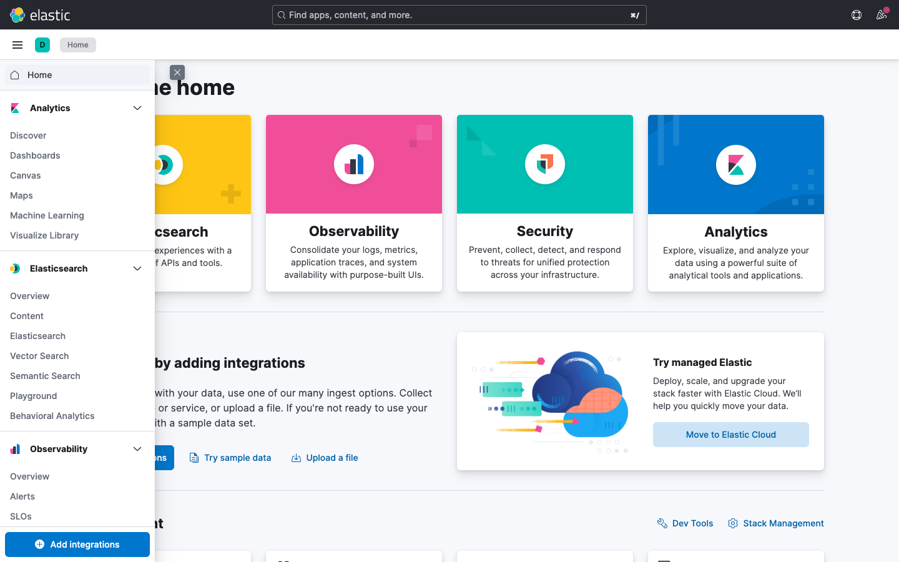
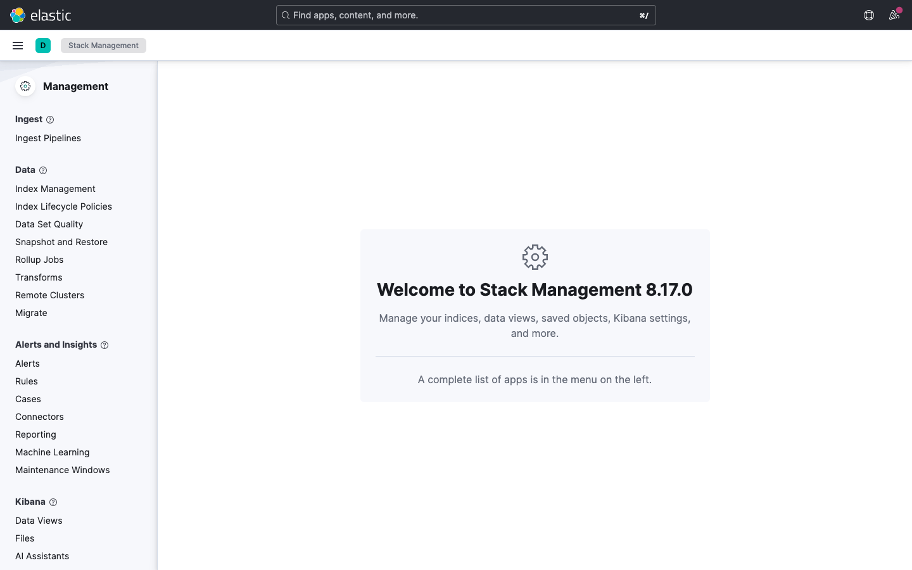
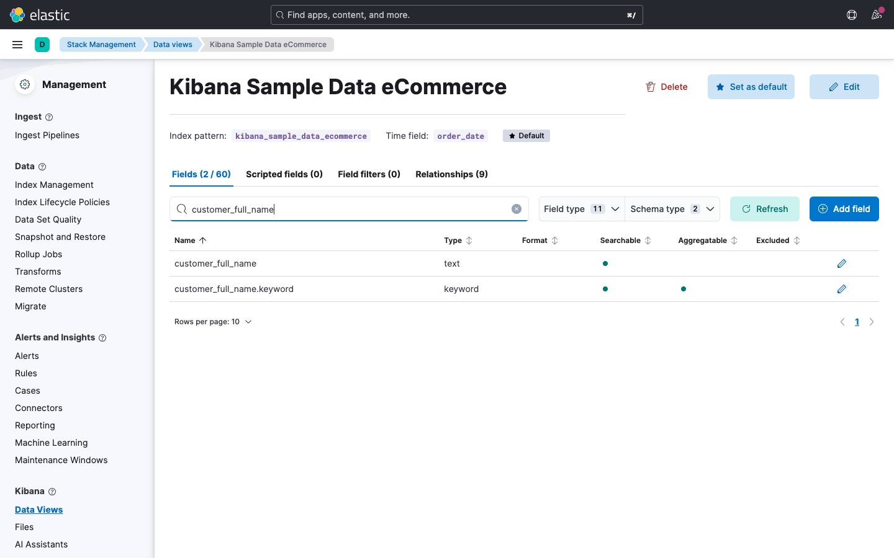

# Modul 01: Einführung

## Übungsziel

Am Ende dieser Übung hast du:

- Die Kibana-Oberfläche kennengelernt und dich orientiert
- Verstanden, was ein Data View ist und wozu er dient
- Das Index Mapping grafisch über die Data-View-Ansicht untersucht und die
  Feldtypen verstanden

---

## Kibana öffnen

Öffne die vom Trainer mitgeteilte URL in deinem Browser.

---

## Teil 1: Kibana-Oberfläche erkunden

### Schritt 1.1: Startseite kennenlernen

Nach dem Öffnen von Kibana siehst du die Startseite (Home). Nimm dir einen
Moment, um die Hauptbereiche zu identifizieren:

| Bereich        | Position                 | Beschreibung                            |
|:---------------|:-------------------------|:----------------------------------------|
| **Hauptmenü**  | Links (Hamburger-Symbol) | Navigation zu allen Kibana-Bereichen    |
| **Suchleiste** | Oben mittig              | Globale Suche nach Funktionen und Daten |
| **Hilfe**      | Oben rechts              | Dokumentation und Hilfe                 |

### Schritt 1.2: Hauptmenü erkunden

Klicke auf das Hamburger-Symbol (drei Striche) oben links, um das Hauptmenü zu
öffnen. Mache dich mit den wichtigsten Bereichen vertraut:

| Menüpunkt                         | Funktion                                |
|:----------------------------------|:----------------------------------------|
| **Analytics > Discover**          | Daten durchsuchen und filtern           |
| **Analytics > Dashboard**         | Dashboards anzeigen und erstellen       |
| **Analytics > Visualize Library** | Gespeicherte Visualisierungen           |
| **Management > Stack Management** | Verwaltung von Indizes, Data Views etc. |
| **Management > Dev Tools**        | Konsole für Elasticsearch-Abfragen      |

### Schritt 1.3: Stack Management öffnen

- Navigiere über das Hauptmenü zu
   **Management > Stack Management**
- Schaue dir die linke Navigation an. Hier findest du unter anderem:
  - **Data Views** (ehemals Index Patterns)
  - **Index Management**

* Klicke auf **Index Management**
* Du siehst die aktuell vorhandenen Indizes

> **Merke:** Stack Management ist die zentrale Anlaufstelle
> für die Verwaltung deiner Elasticsearch-Daten in Kibana.

---

## Teil 2: Data View verstehen und erkunden

### Was ist ein Data View?

Ein Data View (früher "Index Pattern") ist die
**Verbindung zwischen Kibana und deinen Elasticsearch-Daten**. Ohne Data View
kannst du Daten in Kibana weder durchsuchen noch visualisieren.

Stell dir einen Data View wie eine **Brille** vor:
Elasticsearch speichert die Rohdaten, aber erst der Data View legt fest, welche
Indizes du in Kibana siehst und wie die Felder interpretiert werden.

Ein Data View definiert:

- **Welche Indizes** einbezogen werden
  (z.B. `kibana_sample_data_ecommerce` oder ein Muster wie `logs-*` für mehrere
  Indizes)
- **Welche Felder** verfügbar sind und welchen
  **Typ** sie haben (Text, Zahl, Datum ...)
- **Welches Feld** als Zeitstempel dient
  (wichtig für zeitbasierte Analysen)

> Jedes Mal, wenn du in Discover, Lens oder einem
> Dashboard arbeitest, wählst du als Erstes einen
> Data View aus. Er bestimmt, auf welche Daten du
> zugreifen kannst.

### Schritt 2.1: Data Views öffnen

1. Navigiere zu **Management > Stack Management**
2. Klicke in der linken Navigation auf **Data Views**
3. Du siehst eine Liste aller vorhandenen Data Views

**Beobachte:** Jeder Data View zeigt:

- seinen **Namen**
- das **Index-Muster** (welche Elasticsearch-Indizes er abdeckt)
- das **Zeitstempel-Feld** (z.B. `order_date`)

### Schritt 2.2: E-Commerce Data View öffnen

1. Klicke auf **kibana_sample_data_ecommerce**
2. Du siehst die **Feld-Übersicht** des Data Views

Auf dieser Seite kannst du ablesen:

| Information      | Wo zu finden        | Beispiel                        |
|:-----------------|:--------------------|:--------------------------------|
| **Feldname**     | Erste Spalte        | `taxful_total_price`            |
| **Feldtyp**      | Symbol + Typname    | `#` = Number                    |
| **Format**       | Format-Spalte       | Standard oder benutzerdefiniert |
| **Durchsuchbar** | Spalte Searchable   | Ja/Nein                         |
| **Aggregierbar** | Spalte Aggregatable | Ja/Nein                         |

> **Wichtig:** Nur Felder, die als **aggregierbar**
> markiert sind, können in Visualisierungen und
> Dashboards als Achse oder Gruppierung verwendet
> werden. Das betrifft vor allem `keyword`-Felder,
> Zahlen und Datumsfelder.

### Schritt 2.3: Wichtige Felder für die Schulung

Suche in der Feldliste nach den folgenden Feldern und notiere ihren Typ. Du
wirst sie in den nächsten Modulen intensiv nutzen:

| Feld                     | Typ     | Bedeutung             |
|:-------------------------|:--------|:----------------------|
| `order_date`             | Date    | Bestelldatum          |
| `customer_full_name`     | Text    | Kundenname            |
| `category`               | Keyword | Produktkategorie      |
| `taxful_total_price`     | Number  | Gesamtpreis (brutto)  |
| `currency`               | Keyword | Währung               |
| `geoip.country_iso_code` | Keyword | Ländercode des Kunden |
| `geoip.continent_name`   | Keyword | Kontinent des Kunden  |
| `manufacturer`           | Keyword | Hersteller            |
| `products.product_name`  | Text    | Produktname           |

---

## Teil 3: Index Mapping

Das **Mapping** legt fest, wie Elasticsearch jedes Feld intern speichert und
interpretiert. Du kannst es dir als das **Schema** deiner Daten vorstellen --
vergleichbar mit der Spaltendefinition in einer Excel-Tabelle
(Text, Zahl, Datum ...).

Die grafische Feldliste im Data View zeigt dir das Mapping, ohne dass du eine
einzige Abfrage schreiben musst.

### Schritt 3.1: Feldtypen identifizieren

Öffne den Data View `kibana_sample_data_ecommerce`
(falls nicht noch geöffnet) und scrolle durch die Feldliste. Achte auf die 
**Typ-Symbole** links neben den Feldnamen:

| Symbol   | Feldtyp       | Beschreibung                                               | Beispielfeld         |
|:---------|:--------------|:-----------------------------------------------------------|:---------------------|
| `t`      | **Keyword**   | Exakter Text, nicht zerlegt - für Filter und Gruppierungen | `category`           |
| `t`      | **Text**      | Volltext, zerlegt in Wörter - für Freitextsuche            | `customer_full_name` |
| `#`      | **Number**    | Zahlenwert (integer, float ...) - für Berechnungen         | `taxful_total_price` |
| Kalender | **Date**      | Datum / Zeitstempel - für Zeitfilter                       | `order_date`         |
| Pin      | **Geo Point** | Geokoordinate (Längen-/Breitengrad)                        | `geoip.location`     |
| `{}`     | **Object**    | Verschachteltes Objekt mit Unterfeldern                    | `products`           |

> **Tipp:** Nutze das **Suchfeld** oben in der Feldliste, um schnell ein
> bestimmtes Feld zu finden.

### Schritt 3.2: Keyword vs. Text unterscheiden

Suche in der Feldliste nach dem Feld
`customer_full_name`. Du wirst feststellen, dass es
**zwei Einträge** gibt:

- `customer_full_name` - Typ **Text**
- `customer_full_name.keyword` - Typ **Keyword**

Das ist ein sogenanntes **Multi-Field-Mapping**:

| Variante                     | Typ     | Einsatz                                                          |
|:-----------------------------|:--------|:-----------------------------------------------------------------|
| `customer_full_name`         | Text    | Volltextsuche ("Suche nach Müller")                              |
| `customer_full_name.keyword` | Keyword | Exakte Filterung und Gruppierung ("Gruppiere nach vollem Namen") |

**Frage:** Wenn du in einem Dashboard eine Tabelle mit Kundennamen erstellen
möchtest - welche Variante verwendest du? Und wenn du nach einem Namensteil
suchen möchtest?

> **Antwort:** Für die Tabelle brauchst du die
> `.keyword`-Variante (exakter Wert, aggregierbar).
> Für die Suche nach einem Namensteil nutzt du das
> `text`-Feld.

### Schritt 3.3: Verschachtelte Felder erkunden

Suche in der Feldliste nach `products`. Du siehst zahlreiche Felder, die mit
`products.` beginnen:

- `products.product_name`
- `products.category`
- `products.price`
- `products.quantity`
- `products.discount_percentage`
- `products.manufacturer`

Diese Felder beschreiben die **einzelnen Artikel innerhalb einer Bestellung**.
Eine Bestellung kann mehrere Produkte enthalten - daher sind die Produktfelder
als verschachteltes Objekt modelliert.

> **Praxisrelevanz:** In Modul 03 (Dashboards)
> wirst du sowohl die Bestellfelder (z.B.
> `taxful_total_price`) als auch die Produktfelder
> (z.B. `products.discount_percentage`) verwenden.

### Schritt 3.4: Felder zählen

Scrolle durch die gesamte Feldliste oder nutze die Filteroptionen oben, um dir
einen Überblick zu verschaffen:

1. **Wie viele Felder** hat der Data View insgesamt?
2. Filtere nach Typ **Number** - wie viele numerische Felder gibt es?
3. Filtere nach Typ **Keyword** - wie viele Keyword-Felder gibt es?

> Der eCommerce-Datensatz hat deutlich mehr Felder,
> als du zunächst erwartest. Viele davon werden
> automatisch von Kibana erzeugt (z.B. `_id`,
> `_index`, `_score`).

---

## Zusammenfassung

Du hast erfolgreich:

- [x] Die Kibana-Oberfläche und das Hauptmenü kennengelernt
- [x] Verstanden, was ein Data View ist und wozu er dient
- [x] Den Data View mit seinen Feldern und Feldtypen erkundet
- [x] Das Index Mapping grafisch über die Feldliste untersucht
- [x] Den Unterschied zwischen Keyword- und Text-Feldern sowie
  Multi-Field-Mappings verstanden

**Nächstes Modul:** Discover & Abfragen - Wir suchen und filtern die
E-Commerce-Daten!
