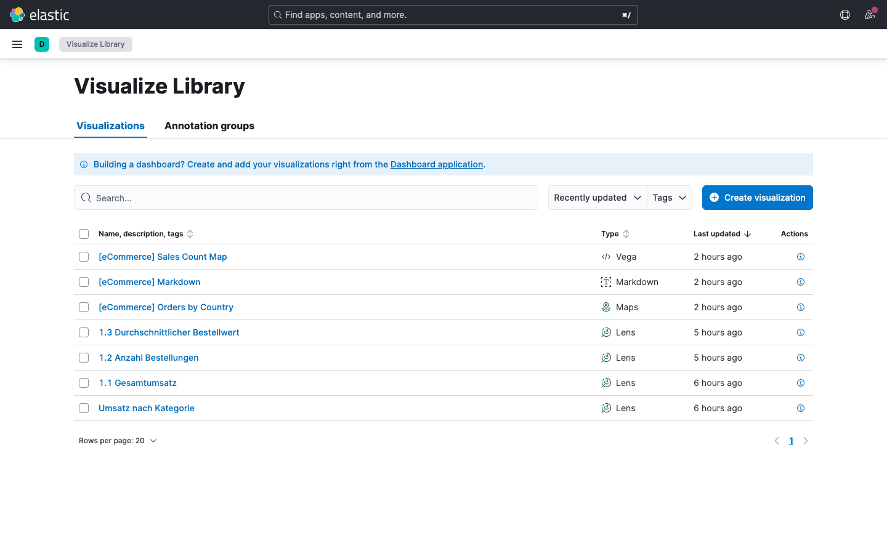
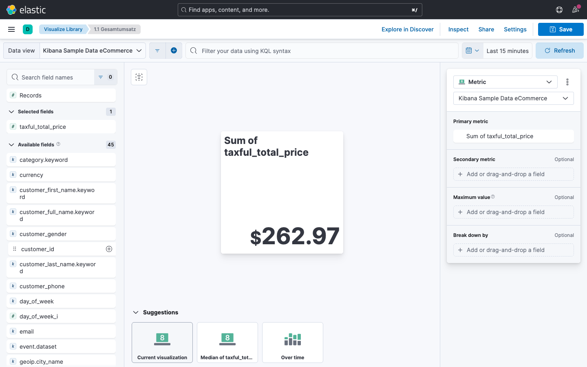
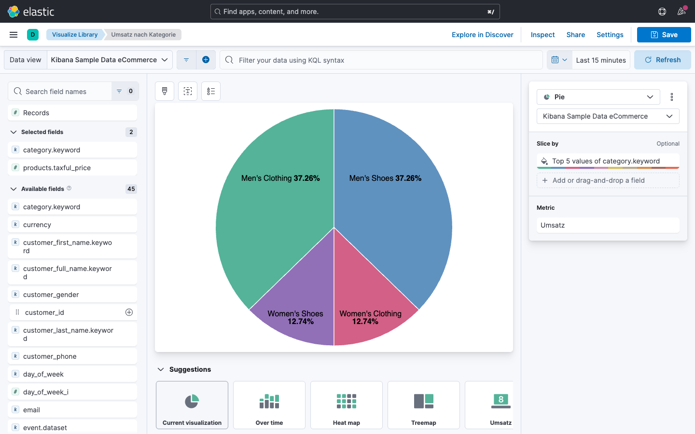
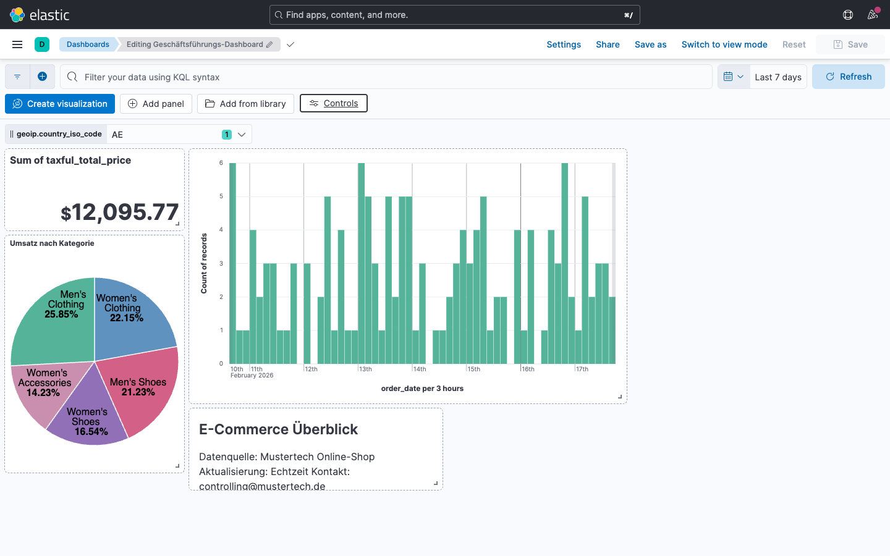
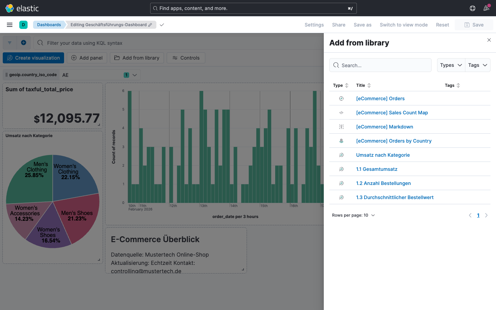
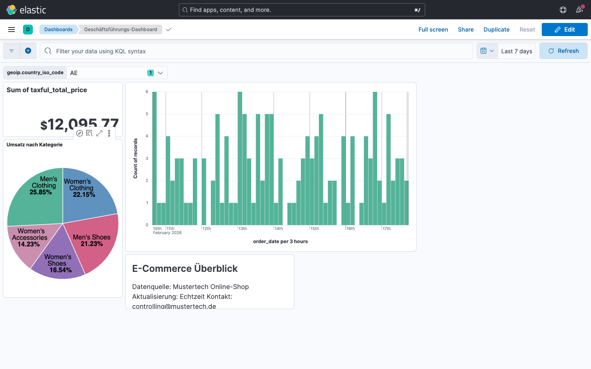
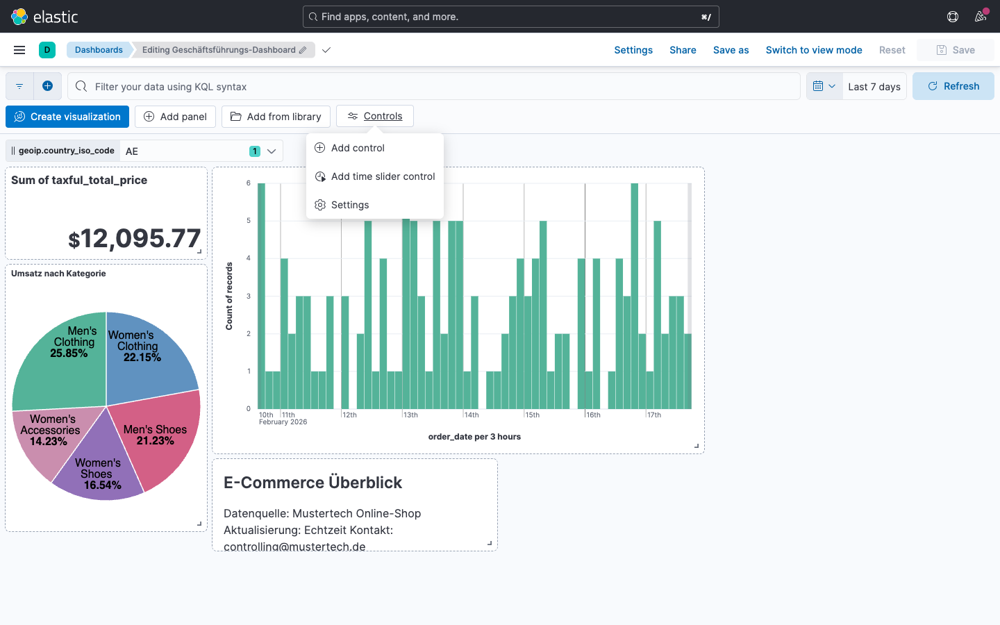

# Modul 03: Visualisierungen & Dashboards

## Übungsziel

Am Ende dieser Übung hast du:

- Verschiedene Visualisierungstypen in Kibana Lens erstellt
  (Metriken, Balken, Linien, Kreis)
- Ein Überblick-Dashboard für die Geschäftsführung gebaut
- Das Dashboard mit Controls und Cross-Filtering interaktiv gestaltet

---

### Zeitraum einstellen

Stelle zu Beginn sicher, dass der Zeitfilter auf
**Last 7 days** steht. Dieser Zeitraum gilt für alle Visualisierungen, sofern
nicht anders angegeben.

### Verfügbare Felder im eCommerce-Datensatz

Die folgenden Felder wirst du in den Übungen verwenden:

| Feld                           | Typ       | Beschreibung             |
|:-------------------------------|:----------|:-------------------------|
| `order_date`                   | date      | Bestellzeitpunkt         |
| `taxful_total_price`           | number    | Bestellwert (brutto)     |
| `taxless_total_price`          | number    | Bestellwert (netto)      |
| `total_quantity`               | number    | Anzahl Artikel           |
| `total_unique_products`        | number    | Verschiedene Produkte    |
| `products.discount_percentage` | number    | Rabatt in Prozent        |
| `products.discount_amount`     | number    | Rabatt in EUR            |
| `products.price`               | number    | Einzelpreis Produkt      |
| `products.quantity`            | number    | Menge pro Produkt        |
| `category`                     | keyword   | Produktkategorie(n)      |
| `manufacturer`                 | keyword   | Hersteller               |
| `customer_full_name`           | text      | Kundenname               |
| `customer_gender`              | keyword   | Geschlecht (MALE/FEMALE) |
| `customer_id`                  | keyword   | Kundennummer             |
| `day_of_week`                  | keyword   | Wochentag (Monday...)    |
| `day_of_week_i`                | number    | Wochentag als Zahl (0-6) |
| `currency`                     | keyword   | Währung (EUR)            |
| `geoip.city_name`              | keyword   | Stadt                    |
| `geoip.region_name`            | keyword   | Region                   |
| `geoip.country_iso_code`       | keyword   | Ländercode (DE, US...)   |
| `geoip.continent_name`         | keyword   | Kontinent                |
| `geoip.location`               | geo_point | Koordinaten              |

---

## Teil 1: Grundlegende Visualisierungen erstellen

Bevor du Dashboards baust, erstellst du die wichtigsten Grundbausteine in der
**Visualize Library**.



### Aufgabe 1.1: Metrik - Gesamtumsatz

1. Navigiere zu **Analytics > Visualize Library**
2. Klicke auf **Create visualization** und wähle **Lens**
3. Stelle sicher, dass der Data View
   **Kibana Sample Data eCommerce** ausgewählt ist
4. Wähle als Visualisierungstyp **Metric**
5. Ziehe `taxful_total_price` in den Bereich
   **Primary metric**
6. Ändere die Funktion von "Median" auf **Sum**
7. Speichere als: `Gesamtumsatz` mit "Add To Dashboard -> None".



### Aufgabe 1.2: Metrik - Anzahl Bestellungen

1. Neue Lens-Visualisierung, Typ **Metric**
2. Ziehe ein `order_id` Feld in **Primary metric**
3. Ändere die Funktion auf **Count**
4. Speichere als: `Anzahl Bestellungen`, mit "Add To Dashboard -> None".

### Aufgabe 1.3: Metrik - Durchschnittlicher Bestellwert

1. Neue Lens-Visualisierung, Typ **Metric**
2. Ziehe `taxful_total_price` in **Primary metric**
3. Ändere die Funktion auf **Average**
4. Speichere als: `Durchschn. Bestellwert`, mit "Add To Dashboard -> None".

### Aufgabe 1.4: Balkendiagramm - Top Produktkategorien

1. Neue Lens-Visualisierung, Typ **Bar -> Unstacked**
2. Vertikale Achse: `order_id` mit Funktion **Count**
3. Horizonale Achse: `category.keyword` mit Funktion
   **Top values**, Number of values: `5`
4. Speichere als: `Top Produktkategorien`, mit "Add To Dashboard -> None".

### Aufgabe 1.5: Liniendiagramm - Umsatz über Zeit

1. Neue Lens-Visualisierung, Typ **Line**
2. X-Achse: `order_date` (Date histogram, Auto)
3. Y-Achse: `taxful_total_price` mit Funktion **Sum**
4. Speichere als: `Umsatz über Zeit`, mit "Add To Dashboard -> None".

### Aufgabe 1.6: Kreisdiagramm - Bestellungen nach Region

1. Neue Lens-Visualisierung, Typ **Pie**
2. Slice by: `geoip.continent_name` (Top values, Number of values: `7`)
3. Metrik: **Count**
4. Speichere als: `Bestellungen nach Region`, mit "Add To Dashboard -> None".



---

## Teil 2: Überblick-Dashboard für die Geschäftsführung

Erstelle ein Dashboard, das die wichtigsten Kennzahlen auf einen Blick zeigt --
geeignet für ein Geschäftsführungs-Meeting.

### Schritt 2.1: Dashboard erstellen

1. Navigiere zu **Analytics > Dashboard**
2. Klicke auf **Create dashboard**



### Schritt 2.2: KPI-Zeile aufbauen

Füge über **Add from library** die drei Metriken hinzu:



- `Gesamtumsatz`
- `Anzahl Bestellungen`
- `Durchschn. Bestellwert`

Ordne sie in einer **horizontalen Reihe** oben im Dashboard an. Mache die Panels
klein - sie sollen nur die Kennzahl anzeigen.

### Schritt 2.3: Diagramme hinzufügen

Füge die restlichen Visualisierungen hinzu:

- `Umsatz über Zeit`
- `Top Produktkategorien`
- `Bestellungen nach Region`

### Schritt 2.4: Layout anordnen

```
+---------------+---------------+----------------+
| Gesamtumsatz  | Anzahl Best.  | Durchschn. BW  |
+---------------+---------------+----------------+
| Umsatz über Zeit (Linie, volle Breite)         |
+------------------------+-----------------------+
| Top Produktkategorien  | Bestellungen nach     |
| (Balken)               | Region (Kreis)        |
+------------------------+-----------------------+
```

### Schritt 2.5: Markdown-Panel hinzufügen

Füge ein **Informationspanel** als Kontext hinzu:

1. Klicke auf **Add panel**
2. Suche und wähle den Typ **Markdown Text**
3. Gib folgenden Text ein:

```markdown
### E-Commerce Überblick

Datenquelle: Mustertech Online-Shop Aktualisierung: Echtzeit Kontakt:
controlling@mustertech.de
```

4. Platziere das Panel oben links oder als schmale Spalte am linken Rand

### Schritt 2.6: Dashboard speichern

1. Klicke auf **Save**
2. Titel: `Überblick - Geschäftsführung`
3. Beschreibung: "KPIs und Trends für das Management-Meeting"



---

## Teil 3: Controls und Interaktivität

Mache das Überblick-Dashboard interaktiv, damit Kolleginnen und Kollegen selbst
filtern können.

### Aufgabe 3.1: Kategorie-Filter hinzufügen

1. Klicke auf **Controls** in der Toolbar



2. Klicke auf **Add control** im Controls-Panel
3. Konfiguriere:
    - Feld: `category.keyword`
    - Typ: **Options list**
    - Bezeichnung: `Kategorie`
4. Speichere

**Test:** Wähle "Women's Clothing" aus dem Dropdown. Alle Visualisierungen
sollten sich filtern.

### Aufgabe 3.2: Hersteller-Filter hinzufügen

1. Klicke auf **Add control** (im Controls-Panel)
2. Konfiguriere:
    - Feld: `manufacturer.keyword`
    - Typ: **Options list**
    - Bezeichnung: `Hersteller`

**Test:** Wähle gleichzeitig eine Kategorie und einen Hersteller. Beobachte, wie
die Kombination die Daten eingrenzt.

### Aufgabe 3.3: Preisbereich-Filter hinzufügen

1. Klicke auf **Add control**
2. Konfiguriere:
    - Feld: `taxful_total_price`
    - Typ: **Range slider**
    - Bezeichnung: `Bestellwert`

**Test:** Stelle den Bereich auf 100-500 EUR ein und beobachte die Veränderungen
im Dashboard.

### Aufgabe 3.4: Cross-Filtering testen

1. Setze alle Controls zurück (Clear)
2. Klicke im Balkendiagramm auf den Balken "Women's Clothing"
3. Wähle **Filter for value** (Plus-Symbol)

**Beobachte:**

- Alle Metriken zeigen nur Werte für diese Kategorie
- Das Liniendiagramm zeigt den Umsatzverlauf nur für Women's Clothing
- Das Kreisdiagramm zeigt die regionale Verteilung nur für diese Kategorie
- In der Filterleiste erscheint ein neuer Filter

4. Entferne den Filter wieder über das **X** in der Filterleiste

### Aufgabe 3.5: Dashboard speichern

Speichere das Dashboard mit den Controls.

---

## Zusammenfassung

Du hast erfolgreich:

- [x] Grundlegende Visualisierungen erstellt
  (Metriken, Balken, Linien, Kreis)
- [x] Ein **Überblick-Dashboard** für die Geschäftsführung gebaut
  mit KPIs, Markdown-Panel und Controls
- [x] Das Dashboard mit **Controls** (Kategorie, Hersteller,
  Preisbereich) und **Cross-Filtering** interaktiv gestaltet

Weiter geht es in **Modul 03b** mit fortgeschrittenen Dashboards
(Controlling, Produktmanagement, Formeln, Drilldowns).

---

## Troubleshooting

### Visualisierung zeigt "No results found"

**Symptom:** Eine Visualisierung ist leer.

**Lösung:**

1. Prüfe den **Zeitfilter** - ist "Last 7 days" eingestellt?
2. Prüfe den **Data View** (kibana_sample_data_ecommerce)
3. Prüfe die **Filterleiste** auf aktive Filter
4. Wechsle zu **Discover** und prüfe, ob dort Daten vorhanden sind

### Controls-Panel reagiert nicht

**Symptom:** Das Dropdown zeigt keine Werte.

**Lösung:**

1. Stelle sicher, dass das Dashboard im
   **Edit**-Modus ist, um Controls zu bearbeiten
2. Prüfe das konfigurierte Feld
3. Speichere das Dashboard und lade die Seite neu
