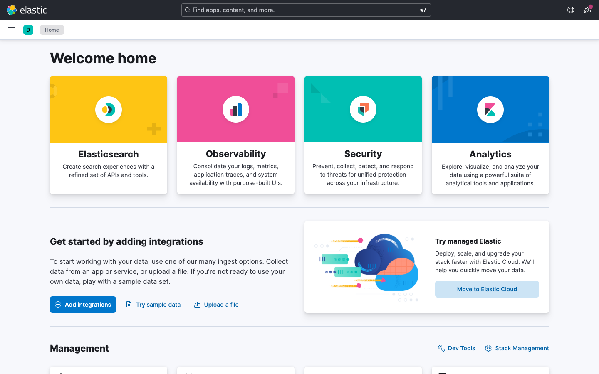
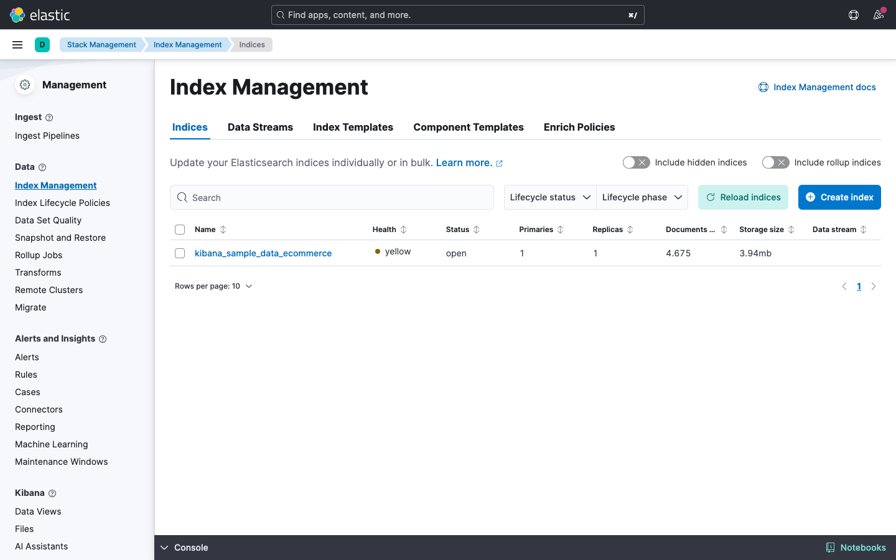
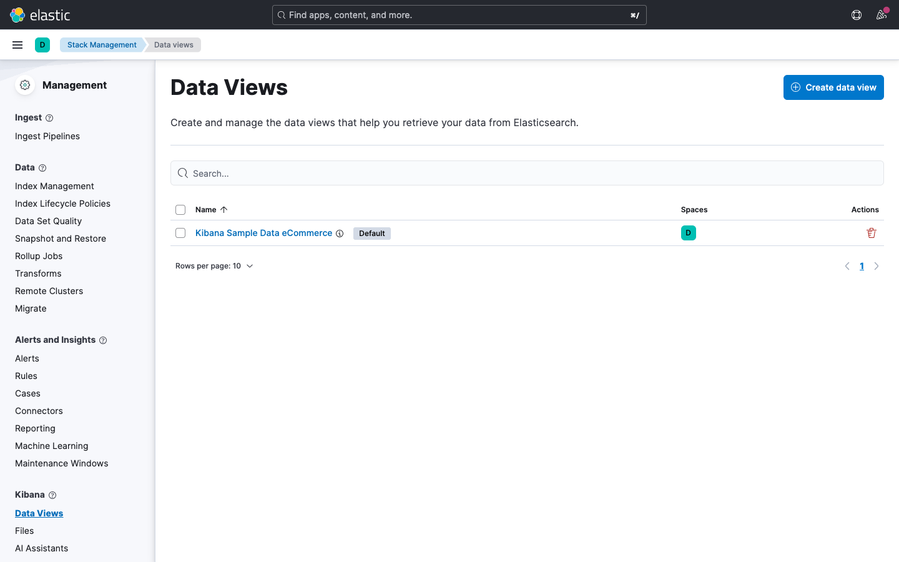
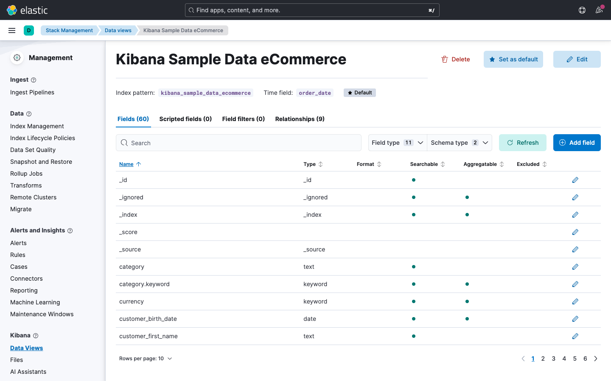

# Lab 01: Einführung

## Übungsziel

Am Ende dieser Übung hast du:

- Deine lokale Übungsumgebung selbst gestartet
- Die Kibana-Oberfläche kennengelernt und dich orientiert
- Verstanden, was ein Data View ist und wozu er dient
- Das Index Mapping grafisch über die Data-View-Ansicht untersucht und die
  Feldtypen verstanden
- Erste REST-Aufrufe in den Kibana Dev Tools ausgeführt

**Dauer:** ca. 25 Minuten

---

## Teil 0: Umgebung starten

In dieser Schulung betreibst du Elasticsearch und Kibana **lokal auf deinem
eigenen Rechner** mit Docker.

> **Voraussetzung:** Du hast die Schritte aus `environment/VORBEREITUNG.md`
> bereits ausgeführt (Docker installiert, Images geladen).

### Schritt 0.1: Docker-Umgebung starten

Öffne ein Terminal im Schulungs-Repository und starte die Umgebung für Tag 1:

```bash
cd environment/day1
docker compose up -d --wait
```

> **Tipp:** Der erste Start kann 1-2 Minuten dauern. Der Befehl kehrt erst
> zurück, wenn Elasticsearch und Kibana bereit sind (`--wait`).

**Erwartetes Ergebnis:** Beide Container werden als `Healthy` angezeigt.

### Schritt 0.2: Kibana öffnen

Öffne in deinem Browser:

<http://localhost:5601>

Kibana und Elasticsearch laufen lokal **ohne Login**. Du landest direkt auf
der Startseite.

### Schritt 0.3: Beispieldaten laden

Für die folgenden Teile brauchst du den eCommerce-Beispieldatensatz:

1. Gehe auf die Kibana-Startseite (**Home**)
2. Klicke auf **Try sample data**
3. Öffne **Other sample data sets**
4. Wähle **Sample eCommerce orders** und klicke auf **Add data**

**Erwartetes Ergebnis:** Nach kurzer Zeit ist der Index
`kibana_sample_data_ecommerce` samt Data View und Dashboard angelegt.

---

## Teil 1: Kibana-Oberfläche erkunden

### Schritt 1.1: Startseite kennenlernen

Nach dem Öffnen von Kibana siehst du die Startseite (Home). Nimm dir einen
Moment, um die Hauptbereiche zu identifizieren:



| Bereich        | Position                 | Beschreibung                            |
| :------------- | :----------------------- | :-------------------------------------- |
| **Hauptmenü**  | Links (Hamburger-Symbol) | Navigation zu allen Kibana-Bereichen    |
| **Suchleiste** | Oben mittig              | Globale Suche nach Funktionen und Daten |
| **Hilfe**      | Oben rechts              | Dokumentation und Hilfe                 |

### Schritt 1.2: Hauptmenü erkunden

Klicke auf das Hamburger-Symbol (drei Striche) oben links, um das Hauptmenü zu
öffnen. Mache dich mit den wichtigsten Bereichen vertraut:


| Menüpunkt                         | Funktion                                |
| :-------------------------------- | :-------------------------------------- |
| **Analytics > Discover**          | Daten durchsuchen und filtern           |
| **Analytics > Dashboard**         | Dashboards anzeigen und erstellen       |
| **Analytics > Visualize Library** | Gespeicherte Visualisierungen           |
| **Management > Stack Management** | Verwaltung von Indizes, Data Views etc. |
| **Management > Dev Tools**        | Konsole für Elasticsearch-Abfragen      |

### Schritt 1.3: Stack Management öffnen

- Navigiere über das Hauptmenü zu
   **Management > Stack Management**
- Schaue dir die linke Navigation an. Hier findest du unter anderem:
  - **Data Views** (ehemals Index Patterns)
  - **Index Management**


- Klicke auf **Index Management**
- Du siehst die aktuell vorhandenen Indizes



> **Merke:** Stack Management ist die zentrale Anlaufstelle
> für die Verwaltung deiner Elasticsearch-Daten in Kibana.

---

## Teil 2: Data View verstehen und erkunden

### Was ist ein Data View?

Ein Data View (früher "Index Pattern") ist die
**Verbindung zwischen Kibana und deinen Elasticsearch-Daten**. Ohne Data View
kannst du Daten in Kibana weder durchsuchen noch visualisieren.

Stell dir einen Data View wie eine **Brille** vor:
Elasticsearch speichert die Rohdaten, aber erst der Data View legt fest, welche
Indizes du in Kibana siehst und wie die Felder interpretiert werden.

Ein Data View definiert:

- **Welche Indizes** einbezogen werden
  (z.B. `kibana_sample_data_ecommerce` oder ein Muster wie `logs-*` für mehrere
  Indizes)
- **Welche Felder** verfügbar sind und welchen
  **Typ** sie haben (Text, Zahl, Datum ...)
- **Welches Feld** als Zeitstempel dient
  (wichtig für zeitbasierte Analysen)

> Jedes Mal, wenn du in Discover, Lens oder einem
> Dashboard arbeitest, wählst du als Erstes einen
> Data View aus. Er bestimmt, auf welche Daten du
> zugreifen kannst.

### Schritt 2.1: Data Views öffnen

1. Navigiere zu **Management > Stack Management**
2. Klicke in der linken Navigation auf **Data Views**
3. Du siehst eine Liste aller vorhandenen Data Views



**Beobachte:** Die Liste zeigt pro Data View seinen **Namen** und die
**Spaces**, in denen er verfügbar ist. Das **Index-Muster** (welche
Elasticsearch-Indizes er abdeckt) und das **Zeitstempel-Feld** (z.B.
`order_date`) siehst du erst nach dem Öffnen des Data Views auf der
Detailseite (Schritt 2.2).

### Schritt 2.2: E-Commerce Data View öffnen

1. Klicke auf **kibana_sample_data_ecommerce**
2. Du siehst die **Feld-Übersicht** des Data Views



Auf dieser Seite kannst du ablesen:

| Information      | Wo zu finden        | Beispiel                        |
| :--------------- | :------------------ | :------------------------------ |
| **Feldname**     | Erste Spalte        | `taxful_total_price`            |
| **Feldtyp**      | Symbol + Typname    | `#` = Number                    |
| **Format**       | Format-Spalte       | Standard oder benutzerdefiniert |
| **Durchsuchbar** | Spalte Searchable   | Ja/Nein                         |
| **Aggregierbar** | Spalte Aggregatable | Ja/Nein                         |

> **Wichtig:** Nur Felder, die als **aggregierbar**
> markiert sind, kannst du in Visualisierungen und
> Dashboards als Achse oder Gruppierung verwenden.
> Das betrifft vor allem `keyword`-Felder,
> Zahlen und Datumsfelder.

### Schritt 2.3: Wichtige Felder für die Schulung

Suche in der Feldliste nach den folgenden Feldern und notiere ihren Typ. Du
wirst sie in den nächsten Modulen intensiv nutzen:

| Feld                     | Typ                 | Bedeutung             |
| :----------------------- | :------------------ | :-------------------- |
| `order_date`             | Date                | Bestelldatum          |
| `customer_full_name`     | Text                | Kundenname            |
| `category`               | Text (+ `.keyword`) | Produktkategorie      |
| `taxful_total_price`     | Number              | Gesamtpreis (brutto)  |
| `currency`               | Keyword             | Währung               |
| `geoip.country_iso_code` | Keyword             | Ländercode des Kunden |
| `geoip.continent_name`   | Keyword             | Kontinent des Kunden  |
| `manufacturer`           | Text (+ `.keyword`) | Hersteller            |
| `products.product_name`  | Text                | Produktname           |

---

## Teil 3: Index Mapping

Das **Mapping** legt fest, wie Elasticsearch jedes Feld intern speichert und
interpretiert. Du kannst es dir als das **Schema** deiner Daten vorstellen,
vergleichbar mit der Spaltendefinition in einer Excel-Tabelle
(Text, Zahl, Datum ...).

Die grafische Feldliste im Data View zeigt dir das Mapping, ohne dass du eine
einzige Abfrage schreiben musst.

### Schritt 3.1: Feldtypen identifizieren

Öffne den Data View `kibana_sample_data_ecommerce`
(falls nicht noch geöffnet) und scrolle durch die Feldliste. Achte auf die
**Typ-Symbole** links neben den Feldnamen:

| Symbol   | Feldtyp       | Beschreibung                                               | Beispielfeld         |
| :------- | :------------ | :--------------------------------------------------------- | :------------------- |
| `t`      | **Keyword**   | Exakter Text, nicht zerlegt - für Filter und Gruppierungen | `currency`           |
| `t`      | **Text**      | Volltext, zerlegt in Wörter - für Freitextsuche            | `customer_full_name` |
| `#`      | **Number**    | Zahlenwert (integer, float ...) - für Berechnungen         | `taxful_total_price` |
| Kalender | **Date**      | Datum / Zeitstempel - für Zeitfilter                       | `order_date`         |
| Pin      | **Geo Point** | Geokoordinate (Längen-/Breitengrad)                        | `geoip.location`     |
| `{}`     | **Object**    | Verschachteltes Objekt mit Unterfeldern                    | `products`           |

> **Tipp:** Nutze das **Suchfeld** oben in der Feldliste, um schnell ein
> bestimmtes Feld zu finden.

### Schritt 3.2: Keyword vs. Text unterscheiden

Suche in der Feldliste nach dem Feld
`customer_full_name`. Du wirst feststellen, dass es
**zwei Einträge** gibt:

- `customer_full_name` - Typ **Text**
- `customer_full_name.keyword` - Typ **Keyword**

Das ist ein sogenanntes **Multi-Field-Mapping**:


| Variante                     | Typ     | Einsatz                                                          |
| :--------------------------- | :------ | :--------------------------------------------------------------- |
| `customer_full_name`         | Text    | Volltextsuche ("Suche nach Müller")                              |
| `customer_full_name.keyword` | Keyword | Exakte Filterung und Gruppierung ("Gruppiere nach vollem Namen") |

**Frage:** Wenn du in einem Dashboard eine Tabelle mit Kundennamen erstellen
möchtest - welche Variante verwendest du? Und wenn du nach einem Namensteil
suchen möchtest?

> **Antwort:** Für die Tabelle brauchst du die
> `.keyword`-Variante (exakter Wert, aggregierbar).
> Für die Suche nach einem Namensteil nutzt du das
> `text`-Feld.

### Schritt 3.3: Verschachtelte Felder erkunden

Suche in der Feldliste nach `products`. Du siehst zahlreiche Felder, die mit
`products.` beginnen:

- `products.product_name`
- `products.category`
- `products.price`
- `products.quantity`
- `products.discount_percentage`
- `products.manufacturer`

Diese Felder beschreiben die **einzelnen Artikel innerhalb einer Bestellung**.
Eine Bestellung kann mehrere Produkte enthalten - daher sind die Produktfelder
als verschachteltes Objekt modelliert.

> **Praxisrelevanz:** In Modul 03 (Dashboards)
> wirst du sowohl die Bestellfelder (z.B.
> `taxful_total_price`) als auch die Produktfelder
> (z.B. `products.discount_percentage`) verwenden.

### Schritt 3.4: Felder zählen

Scrolle durch die gesamte Feldliste oder nutze die Filteroptionen oben, um dir
einen Überblick zu verschaffen:

1. **Wie viele Felder** hat der Data View insgesamt?
2. Filtere nach Typ **Number** - wie viele numerische Felder gibt es?
3. Filtere nach Typ **Keyword** - wie viele Keyword-Felder gibt es?

> Der eCommerce-Datensatz hat deutlich mehr Felder,
> als du zunächst erwartest. Viele davon werden
> automatisch von Kibana erzeugt (z.B. `_id`,
> `_index`, `_score`).

---

## Teil 4: Dev Tools - erste REST-Aufrufe

Zum Abschluss sprichst du direkt mit Elasticsearch, so wie es Kibana im
Hintergrund die ganze Zeit tut. Dafür nutzt du die **Dev Tools Console**.

### Schritt 4.1: Dev Tools öffnen

1. Navigiere über das Hauptmenü zu **Management > Dev Tools**
2. Links siehst du den Editor für deine Anfragen, rechts erscheinen die
   Antworten

> **Tipp:** Anfragen führst du mit **Ctrl+Enter** (Windows/Linux) bzw.
> **Cmd+Enter** (macOS) aus, alternativ über das Play-Symbol neben der
> Anfrage.
> Die Console bietet Autocomplete für Endpunkte und Felder.

### Schritt 4.2: Erstes Dokument anlegen

Lege einen Kunden der Mustertech GmbH an. Tippe in die Console:

```json
PUT kunden/_doc/1
{
  "name": "Firma Müller",
  "stadt": "Köln",
  "branche": "Maschinenbau",
  "kunde_seit": "2019-04-01"
}
```

**Erwartetes Ergebnis:** Die Antwort enthält `"result": "created"` und
`"_id": "1"`. Den Index `kunden` hat Elasticsearch dabei automatisch angelegt.

### Schritt 4.3: Dokument lesen

```json
GET kunden/_doc/1
```

**Erwartetes Ergebnis:** `"found": true`. Unter `_source` steht dein
Kunden-Dokument, dazu Metadaten wie `_index` und `_version`.

### Schritt 4.4: Indizes auflisten

```json
GET _cat/indices?v
```

**Erwartetes Ergebnis:** Eine Tabelle aller Indizes. Du findest darin sowohl
`kunden` (mit `docs.count` 1) als auch `kibana_sample_data_ecommerce`.

### Schritt 4.5: Mehrere Dokumente per Bulk-API anlegen

Statt drei einzelner `PUT`-Aufrufe bündelst du drei Kunden in einer Anfrage.
Beachte das Zeilenformat: immer eine Action-Zeile, dann eine Dokument-Zeile:

```json
POST _bulk
{ "index": { "_index": "kunden", "_id": "2" } }
{ "name": "Schmidt AG", "stadt": "Hamburg", "branche": "Logistik", "kunde_seit": "2021-09-15" }
{ "index": { "_index": "kunden", "_id": "3" } }
{ "name": "Weber & Co", "stadt": "München", "branche": "Handel", "kunde_seit": "2020-02-01" }
{ "index": { "_index": "kunden", "_id": "4" } }
{ "name": "Becker GmbH", "stadt": "Köln", "branche": "Maschinenbau", "kunde_seit": "2023-06-20" }
```

> **Wichtig:** Bei `_bulk` muss **jedes JSON-Objekt auf genau einer Zeile**
> stehen. Kommt beim Kopieren (besonders aus dem PDF oder über die
> RDP-Zwischenablage) ein Zeilenumbruch mitten in eine Zeile, meldet
> Elasticsearch z.B. `Malformed action/metadata line [3], expected
> START_OBJECT but found [VALUE_STRING]`. Ziehe umgebrochene Zeilen dann in der
> Console wieder zu einer Zeile zusammen.

**Erwartetes Ergebnis:** Die Antwort enthält `"errors": false` und listet für
jedes der drei Dokumente `"result": "created"` auf.

### Schritt 4.6: Erste Suche

Suche alle Kunden, in deren Namen "müller" vorkommt:

```json
GET kunden/_search
{
  "query": {
    "match": {
      "name": "müller"
    }
  }
}
```

**Erwartetes Ergebnis:** Unter `hits.total.value` steht `1`, und in
`hits.hits` findest du die Firma Müller, obwohl du klein geschrieben gesucht
hast. Die Details der Query DSL lernst du in einem späteren Modul.

### Schritt 4.7: Aufräumen

Lösche den Übungsindex wieder, damit er die nächsten Labs nicht stört:

```json
DELETE kunden
```

**Erwartetes Ergebnis:** `"acknowledged": true`. Ein erneutes
`GET _cat/indices?v` zeigt: `kunden` ist verschwunden,
`kibana_sample_data_ecommerce` ist weiterhin da.

> **Merke:** `DELETE kunden` löscht den kompletten Index inklusive aller
> Dokumente und des Mappings, ohne Rückfrage.
