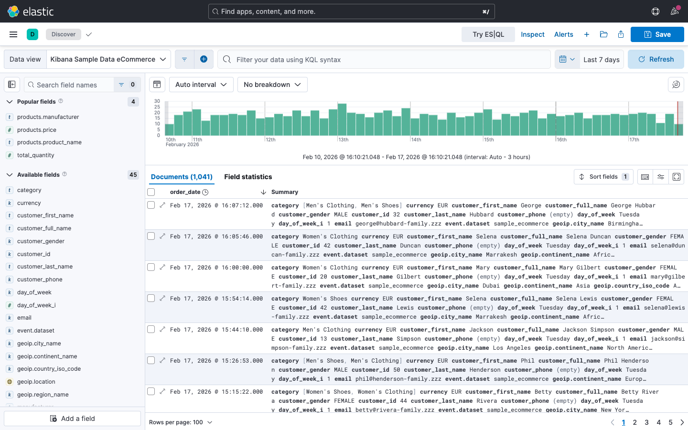
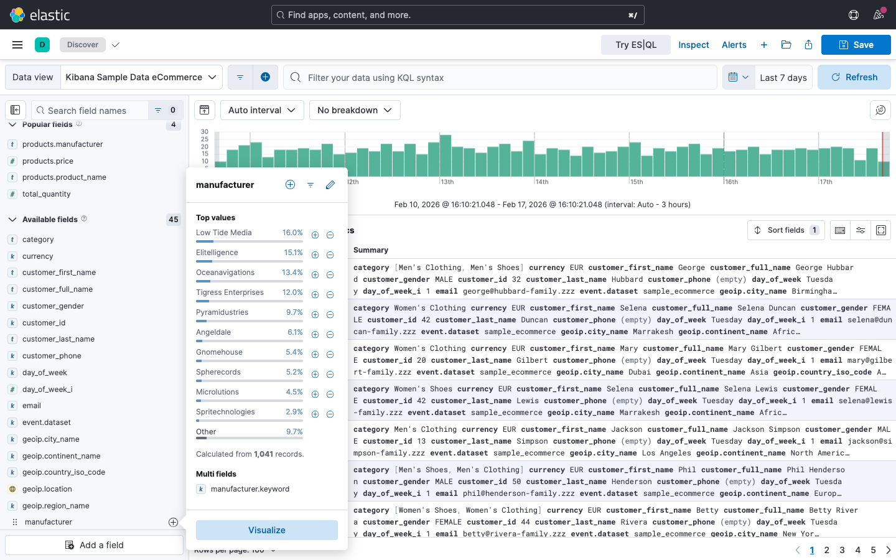
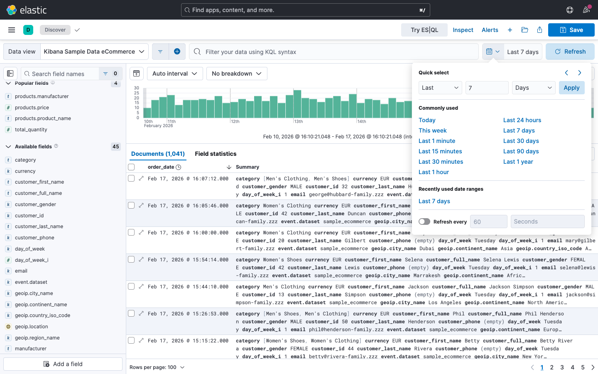
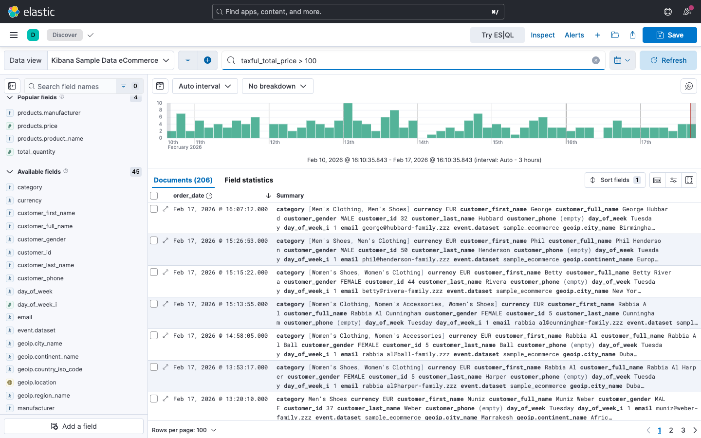
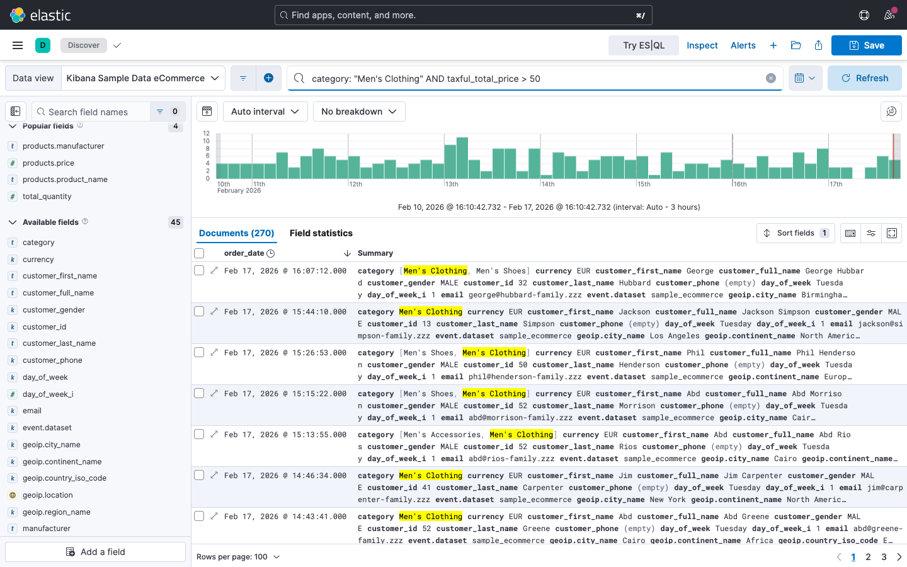
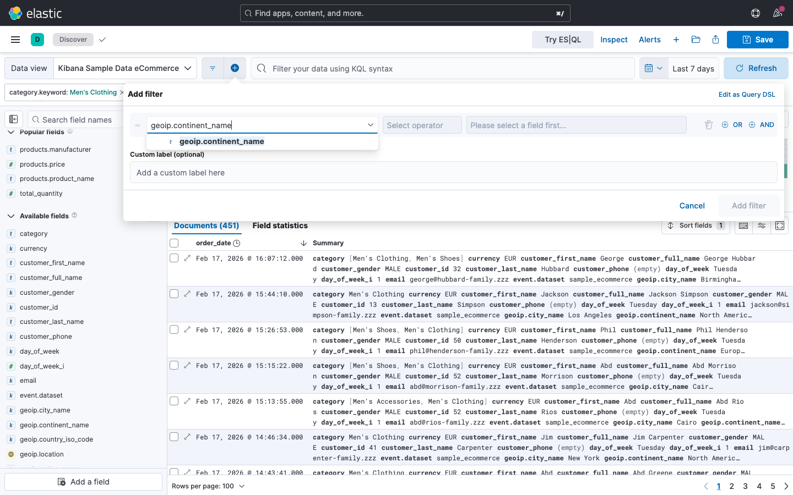
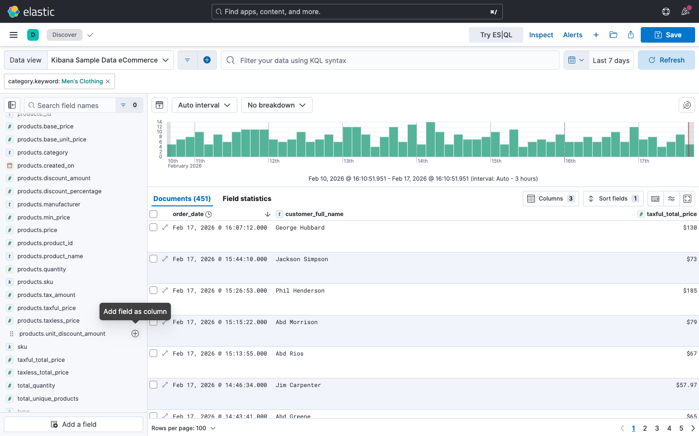

# Lab 02: Discover & Abfragen

## Übungsziel

Am Ende dieser Übung hast du:

- Das Discover Interface kennengelernt und verstanden
- Zeitfilter gezielt eingesetzt
- Daten mit KQL (Kibana Query Language) abgefragt
- Filter über die Filter-Leiste hinzugefügt und kombiniert
- Spalten konfiguriert und Ergebnisse als CSV exportiert

---

## Teil 1: Discover öffnen und orientieren

### Schritt 1.1: Discover aufrufen

1. Öffne Kibana in deiner lokalen Umgebung: <http://localhost:5601>
   (kein Login erforderlich)
2. Navigiere über das Hauptmenü zu **Analytics > Discover**
3. Falls nötig, wähle oben links den Data View
   **Kibana Sample Data eCommerce** aus

### Schritt 1.2: Oberfläche verstehen

Mache dich mit den Bereichen der Discover-Ansicht vertraut:



| Bereich               | Position             | Beschreibung                     |
| :-------------------- | :------------------- | :------------------------------- |
| **Data View Auswahl** | Oben links           | Auswahl des Datensatzes          |
| **Suchleiste (KQL)**  | Oben                 | Eingabefeld für Suchabfragen     |
| **Zeitfilter**        | Oben rechts          | Zeitraum einschränken            |
| **Filter-Leiste**     | Unter der Suchleiste | Aktive Filter anzeigen/verwalten |
| **Feldliste**         | Links                | Verfügbare Felder des Data View  |
| **Histogramm**        | Mitte oben           | Zeitliche Verteilung der Treffer |
| **Dokumentenliste**   | Mitte unten          | Einzelne Datensätze (Treffer)    |

### Schritt 1.3: Feldliste erkunden

Scrolle in der linken Feldliste durch die verfügbaren Felder. Klicke auf ein
Feld (z.B. `category`), um eine Vorschau der häufigsten Werte zu sehen.

**Aufgabe:** Klicke auf das Feld `manufacturer` und notiere die drei häufigsten
Hersteller.



---

## Teil 2: Zeitfilter verwenden

Die E-Commerce-Beispieldaten verwenden relative Zeiträume: Die Daten passen
sich an das aktuelle Datum an.

### Schritt 2.1: Zeitraum einstellen

1. Klicke auf den **Zeitfilter** oben rechts
   (z.B. "Last 15 minutes")
2. Wähle **Last 7 days**
3. Klicke auf **Update**

**Erwartetes Ergebnis:** Das Histogramm zeigt die Verteilung der Bestellungen
der letzten 7 Tage.

### Schritt 2.2: Absoluten Zeitraum setzen

1. Klicke erneut auf den Zeitfilter
2. Wechsle zum Tab **Absolute**
3. Wähle als Start: vor 30 Tagen
4. Wähle als Ende: heute
5. Klicke auf **Update**

Beobachte, wie sich das Histogramm und die Trefferzahl ändern.

### Schritt 2.3: Quick Select nutzen

1. Klicke auf den Kalender links neben dem Zeitfilter
2. Nutze die **Quick select**-Optionen:
    - Setze den Zeitraum auf **Last 24 hours**
    - Wechsle zu **Last 30 days**
3. Beobachte jeweils die Änderung im Histogramm



> **Tipp:** Der Zeitfilter ist der wichtigste Filter in Kibana.
> Wenn du keine Daten siehst, prüfe immer zuerst den Zeitraum!

### Schritt 2.4: Zeitraum auf 7 Tage zurücksetzen

Stelle den Zeitfilter auf **Last 7 days**, damit die folgenden Übungen
konsistente Ergebnisse liefern.

---

## Teil 3: KQL-Abfragen üben

KQL (Kibana Query Language) ist die Suchsprache in Kibana. Du gibst KQL-Abfragen
in die Suchleiste oben ein.

### KQL-Kurzreferenz

| Operator          | Beispiel              | Beschreibung                          |
| :---------------- | :-------------------- | :------------------------------------ |
| `:`               | `status: "success"`   | Exakte Übereinstimmung                |
| `>` `<` `>=` `<=` | `price > 100`         | Vergleich (Zahlen, Datum)             |
| `AND`             | `a: "x" AND b > 5`    | Beide Bedingungen müssen gelten       |
| `OR`              | `a: "x" OR a: "y"`    | Mindestens eine Bedingung muss gelten |
| `NOT`             | `NOT status: "error"` | Bedingung darf nicht gelten           |
| `*`               | `name: "Müll*"`       | Wildcard-Suche                        |

### Aufgabe 3.1: Bestellungen über 100 EUR

Gib in die Suchleiste folgende KQL-Abfrage ein:

```
taxful_total_price > 100
```

Drücke `Enter` oder klicke auf **Update**.

**Erwartetes Ergebnis:** Nur Bestellungen mit einem Gesamtpreis über 100 EUR
werden angezeigt.



**Aufgabe:** Notiere die ungefähre Anzahl der Treffer
(sichtbar oben links, z.B. "X hits").

### Aufgabe 3.2: Suche nach Produktkategorie

Lösche die vorherige Abfrage und gib ein:

```
category: "Women's Clothing"
```

**Erwartetes Ergebnis:** Nur Bestellungen mit der Kategorie
"Women's Clothing" werden angezeigt.

> **Hinweis:** Achte auf die Anführungszeichen um den Wert.
> Bei Werten mit Leerzeichen oder Sonderzeichen sind sie
> erforderlich.

**Aufgabe:** Wie viele Treffer gibt es? Gehe in die Detailansicht eines
Dokuments und prüfe, ob das Feld `category` tatsächlich "Women's Clothing"
enthält.

### Aufgabe 3.3: Kombinierte Suche

Kombiniere zwei Bedingungen mit AND:

```
category: "Men's Clothing" AND taxful_total_price > 50
```

**Erwartetes Ergebnis:** Nur Bestellungen aus der Kategorie
"Men's Clothing" mit einem Preis über 50 EUR.



**Aufgabe:** Vergleiche die Trefferzahl mit der Suche nur nach der Kategorie (
ohne Preisfilter). Wie viel Prozent der Bestellungen in "Men's Clothing" liegen
über 50 EUR?

### Aufgabe 3.4: Suche nach Kundenland

Finde alle Bestellungen von Kunden aus Frankreich:

```
geoip.country_iso_code: "FR"
```

**Erwartetes Ergebnis:** Nur Bestellungen von Kunden mit dem Ländercode "FR".

**Zusatzaufgabe:** Probiere auch andere Ländercodes aus. Welches Land hat die
meisten Bestellungen?

---

## Teil 4: Filter hinzufügen

Neben KQL-Abfragen kannst du Filter über die Filter-Leiste hinzufügen. Filter
sind visuell sichtbar und lassen sich leicht kombinieren.

### Schritt 4.1: Filter über die Feldliste hinzufügen

1. Lösche zunächst die KQL-Abfrage aus der Suchleiste
2. Klicke in der linken Feldliste auf das Feld `category`
3. Klicke **bei einem der angezeigten Werte** auf das
   **Plus-Symbol** (+), um einen Filter hinzuzufügen

**Erwartetes Ergebnis:** Ein Filter-Pill erscheint in der Filter-Leiste unter
der Suchleiste.

### Schritt 4.2: Filter bearbeiten

1. Klicke auf den Filter-Pill in der Filter-Leiste
2. Erkunde die Optionen:
    - **Pin** - Filter beim Wechsel zwischen Kibana-Bereichen beibehalten
    - **Edit** - Filter bearbeiten
    - **Exclude** - Alle Ergebnisse AUSSER diesem Wert anzeigen (Negation)
    - **Disable** - Filter vorübergehend deaktivieren
    - **Delete** - Filter entfernen

### Schritt 4.3: Mehrere Filter kombinieren

1. Füge einen Filter für `category: "Women's Clothing"`
   hinzu (Plus-Symbol in der Feldliste)
2. Füge einen weiteren Filter hinzu:
    - Klicke auf **+** in der Filter-Leiste
    - Feld: `geoip.continent_name`
    - Operator: `is`
    - Wert: `Europe`
    - Klicke auf **Save**



**Erwartetes Ergebnis:** Nur europäische Bestellungen aus der Kategorie "Women's
Clothing" werden angezeigt.

### Schritt 4.4: Filter invertieren

1. Klicke auf den Kontinent-Filter
2. Wähle **Exclude**

**Erwartetes Ergebnis:** Jetzt werden alle Bestellungen AUSSERHALB Europas
angezeigt (der Filter-Pill wird rot dargestellt).

### Schritt 4.5: Alle Filter entfernen

Klicke auf **Actions** (neben den Filter-Pills) und wähle
**Remove all** - oder entferne die Filter einzeln.

---

## Teil 5: Spalten konfigurieren und exportieren

In der Standardansicht zeigt Discover das gesamte Dokument als Zusammenfassung.
Wir konfigurieren gezielt die Spalten, die für die Analyse relevant sind.

### Schritt 5.1: Spalten hinzufügen

Füge die folgenden Felder als Spalten hinzu. Dazu klickst du in der linken
Feldliste auf das **Plus-Symbol** (+) neben dem jeweiligen Feld:

1. `customer_full_name`
2. `category`
3. `taxful_total_price`
4. `order_date`

**Erwartetes Ergebnis:** Die Dokumentenliste zeigt jetzt eine übersichtliche
Tabelle mit vier Spalten.



### Schritt 5.2: Spaltenreihenfolge ändern

Du kannst die Reihenfolge der Spalten anpassen:

1. Bewege die Maus über einen Spalten-Header
2. Ziehe die Spalte per Drag & Drop an die gewünschte Position

Ordne die Spalten in dieser Reihenfolge:

1. `order_date`
2. `customer_full_name`
3. `category`
4. `taxful_total_price`

### Schritt 5.3: Nach Preis sortieren

1. Klicke auf den Spalten-Header **taxful_total_price**
2. Wähle im Menü **Sort High-Low** (absteigend) bzw. **Sort Low-High**
   (aufsteigend)

**Aufgabe:** Was ist die teuerste Bestellung der letzten 7 Tage? Notiere den
Betrag und den Kundennamen.

---

## Teil 6 (Bonus): KQL-Abfrage als Query DSL nachbauen

Hinter jeder KQL-Abfrage in Discover steht eine Query-DSL-Abfrage gegen die
Elasticsearch-API. In diesem Bonus-Teil baust du die kombinierte Abfrage aus
Aufgabe 3.3 in den Dev Tools nach.

### Schritt 6.1: Trefferzahl in Discover ermitteln

1. Gib in Discover erneut die KQL-Abfrage aus Aufgabe 3.3 ein:

   ```
   category: "Men's Clothing" AND taxful_total_price > 50
   ```

2. Notiere die Trefferzahl (oben links, "X hits")

### Schritt 6.2: Abfrage in Dev Tools nachbauen

1. Navigiere zu **Management > Dev Tools**
2. Führe folgende `_search`-Abfrage aus:

   ```json
   GET kibana_sample_data_ecommerce/_search
   {
     "query": {
       "bool": {
         "must": [
           { "match_phrase": { "category": "Men's Clothing" } },
           { "range": { "taxful_total_price": { "gt": 50 } } }
         ]
       }
     }
   }
   ```

3. Prüfe im Ergebnis das Feld `hits.total.value`

> **Warum `match_phrase`?** Die KQL-Suche mit Anführungszeichen sucht die
> exakte Wortfolge. Ein einfaches `match` würde die Wörter per ODER
> verknüpfen und damit auch "Women's Clothing"-Bestellungen treffen --
> die Trefferzahlen wären nicht vergleichbar.

### Schritt 6.3: Ergebnis vergleichen

Vergleiche `hits.total.value` mit der Trefferzahl aus Discover.

> **Hinweis:** Discover schränkt die Suche zusätzlich über den Zeitfilter ein.
> Damit die Zahlen übereinstimmen, müsstest du die `_search`-Abfrage um eine
> `range`-Bedingung auf `order_date` ergänzen - oder in Discover einen
> Zeitraum wählen, der alle Daten umfasst.

<!-- markdownlint-disable-next-line MD028 -->
> **Tipp:** Über **Inspect > Request** in Discover kannst du dir die von
> Kibana generierte Query-DSL-Abfrage anzeigen lassen und mit deiner eigenen
> vergleichen.
