# Lab 03b: Fortgeschrittene Dashboards

## Übungsziel

Am Ende dieser Übung hast du:

- Ein Controlling-Dashboard mit KPIs und Trendvergleichen zusammengestellt
- Ein Produktmanagement-Dashboard mit Hersteller- und Rabattanalyse erstellt
- Fortgeschrittene Techniken wie Formeln, Referenzlinien und Time Shift
  angewendet
- Dashboards mit Drilldowns hierarchisch verknüpft
- Dashboards finalisiert und geteilt

### Voraussetzung

Du hast **Modul 03** abgeschlossen. Das Dashboard
`Überblick - Geschäftsführung` mit Controls und den Visualisierungen aus der
Visualize Library sind vorhanden.

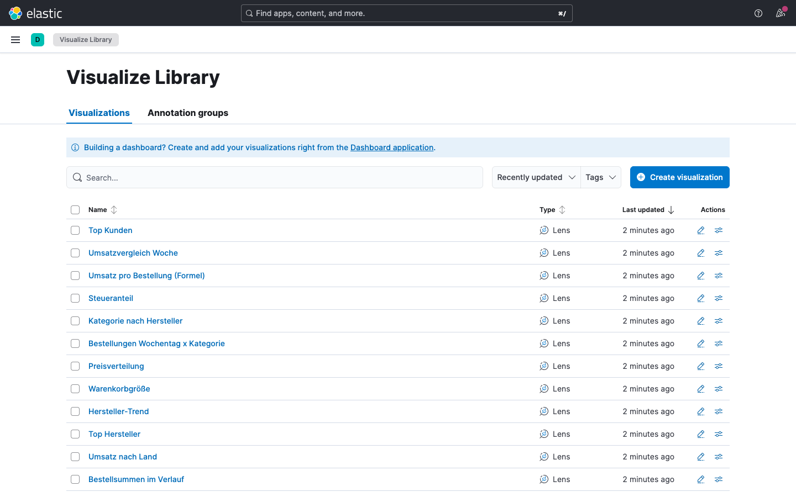

---

## Teil 1: Controlling-Dashboard

Erstelle ein zweites Dashboard speziell für das Controlling - mit Fokus auf
finanzielle Kennzahlen, Trends und Vergleiche.

### Schritt 1.1: Neues Dashboard erstellen

1. Navigiere zu **Analytics > Dashboard**
2. Klicke auf **Create dashboard**

### Schritt 1.2: KPI mit Trendvergleich (Vorwoche)

Erstelle eine Metrik, die den **Umsatz dieser Woche mit der Vorwoche**
vergleicht:

1. Klicke auf **Add** -> **Visualization** und wähle den Typ **Metric**
2. Ziehe `taxful_total_price` in **Primary metric**.
3. Ändere die Funktion auf **Sum**
4. Ziehe `taxful_total_price` auch in **Secondary metric** und wähle **Sum**
5. Klicke auf die **Secondary metric**. Klappe den Bereich **Advanced** auf.
6. Füge einen **Time shift** hinzu: `Previous Time Range`

**Erwartetes Ergebnis:** Die Metrik zeigt den aktuellen Umsatz und darüber den
Wert des vorherigen Berichtszeitraums an.

7. Speichere als: `Umsatz vs. vorheriger Zeitraum`

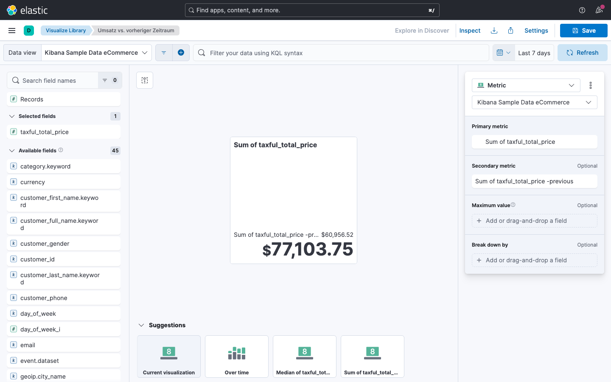

### Schritt 1.3: Bestellanzahl mit Trendvergleich

Wiederhole das gleiche Prinzip für die Bestellanzahl:

1. Neue **Metric** mit **Count** über `order_id`
2. Füge einen Time Shift von `1w` hinzu
3. Speichere als: `Bestellungen vs. Vorberichtszeitraum`

### Schritt 1.4: Umsatz nach Kategorie (Balken) und Breakdown nach Geschlecht

Erstelle ein vertikales Balkendiagramm, das den
**Umsatz pro Kategorie** zeigt (nicht die Anzahl):

1. Neue Visualisierung, Typ **Bar**
2. Horizontale Achse: `category.keyword` (Top values, 8)
3. Vertikale Achse: `taxful_total_price` mit **Sum**
4. Füge einen Breakdown hinzu über `customer_gender`
5. Wähle unter "Appearance" ein Color Mapping nach deinem Geschmack
6. Speichere als: `Umsatz nach Kategorie und Geschlecht`

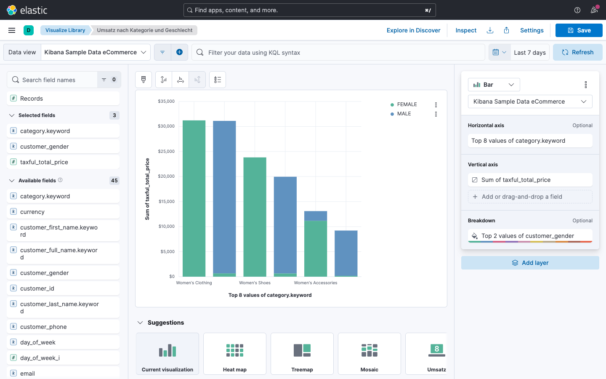

### Schritt 1.5: Ebenen

Erstelle ein Liniendiagramm mit **zwei Linien** und einem weiteren Layer:

1. Neue Visualisierung, Typ **Line**
2. Horizontale Achse: `order_date`
3. Vertikale Achse: `taxful_total_price` mit **Sum** - benenne sie "Brutto"
4. Weitere Vertikale Achse: `taxful_total_price` mit **Moving Average** und
   **Choose a sub-function** "Sum" sowie **Window Size** 10. Benenne sie "
Gleitender Durchschnitt"
5. Füge einen weiteren **Layer** hinzu (Knopf mit **+** oben)
6. Wähle **Visualisation** -> **Bar**. Horizontale Achse: `order_date`, Vertikale
   Achse: `order_id`
   **Unique Count** und unter Appearance **Axis Side** -> Right
7. Wähle unter **Series Color** eine helle Pastellfarbe für dieses Bar Chart,
   damit es übersichtlich bleibt

Speichere als: `Bestellsummen im Verlauf`

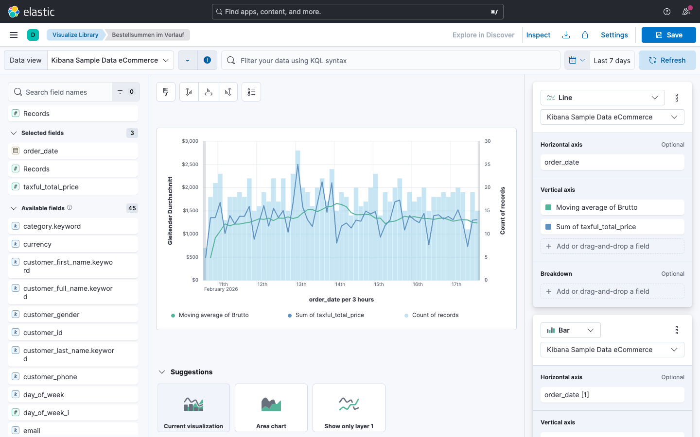

### Schritt 1.6: Umsatzverteilung nach Land (Tabelle)

Erstelle eine Tabelle mit den **Top 15 Ländern nach Umsatz**:

1. Neue Visualisierung, Typ **Table**
2. **Rows**: `geoip.country_iso_code`, Top values (15)
3. **Metrics** (Spalten):

| Feld                 | Funktion | Anzeigename   |
|:---------------------|:---------|:--------------|
| `taxful_total_price` | Sum      | Umsatz        |
| `Records`            | Count    | Bestellungen  |
| `taxful_total_price` | Average  | Durchschn. BW |

4. Sortiere nach Umsatz absteigend
5. Speichere als: `Umsatz nach Land`

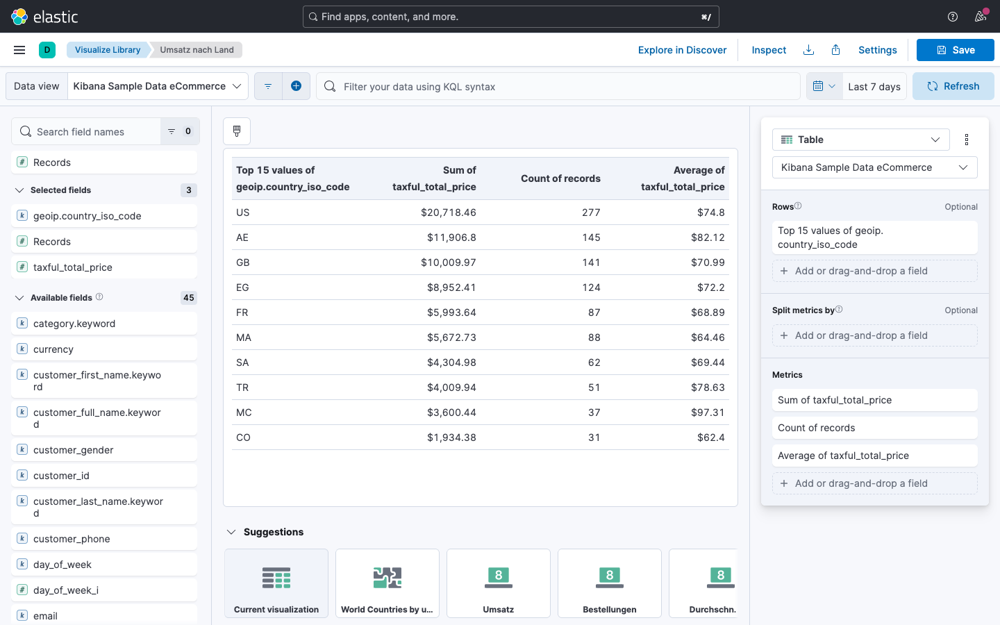

### Schritt 1.7: Dashboard zusammenstellen

Ordne die Visualisierungen im Controlling-Dashboard:

```text
+-----------------------+-----------------------+
| Umsatz vs. Vorwoche   | Bestellungen vs. Vorw.|
| (Metrik mit Trend)    | (Metrik mit Trend)    |
+-----------------------+-----------------------+
| Umsatz nach Kategorie (Balken, volle Breite)  |
+------------------------------------------------+
| Bestellsummen im Verlauf | Umsatz nach Land    |
| (Liniendiagramm)         | (Tabelle)           |
+--------------------------+---------------------+
```

### Schritt 1.8: Controls hinzufügen

Füge dem Controlling-Dashboard folgende Controls hinzu:

1. **Kategorie** (Options list auf `category.keyword`)
2. **Land** (Options list auf `geoip.country_iso_code`)
3. **Bestellwert** (Range slider auf `taxful_total_price`)

### Schritt 1.9: Dashboard speichern

1. Titel: `Controlling - Umsatzanalyse`
2. Beschreibung: "Finanzielle Kennzahlen mit Trendvergleich und Länderanalyse"

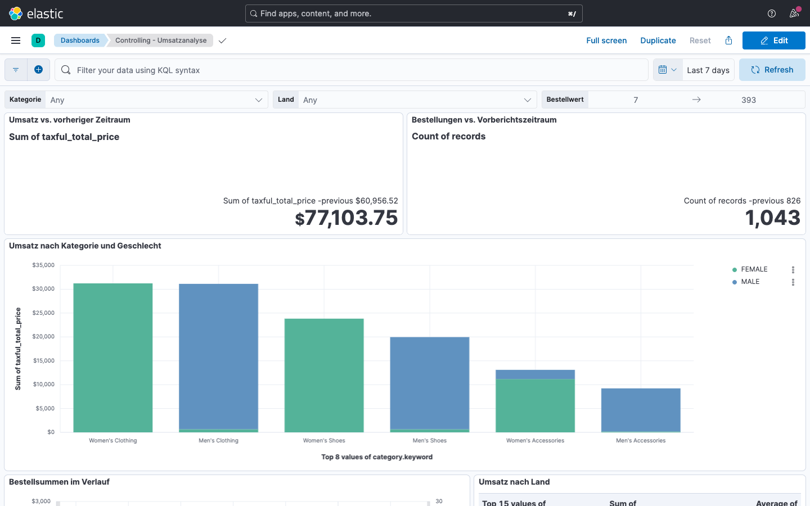

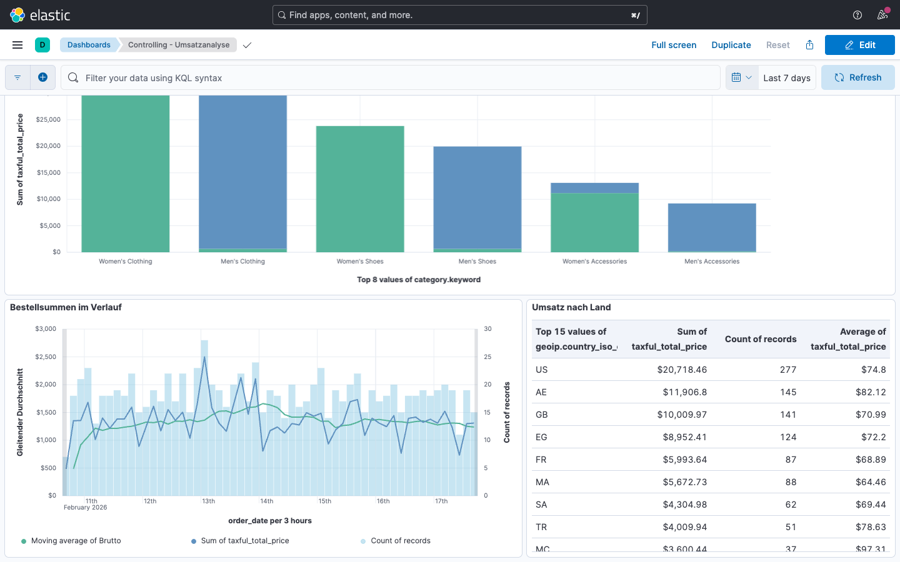

---

## Teil 2: Produktmanagement-Dashboard

Erstelle ein drittes Dashboard für das Produktmanagement - mit Fokus auf
Hersteller, Rabatte und Warenkorbanalyse.

### Schritt 2.1: Neues Dashboard erstellen

1. **Analytics > Dashboard > Create dashboard**

### Schritt 2.2: Top-Hersteller nach Umsatz

Erstelle ein horizontales Balkendiagramm mit den
**umsatzstärksten Herstellern**:

1. Neue Visualisierung, Typ **Bar horizontal**
2. Vertikale Achse: `manufacturer.keyword` (Top values, 10)
3. Horizontale Achse: `taxful_total_price` mit **Sum**
4. Speichere als: `Top Hersteller`

### Schritt 2.3: Hersteller-Performance über Zeit

Erstelle ein Liniendiagramm, das den **Umsatz der Top-5-Hersteller über die Zeit
** vergleicht:

1. Neue Visualisierung, Typ **Line**
2. Horizontale Achse: `order_date` (Date histogram)
3. Vertikale Achse: `taxful_total_price` mit **Sum**
4. Ziehe `manufacturer` auf **Breakdown**
5. Klicke auf die Break-down-Konfiguration, wähle `manufacturer.keyword` und
   setze **Number of values** auf `5`
6. Speichere als: `Hersteller-Trend`

### Schritt 2.4: Warenkorbgröße analysieren

Erstelle ein Balkendiagramm, das zeigt, wie viele Artikel typischerweise pro
Bestellung bestellt werden:

1. Neue Visualisierung, Typ **Bar vertical**
2. Horizontale Achse: `total_quantity` mit Funktion **Intervals**
3. Konfiguriere folgende Bereiche (**custom ranges**):
    - 1-1 (Einzelartikel)
    - 2-3
    - 4-5
    - 6+
4. Vertikale Achse: **Count** über `order_id`.
5. Speichere als: `Warenkorbgröße`

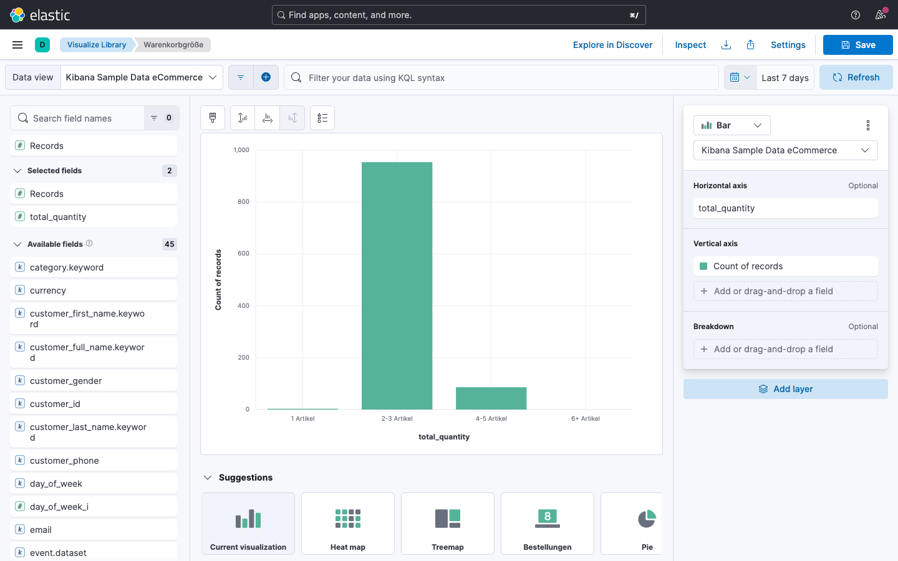

### Schritt 2.5: Preisanalyse - Pie-Chart

Erstelle ein Kuchen-Diagramm, das die Verteilung der Produktpreise zeigt:

1. Neue Visualisierung, Typ **Pie**
2. Slice by: `products.price`
   mit **Custom Ranges**:
    - $0-$10
    - $10-25
    - $25-$100
    - $100-Unendlich
3. Metrik: **Count**
4. Speichere als: `Preisverteilung`

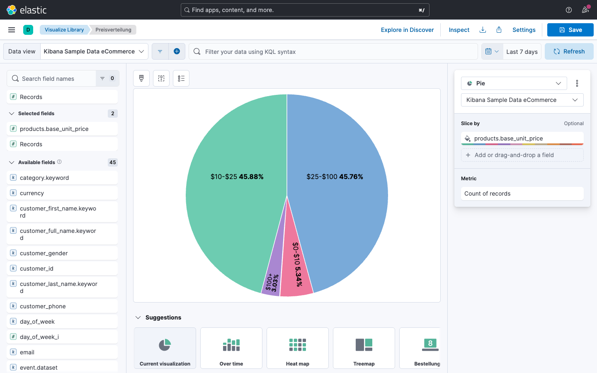

### Schritt 2.6: Wochentag-Analyse (Heatmap)

Erstelle eine Heatmap, die zeigt, an welchen
**Wochentagen** das höchste Bestellvolumen liegt:

1. Neue Visualisierung, Typ **Heat map**
2. Horizontale Achse: `day_of_week` (Top values, 7)
3. Vertikale Achse: `category` (Top values, 6)
4. Cell Value: **Count** (Farbskala)
5. Speichere als: `Bestellungen Wochentag x Kategorie`

**Erwartetes Ergebnis:** Eine farbige Matrix, die zeigt, welche Kategorien an
welchen Tagen besonders gefragt sind. Dunklere Farben = mehr Bestellungen.

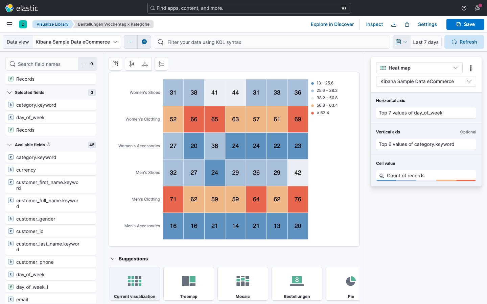

### Schritt 2.7: Herstellerverteilung pro Kategorie

Erstelle ein gestapeltes Balkendiagramm, das die
**Bestellungen nach Kategorie, aufgeteilt nach Hersteller** zeigt:

1. Neue Visualisierung, Typ **Bar vertical stacked**
2. Horizontale Achse: `category` (Top values, 8)
3. Vertikale Achse: **Count**
4. Ziehe `manufacturer.keyword` auf **Breakdown**
5. Speichere als: `Kategorie nach Hersteller`

### Schritt 2.8: Dashboard zusammenstellen

```text
+---------------------------+---------------------+
| Top Hersteller (Balken)   | Preisverteilung    |
|                           | (Pie)              |
+---------------------------+---------------------+
| Hersteller-Trend (Linie, volle Breite)          |
+---------------------------+---------------------+
| Warenkorbgröße            | Kategorie nach      |
| (Balken)                  | Hersteller (Balken) |
+---------------------------+---------------------+
| Bestellungen Wochentag x Kategorie (Heatmap)    |
+-------------------------------------------------+
```

### Schritt 2.9: Controls hinzufügen

1. **Hersteller** (Options list auf `manufacturer.keyword`)
2. **Kategorie** (Options list auf `category.keyword`)
3. **Geschlecht** (Options list auf `customer_gender`)

### Schritt 2.10: Dashboard speichern

1. Titel: `Produktmanagement - Sortimentsanalyse`
2. Beschreibung: "Hersteller-Performance, Preise, Warenkörbe und Kundenstruktur"

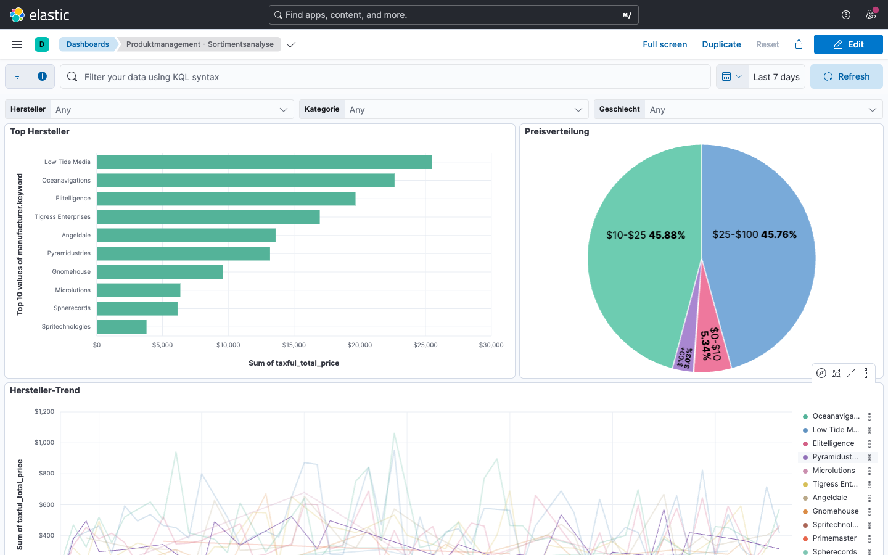

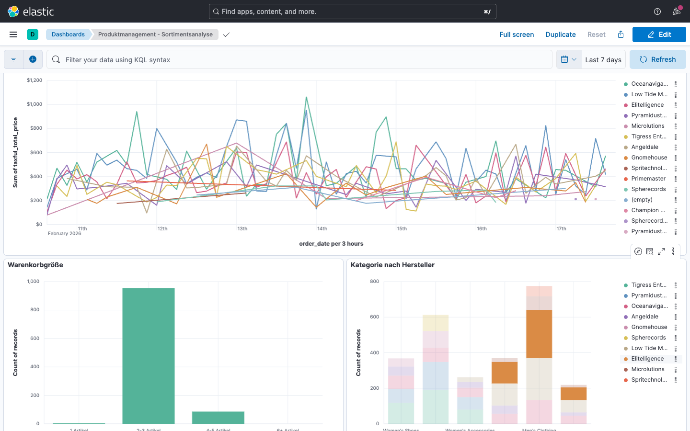

---

## Teil 3: Fortgeschrittene Lens-Techniken

Erweitere die bestehenden Dashboards mit fortgeschrittenen Visualisierungen.

### Aufgabe 3.1: Formel - Durchschnittlicher Artikelpreis

Erstelle eine Metrik, die den **durchschnittlichen Preis pro verkauftem Artikel** berechnet - nicht pro Bestellung, sondern pro Einzelartikel:

1. Neue Visualisierung, Typ **Metric**
2. Statt ein Feld zu ziehen, klicke auf
   **Primary metric** und wähle **Formula**
3. Gib folgende Formel ein:

```text
sum(taxful_total_price) / sum(total_quantity)
```

4. Formatiere die Ausgabe als **Number** mit 2 Dezimalstellen
   (unter Format in der Konfiguration)
5. Speichere als: `Durchschn. Artikelpreis`
6. Füge die Metrik zum Controlling-Dashboard hinzu

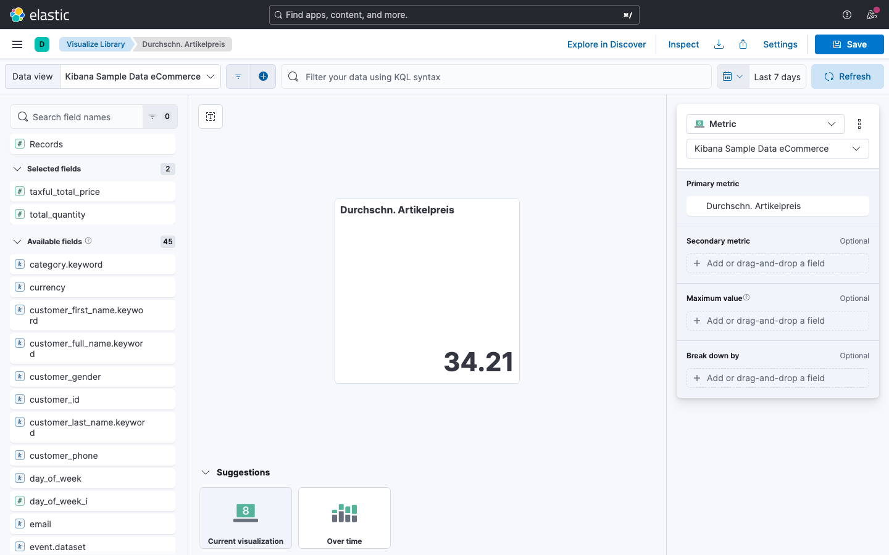

> **Hinweis:** Dieser Wert unterscheidet sich vom
> durchschnittlichen Bestellwert (Aufgabe 3.2), weil
> hier durch die Artikelanzahl geteilt wird, nicht
> durch die Bestellanzahl.

### Aufgabe 3.2: Formel - Umsatz pro Bestellung

Erstelle eine Metrik mit einer Formel für den durchschnittlichen Umsatz pro
Bestellung:

1. Neue Visualisierung, Typ **Metric**
2. Wähle **Formula** und gib ein:

```text
sum(taxful_total_price) / count()
```

3. Formatiere als **Number** mit 2 Dezimalstellen
4. Speichere als: `Umsatz pro Bestellung (Formel)`


### Aufgabe 3.3: Referenzlinie im Umsatzverlauf

Füge dem Liniendiagramm "Umsatz über Zeit" eine
**Referenzlinie** für den Durchschnitt hinzu:

1. Öffne die Visualisierung `Umsatz über Zeit` zur Bearbeitung
2. Im rechten Konfigurationspanel, klicke **+** und dann **Reference lines**
3. Klicke auf **Static value**, um ihn zu ersetzen
4. Klicke auf **Quick function** -> **Average**
5. Gebe der Linie weiter unten unter **Appearance** den Namen "Durchschnitt"
6. Wähle eine gestrichelte Linie in einer auffälligen Farbe (z.B. blau)
7. Speichere die Änderung

**Erwartetes Ergebnis:** Das Liniendiagramm zeigt den Umsatzverlauf mit einer horizontalen Durchschnittslinie an.

### Aufgabe 3.4: Umsatz mit Vorwochenvergleich (Linie)

Erstelle ein Liniendiagramm, das den **aktuellen Umsatz neben dem der Vorwoche**
zeigt:

1. Neue Visualisierung, Typ **Line**
2. Horizontale Achse: `order_date`
3. Vertikale Achse 1: `taxful_total_price` mit **Sum** - benenne sie "Aktuelle Woche"
4. Füge eine zweite vertikale Achse hinzu, ebenfalls `taxful_total_price` mit **Sum**
5. Für die zweite Linie: Aktiviere **Time shift**
   und gib `1w` ein - benenne sie "Vorwoche"
6. Speichere als: `Umsatzvergleich Woche`
7. Füge die Visualisierung zum Controlling-Dashboard hinzu

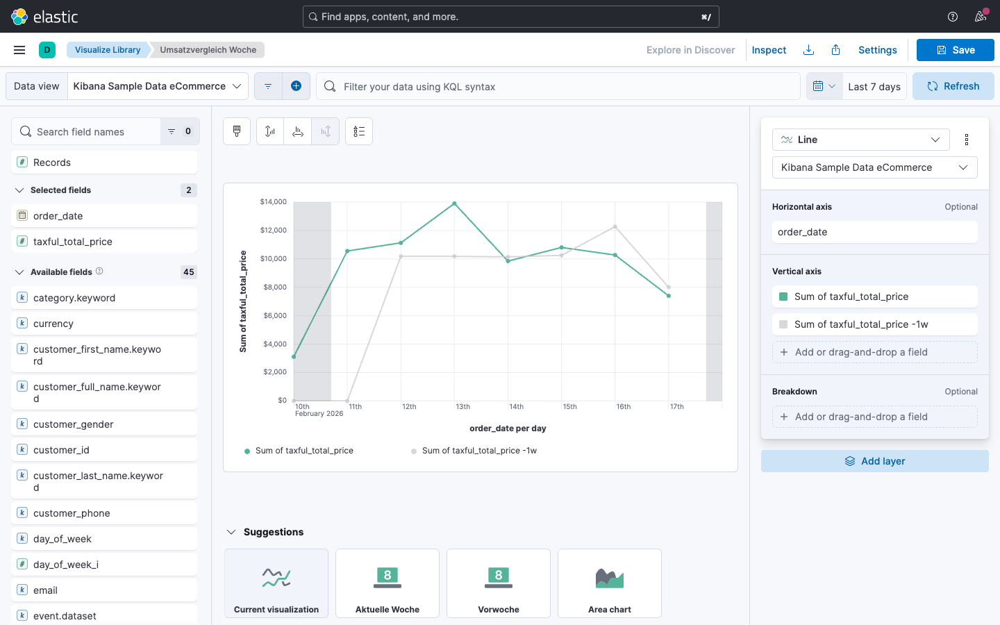

### Aufgabe 3.5: Top-Kunden-Tabelle

Erstelle eine detaillierte Tabelle der
**wertvollsten Kunden**:

1. Neue Visualisierung, Typ **Table**
2. Konfiguriere als **Rows** das Feld `customer_full_name`
3. Konfiguriere die Spalten (**Metrics**) wie folgt:

| Feld                 | Funktion        | Anzeigename    |
|:---------------------|:----------------|:---------------|
| `taxful_total_price` | Sum             | Gesamtumsatz   |
| `taxful_total_price` | Average         | Durchschn. BW  |
| `Records`            | Count           | Bestellungen   |
| `total_quantity`     | Sum             | Artikel gesamt |

4. Sortiere nach Gesamtumsatz absteigend
5. Speichere als: `Top Kunden`
6. Füge die Tabelle zum Controlling-Dashboard hinzu

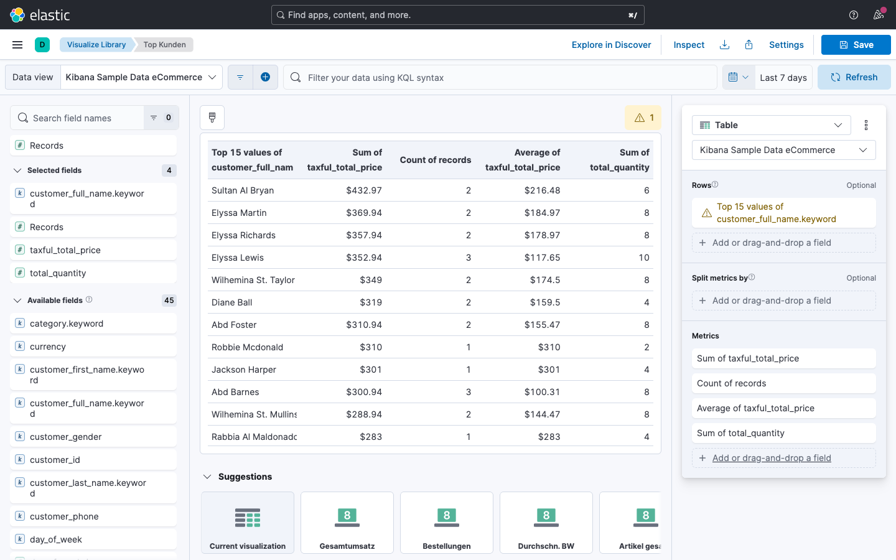

### Aufgabe 3.6: Formel - Umsatzveränderung zum Vorberichtszeitraum

Erstelle eine Metrik, die die **prozentuale Umsatzveränderung**
gegenüber dem vorherigen Berichtszeitraum anzeigt:

1. Neue Visualisierung, Typ **Metric**
2. Wähle **Formula** und gib ein:

```text
(sum(taxful_total_price) - sum(taxful_total_price, shift='previous')) / sum(taxful_total_price, shift='previous')
```

3. Formatiere als **Percent** mit 1 Dezimalstelle
4. Benenne die Metrik: "Umsatzveränderung"
5. Speichere als: `Umsatzveränderung (%)`
6. Füge die Metrik zum Controlling-Dashboard hinzu

**Erwartetes Ergebnis:** Die Metrik zeigt z.B. `+12,3%` oder `-5,7%`
an. Ein positiver Wert bedeutet Umsatzwachstum gegenüber dem
vorherigen Zeitraum (bei "Last 7 days" ist das die Vorwoche).

> **Hinweis:** Der Parameter `shift='previous'` verschiebt die
> Aggregation automatisch um den aktuellen Berichtszeitraum. Bei
> "Last 7 days" entspricht das 7 Tagen, bei "Last 30 days"
> entsprechend 30 Tagen.

### Aufgabe 3.7: Formel - Anteil hochwertiger Bestellungen

Erstelle eine Metrik, die den **prozentualen Anteil der Bestellungen
mit einem Gesamtwert über 100 EUR** an allen Bestellungen anzeigt:

1. Neue Visualisierung, Typ **Metric**
2. Wähle **Formula** und gib ein:

```text
count(kql='taxful_total_price > 100') / count()
```

3. Formatiere als **Percent** mit 1 Dezimalstelle
4. Benenne die Metrik: "Anteil Bestellungen mit mehr als 100 EUR Umsatz"
5. Speichere als: `Anteil hochwertige Bestellungen`
6. Füge die Metrik zum Controlling-Dashboard hinzu

**Erwartetes Ergebnis:** Die Metrik zeigt z.B. `68,4%`. Das bedeutet,
dass rund zwei Drittel aller Bestellungen einen Wert über 100 EUR haben.

> **Hinweis:** Die Funktion `count(kql='...')` filtert die Zählung
> per KQL-Ausdruck. So lassen sich Teilmengen in Formeln verwenden,
> ohne einen Dashboard-Filter zu setzen.

---

## Teil 4: Dashboard-Drilldowns

Verbinde die drei Dashboards miteinander, sodass Nutzer per Klick zwischen
Überblick, Controlling und Produktmanagement navigieren können.

### Aufgabe 4.1: Drilldown vom Überblick zum Controlling

1. Öffne das Dashboard `Überblick - Geschäftsführung`
   im Bearbeitungsmodus
2. Klicke auf die drei Punkte am Panel
   `Umsatz über Zeit`
3. Wähle **Create drilldown**
4. Wähle **Go to dashboard**
5. Ziel-Dashboard: `Controlling - Umsatzanalyse`
6. Speichere

**Test:** Klicke im Überblick-Dashboard auf einen Datenpunkt im Liniendiagramm.
Du solltest zum Controlling-Dashboard navigiert werden.

### Aufgabe 4.2: Drilldown vom Überblick zum Produktmanagement

1. Klicke auf die drei Punkte am Panel
   `Top Produktkategorien`
2. **Create drilldown > Go to dashboard**
3. Ziel: `Produktmanagement - Sortimentsanalyse`

**Test:** Klicke im Balkendiagramm auf eine Kategorie. Du solltest zum
Produktmanagement-Dashboard navigiert werden, gefiltert auf diese Kategorie.

### Aufgabe 4.3: Navigation testen

Teste den kompletten Navigationsfluss:

1. Starte im `Überblick - Geschäftsführung`
2. Klicke auf "Women's Clothing" im Balkendiagramm - du landest im
   Produktmanagement-Dashboard, gefiltert auf Women's Clothing
3. Gehe zurück (Browser-Zurück-Button)
4. Klicke auf einen Datenpunkt im Umsatzverlauf - du landest im
   Controlling-Dashboard
5. Gehe zurück zum Überblick

> **Tipp:** Mit Drilldowns kannst du eine
> Dashboard-Hierarchie aufbauen: Überblick als
> Einstieg, Detail-Dashboards eine Ebene tiefer.

---

## Teil 5: Dashboard finalisieren und teilen

### Aufgabe 5.1: Dashboards im Vollbild prüfen

Öffne jedes der drei Dashboards im Vollbildmodus
(**Full screen** oder Taste `F`) und prüfe:

- [ ] Sind alle Panels sichtbar ohne zu scrollen?
- [ ] Sind die Titel aussagekräftig?
- [ ] Sind die Farben konsistent?
- [ ] Funktionieren die Controls?
- [ ] Funktioniert Cross-Filtering?

### Aufgabe 5.2: Dashboard-Link teilen

1. Öffne das Überblick-Dashboard
2. Klicke auf **Share** in der Toolbar
3. Wähle **Get link**
4. Kopiere den Link

> Dieser Link enthält den aktuellen Zeitfilter
> und alle gesetzten Filter. Kollegen sehen
> exakt die gleiche Ansicht.

---

## Zusammenfassung

Du hast erfolgreich:

- [x] Ein **Controlling-Dashboard** mit Trendvergleichen (Time Shift) erstellt
- [x] Ein **Produktmanagement-Dashboard** mit Hersteller-Analyse, Heatmap,
  Geschlechterverteilung und Rabattanalyse gebaut
- [x] **Formeln** in Lens verwendet
  (Artikelpreis, Umsatz pro Bestellung, Umsatzveränderung)
- [x] **Referenzlinien** und **Vorwochenvergleiche**
  konfiguriert
- [x] **Drilldowns** zwischen Dashboards eingerichtet
- [x] Dashboards **geteilt** (Link)
