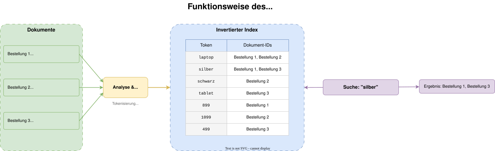
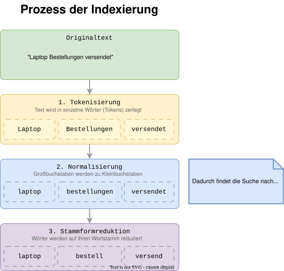
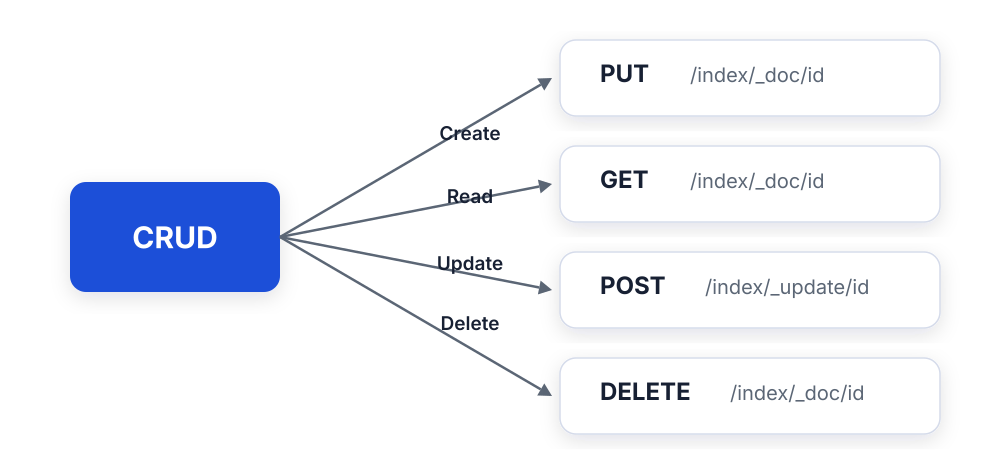
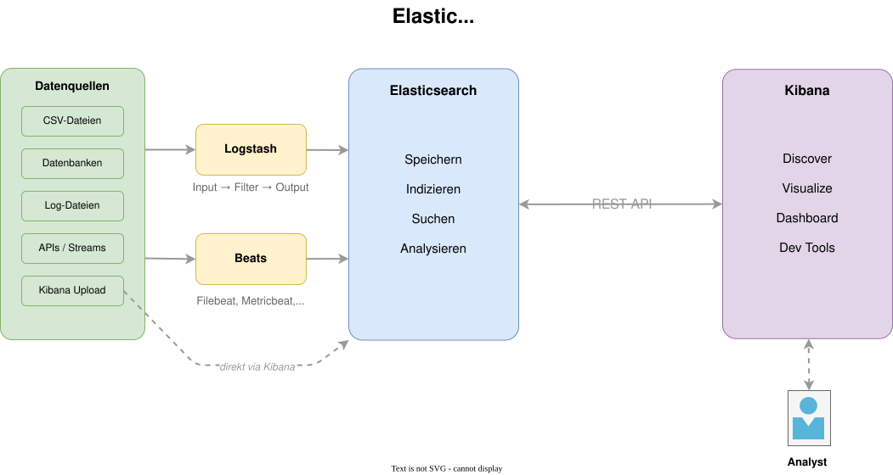
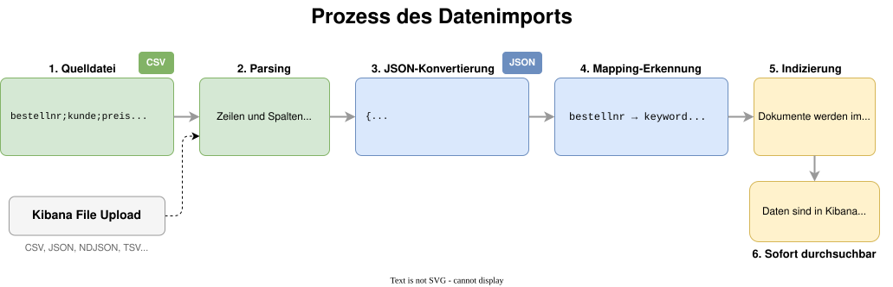
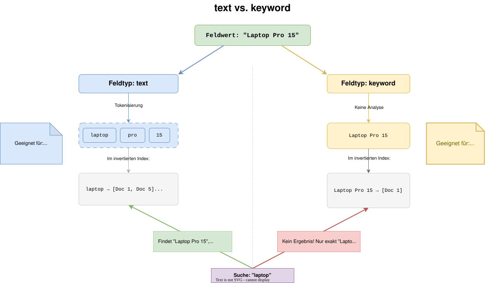

<style>
section blockquote { font-size: 0.8em; line-height: 1.3; margin-top: 0.25em; }
</style>

# Elastic Stack

## Modul 01: Einführung

---

# Über dieses Modul

- Grundlagen des Elastic Stack
- Wie funktioniert eine Suchmaschine überhaupt?
- Wie kommen Daten nach Elasticsearch?
- Direkt mit dem Cluster reden - per REST-API
- Warum Mappings über deine späteren Analysen entscheiden

---

# Lernziele

Nach diesem Modul kannst du:

- Erklären, was eine Suchmaschine von einer Datenbank unterscheidet
- Die Komponenten des Elastic Stack benennen und ihre Rollen beschreiben
- Den Unterschied zwischen Elasticsearch und OpenSearch einordnen
- Verstehen, wie Daten in Elasticsearch importiert und indiziert werden
- Erklären, warum Mappings für Analysen und Aggregationen entscheidend sind
- Erste CRUD-Operationen und Suchen über die REST-API in den Kibana Dev Tools
  ausführen

---

# Teil 1: Allgemeines zu Suchmaschinen

---

# Warum gibt es Suchmaschinen?

Stell dir vor, du hast ein Buch mit 500 Seiten und suchst alle Stellen, in
denen "Umsatz" vorkommt.

**Ohne Index:** Du blätterst jede Seite durch. Das dauert ewig.

**Mit Index (Stichwortverzeichnis):** Du schlägst hinten nach und findest sofort
alle Seitenzahlen.

> So arbeitet auch eine Suchmaschine: Sie baut den Index schon vorab auf. Die
> eigentliche Suche geht dann schnell, egal wie viele Daten dahinterstehen.

---

# Volltextsuche vs. Datenbankabfrage

<style scoped>
table { font-size: 0.85em; }
</style>

| Merkmal                  | Datenbank (SQL)           | Suchmaschine                |
| ------------------------ | ------------------------- | --------------------------- |
| Stärke                   | Exakte Abfragen           | Textsuche, Relevanz         |
| Beispiel                 | `WHERE stadt = 'Köln'`    | "Köln" findet auch "Kölner" |
| Geschwindigkeit bei Text | Langsam bei großen Mengen | Sehr schnell                |
| Tippfehler               | Kein Ergebnis             | Trotzdem Treffer möglich    |
| Sortierung               | Nach Spalte               | Nach Relevanz               |

> **Merke:** Eine Suchmaschine ersetzt keine Datenbank - sie ergänzt sie.
> Viele Unternehmen nutzen beides zusammen.

---

# Was ist ein invertierter Index?

Ein invertierter Index dreht die Logik um:
Statt "Welche Wörter enthält Dokument X?"
fragt er "In welchen Dokumenten kommt Wort Y vor?"

**Beispiel - Bestelldaten der Mustertech GmbH:**

| Dokument     | Inhalt                      |
| ------------ | --------------------------- |
| Bestellung 1 | "Laptop, silber, 899 EUR"   |
| Bestellung 2 | "Laptop, schwarz, 1099 EUR" |
| Bestellung 3 | "Tablet, silber, 499 EUR"   |

---



---



---

# Frage in die Runde

- Wo suchst du heute im Alltag - Logs, Doku, Produktkatalog, Tickets?
- Was nervt dich an eurer aktuellen Suche am meisten?

---

# Teil 2: Elasticsearch Grundlagen

---

# Was ist Elasticsearch?

Elasticsearch ist eine **verteilte Such- und Analyseplattform**, die auf dem
invertierten Index aufbaut.

Kernmerkmale:

- **Open Source** (mit Einschränkungen, dazu später mehr)
- **Dokumentenorientiert:** Daten werden als JSON-Dokumente gespeichert
- **Schnell:** durchsucht auch sehr große Datenmengen in Sekunden
- **Skalierbar:** wächst mit deinen Daten mit
- **REST-API:** Kommunikation über Standard-HTTP

---
<style scoped>
section { font-size: 1.6em; }
</style>

# Was ist ein JSON-Dokument?

JSON ist ein einfaches Textformat. Jeder Datensatz in Elasticsearch ist ein
JSON-Dokument:

```json
{
  "bestellnummer": "MT-2024-001",
  "kunde": "Firma Müller",
  "produkt": "Laptop Pro 15",
  "preis": 1299.00,
  "anzahl": 2,
  "bestelldatum": "2024-03-15",
  "status": "versendet"
}
```

> Keine Zeilen und Spalten wie in Excel, sondern Schlüssel-Wert-Paare. Der
> Vorteil: Jedes Dokument darf andere Felder haben.

---

# Dokumente, Indizes und Felder

<style scoped>
section { font-size: 1.5em; }
</style>

Die wichtigsten Begriffe im Überblick:

| Begriff      | Erklärung                   | Analogie                 |
| ------------ | --------------------------- | ------------------------ |
| **Dokument** | Ein einzelner Datensatz     | Eine Zeile in Excel      |
| **Index**    | Sammlung von Dokumenten     | Ein Excel-Arbeitsblatt   |
| **Feld**     | Eigenschaft eines Dokuments | Eine Spalte in Excel     |
| **Mapping**  | Beschreibung der Felder     | Spaltenüberschrift + Typ |

**Beispiel Mustertech GmbH:**

- Index `bestellungen` enthält alle Bestelldokumente
- Index `produkte` enthält alle Produktdokumente
- Index `kunden` enthält alle Kundendokumente

---

# REST-API

Elasticsearch spricht HTTP - dasselbe Protokoll wie dein Browser.

- Jede Operation = **Methode + Pfad + JSON-Body**
- Kein Spezial-Client nötig: `curl`, Postman oder Kibana Dev Tools
- Auch Kibana schickt im Hintergrund genau diese Aufrufe


> Diese Aufrufe begleiten dich durch die ganze Schulung.

---

# Kibana Dev Tools Console

Die bequemste Art, mit der REST-API zu arbeiten:

- Zu finden unter **Management → Dev Tools**
- Syntax: `METHODE /pfad`, darunter optional ein JSON-Body
- **Autocomplete** für Endpunkte, Feldnamen und Parameter
- Ausführen mit **Ctrl+Enter** (Windows/Linux) bzw. **Cmd+Enter** (macOS)

```
GET /_cluster/health
```

> Alle REST-Beispiele in dieser Schulung kannst du 1:1 in die Console kopieren.

---

# CRUD über die REST-API

Vier Operationen, vier HTTP-Methoden:



> Jetzt einmal durch den ganzen Zyklus - live in den Dev Tools.

---

# CRUD per REST: Dokument anlegen

Ein neuer Kunde der Mustertech GmbH - `PUT` mit expliziter ID:

```json
PUT /kunden/_doc/1
{
  "name": "Firma Müller",
  "stadt": "Köln",
  "branche": "Maschinenbau",
  "kunde_seit": "2019-04-01"
}
```

> Existiert der Index `kunden` noch nicht, legt Elasticsearch ihn automatisch
> an, inklusive dynamischem Mapping.

---

# CRUD per REST: Dokument lesen

<style scoped>
section { font-size: 1.6em; }
</style>

Abruf über Index, `_doc` und ID:

```json
GET /kunden/_doc/1
```

Die Antwort enthält Metadaten (`_index`, `_id`, `_version`) und das Dokument
selbst unter `_source`:

```json
{
  "_index": "kunden",
  "_id": "1",
  "_version": 1,
  "found": true,
  "_source": { "name": "Firma Müller", "stadt": "Köln", "..." : "..." }
}
```

---

# CRUD per REST: Dokument aktualisieren

Mit `_update` änderst du nur einzelne Felder, der Rest bleibt erhalten:

```json
POST /kunden/_update/1
{
  "doc": {
    "stadt": "Düsseldorf"
  }
}
```

> Intern schreibt Elasticsearch trotzdem eine neue Dokumentversion:
> `_version` zählt hoch. Dokumente sind unveränderlich (immutable).

---

# CRUD per REST: Dokument löschen

```json
DELETE /kunden/_doc/1
```

Und wenn der ganze Index weg soll:

```json
DELETE /kunden
```

> **Vorsicht:** `DELETE /kunden` löscht den Index mit allen Dokumenten und dem
> Mapping - ohne Rückfrage.

---

# Suche minimal: match

Ein erster Vorgeschmack auf die Suche - Volltextsuche mit `match`:

```json
GET /kunden/_search
{
  "query": {
    "match": {
      "name": "müller"
    }
  }
}
```

- `match` analysiert den Suchbegriff: Groß-/Kleinschreibung egal,
  Wortzerlegung inklusive
- Ergebnisse kommen nach **Relevanz** sortiert zurück

---

# Suche minimal: term

Exakte Werte filterst du mit `term`, typischerweise auf `keyword`-Feldern:

```json
GET /kunden/_search
{
  "query": {
    "term": {
      "branche.keyword": "Maschinenbau"
    }
  }
}
```

- `term` analysiert nichts: Der Wert muss **exakt** übereinstimmen

> Die Details der Query DSL (bool, range, Aggregationen ...) schauen wir uns
> später in einem eigenen Modul an.

---

# Bulk-API: Warum?

Stell dir vor, du willst 10.000 Bestellungen importieren.

**Einzeln (10.000 × `PUT`):**

- 10.000 HTTP-Roundtrips
- Jede Anfrage hat Overhead (Verbindung, Header, Antwort)

**Gebündelt (1 × `_bulk`):**

- Ein einziger HTTP-Aufruf mit allen Dokumenten
- Spart den Overhead und ist deutlich schneller

> **Merke:** Sobald du mehr als eine Handvoll Dokumente schreibst, nimm `_bulk`.
> Beats und Logstash machen intern übrigens genau das.

---

# Bulk-API: Das Zeilenformat

<style scoped>
section { font-size: 1.6em; }
pre { font-size: 0.75em; }
</style>

Immer im Wechsel: eine Zeile **Action**, eine Zeile **Dokument** (NDJSON):

```json
POST /_bulk
{ "index": { "_index": "kunden", "_id": "2" } }
{ "name": "Schmidt AG", "stadt": "Hamburg", "branche": "Logistik" }
{ "index": { "_index": "kunden", "_id": "3" } }
{ "name": "Weber & Co", "stadt": "München", "branche": "Handel" }
{ "index": { "_index": "kunden", "_id": "4" } }
{ "name": "Becker GmbH", "stadt": "Köln", "branche": "Maschinenbau" }
```

- Jede Zeile ist ein eigenständiges JSON-Objekt, **kein** Array drumherum
- Die letzte Zeile muss mit einem Zeilenumbruch enden
- Die Antwort listet den Status **pro Dokument** auf

---

# Frage in die Runde

- Wie landen bei euch heute Daten in einem System - Skript, Cronjob, Import-Button?
- Wo würdest du dir einen gebündelten Massen-Import wünschen?

---

# Teil 3: Zusammenspiel des Elastic Stack

---

# Die vier Komponenten

Der Elastic Stack besteht aus vier Hauptkomponenten:

| Komponente        | Aufgabe                             |
| ----------------- | ----------------------------------- |
| **Elasticsearch** | Speichern, Suchen, Analysieren      |
| **Kibana**        | Visualisierung und Bedienoberfläche |
| **Logstash**      | Daten einlesen und transformieren   |
| **Beats**         | Leichtgewichtige Datensammler       |

> Früher hieß das Ganze "ELK Stack" (Elasticsearch, Logstash, Kibana). Mit der
> Ergänzung von Beats wurde es zum "Elastic Stack".

---



---

# Elasticsearch - der Kern

Elasticsearch ist der Kern des Stacks. Hier passiert die eigentliche Arbeit:

- **Speichert** alle Daten als JSON-Dokumente
- **Indiziert** die Daten für schnelle Suche
- **Beantwortet** Suchanfragen und Aggregationen
- **Skaliert** automatisch über mehrere Server

> Du interagierst mit Elasticsearch über Kibana, direkt über die REST-API oder
> aus deiner Anwendung heraus über Sprach-Clients.

---

# Kibana

Mit Kibana arbeitest du im Alltag der Datenanalyse am meisten:

- **Discover:** Daten durchsuchen und filtern
- **Visualize:** Diagramme und Grafiken erstellen
- **Dashboard:** Mehrere Visualisierungen kombinieren
- **Dev Tools:** Direkte REST-Anfragen an Elasticsearch
  (kennst du bereits aus Teil 2)

> Kibana lernst du in den nächsten Modulen genauer kennen. Heute geht es erst
> mal darum, wie die Daten überhaupt nach Elasticsearch kommen.

---

# Logstash

<style scoped>
li { font-size: 0.9em; }
</style>

Logstash ist ein Werkzeug zur Datenverarbeitung:

- **Input:** Daten aus verschiedenen Quellen einlesen (Dateien, Datenbanken, APIs)
- **Filter:** Daten umwandeln, anreichern, bereinigen
- **Output:** Aufbereitete Daten an Elasticsearch senden

**Beispiel Mustertech GmbH:**
Logstash liest jede Nacht die neuen Bestellungen aus dem ERP-System und schreibt
sie in den Elasticsearch-Index `bestellungen`.

> An Tag 2 richtest du selbst Logstash-Pipelines ein und schreibst eigene
> Filter.

---

# Beats

Beats sind leichtgewichtige Programme, die auf Servern oder Arbeitsplätzen
laufen und Daten einsammeln:

| Beat           | Sammelt                      |
| -------------- | ---------------------------- |
| **Filebeat**   | Log-Dateien                  |
| **Metricbeat** | System- und Service-Metriken |
| **Packetbeat** | Netzwerkdaten                |
| **Heartbeat**  | Verfügbarkeitsdaten          |

> Für die Mustertech GmbH sammelt Metricbeat z. B. die Antwortzeiten des Online-Shops. Wenn der Shop langsam wird, siehst du das sofort im Kibana-Dashboard.

---

# Teil 4: Unterschiede zwischen Elasticsearch und OpenSearch

---

# Die Geschichte der Trennung

- **Bis 2021:** Elasticsearch war vollständig unter der Apache-2.0-Lizenz (Open Source)
- **Januar 2021:** Elastic (die Firma) änderte die Lizenz auf SSPL und Elastic License; bestimmte Cloud-Nutzungen waren damit eingeschränkt
- **April 2021:** Amazon (AWS) erstellte einen Fork namens **OpenSearch** unter der Apache-2.0-Lizenz
- **Seitdem:** Zwei getrennte Produkte, die sich unabhängig weiterentwickeln

> **Warum ist das relevant?** Je nach Unternehmen und Cloud-Anbieter triffst du
> auf das eine oder das andere Produkt.

---
<style scoped>
section { font-size: 1.7em; }
</style>

# Wann welches Produkt?

**Elasticsearch / Kibana wählen, wenn:**

- Du Elastic Cloud nutzen möchtest
- Du Wert auf die neuesten Features legst
  (z. B. ES|QL, ML-Funktionen)
- Dein Unternehmen bereits Elastic-Lizenzen hat

**OpenSearch wählen, wenn:**

- Du auf AWS arbeitest und den Managed Service nutzen möchtest
- Eine Apache-2.0-Lizenz erforderlich ist
- Du keinen Vendor-Lock-in möchtest

> In dieser Schulung verwenden wir **Elasticsearch und Kibana**.

---

# Teil 5: Datenimport und Indizierung

---

# Wege in den Cluster

<style scoped>
table { font-size: 0.78em; }
</style>

Es gibt mehrere Wege, Daten in Elasticsearch zu laden. Hier die wichtigsten:

| Weg                    | Beschreibung                                | Mehr dazu |
| ---------------------- | ------------------------------------------- | --------- |
| **Kibana File Upload** | CSV/JSON per Browser hochladen              | heute     |
| **REST-API + `_bulk`** | HTTP-Aufrufe, gebündelt per Bulk-API        | heute     |
| **Sprach-Clients**     | Offizielle Libraries für Java, JS, Python … | heute     |
| **Beats**              | Leichtgewichtige Datensammler auf Servern   | → Tag 2   |
| **Logstash**           | Automatisierte Pipelines mit Transformation | → Tag 2   |
| **Elastic Agent**      | Zentral verwaltete Datensammlung (Fleet)    | → Tag 3   |

---

# Kibana File Upload

Mit dem Kibana File Upload kannst du selbstständig Daten importieren:

**Unterstützte Formate:**

- CSV (Komma- oder Semikolon-getrennt)
- TSV (Tabulator-getrennt)
- JSON (einzelne Dokumente oder Arrays)
- NDJSON (ein JSON-Dokument pro Zeile)

---

## Ablauf Kibana File Upload

1. In Kibana auf "Upload a file" klicken
2. Datei per Drag & Drop hochladen
3. Kibana erkennt automatisch die Struktur
4. Feldtypen prüfen und ggf. anpassen
5. Index-Namen vergeben und importieren

---
<style scoped>
section { font-size: 1.5em; }
</style>

# Kibana File Upload - Grenzen

Der Kibana File Upload ist praktisch, hat aber Einschränkungen:

- **Maximale Dateigröße:** Standardmäßig 100 MB
- **Einmaliger Import:** Keine automatische Aktualisierung
- **Einfache Transformationen:** Keine komplexe Datenaufbereitung

**Wann nutze ich was?**

| Szenario                       | Empfehlung               |
| ------------------------------ | ------------------------ |
| Einmalige Analyse einer CSV    | Kibana Upload            |
| Täglicher Import aus ERP       | Logstash (→ Tag 2)       |
| Laufende Server-Überwachung    | Beats (→ Tag 2)          |
| Integration in eigene Software | REST-API / Sprach-Client |

---

# Praxisbeispiel: Bestelldaten importieren

<style scoped>
pre { font-size: 0.75em; }
</style>

Die Mustertech GmbH exportiert Bestelldaten als CSV-Datei aus dem ERP-System:

```csv
bestellnummer;kunde;produkt;kategorie;preis;anzahl;datum;status
MT-2024-001;Firma Müller;Laptop Pro 15;Laptops;1299.00;2;2024-03-15;versendet
MT-2024-002;Schmidt AG;USB-C Hub;Zubehör;49.99;10;2024-03-15;versendet
MT-2024-003;Weber & Co;Monitor Ultra 27;Monitore;599.00;3;2024-03-16;in Bearbeitung
MT-2024-004;Firma Müller;Tastatur Ergo;Zubehör;89.99;5;2024-03-16;versendet
```

Diese Datei kannst du direkt über den Kibana File Upload importieren. Kibana
erkennt das Semikolon als Trennzeichen und schlägt passende Feldtypen vor.

---



---

# Frage in die Runde

- Hattest du schon Ärger mit einem falsch erkannten Datentyp - PLZ, Datum, Betrag?
- Was ist dabei schiefgegangen?

---

# Teil 6: Mappings und Schemafreiheit

---

# Was ist ein Mapping?

Ein Mapping beschreibt die Struktur eines Index, also welche Felder es gibt
und welchen Typ sie haben.

**Vergleich mit Excel:**

| Excel                                 | Elasticsearch                |
| ------------------------------------- | ---------------------------- |
| Spalte "Preis" als Währung formatiert | Feld "preis" als Typ `float` |
| Spalte "Datum" als Datum formatiert   | Feld "datum" als Typ `date`  |
| Spalte "Name" als Text                | Feld "name" als Typ `text`   |

> Das Mapping bestimmt, was du mit den Daten machen kannst: Ohne richtigen Typ kein korrektes Sortieren, Filtern oder Aggregieren.

---

# Die wichtigsten Feldtypen

<style scoped>
table { font-size: 0.8em; }
</style>

| Feldtyp          | Beschreibung        | Beispiel          | Nutzung             |
| ---------------- | ------------------- | ----------------- | ------------------- |
| `text`           | Volltextsuche       | Produktname       | Suchen              |
| `keyword`        | Exakter Wert        | Status, Kategorie | Filtern, Gruppieren |
| `long` / `float` | Ganze / Dezimalzahl | Anzahl, Preis     | Rechnen, Sortieren  |
| `date`           | Datum / Zeitstempel | Bestelldatum      | Zeitreihen          |
| `boolean`        | Wahr / Falsch       | Bezahlt ja/nein   | Filtern             |
| `geo_point`      | Koordinaten         | Lieferadresse     | Kartenansicht       |

> **Tipp:** Achte beim Import besonders auf die Erkennung von `date`-Feldern. Wird ein Datum als `text` erkannt, kannst du keine Zeitreihen-Analysen durchführen.

---



---

# Schemafreiheit - Fluch und Segen

<style scoped>
section { font-size: 1.6em; }
</style>

Elasticsearch ist **schemafrei** (schema-free). Das bedeutet:

## Vorteile

- Du kannst Daten importieren, ohne vorher eine Tabellenstruktur festzulegen
- Neue Felder werden automatisch erkannt
- Verschiedene Dokumente im selben Index können unterschiedliche Felder haben

## Nachteile

- Automatische Erkennung rät manchmal falsch (z. B. "2024" als Zahl statt als Jahr)
- Einmal gesetzte Feldtypen können nachträglich nicht geändert werden
- Inkonsistente Daten erschweren die Analyse

---

# Warum Mappings für die Analyse

<style scoped>
table { font-size: 0.82em; }
section { font-size: 1.6em; }
</style>

Falsche Feldtypen führen zu Problemen bei der Analyse:

| Situation            | Problem                        | Lösung               |
| -------------------- | ------------------------------ | -------------------- |
| Preis als `text`     | Keine Summe, kein Durchschnitt | Als `float` mappen   |
| Datum als `text`     | Keine Zeitreihen möglich       | Als `date` mappen    |
| PLZ als `long`       | "01234" wird zu "1234"         | Als `keyword` mappen |
| Kategorie als `text` | Gruppierung geht nicht sauber  | Als `keyword` mappen |

> **Merke:** Prüfe beim Import immer die Feldtypen, bevor du den Import bestätigst. Nachträgliche Änderungen erfordern einen Neu-Import der Daten.

---

# Praxisbeispiel: Mapping der Bestelldaten

<style scoped>
section { font-size: 1.6em; }
</style>

So sollte das Mapping für die Bestelldaten der Mustertech GmbH aussehen:

```json
{
  "bestellnummer":  { "type": "keyword" },
  "kunde":          { "type": "keyword" },
  "produkt":        { "type": "text" },
  "kategorie":      { "type": "keyword" },
  "preis":          { "type": "float" },
  "anzahl":         { "type": "integer" },
  "datum":          { "type": "date" },
  "status":         { "type": "keyword" }
}
```

- `produkt` als `text`: Volltextsuche nach Produktnamen
- `kategorie` als `keyword`: Gruppierung nach Produktkategorie
- `kunde` als `keyword`: Exaktes Filtern nach Kundennamen

---

<style scoped>
section { font-size: 1.4em; }
</style>

# Dynamisches vs. explizites Mapping

Es gibt zwei Wege, das Mapping festzulegen:

### Dynamisches Mapping (automatisch)

- Elasticsearch erkennt die Feldtypen selbst
- Praktisch für den schnellen Einstieg
- Risiko: Falsche Typerkennung

### Explizites Mapping (manuell)

- Du legst die Feldtypen selbst fest
- Beim Kibana Upload: Feldtypen im letzten Schritt anpassen
- Mehr Kontrolle, weniger Überraschungen

> **Empfehlung:** Lass Elasticsearch die Typen erkennen, aber überprüfe das Ergebnis vor dem finalen Import.
>
> **Ausblick:** An Tag 3 (Modul 08) optimieren wir Mappings im Workshop,
> inklusive expliziter Mappings per REST-API und Reindexing.

---

# Zusammenfassung

---

# Was wir bisher gelernt haben

<style scoped>
li { font-size: 0.9em; }
</style>

- **Suchmaschinen** nutzen einen invertierten Index für schnelle Volltextsuche
- **Elasticsearch** speichert Daten als JSON-Dokumente in Indizes
- Der **Elastic Stack** besteht aus Elasticsearch, Kibana, Logstash und Beats
- **OpenSearch** ist ein Fork von Elasticsearch mit identischen Grundkonzepten
- Die **REST-API** ist der direkte Draht zum Cluster: CRUD, Suche und
  `_bulk`-Import per HTTP, am bequemsten über die Kibana Dev Tools
- **Datenimport** geht für schnelle Tests über den Kibana File Upload, für
  automatisierte Pipelines über Beats und Logstash (Tag 2)
- **Mappings** legen fest, welchen Typ ein Feld hat: Das beeinflusst, was du mit den Daten tun kannst

---

# Wichtige Begriffe

<style scoped>
table { font-size: 0.82em; }
</style>

| Begriff            | Bedeutung                          |
| ------------------ | ---------------------------------- |
| Invertierter Index | Verzeichnis: Wort -> Dokumente     |
| Dokument           | Ein einzelner Datensatz (JSON)     |
| Index              | Sammlung von Dokumenten            |
| Feld               | Eigenschaft eines Dokuments        |
| Mapping            | Definition der Feldtypen           |
| Tokenisierung      | Zerlegung von Text in Einzelwörter |
| `text`             | Feldtyp für Volltextsuche          |
| `keyword`          | Feldtyp für exakte Werte           |

---

# Nächste Schritte

**Modul 02: Discover & Abfragen**

Im nächsten Modul wirst du:

- Das **Kibana Discover Interface** kennenlernen
- Daten mit der **Kibana Query Language (KQL)**
  durchsuchen und filtern
- **Zeitfilter** für Zeitreihenanalysen einsetzen
- **Spalten konfigurieren** und Daten exportieren
