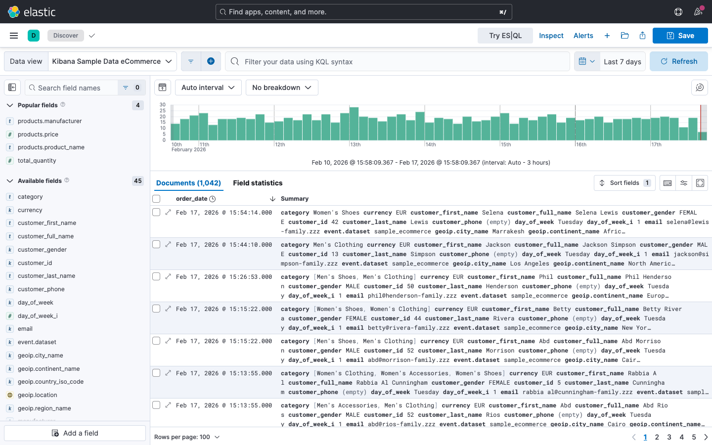
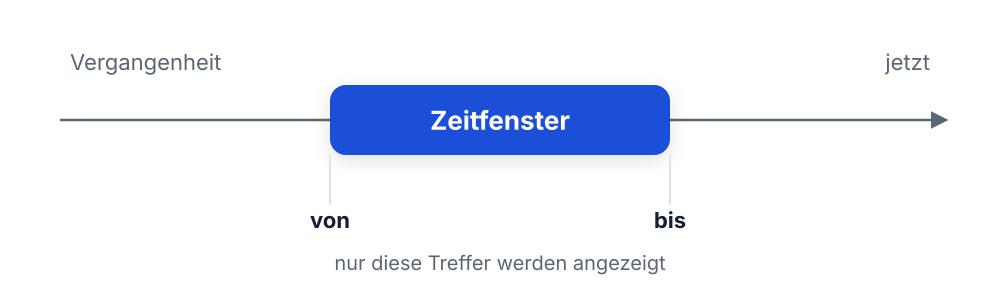
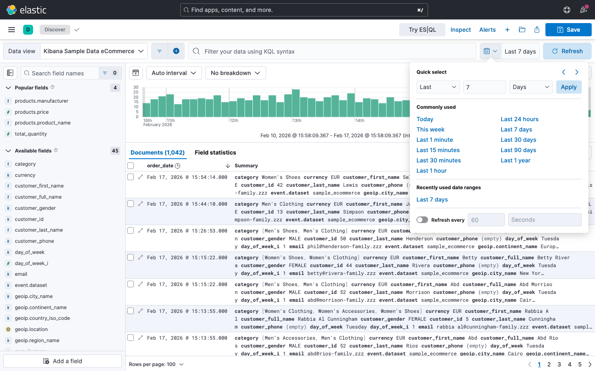
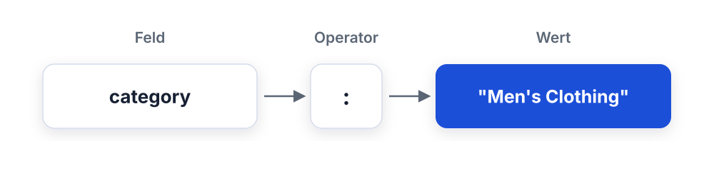
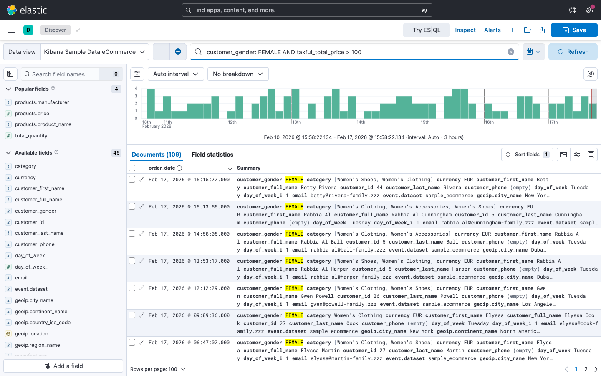
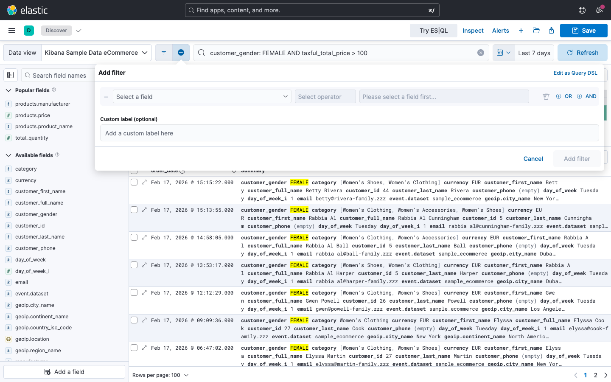
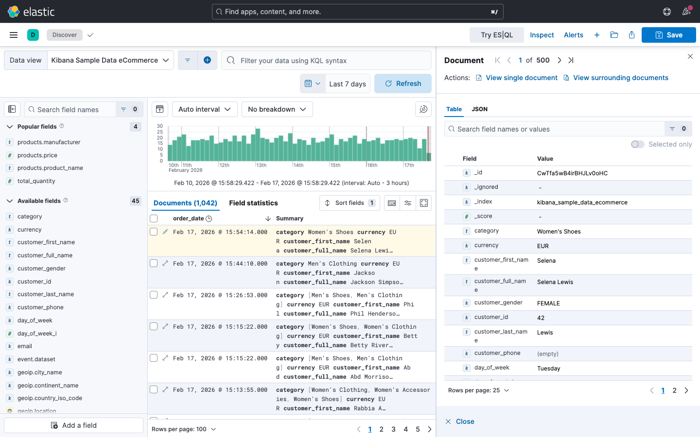
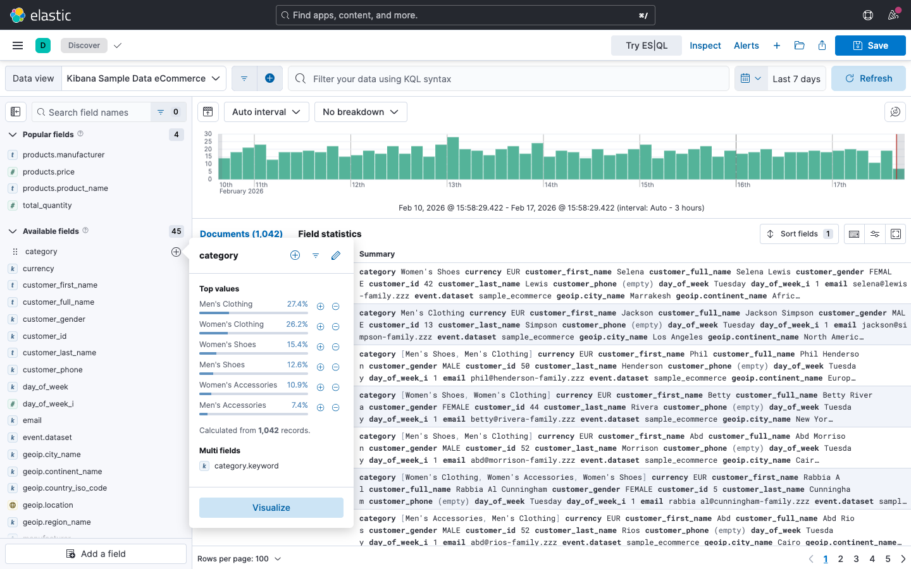

<style>
section blockquote { font-size: 0.8em; line-height: 1.3; margin-top: 0.25em; }
</style>

# Modul 02: Discover & Abfragen

Daten durchsuchen, filtern und analysieren mit Kibana Discover

---

# Lernziele

Nach diesem Modul kannst du:

- Die Discover-Oberfläche in Kibana sicher bedienen
- Zeitfilter gezielt einsetzen, um relevante Zeiträume auszuwählen
- Mit der Kibana Query Language (KQL) präzise Abfragen formulieren
- Filter kombinieren, um Datenbestände einzugrenzen
- Spalten konfigurieren und Dokumente im Detail untersuchen
- Ergebnisse als CSV exportieren und gespeicherte Suchen teilen

---

# Kibana Discover - Überblick

- Rohdaten in Elasticsearch durchsuchen und erkunden
- Erster Anlaufpunkt für fast jede Analyse

**Typische Anwendungsfälle bei Mustertech GmbH:**

- Bestellungen eines bestimmten Zeitraums finden
- Umsätze nach Produktkategorie analysieren
- Kundenregionen auswerten
- Auffällige Bestellwerte identifizieren

> Discover zeigt dir die Rohdaten - hier beginnst du jede Analyse.

---

# Die Discover-Oberfläche

<style scoped>
table { font-size: 0.85em; }
</style>

| Bereich               | Beschreibung                              |
| --------------------- | ----------------------------------------- |
| **Suchleiste**        | KQL-Abfragen eingeben                     |
| **Zeitfilter**        | Zeitraum auswählen (oben rechts)          |
| **Histogramm**        | Verteilung der Treffer über die Zeit      |
| **Felderliste**       | Verfügbare Felder (linke Seitenleiste)    |
| **Dokumententabelle** | Trefferliste mit konfigurierbaren Spalten |
| **Dokumentendetails** | Einzelnes Dokument aufklappen             |
| **Filter-Leiste**     | Aktive Filter unterhalb der Suchleiste    |

---

# Die Discover-Oberfläche - Kibana



---

<style scoped>
section { font-size: 1.6em; }
</style>

# Data Views (ehemals Index Patterns)

- Ein **Data View** legt fest, welche Indizes du durchsuchst
- Bestimmt, welche Felder dir zur Verfügung stehen

**In den Übungen nutzt du:**

- `Kibana Sample Data eCommerce` - die Bestelldaten des Beispiel-Shops

> Die Beispieldaten ersetzen an Tag 1 die echten Mustertech-Indizes -
> Felder, KQL und Filter funktionieren identisch.

**Data View wechseln:**

1. Oben links auf den Data-View-Namen klicken
2. Gewünschten Data View wählen
3. Felderliste und Daten aktualisieren sich automatisch

---
<style scoped>
section { font-size: 1.15em; }
</style>

# Zeitfilter und Zeitreihen

- Kaum eine Analyse ohne Zeitfilter
- Zu finden oben rechts in der Oberfläche

**Zwei Arten der Zeitauswahl:**

- **Relativ:** z. B. "Letzte 24 Stunden",
  "Letzte 7 Tage", "Letzte 30 Tage"
- **Absolut:** z. B. "01.01.2026 00:00" bis
  "31.01.2026 23:59"

**Wann welche Variante nutzen?**

| Relativ                     | Absolut                      |
| --------------------------- | ---------------------------- |
| Laufende Überwachung        | Monatsberichte               |
| Tagesaktuelle Analyse       | Quartalsvergleiche           |
| Dashboards mit Auto-Refresh | Reproduzierbare Auswertungen |

---

# Zeitfenster auf der Zeitachse

Der Zeitfilter schneidet ein Fenster aus der Zeitachse - nur
Treffer darin landen in der Tabelle:



- Fenster verschieben oder Grenzen ziehen -> Trefferliste ändert sich sofort
- Relativ: Fenster wandert mit "jetzt" mit
- Absolut: Fenster steht fest, egal wann du schaust

---

# Zeitfilter - Quick Menu



---
<style scoped>
section { font-size: 1.8em; }
</style>

# Das Histogramm nutzen

Das Histogramm oben in Discover zeigt die
**Verteilung der Treffer über die Zeit**.

**Was du damit machst:**

- **Überblick verschaffen:** Erkenne auf einen Blick, wann besonders viele
  Bestellungen eingegangen sind
- **Hineinzoomen:** Klicke und ziehe, um einen Zeitbereich auszuwählen
- **Intervall anpassen:** Kibana wählt das Intervall automatisch, du kannst es
  aber manuell ändern (z. B. stündlich, täglich)

> Auffällige Spitzen oder Lücken im Histogramm sind oft der Ausgangspunkt für
> tiefere Analysen.

---

# Frage in die Runde

**Wie sucht ihr heute in euren Logs oder Daten?**

- grep, SQL-Queries, ein Klick-UI - was nutzt du gerade?
- Wo verlierst du dabei am meisten Zeit?

> Behalte deinen Fall im Kopf - wir bauen ihn gleich in KQL nach.

---

# Kibana Query Language (KQL)

- Die Abfragesprache in Kibanas Suchleiste
- Bewusst einfach - auch ohne Programmierkenntnisse schnell am Ergebnis

**Grundprinzip:**

```
feldname: wert
```

**Beispiel:**

```
category: "Men's Clothing"
```

> KQL-Abfragen gibst du in die Suchleiste oben in Discover ein.

---
<style scoped>
section { font-size: 1.3em; }
</style>

# KQL - Freitextsuche

Ohne Feldnamen durchsuchst du alle Felder gleichzeitig:

```
Women's Clothing
```

Findet alle Dokumente, die "Women's" **und** "Clothing" in beliebigen Feldern
enthalten.

**Anführungszeichen für exakte Phrasen:**

```
"Women's Clothing"
```

Findet nur Dokumente mit genau dieser Zeichenkette.

| Abfrage              | Ergebnis                             |
| -------------------- | ------------------------------------ |
| `Women's Clothing`   | Beide Wörter (beliebige Reihenfolge) |
| `"Women's Clothing"` | Exakte Phrase                        |

---

# Wie eine KQL-Abfrage aufgebaut ist

Drei Teile: welches Feld, welcher Vergleich, welcher Wert.



- Feld = welche Spalte im Dokument
- Operator = `:` `>` `<` `>=` `<=`
- Wert = Text (in `"..."`) oder Zahl

---

# KQL - Feld:Wert-Abfragen

<style scoped>
table { font-size: 0.82em; }
code { font-size: 0.9em; }
section { font-size: 1.6em; }
</style>

Am genauesten suchst du, wenn du das Feld explizit angibst.

| Abfrage                         | Beschreibung               |
| ------------------------------- | -------------------------- |
| `geoip.city_name: "Cairo"`      | Kunden aus Kairo           |
| `category: "Men's Clothing"`    | Kategorie Herrenbekleidung |
| `manufacturer: "Elitelligence"` | Hersteller Elitelligence   |
| `geoip.country_iso_code: "FR"`  | Kunden aus Frankreich      |

**Wichtig:**

- Feldnamen sind case-sensitive
- Textwerte mit Leerzeichen in Anführungszeichen setzen
- Kibana bietet Autovervollständigung für Feldnamen und Werte

---

# KQL - Vergleichsoperatoren

<style scoped>
table { font-size: 0.82em; }
code { font-size: 0.9em; }
section { font-size: 1.6em; }
</style>

Für numerische Felder und Datumswerte gibt es Vergleichsoperatoren:

| Operator | Bedeutung           | Beispiel                    |
| -------- | ------------------- | --------------------------- |
| `>`      | Größer als          | `taxful_total_price > 500`  |
| `>=`     | Größer oder gleich  | `taxful_total_price >= 100` |
| `<`      | Kleiner als         | `taxful_total_price < 50`   |
| `<=`     | Kleiner oder gleich | `total_quantity <= 3`       |

**Praxisbeispiel Mustertech GmbH:**

Alle Bestellungen über 100 Euro finden:

```
taxful_total_price > 100
```

---

# KQL - Boolesche Operatoren

<style scoped>
code { font-size: 0.9em; }
section { font-size: 1.5em; }
</style>

Kombiniere Bedingungen mit `AND`, `OR`
und `NOT`:

**AND - beide Bedingungen müssen zutreffen:**

```
category: "Men's Clothing" AND taxful_total_price > 50
```

**OR - mindestens eine Bedingung trifft zu:**

```
geoip.country_iso_code: "FR" OR
  geoip.country_iso_code: "GB"
```

**NOT - Bedingung ausschließen:**

```
category: "Women's Clothing" AND
  NOT manufacturer: "Elitelligence"
```

---

<style scoped>
code { font-size: 0.9em; }
section { font-size: 1.5em; }
</style>

# KQL - Klammern und Priorität

Verwende Klammern, um die Auswertungsreihenfolge festzulegen:

**Ohne Klammern (mehrdeutig):**

```
category: "Men's Clothing" OR
  category: "Men's Shoes" AND
  taxful_total_price > 50
```

**Mit Klammern (eindeutig):**

```
(category: "Men's Clothing" OR
  category: "Men's Shoes") AND
  taxful_total_price > 50
```

> Nutze immer Klammern, wenn du `AND` und `OR` in einer Abfrage kombinierst. So
> vermeidest du unerwartete Ergebnisse.

---

# KQL - Wildcards

<style scoped>
table { font-size: 0.82em; }
code { font-size: 0.9em; }
section { font-size: 1.5em; }
</style>

Das Sternchen `*` steht für beliebig viele Zeichen:

| Abfrage                         | Findet                       |
| ------------------------------- | ---------------------------- |
| `customer_full_name: Eddie*`    | Eddie Weber, Eddie Rowe, ... |
| `products.product_name: *shirt` | Alle Shirt-Produkte          |
| `sku: ZO0*`                     | Alle Artikelnummern mit ZO0  |

**Existenzprüfung** - hat ein Feld überhaupt einen Wert?

```
geoip.region_name: *
```

Findet alle Dokumente, bei denen das Feld
`geoip.region_name` vorhanden und nicht leer ist.

> Wildcards sind nützlich, können aber bei sehr großen Datenmengen langsam sein.

---

# KQL - Übersicht der Syntax

<style scoped>
table { font-size: 0.6em; }
code { font-size: 0.85em; }
</style>

| Element       | Syntax        | Beispiel                     |
| ------------- | ------------- | ---------------------------- |
| Freitext      | `text`        | `Clothing`                   |
| Exakte Phrase | `"text"`      | `"Women's Clothing"`         |
| Feld:Wert     | `feld: wert`  | `category: "Men's Clothing"` |
| Größer als    | `feld > wert` | `taxful_total_price > 500`   |
| Kleiner als   | `feld < wert` | `taxful_total_price < 50`    |
| UND           | `AND`         | `a: 1 AND b: 2`              |
| ODER          | `OR`          | `a: 1 OR a: 2`               |
| NICHT         | `NOT`         | `NOT a: 1`                   |
| Wildcard      | `*`           | `manufacturer: Elite*`       |
| Klammern      | `()`          | `(a: 1 OR a: 2) AND b: 3`    |
| Existenz      | `feld: *`     | `geoip.region_name: *`       |

---

# KQL in Aktion

`customer_gender: FEMALE AND taxful_total_price > 100`



---

# KQL vs. Query DSL vs. Lucene

<style scoped>
table { font-size: 0.68em; }
section { font-size: 1.5em; }
</style>

Drei Abfragesprachen begegnen dir im Elastic Stack:

|                  | KQL                      | Query DSL                   | Lucene                     |
| ---------------- | ------------------------ | --------------------------- | -------------------------- |
| **Wo verwendet** | Kibana-Suchleiste        | JSON für APIs / Anwendungen | Kibana-Suchleiste (Legacy) |
| **Mächtigkeit**  | Einfach, deckt Alltag ab | Voller Funktionsumfang      | Mehr als KQL, sperrig      |
| **Zielgruppe**   | Analysten, Kibana-Nutzer | Entwickler, Integrationen   | Bestandssysteme            |

- **KQL** ist der Standard in Kibana - für fast alle Analysen ausreichend
- **Query DSL** hast du in Modul 01 in den Dev Tools bereits kurz gesehen:
  Sie ist die Sprache, die Anwendungen gegen die Elasticsearch-API sprechen
- **Lucene** ist die ältere Syntax, nur noch relevant für Altbestände

---
<style scoped>
table { font-size: 0.82em; }
code { font-size: 0.9em; }
section { font-size: 1.7em; }
</style>

# Filter verwenden

Neben KQL gibt es die **grafische Filter-Leiste** unter der Suchleiste - klicken
statt tippen.

**Filter hinzufügen - drei Wege:**

1. **Über die Felderliste:** Klicke auf ein Feld in der linken Seitenleiste und
   wähle einen Wert aus
2. **Über die Dokumententabelle:** Klicke auf ein Lupensymbol neben einem
   Feldwert
3. **Manuell:** Klicke auf "Add filter" in der Filter-Leiste

> Filter und KQL-Abfragen ergänzen sich. Nutze Filter für häufig wechselnde
> Bedingungen und KQL für komplexere Abfragen.

---

# Filter hinzufügen - Dialog



---

# Filter - Aktionen

<style scoped>
table { font-size: 0.82em; }
code { font-size: 0.9em; }
section { font-size: 1.7em; }
</style>

Für jeden aktiven Filter gibt es mehrere Aktionen per Klick:

| Aktion                      | Beschreibung                                            |
| --------------------------- | ------------------------------------------------------- |
| **Aktivieren/Deaktivieren** | Filter temporär ein-/ausschalten                        |
| **Pinnen**                  | Filter bleibt beim Wechsel zwischen Tabs erhalten       |
| **Invertieren**             | Gegenteil anzeigen (z. B. alles außer "Men's Clothing") |
| **Bearbeiten**              | Filterbedingung nachträglich ändern                     |
| **Löschen**                 | Filter entfernen                                        |

**Praxisbeispiel:**

Du filterst auf `category: "Men's Clothing"`. Durch Invertieren siehst du alle
Bestellungen **ohne** Herrenbekleidung.

---
<style scoped>
table { font-size: 0.82em; }
code { font-size: 0.9em; }
section { font-size: 1.7em; }
</style>

# Filter kombinieren

Mehrere Filter werden standardmäßig mit **AND** verknüpft.

**Beispiel-Szenario bei Mustertech GmbH:**

Du möchtest alle Herrenschuh-Bestellungen aus Frankreich mit einem Wert über
50 Euro finden:

1. Filter: `category: "Men's Shoes"`
2. Filter: `geoip.country_iso_code: "FR"`
3. KQL-Abfrage: `taxful_total_price > 50`

Alle drei Bedingungen müssen gleichzeitig erfüllt sein.

> **Tipp:** Gepinnte Filter bleiben aktiv, auch wenn du zwischen verschiedenen
> Discover-Tabs oder Dashboards wechselst.

---

<style scoped>
table { font-size: 0.82em; }
code { font-size: 0.9em; }
section { font-size: 1.6em; }
</style>

# Frage in die Runde

**Deine Abfrage sitzt - wie soll das Ergebnis aussehen?**

- Welche Felder willst du als Spalten sehen, welche stören nur?
- Wonach würdest du sortieren, um Auffälliges nach oben zu holen?

---

<style scoped>
section { font-size: 0.9em; }
</style>

# Spalten konfigurieren

- Standardansicht zeigt nur `_source` mit dem ganzen Dokument
- Das ist unübersichtlich - bau dir eigene Spalten

**Spalten hinzufügen:**

- Klicke in der Felderliste links auf das
  **Plus-Symbol** neben einem Feldnamen
- Oder klicke im aufgeklappten Dokument auf das Spaltensymbol neben einem Feld

**Empfohlene Spalten für Bestellanalysen:**

- `order_date`
- `customer_full_name`
- `category`
- `manufacturer`
- `taxful_total_price`
- `customer_gender`

---
<style scoped>
table { font-size: 0.82em; }
code { font-size: 0.9em; }
section { font-size: 1.5em; }
</style>

# Spalten verwalten

**Spalten neu anordnen:**

- Ziehe Spaltenüberschriften per Drag & Drop an die gewünschte Position

**Spalten entfernen:**

- Klicke auf das X-Symbol in der Spaltenüberschrift

**Spaltenbreite anpassen:**

- Ziehe den Rand einer Spaltenüberschrift

**Sortierung ändern:**

- Klicke auf eine Spaltenüberschrift, um aufsteigend oder absteigend zu
  sortieren
- Mehrfachsortierung: Halte die Umschalttaste gedrückt

---
<style scoped>
table { font-size: 0.82em; }
code { font-size: 0.9em; }
section { font-size: 1.5em; }
</style>

# Dokumente im Detail untersuchen

Klicke auf einen Pfeil links neben einem Dokument, um es aufzuklappen.

**Die Detailansicht zeigt:**

- **Tabelle:** Alle Felder mit Werten übersichtlich dargestellt
- **JSON:** Das Rohdokument im JSON-Format

**Nützliche Aktionen in der Detailansicht:**

- Feldwert als Filter hinzufügen (Plus-Symbol)
- Feldwert als Ausschlussfilter setzen
  (Minus-Symbol)
- Spalte zur Tabelle hinzufügen
- Feld in die Zwischenablage kopieren

> Die Detailansicht ist ideal, um einzelne Bestellungen genau zu prüfen.

---

# Dokumente im Detail - Kibana



---

<style scoped>
table { font-size: 0.82em; }
code { font-size: 0.9em; }
section { font-size: 1.6em; }
</style>

# Verfügbare Felder - Die Seitenleiste

Die linke Seitenleiste zeigt alle verfügbaren Felder des aktuellen Data Views.

**Feldtypen erkennen:**

- **t** - Textfeld (z. B. `customer_full_name`)
- **#** - Numerisches Feld (z. B. `taxful_total_price`)
- **Kalender** - Datumsfeld (z. B. `order_date`)
- **?** - Boolean - Ja/Nein-Feld (in den Beispieldaten nicht enthalten)

**Feldstatistiken:**

Klicke auf ein Feld, um eine Schnellübersicht der häufigsten Werte zu sehen. So
erkennst du z. B. sofort die beliebtesten Produktkategorien.

---

# Verfügbare Felder - Feldstatistiken



---
<style scoped>
table { font-size: 0.82em; }
code { font-size: 0.9em; }
section { font-size: 1.7em; }
</style>

# Frage in die Runde

**Die Analyse steht - was passiert danach damit?**

- Landet sie in einer Mail, einem Ticket, einer Tabelle für Kollegen?
- Was davon machst du immer wieder und würdest es gern speichern?

---

<style scoped>
section { font-size: 0.85em; }
</style>

# Daten exportieren - CSV

Du kannst die aktuelle Trefferliste als CSV-Datei herunterladen:

1. Führe deine Suche mit Filtern und KQL durch
2. Klicke auf **Share** in der oberen Leiste
3. Wähle **CSV Reports** oder **Download CSV**
4. Warte, bis der Export erstellt ist
5. Lade die Datei herunter

**Hinweise:**

- Der Export enthält die aktuell sichtbaren Spalten
- Zeitfilter und Abfragen werden berücksichtigt
- Bei sehr großen Datenmengen kann der Export einige Zeit dauern
- Maximale Zeilenanzahl ist in Kibana konfigurierbar

---
<style scoped>
table { font-size: 0.82em; }
code { font-size: 0.9em; }
section { font-size: 1.35em; }
</style>

# Gespeicherte Suchen

Speichere häufig genutzte Abfragen, um sie schnell wiederzuverwenden:

**Suche speichern:**

1. Konfiguriere deine Abfrage, Filter und Spalten
2. Klicke auf **Save** in der oberen Leiste
3. Vergib einen aussagekräftigen Namen

**Beispiele für sinnvolle Namen:**

- "Herrenschuhe Frankreich > 50 EUR"
- "Bestellungen über 100 EUR letzte 7 Tage"
- "Damenmode Europa"

> Gespeicherte Suchen können auch in Dashboards eingebettet werden - dazu mehr
> in Modul 03.

---
<style scoped>
code { font-size: 0.9em; }
section { font-size: 1.35em; }
</style>

# Blick hinter die Kulissen: Inspect

Jede Discover-Ansicht basiert auf einer echten Elasticsearch-Abfrage. Mit
**Inspect** schaust du dir diese Abfrage an:

1. Öffne oben rechts das Menü und wähle **Inspect**
2. Wechsle zum Tab **Request**
3. Du siehst die generierte **Query-DSL-Abfrage** als JSON

**Warum ist das für Entwickler nützlich?**

- Du baust deine Suche bequem mit KQL und Filtern in Discover zusammen
- Über Inspect greifst du die fertige Query DSL ab
- Die Abfrage kannst du direkt in deine **eigene Anwendung** übernehmen oder
  in den Dev Tools weiterentwickeln

> Praktisch: Du klickst dir die Suche in Discover zusammen und nimmst die
> fertige Query DSL für deinen Code mit.

---
<style scoped>
table { font-size: 0.82em; }
code { font-size: 0.9em; }
section { font-size: 1.7em; }
</style>

# Zusammenfassung

**Discover** ist dein Einstiegspunkt für jede Datenanalyse in Kibana:

- **Zeitfilter** grenzen den Zeitraum ein - relativ für laufende Analysen,
  absolut für Berichte
- **KQL** deckt fast alles ab und bleibt einfach: Feld:Wert-Suche, Vergleiche,
  Wildcards und boolesche Logik
- **Filter** ergänzen KQL und lassen sich per Klick ein-/ausschalten, pinnen und
  invertieren
- **Spalten** konfigurierst du individuell für jede Analyse
- **Gespeicherte Suchen** und **CSV-Export**
  machen deine Ergebnisse wiederverwendbar
