<style>
section blockquote { font-size: 0.8em; line-height: 1.3; margin-top: 0.25em; }
</style>

# Modul 03: Visualisierungen & Dashboards

---

# Lernziele

Nach diesem Modul kannst du:

- die wichtigsten **Visualisierungstypen** in Kibana benennen und einordnen
- **Aggregationen** (Metriken und Buckets) verstehen und gezielt einsetzen
- Balken-, Linien-, Kreisdiagramme und Tabellen in **Kibana Lens** erstellen
- ein vollständiges **Dashboard** zusammenstellen und gestalten
- **Interaktivität** in Dashboards nutzen
  (Cross-Filtering, Drilldowns, Zeitsteuerung)

---

<style scoped>
section { font-size: 0.9em; }
</style>

# Unser Ziel: Das E-Commerce Dashboard

Wir bauen Schritt für Schritt ein Dashboard auf Basis der **Kibana Sample
eCommerce Orders**:

| Visualisierung                | Typ            |
| ----------------------------- | -------------- |
| Gesamtumsatz, Bestellanzahl,  | Metrik-Kacheln |
| durchschn. Bestellwert        |                |
| Umsatz über Zeit              | Liniendiagramm |
| Top-Produktkategorien         | Balkendiagramm |
| Bestellverteilung nach Region | Kreisdiagramm  |
| Bestelldetails                | Datentabelle   |

---

# Beispiel: eCommerce Revenue Dashboard

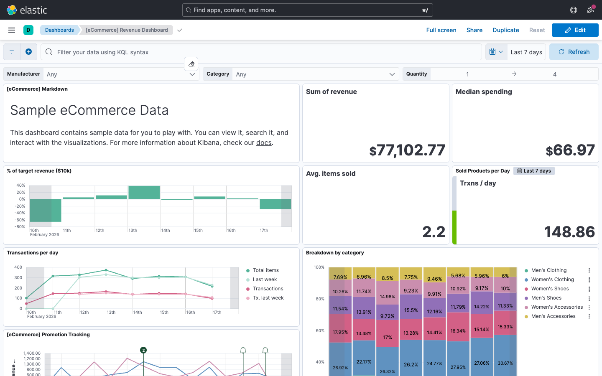

---

# Kibana Lens - der zentrale Editor

**Lens** ist der primäre Visualisierungseditor in Kibana.

- **Drag-and-Drop-Oberfläche** - keine Programmierung nötig
- Automatische Vorschläge für passende Diagrammtypen
- Unterstützt alle gängigen Diagrammarten
- Einfacher Wechsel zwischen Diagrammtypen

> Lens ist dein Hauptwerkzeug für alle Visualisierungen in diesem Modul.

---

# Lens öffnen

So erreichst du den Lens-Editor:

1. Klicke im Seitenmenü auf **Visualize Library**
2. Klicke auf **Create visualization**
3. Wähle **Lens** als Editor-Typ

Oder direkt aus einem Dashboard heraus:

1. Öffne ein Dashboard im Bearbeitungsmodus
2. Klicke auf **Create visualization**
3. Der Lens-Editor öffnet sich eingebettet

---

# Visualize Library

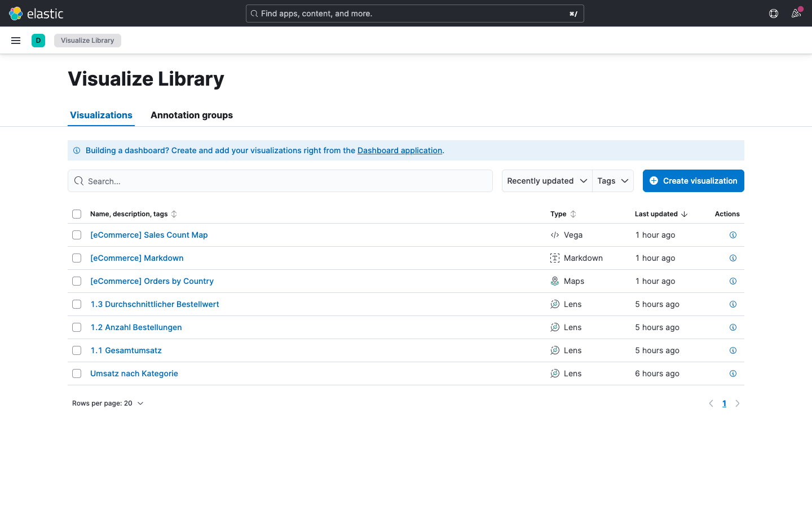

---

# Aufbau des Lens-Editors

<style scoped>
table { font-size: 0.85em; }
</style>

| Bereich          | Funktion                        |
| ---------------- | ------------------------------- |
| **Linke Seite**  | Feldliste aus dem Index Pattern |
| **Mitte**        | Vorschau der Visualisierung     |
| **Rechte Seite** | Konfiguration (Achsen, Farben)  |
| **Oben**         | Diagrammtyp-Auswahl             |

Felder ziehst du per **Drag and Drop** aus der Feldliste auf die Achsen.

---

# Lens-Editor - Kibana

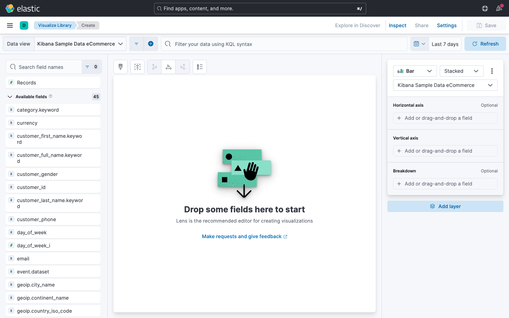

---

# Verfügbare Diagrammtypen

<style scoped>
table { font-size: 0.7em; }
</style>

| Typ                 | Einsatzgebiet                  |
| ------------------- | ------------------------------ |
| **Balkendiagramm**  | Vergleich von Kategorien       |
| **Liniendiagramm**  | Zeitverläufe und Trends        |
| **Flächendiagramm** | Zeitverläufe mit Volumen       |
| **Kreisdiagramm**   | Anteile an einem Ganzen        |
| **Donut**           | Anteile (mit Zentralwert)      |
| **Metrik**          | Einzelne Kennzahlen            |
| **Datentabelle**    | Detaillierte Auflistungen      |
| **Heatmap**         | Zwei Dimensionen mit Farbskala |
| **Treemap**         | Hierarchische Anteile          |
| **Gauge / Ziel**    | Fortschritt gegen Zielwert     |

---

# Diagrammtyp-Auswahl in Lens

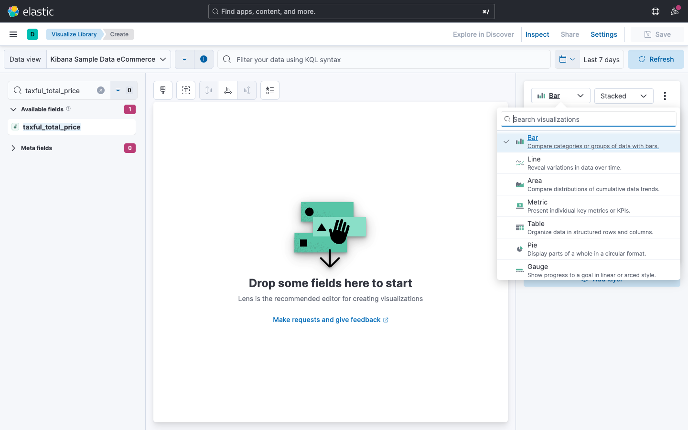

---

# Wann welchen Diagrammtyp wählen?

**Du möchtest ...**

- ... einen **Trend über Zeit** zeigen? Linien- oder Flächendiagramm
- ... **Kategorien vergleichen**? Balkendiagramm (vertikal oder horizontal)
- ... **Anteile** darstellen? Kreis- oder Donutdiagramm
- ... eine **einzelne Kennzahl** hervorheben? Metrik-Kachel
- ... **Details** anzeigen? Datentabelle
- ... **Muster in zwei Dimensionen** erkennen? Heatmap

---

# Frage in die Runde

- Welche Kennzahl schaust du im Job zuerst an, wenn du wissen willst "läuft's gerade"?
- Welcher Diagrammtyp landet bei dir am häufigsten im Report - und warum genau der?

---

<!-- _header: "Metriken und Aggregationen" -->

# Was sind Aggregationen?

Viele Einzeldaten rein, eine **Kennzahl** raus:

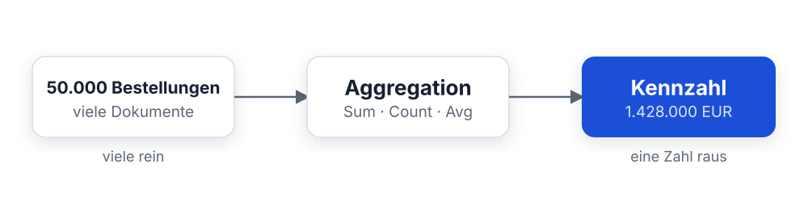

Zwei Hauptarten:

- **Metrik-Aggregation** - berechnet einen Wert
- **Bucket-Aggregation** - teilt Daten in Gruppen

---

# Metrik-Aggregationen

<style scoped>
table { font-size: 0.85em; }
section { font-size: 1.7em; }
</style>

| Aggregation      | Beschreibung             | Beispiel            |
| ---------------- | ------------------------ | ------------------- |
| **Count**        | Anzahl der Dokumente     | Anzahl Bestellungen |
| **Sum**          | Summe eines Feldes       | Gesamtumsatz        |
| **Average**      | Durchschnitt             | Mittlerer Bestellw. |
| **Min**          | Kleinster Wert           | Günstigste Bestell. |
| **Max**          | Größter Wert             | Teuerste Bestellung |
| **Unique Count** | Anzahl eindeutiger Werte | Verschiedene Kunden |

Alle diese Aggregationen beziehen sich auf
**numerische Felder** (außer Count und Unique Count).

---

# Bucket-Aggregationen

<style scoped>
section { font-size: 1.4em; }
</style>
Bucket-Aggregationen **gruppieren** Dokumente:

| Aggregation        | Gruppiert nach ...          |
| ------------------ | --------------------------- |
| **Terms**          | Werten eines Feldes         |
| **Date Histogram** | Zeitintervallen             |
| **Ranges**         | Selbstdefinierten Bereichen |
| **Filters**        | Eigenen Filterregeln        |

**Beispiel Terms:** Gruppiere Bestellungen nach
*Produktkategorie*. Du erhältst einen Bucket pro Kategorie (Women's Clothing,
Men's Shoes ...).

**Beispiel Date Histogram:** Gruppiere Bestellungen nach *Monat*. Du erhältst
einen Bucket pro Monat.

---

<style scoped>
table { font-size: 0.78em; }
section { font-size: 0.95em; }
</style>

# Zusammenspiel: Buckets und Metriken

Eine Visualisierung = **Bucket** (Gruppierung) + **Metrik** (Wert):

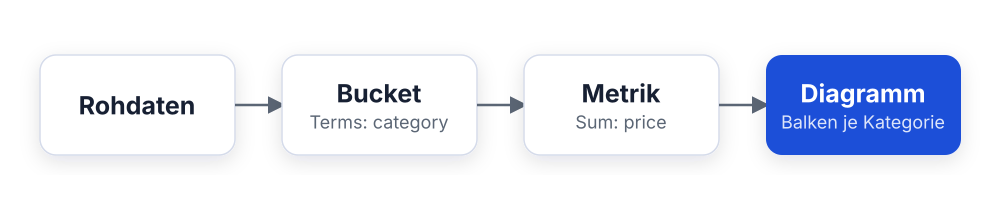

Beispiel mit den eCommerce-Beispieldaten:

| Bucket (X-Achse) | Metrik (Y-Achse)     | Ergebnis             |
| ---------------- | -------------------- | -------------------- |
| Produktkategorie | Sum(Umsatz)          | Umsatz pro Kategorie |
| Monat            | Count(Bestellungen)  | Bestellungen / Monat |
| Region           | Average(Bestellwert) | Mittl. Wert / Region |

---

# Aggregationen in Lens konfigurieren

So legst du eine Aggregation in Lens fest:

1. Ziehe ein Feld auf eine **Achse**
   (z. B. `order_date` auf die X-Achse)
2. Lens erkennt den Feldtyp und schlägt eine passende Aggregation vor
3. Klicke auf das Feld in der Achsenkonfiguration, um die **Aggregation zu
   ändern**
4. Wähle z. B. *Sum*, *Average* oder *Unique Count*

> Lens schlägt sinnvolle Standardwerte vor.
> Du kannst sie jederzeit anpassen.

---

<style scoped>
section { font-size: 1.6em; }
</style>

# Balkendiagramme - Überblick

Willst du **Kategorien vergleichen**, ist das
Balkendiagramm der Klassiker.

**Varianten:**

- **Vertikal** - Kategorien auf der X-Achse
  (Standard)
- **Horizontal** - Kategorien auf der Y-Achse
  (gut bei langen Beschriftungen)
- **Gestapelt (Stacked)** - mehrere Metriken übereinander (zeigt
  Zusammensetzung)
- **Nebeneinander (Grouped)** - mehrere Metriken nebeneinander (besser für
  direkten Vergleich)

---
<style scoped>
section { font-size: 1.6em; }
</style>

# Praxis: Top-Produktkategorien

Wir erstellen ein Balkendiagramm für die
**Top 10 Produktkategorien nach Umsatz**.

**Schritt für Schritt:**

1. Öffne **Lens** (Visualize Library / Create)
2. Wähle den Diagrammtyp **Bar vertical**
3. Ziehe `category.keyword` auf die **X-Achse**
4. Ziehe `taxful_total_price` auf die **Y-Achse**
5. Klicke auf das Y-Achsen-Feld und wähle
   **Sum** als Aggregation
6. Klicke auf das X-Achsen-Feld und stelle
   **Number of values** auf 10

---

# Balkendiagramm konfigurieren

<style scoped>
section { font-size: 1.6em; }
</style>

Nützliche Einstellungen im rechten Panel:

| Einstellung            | Wo                  | Tipp                  |
| ---------------------- | ------------------- | --------------------- |
| **Sortierung**         | X-Achsen-Konfig.    | Nach Metrik abst.     |
| **Farben**             | Rechtes Panel       | Einheitliche Palette  |
| **Achsenbeschriftung** | Rechtes Panel       | Aussagekräftige Namen |
| **Legende**            | Rechtes Panel       | Position anpassen     |
| **Stacked / Grouped**  | Diagrammtyp-Auswahl | Je nach Fragestellung |

> Benenne Achsen immer so, dass auch Kollegen
> ohne Kontext die Visualisierung verstehen.

---
<style scoped>
section { font-size: 1.7em; }
</style>

# Gestapelte Balkendiagramme

**Anwendungsfall:** Umsatz pro Kategorie, aufgeteilt nach Hersteller.

1. Erstelle ein Balkendiagramm wie zuvor
   (Kategorie auf X, Umsatz auf Y)
2. Ziehe `manufacturer` auf
   **Break down by** (Farbaufteilung)
3. Lens zeigt automatisch gestapelte Balken

**Wann gestapelt, wann nebeneinander?**

- **Gestapelt:** Wenn der Gesamtwert pro Kategorie wichtig ist
- **Nebeneinander:** Wenn der direkte Vergleich der Teilwerte wichtig ist

---

<style scoped>
section { font-size: 1.8em; }
</style>

# Liniendiagramme - Überblick

Sobald sich etwas über die Zeit entwickelt,
kommt das Liniendiagramm zum Einsatz - für
**Zeitreihen** und **Trends**.

**Typische Fragestellungen:**

- Wie entwickelt sich der Umsatz über die Zeit?
- Gibt es saisonale Muster?
- Steigen oder fallen die Bestellzahlen?

> Bei zeitbasierten Analysen ist das
> Liniendiagramm meist die erste Wahl.

---

<style scoped>
section { font-size: 1.45em; }
</style>

# Praxis: Umsatz über Zeit

Wir erstellen ein Liniendiagramm für den
**täglichen Umsatzverlauf**.

**Schritt für Schritt:**

1. Öffne **Lens** und wähle **Line**
2. Ziehe `order_date` auf die **X-Achse**
   - Lens wählt automatisch *Date Histogram*
3. Ziehe `taxful_total_price` auf die **Y-Achse**
4. Wähle **Sum** als Aggregation für die Y-Achse
5. Passe das **Zeitintervall** an:
   Klicke auf das X-Achsen-Feld und wähle z. B.
   *Weekly* oder *Monthly*

---

# Linien- und Balkendiagramme - Beispiel

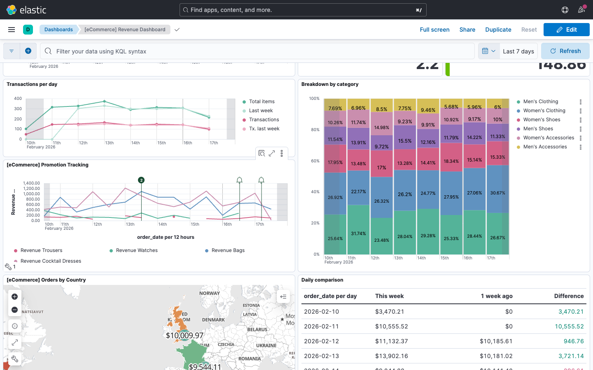

---
<style scoped>
section { font-size: 1.8em; }
</style>

# Zeitintervall anpassen

Das Zeitintervall bestimmt die **Granularität** der Darstellung.

| Intervall       | Gut für ...                       |
| --------------- | --------------------------------- |
| **Stündlich**   | Sehr kurzfristige Analysen        |
| **Täglich**     | Tages-Trends, letzte Woche        |
| **Wöchentlich** | Wochen-Vergleich, letzter Monat   |
| **Monatlich**   | Langfristige Trends, Quartale     |
| **Auto**        | Lens wählt basierend auf Zeitraum |

> Wähle *Auto*, wenn du unsicher bist. Lens passt das Intervall automatisch an den gewählten Zeitraum an.

---
<style scoped>
section { font-size: 1.7em; }
</style>

# Mehrere Linien vergleichen

**Anwendungsfall:** Umsatz pro Kategorie über Zeit.

1. Erstelle ein Liniendiagramm mit
   `order_date` (X) und `Sum(taxful_total_price)` (Y)
2. Ziehe `category.keyword` auf
   **Break down by**
3. Lens zeichnet eine Linie pro Kategorie

**Tipp:** Beschränke die Kategorien auf die Top 5, damit das Diagramm
übersichtlich bleibt.

Klicke dazu auf das Break-down-Feld und setze
**Number of values** auf 5.

---
<style scoped>
section { font-size: 1.8em; }
</style>

# Perioden vergleichen

Um den **aktuellen Monat mit dem Vormonat**
zu vergleichen:

1. Erstelle ein Liniendiagramm (Umsatz über Zeit)
2. Klicke auf das Y-Achsen-Feld
3. Füge eine zweite Metrik über **Add advanced**
   hinzu
4. Wähle **Differences** oder nutze
   **Time shift**: gib `1M` ein
5. Lens zeigt die verschobene Linie zum Vergleich

> Time shift ist praktisch für Monats- oder Jahresvergleiche.

---

<style scoped>
section { font-size: 1.8em; }
</style>

# Kreisdiagramme - Überblick

Kreisdiagramme zeigen **Anteile an einem Ganzen**.

**Varianten:**

- **Pie** - klassisches Kreisdiagramm
- **Donut** - mit Loch in der Mitte
  (Platz für eine zentrale Kennzahl)

**Wann einsetzen?**

- Maximal **5-7 Segmente** (sonst unübersichtlich)
- Wenn die **Verteilung** im Vordergrund steht
- Nicht geeignet für exakte Wertvergleiche

---
<style scoped>
section { font-size: 1.6em; }
</style>

# Praxis: Bestellungen nach Region

Wir erstellen ein Kreisdiagramm für die
**Verteilung der Bestellungen nach Region**.

**Schritt für Schritt:**

1. Öffne **Lens** und wähle **Pie**
2. Ziehe `geoip.region_name.keyword` auf **Slice by**
3. Die Größe der Segmente basiert standardmäßig auf **Count** (Anzahl
   Bestellungen)
4. Setze **Number of values** auf 6
5. Benenne die Visualisierung: *Bestellverteilung nach Region*

> Für einen Donut-Chart wechsle einfach den Diagrammtyp von *Pie* auf *Donut*.

---

# Kreisdiagramm in Lens

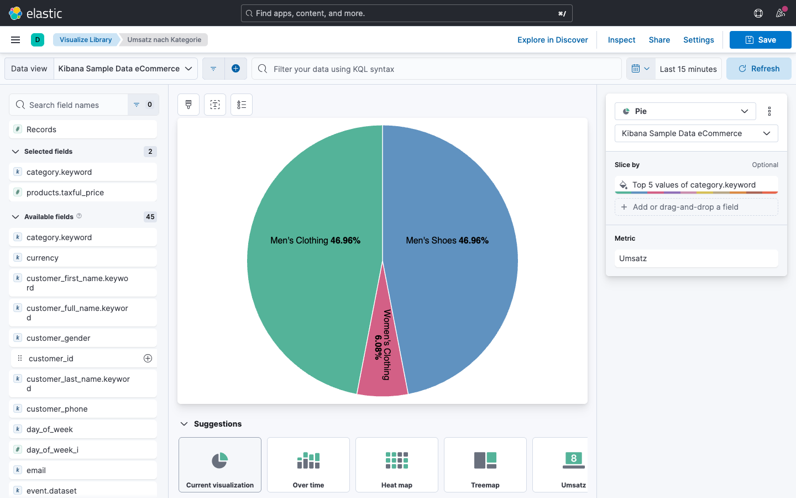

---

<style scoped>
section { font-size: 1.8em; }
</style>

# Datentabellen

Datentabellen eignen sich für **detaillierte Auflistungen** und **exakte Werte**.

**Anwendungsfälle:**

- Top-Kunden mit Umsatz und Bestellanzahl
- Bestellliste mit Datum, Betrag und Status
- Vergleich mehrerer Kennzahlen nebeneinander

**Vorteile gegenüber Diagrammen:**

- Exakte Werte statt visueller Schätzung
- Mehrere Metriken gleichzeitig darstellbar
- Sortierbar und durchsuchbar

---
<style scoped>
section { font-size: 1.7em; }
</style>

# Praxis: Bestelldetails-Tabelle

Wir erstellen eine Tabelle mit den **neuesten Bestellungen im eCommerce-Datensatz**.

**Schritt für Schritt:**

1. Öffne **Lens** und wähle **Table**
2. Ziehe folgende Felder als **Spalten**:
    - `order_date` - Bestelldatum
    - `customer_full_name` - Kundenname
    - `category.keyword` - Produktkategorie
    - `taxful_total_price` - Bestellwert
3. Klicke auf **Rows per page** und wähle 10
4. Sortiere nach `order_date` absteigend

---

# Heatmaps

<style scoped>
section { font-size: 1.8em; }
</style>

Heatmaps zeigen **Muster in zwei Dimensionen**
über eine Farbskala.

**Beispiel:** Bestellaufkommen nach Wochentag und Tageszeit.

1. Öffne **Lens** und wähle **Heat map**
2. X-Achse: `order_date` mit Intervall
   *Day of week*
3. Y-Achse: `order_date` (zweite Instanz)
   mit Intervall *Hour of day*
4. Metrik: **Count**

> Heatmaps helfen, Spitzenzeiten oder saisonale Muster schnell zu erkennen.

---

# Frage in die Runde

- Wer schaut bei euch auf Dashboards - ihr selbst, das Management, Kunden?
- Was nervt dich an einem Dashboard, das du regelmäßig offen hast?

---

<style scoped>
section { font-size: 1.3em; }
</style>

# Was ist ein Dashboard?

Viele Visualisierungen, eine Seite, ein Zeitfilter:

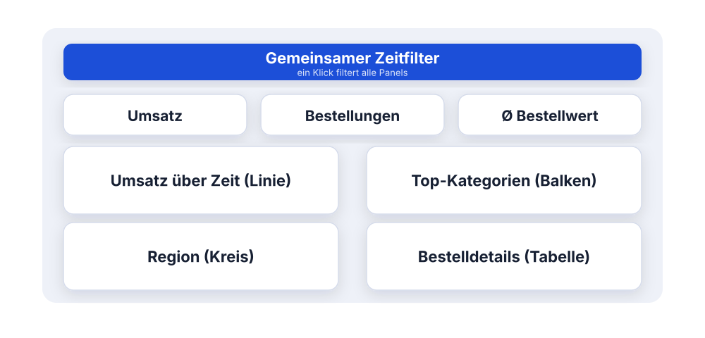

- Alle Kennzahlen auf einen Blick
- Interaktiv filterbar, einfach teilbar

---

<style scoped>
section { font-size: 1.8em; }
</style>

# Dashboard erstellen

**Schritt für Schritt:**

1. Klicke im Seitenmenü auf **Dashboard**
2. Klicke auf **Create dashboard**
3. Du siehst eine leere Fläche
4. Klicke auf **Create visualization**, um eine neue Visualisierung hinzuzufügen
5. Oder klicke auf **Add from library**, um eine gespeicherte Visualisierung
   einzufügen

> Speichere Visualisierungen in der Library, wenn du sie in mehreren Dashboards verwenden möchtest.

---
<style scoped>
section { font-size: 1.5em; }
</style>

# Metrik-Kacheln hinzufügen

Unser Dashboard beginnt mit den **wichtigsten Kennzahlen** (KPIs).

**Gesamtumsatz:**

1. Klicke auf **Create visualization**
2. Wähle den Typ **Metric**
3. Ziehe `taxful_total_price` in den Metrik-Bereich
4. Wähle **Sum** als Aggregation
5. Benenne die Metrik: *Gesamtumsatz*
6. Klicke auf **Save and return**

Wiederhole das für:

- **Bestellanzahl** (Count)
- **Durchschn. Bestellwert** (Average)

---

# Metrik-Kachel in Lens

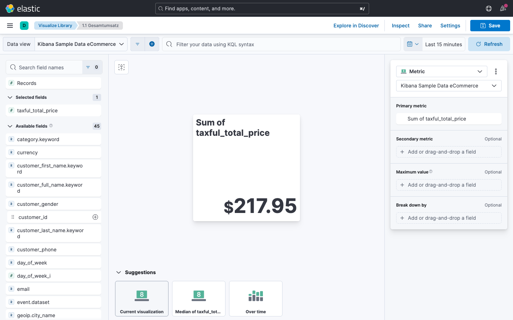

---

<style scoped>
section { font-size: 1.8em; }
</style>

# Diagramme hinzufügen

Füge die bereits erstellten Visualisierungen zum Dashboard hinzu:

| Reihenfolge | Visualisierung                                |
| ----------- | --------------------------------------------- |
| 1           | Metrik-Kacheln (Umsatz, Anzahl, Durchschnitt) |
| 2           | Umsatz über Zeit (Linie)                      |
| 3           | Top-Kategorien (Balken)                       |
| 4           | Bestellverteilung Region (Kreis)              |
| 5           | Bestelldetails (Tabelle)                      |

Nutze **Add from library**, wenn die Visualisierungen bereits gespeichert sind.

---

# Layout und Größenanpassung

<style scoped>
section { font-size: 1.8em; }
</style>

Visualisierungen lassen sich frei anordnen:

- **Verschieben:** Klicke auf die Titelleiste und ziehe die Visualisierung an
  die gewünschte Position
- **Größe ändern:** Ziehe an der unteren rechten Ecke des Panels
- **Vollbild:** Klicke auf das Maximieren-Symbol in der Panel-Ecke

---

**Empfohlenes Layout:**

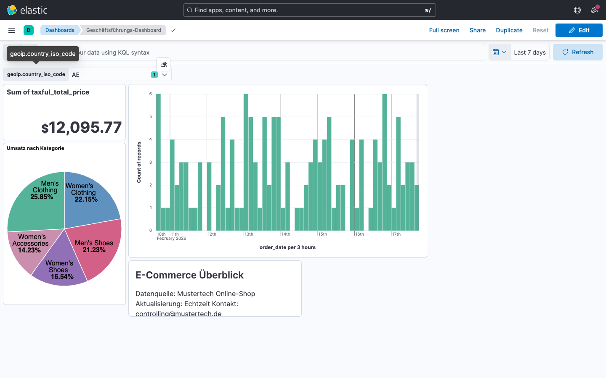

---
<style scoped>
section { font-size: 1.8em; }
</style>

# Filter und Controls hinzufügen

Du kannst dem Dashboard **Steuerelemente** hinzufügen, damit Nutzer Daten filtern können.

1. Klicke im Dashboard auf **Controls** (über der Visualisierungsfläche)
2. Wähle **Add control**

| Control-Typ      | Beispiel                    |
| ---------------- | --------------------------- |
| **Options List** | Dropdown für Kategorie      |
| **Range Slider** | Bestellwert von ... bis ... |
| **Time Slider**  | Zeitraum visuell eingrenzen |

> Mit Controls filtern deine Kollegen das Dashboard selbst, ohne KQL schreiben zu müssen.

---

# Dashboard im Bearbeitungsmodus

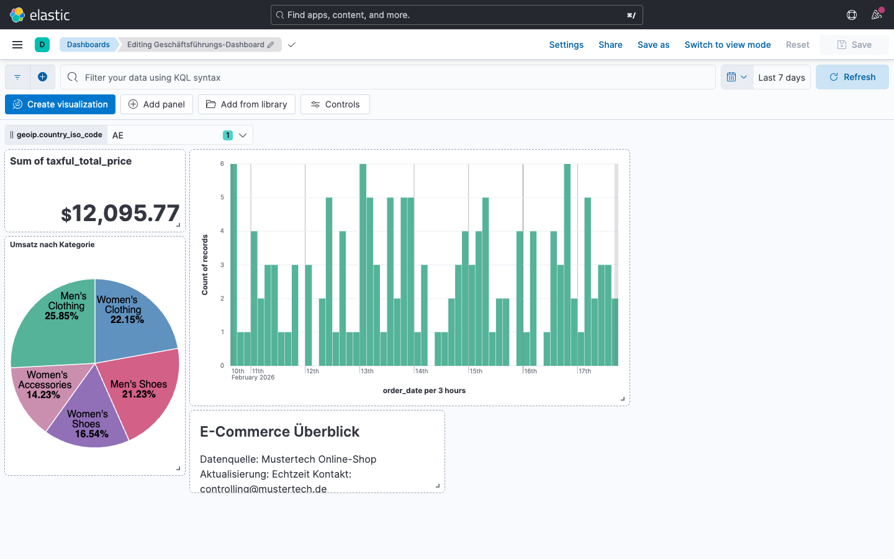

---

# Dashboard speichern

Wenn dein Dashboard fertig ist:

1. Klicke auf **Save**
2. Vergib einen aussagekräftigen Namen: z. B. *E-Commerce Dashboard - Überblick*
3. Optional: Füge eine Beschreibung hinzu
4. Wähle, ob neue Visualisierungen in die **Library** übernommen werden sollen

> Verwende eine einheitliche Namenskonvention, z. B. mit Präfix für den Fachbereich: *Controlling - Monatsbericht Umsatz*

---

# Frage in die Runde

- Wie filterst du heute durch deine Daten - Klick, Query, oder doch Excel-Export?
- Wo würde dir "ein Klick filtert alles" im Alltag am meisten Zeit sparen?

---

# Cross-Filtering

**Cross-Filtering** bedeutet: Ein Klick auf ein Element in einem Diagramm
filtert **alle anderen Diagramme** im Dashboard.

**Beispiel:**

1. Du klickst im Balkendiagramm auf die Kategorie *Women's Clothing*
2. Das Liniendiagramm zeigt nur noch den Umsatzverlauf für Women's Clothing
3. Die Metrik-Kacheln zeigen nur noch Kennzahlen für Women's Clothing
4. Die Tabelle zeigt nur passende Bestellungen

> Cross-Filtering ist in Kibana standardmäßig aktiv - du musst nichts konfigurieren.

---
<style scoped>
section { font-size: 1.9em; }
</style>

# Cross-Filtering in der Praxis

In der Praxis:

- **Klick auf ein Balken-Segment:** Filtert nach dieser Kategorie
- **Klick auf ein Kreis-Segment:** Filtert nach dieser Region
- **Klick auf einen Punkt im Liniendiagramm:** Filtert nach diesem Zeitraum

**Filter wieder entfernen:**

- Klicke auf das **X** neben dem Filter in der Filterleiste oben im Dashboard
- Oder klicke auf **Clear** in der Filterleiste

---

# Drilldowns konfigurieren

<style scoped>
section { font-size: 1.5em; }
</style>

Mit Drilldowns navigierst du per Klick auf ein Element **zu einer anderen
Ansicht**.

**Beispiel:** Klick auf eine Produktkategorie öffnet ein Detail-Dashboard für
diese Kategorie.

**Einrichtung:**

1. Wechsle in den Bearbeitungsmodus des Dashboards
2. Klicke auf die drei Punkte am Panel
3. Wähle **Create drilldown**
4. Wähle **Go to dashboard**
5. Wähle das Ziel-Dashboard
6. Konfiguriere, welcher Wert als Filter übergeben wird

---
<style scoped>
section { font-size: 1.6em; }
</style>

# Zeitsteuerung im Dashboard

Alle Visualisierungen im Dashboard teilen sich den **gemeinsamen Zeitfilter** (oben rechts).

**Nützliche Funktionen:**

| Funktion              | Beschreibung                  |
| --------------------- | ----------------------------- |
| **Quick Select**      | Letzte 15 Min, 24 h, 7 Tage   |
| **Absoluter Bereich** | Von Datum X bis Datum Y       |
| **Relativer Bereich** | Letzte 30 Tage, letzter Monat |
| **Refresh-Intervall** | Auto-Aktualisierung (z. B.    |
|                       | alle 30 Sekunden)             |

> Setze den Zeitfilter so, dass die Daten aussagekräftig sind - oft ist *Letzte 30 Tage* ein guter Startpunkt.

---
<style scoped>
section { font-size: 1.6em; }
</style>

# Dashboards teilen

Du kannst Dashboards auf verschiedene Arten mit Kollegen teilen:

**Teilen innerhalb von Kibana:**

- Kollegen mit Kibana-Zugang sehen das Dashboard in der Dashboard-Liste
- Sende den **Link** (Share / Get link)

**Als Bericht exportieren:**

- Klicke auf **Share** und wähle **PDF** oder **PNG**
- Kibana generiert einen statischen Bericht

**Als CSV:**

- In der Datentabelle: **Download as CSV** für die Rohdaten

---

# Tipps für gute Dashboards

<style scoped>
section { font-size: 1.8em; }
</style>

| Prinzip                    | Empfehlung                                       |
| -------------------------- | ------------------------------------------------ |
| **Weniger ist mehr**       | Max. 8-10 Visualisierungen                       |
| **Wichtigstes oben**       | KPIs und Haupttrend zuerst                       |
| **Konsistente Farben**     | Gleiche Palette verwenden                        |
| **Aussagekräftige Titel**  | Nicht "Chart 1", sondern "Umsatz nach Kategorie" |
| **Zeitraum dokumentieren** | Standard-Zeitraum festlegen                      |
| **Controls anbieten**      | Filter für Nutzer vorsehen                       |

> Faustregel: Wenn nach einem Blick aufs Dashboard keine Rückfragen mehr kommen, sitzt es.

---
<style scoped>
code { font-size: 0.85em; }
section { font-size: 1.3em; }
</style>

# Dashboards as Code

Dashboards sind in Kibana **Saved Objects** und lassen sich exportieren und
importieren:

- **Oberfläche:** Stack Management / Saved Objects / Export bzw. Import
- **API:**

```
POST /api/saved_objects/_export
{ "type": "dashboard" }
```

Das Ergebnis ist eine **ndjson-Datei** (ein JSON-Objekt pro Zeile), inklusive
abhängiger Objekte wie Visualisierungen und Data Views.

**Anwendungsfälle:**

- **Versionierung** - Dashboards im Git-Repository verwalten
- **Deployment über Umgebungen** - Dev / Test / Produktion identisch halten
- **Backup und Austausch** - Dashboards mit anderen Teams teilen

---

# Zusammenfassung

**Was du in diesem Modul gelernt hast:**

- **Lens** ist der zentrale Editor für Visualisierungen in Kibana
- **Aggregationen** (Count, Sum, Average ...)
  berechnen Kennzahlen, **Buckets** (Terms, Date Histogram) gruppieren Daten
- **Balkendiagramme** vergleichen Kategorien,
  **Liniendiagramme** zeigen Trends,
  **Kreisdiagramme** zeigen Anteile
- **Dashboards** bündeln Visualisierungen und bieten interaktive Filterung
- **Cross-Filtering** filtert per Klick alle Panels,
  **Drilldowns** verlinken auf andere Dashboards
