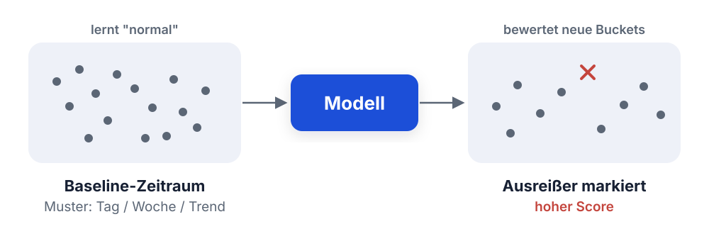
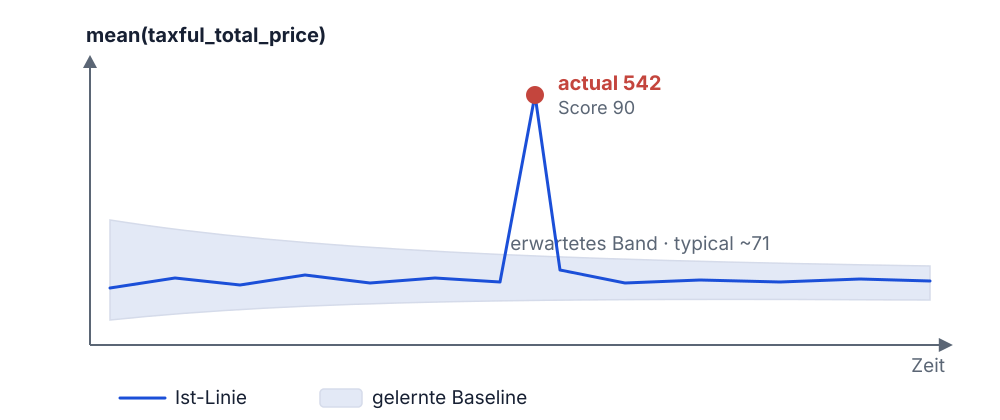

<style>
section blockquote { font-size: 0.8em; line-height: 1.3; margin-top: 0.25em; }
</style>


# Modul 04: Machine Learning in Kibana

Anomalien automatisch erkennen. Auch mit wenig Vorkenntnissen.

---

# Lernziele

Nach diesem Modul kannst du:

- Die Machine-Learning-Funktionen des Elastic Stack einordnen
- Die Konzepte der Anomaly Detection erklären
  (Job, Detector, Bucket Span, Severity)
- Einen Anomaly-Detection-Job in Kibana anlegen und die Ergebnisse
  interpretieren
- Den Data Visualizer nutzen, um Datenqualität und Feldverteilungen zu prüfen
- Einschätzen, wann sich der Einsatz von ML lohnt - und was es kostet

---
<style scoped>
section { font-size: 1.7em; }
</style>

# Warum Machine Learning bei Mustertech GmbH?

Tausende Bestellungen am Tag. Von Hand siehst du nicht, wenn was aus dem
Ruder läuft:

- **Bestellwert** bricht ein - Preisfehler im Shop?
- **Bestellanzahl** schießt nachts hoch - Bots oder Betrug?
- **Ein Kunde** verhält sich völlig anders als alle anderen

**Feste Schwellenwerte greifen zu kurz:**

- Alarm bei "Umsatz < 1000 EUR/Stunde"
- ignoriert, dass nachts weniger bestellt wird als mittags

> Machine Learning lernt, was für deine Daten *normal* ist - und meldet nur
> echte Abweichungen.

---

# Frage in die Runde

- Wo überwacht ihr heute Grenzwerte von Hand - und wie oft schlägt ein Alarm
  an, obwohl alles in Ordnung ist?
- Welche Kennzahl in eurem System schwankt so stark, dass ein fester
  Schwellenwert kaum passt?

---
<style scoped>
table { font-size: 0.78em; }
section { font-size: 1.6em; }
</style>

# Was kann ML im Elastic Stack?

| Funktion                 | Was sie tut                                   |
| ------------------------ | --------------------------------------------- |
| **Anomaly Detection**    | Zeitreihen überwachen, Abweichungen erkennen  |
| **Data Frame Analytics** | Klassifikation, Regression, Outlier Detection |
| **Inference / NLP**      | Trainierte Modelle anwenden (z. B. Sentiment, |
|                          | Named Entity Recognition, Embeddings)         |

**In diesem Modul konzentrieren wir uns auf Anomaly Detection** - die in der
Praxis am häufigsten genutzte Funktion.

> Data Frame Analytics und NLP sind eigene Themenwelten - hier reicht uns die
> Einordnung, dass es sie gibt.

---
<style scoped>
section { font-size: 1.6em; }
</style>

# Zur Lizenz

Machine Learning ist ein **kommerzielles Feature** des Elastic Stack:

- Enthalten ab Lizenzstufe **Platinum** (bzw. Enterprise)
- Mit der **Basic-Lizenz** (kostenlos) nicht verfügbar
- Zum Ausprobieren: **30-Tage-Trial-Lizenz** aktivierbar

**In unserem Kurs-Setup:**

Wir nutzen die Tag-1-Umgebung (Docker Compose). Die Trial-Lizenz aktivierst du
in den Dev Tools mit einem einzigen Aufruf:

```
POST _license/start_trial?acknowledge=true
```

> Nach dem Kurs: Prüfe vor einem produktiven Einsatz, ob sich die
> Platinum-Lizenz für deinen Anwendungsfall rechnet.

---
<style scoped>
section { font-size: 1.8em; }
</style>

# Teil 2: Anomaly Detection - Konzepte

Bevor wir klicken, klären wir die Begriffe:

- **Job** - die zentrale Einheit
- **Detector** - was wird gemessen?
- **Bucket Span** - in welchen Zeitscheiben?
- **Baseline** - was ist normal?
- **Severity Score** - wie ungewöhnlich ist eine Abweichung?

---
<style scoped>
section { font-size: 1.7em; }
</style>

# Der Anomaly-Detection-Job

Ein **Job** ist die zentrale Konfigurationseinheit der Anomaly Detection:

- Er definiert, **welche Daten** analysiert werden
  (Index bzw. Data View, Zeitfeld, optional eine Abfrage)
- Er enthält einen oder mehrere **Detectors**
  (was genau gemessen wird)
- Er legt den **Bucket Span** fest
  (die zeitliche Auflösung)
- Er läuft kontinuierlich oder über einen festen Zeitraum

> Ein Job lernt fortlaufend dazu: Je mehr Daten er sieht, desto besser wird
> sein Modell des Normalzustands.

---
<style scoped>
table { font-size: 0.75em; }
section { font-size: 1.6em; }
</style>

# Detector-Funktionen

Ein **Detector** kombiniert eine Funktion mit einem Feld:

| Funktion    | Erkennt Anomalien in ...         | Beispiel Mustertech        |
| ----------- | -------------------------------- | -------------------------- |
| `count`     | Anzahl der Ereignisse pro Bucket | Bestellungen pro Stunde    |
| `mean`      | Durchschnitt eines Feldes        | Mittlerer Bestellwert      |
| `sum`       | Summe eines Feldes               | Umsatz pro Stunde          |
| `min`/`max` | Extremwerten eines Feldes        | Höchster Einzelbestellwert |
| `rare`      | Selten auftretenden Werten       | Ungewöhnlicher Ländercode  |

**Varianten:** `high_count`, `low_mean` usw., wenn dich nur Ausschläge
**in eine Richtung** interessieren (z. B. nur Umsatz-*Einbrüche*).

---
<style scoped>
section { font-size: 1.7em; }
</style>

# Bucket Span

Der **Bucket Span** teilt die Zeitachse in gleich große Abschnitte - pro
Abschnitt ein Wert.

**Beispiel:** `mean(taxful_total_price)`, Bucket Span **1h** - stündlicher
Durchschnitts-Bestellwert.

**Wahl des Bucket Span:**

- **Zu klein** (z. B. 1m): verrauschte Werte, viele Fehlalarme
- **Zu groß** (z. B. 1d): kurze Anomalien verschwinden im Durchschnitt
- **Faustregel:** so groß, dass jeder Bucket genug Datenpunkte enthält -
  Kibana schlägt einen passenden Wert vor (*Estimate bucket span*)

---
<style scoped>
section { font-size: 1.7em; }
</style>

# Baseline: Wie lernt das Modell "normal"?

Die Anomaly Detection arbeitet **unüberwacht** - du musst keine Beispiele
für "gut" und "schlecht" liefern:

1. Das Modell beobachtet die Werte über die Zeit
2. Es lernt **typische Muster**: Tagesverlauf, Wochenrhythmus, Trends
3. Für jeden neuen Bucket berechnet es einen **erwarteten Wertebereich**
4. Weicht der tatsächliche Wert stark ab, entsteht eine **Anomalie**

**Wichtig zu wissen:**

- Das Modell braucht **Anlaufzeit**: Die ersten Tage sind wenig aussagekräftig
- Saisonale Muster (z. B. Wochenende) erkennt es automatisch,
  sobald es sie mehrfach gesehen hat

---

# Baseline lernen - Skizze



Erst beobachten, dann Muster lernen, dann Abweichungen markieren.

---
<style scoped>
table { font-size: 0.8em; }
section { font-size: 1.6em; }
</style>

# Severity Scores: 0 bis 100

Jede Anomalie erhält einen **Anomaly Score** von 0 bis 100. Er drückt aus,
wie unwahrscheinlich der beobachtete Wert war:

| Score  | Stufe        | Farbe in Kibana |
| ------ | ------------ | --------------- |
| < 25   | **Warning**  | Blau            |
| 25-50  | **Minor**    | Gelb            |
| 50-75  | **Major**    | Orange          |
| 75-100 | **Critical** | Rot             |

**Der Score ist relativ zum bisher Gelernten:**

- Derselbe Messwert: heute Critical, in drei Wochen normal
- Ändert sich das Verhalten dauerhaft, zieht das Modell nach

---
<style scoped>
table { font-size: 0.75em; }
section { font-size: 1.5em; }
</style>

# Job-Typen: Single, Multi, Population

Kibana bietet mehrere Job-Assistenten:

| Typ               | Analysiert ...                | Beispiel                      |
| ----------------- | ----------------------------- | ----------------------------- |
| **Single Metric** | Eine Kennzahl über die Zeit   | Mittlerer Bestellwert         |
| **Multi-Metric**  | Eine oder mehrere Kennzahlen, | Bestellwert **pro Kategorie** |
|                   | aufgeteilt nach einem Feld    |                               |
| **Population**    | Verhalten von Individuen im   | Kunde bestellt auffällig      |
|                   | Vergleich zur Gesamtheit      | anders als alle anderen       |

**Wann Population statt Multi-Metric?**

- **Multi-Metric:** Vergleicht jede Kategorie mit ihrer *eigenen* Historie
- **Population:** Vergleicht jedes Mitglied mit *allen anderen*, ideal bei
  vielen Entitäten mit wenig Einzelhistorie (z. B. zehntausende Kunden)

---

# Frage in die Runde

- Was in eurem System würdet ihr als Erstes von so einem Job überwachen
  lassen - eine Metrik, ein Log, das Verhalten einzelner Nutzer?
- Wäre das eher ein Single-Metric-Fall oder ein Population-Fall?

---
<style scoped>
section { font-size: 1.8em; }
</style>

# Teil 3: Demo - Anomaly Detection live

**Der Trainer führt die folgenden Schritte live vor.** Du kannst in deiner
eigenen Umgebung mitklicken.

**Unser Szenario:**

Mustertech möchte automatisch erkennen, wenn der **durchschnittliche
Bestellwert** ungewöhnlich hoch oder niedrig ist.

**Datengrundlage:** `kibana_sample_data_ecommerce`
(die eCommerce-Beispieldaten aus den Modulen 02 und 03)

---
<style scoped>
section { font-size: 1.7em; }
</style>

# Demo-Schritt 1: Trial-Lizenz aktivieren

Falls noch nicht geschehen, in den **Dev Tools**:

```
POST _license/start_trial?acknowledge=true
```

Prüfen:

```
GET _license
```

**Erwartetes Ergebnis:** `"type": "trial"`, gültig für 30 Tage.

> Ohne aktive Trial- oder Platinum-Lizenz zeigt Kibana die ML-Funktionen nur
> eingeschränkt an.

---
<style scoped>
section { font-size: 1.7em; }
</style>

# Demo-Schritt 2: Zum ML-Bereich navigieren

1. Öffne das Hauptmenü und navigiere zu **Machine Learning**
2. Wähle **Anomaly Detection > Jobs**
3. Klicke auf **Create job**
4. Wähle als Datengrundlage den Data View
   **Kibana Sample Data eCommerce**

**Praktisch:** Für die Kibana-Beispieldaten schlägt der Wizard bereits
**vorkonfigurierte Jobs** vor. Daran kannst du dich orientieren.

Wir bauen unseren Job aber **selbst**, um die Konzepte zu verstehen:
Wähle **Single metric**.

---
<style scoped>
section { font-size: 1.6em; }
</style>

# Demo-Schritt 3: Single Metric Job anlegen

**Job: "Bestellwert-Anomalien"**

1. **Zeitraum:** Use full data (gesamten Datenbereich nutzen)
2. **Detector:** Funktion **Mean**, Feld `taxful_total_price`
3. **Bucket span:** `1h`
4. Kibana zeigt eine **Vorschau** der Zeitreihe
5. **Job ID:** `bestellwert-anomalien`
6. Job erstellen und starten

Der Job analysiert nun die historischen Daten
(**Lookback**). Bei den Beispieldaten dauert das nur wenige Sekunden.

---
<style scoped>
section { font-size: 1.6em; }
</style>

# Demo-Schritt 4: Ergebnisse lesen

Nach dem Lauf öffnest du den **Single Metric Viewer**:

- Die **blaue Linie** zeigt den tatsächlichen Verlauf von
  `mean(taxful_total_price)`
- Der **schattierte Bereich** ist der vom Modell erwartete Wertebereich
  ("model bounds"), die gelernte Baseline
- **Anomalie-Marker** (farbige Punkte) markieren Buckets, in denen der
  tatsächliche Wert den erwarteten Bereich verlassen hat
- Die Farbe entspricht der **Severity** (blau bis rot)

**Darunter: die Anomalie-Tabelle**

Für jede Anomalie siehst du Zeitpunkt, Score, tatsächlichen und erwarteten
Wert, z. B. *"actual: 542, typical: 71"*.

---

# Was der Viewer zeigt - Skizze



Verlässt die Linie das Band, setzt der Job einen Anomalie-Marker.

---
<style scoped>
section { font-size: 1.7em; }
</style>

# Demo: Was sehen wir - und was heißt das?

**Typische Beobachtungen in den Beispieldaten:**

- Der erwartete Bereich ist anfangs **breit**: Das Modell ist noch unsicher
- Mit jedem gelernten Tag wird der Bereich **enger**: Das Modell kennt
  jetzt den Tagesrhythmus
- Einzelne Ausreißer-Bestellungen erzeugen Anomalien mit hohem Score

**So würde Mustertech weitermachen:**

- Job **kontinuierlich** laufen lassen (Real-time-Modus mit Datafeed)
- **Alerting-Regel** auf Anomalie-Scores aufsetzen
  (z. B. E-Mail ab Severity 75); Alerting sehen wir an Tag 3

---
<style scoped>
section { font-size: 1.8em; }
</style>

# Vom Spielzeug zum Praxiseinsatz

Die Beispieldaten sind harmlos - interessant wird es mit echten Daten:

- **Bestell- und Umsatzdaten:** Preisfehler, Betrugsmuster
- **Webserver-Logs:** Traffic-Anomalien, Fehlerraten-Ausschläge
  (unsere Daten ab Tag 2!)
- **Infrastruktur-Metriken:** CPU, Speicher, Antwortzeiten

> Merke: Anomaly Detection ersetzt keine Analyse - sie sagt dir, **wo du
> hinschauen** solltest.

---
<style scoped>
section { font-size: 1.7em; }
</style>

# Teil 4: Data Visualizer - ML für alle

Nicht alles im ML-Bereich braucht eine Lizenz: Der **Data Visualizer** ist
auch mit der **kostenlosen Basic-Lizenz** verfügbar.

**Was er kann:**

- Bestehende **Indizes bzw. Data Views** analysieren
- **Dateien importieren** (CSV, NDJSON, Logdateien), inkl. automatischer
  Format-Erkennung und Mapping-Vorschlag
- Pro Feld: Verteilungen, Top-Werte, Statistiken

**Zu finden unter:** Machine Learning > Data Visualizer

---
<style scoped>
section { font-size: 1.5em; }
</style>

# Was zeigt der Data Visualizer?

Für jedes Feld des Datensatzes siehst du auf einen Blick:

- **Dokumentenabdeckung:** In wie viel Prozent der Dokumente ist das Feld
  gefüllt?
- **Verteilung:** Histogramm für Zahlen, Top-Werte für Keywords
- **Eindeutige Werte:** Wie viele verschiedene Ausprägungen gibt es?
- **Statistiken:** Min, Max, Median bei numerischen Feldern

**Wofür du das nutzt:**

- **Datenqualität prüfen:** Fehlen Werte? Gibt es unerwartete Ausreißer?
- **Felder für Analysen auswählen:** Welche Felder lohnen sich für
  Visualisierungen oder ML-Jobs?

> Dieselben Statistiken kennst du schon aus Discover, als
> **Field statistics**-Ansicht direkt in der Trefferliste.

---

# Frage in die Runde

- Bei welchem eurer Datensätze wärt ihr euch unsicher, wie sauber er ist -
  und würdet zuerst mal den Data Visualizer drüberlaufen lassen?
- Welche Felder daraus wären Kandidaten für einen ML-Job?

---
<style scoped>
section { font-size: 1.7em; }
</style>

# Zusammenfassung

- **ML im Elastic Stack:** Anomaly Detection, Data Frame Analytics,
  Inference/NLP; kommerziell ab **Platinum**, testbar per **Trial-Lizenz**
- Ein **Anomaly-Detection-Job** kombiniert Detector-Funktion
  (count, mean, rare ...), Feld und **Bucket Span**
- Das Modell lernt **unüberwacht** eine Baseline und bewertet Abweichungen
  mit einem **Severity Score von 0 bis 100**
- **Single Metric** für eine Kennzahl, **Multi-Metric** pro Kategorie,
  **Population** für Individuum-vs.-Gesamtheit
- Der **Single Metric Viewer** zeigt erwarteten Bereich und Anomalie-Marker
- Der **Data Visualizer** liefert Feldstatistiken - ganz ohne Lizenz
