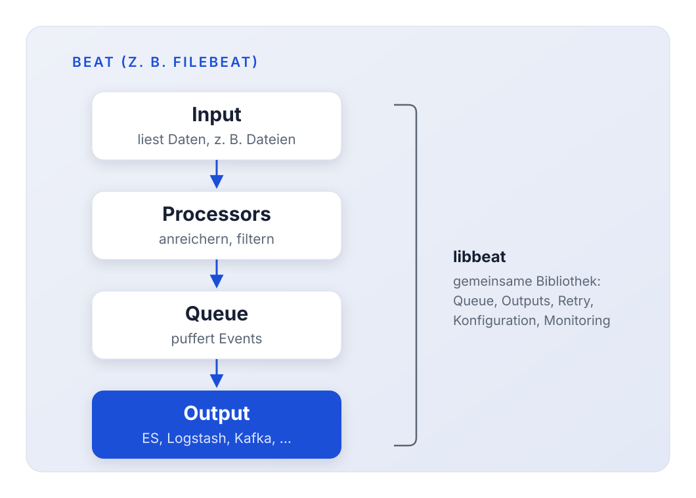
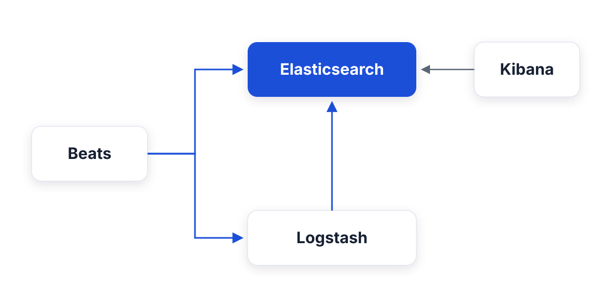
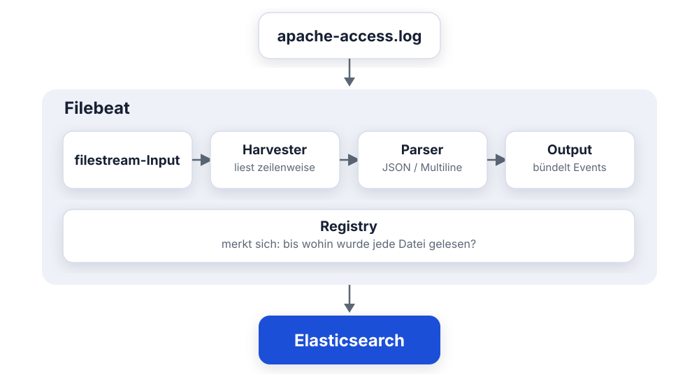
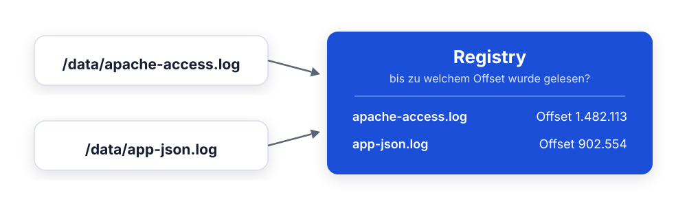
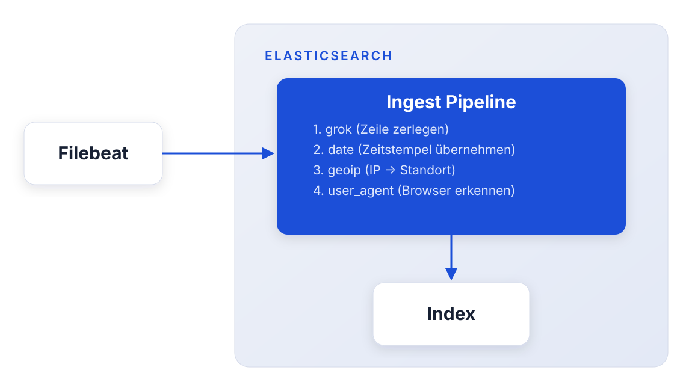
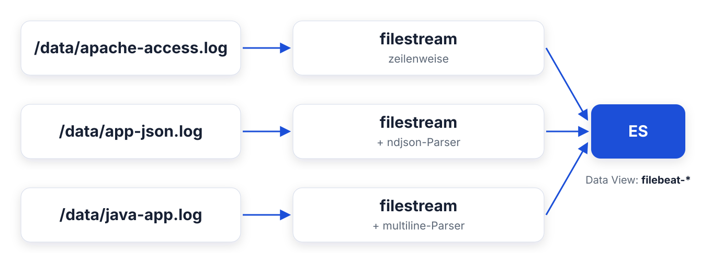

<style>
section blockquote { font-size: 0.8em; line-height: 1.3; margin-top: 0.25em; }
</style>

# Modul 05: Beats & Filebeat

Logs einsammeln mit leichtgewichtigen Datensammlern

---

# Lernziele

Nach diesem Modul kannst du:

- Die Beats-Familie einordnen und den passenden Beat für einen Anwendungsfall
  wählen
- Filebeat installieren und die Anatomie der `filebeat.yml` erklären
- Die Registry und die At-least-once-Semantik von Filebeat verstehen
- Plain-Text- und JSON-Logs (NDJSON) mit dem passenden Parser einlesen
- Java-Stacktraces mit dem Multiline-Parser zu einem Event zusammenfassen
- Filebeat-Module und Ingest Pipelines einordnen
- Zwischen den Outputs Elasticsearch und Logstash begründet wählen

---

<style scoped>
section { font-size: 1.6em; }
</style>

# Ausgangslage bei Mustertech GmbH

Der Online-Shop läuft, aber die Logs liegen verstreut auf den Servern:

| Quelle            | Datei               | Format                      |
| ----------------- | ------------------- | --------------------------- |
| Apache-Webserver  | `apache-access.log` | Combined Log Format (Text)  |
| Java-Shop-Backend | `java-app.log`      | Log4j-Pattern + Stacktraces |
| Microservices     | `app-json.log`      | NDJSON (ecs-logging)        |

**Das Problem:** Bei Störungen greppt das Team per SSH auf drei Servern
gleichzeitig. Niemand hat den Überblick.

**Das Ziel von Tag 2:** Alle Logs zentral in Elasticsearch - durchsuchbar,
filterbar, visualisierbar.

> Der erste Schritt: ein Werkzeug, das Logs von den Servern abholt.

---

# Was sind Beats?

**Beats** sind leichtgewichtige Datensammler (*lightweight data shippers*)
von Elastic.

**Gemeinsame Eigenschaften:**

- In **Go** geschrieben: eine einzige Binärdatei, kein JVM-Overhead
- Laufen **direkt auf den Quellsystemen** (Server, Container, VM)
- Jeder Beat hat **genau eine Aufgabe** (Logs, Metriken, Netzwerk, ...)
- Senden Daten an Elasticsearch oder Logstash

> Beats sind bewusst schlank: sammeln und weiterleiten - die schwere
> Verarbeitung passiert woanders.

---

# Die Beats-Familie

<style scoped>
table { font-size: 0.78em; }
</style>

| Beat           | Sammelt                    | Typischer Einsatz                       |
| -------------- | -------------------------- | --------------------------------------- |
| **Filebeat**   | Log-Dateien                | Webserver-, Applikations-, Syslogs      |
| **Metricbeat** | System- und Dienstmetriken | CPU, RAM, Docker, MySQL, Kafka, ...     |
| **Packetbeat** | Netzwerkverkehr            | HTTP-, DNS-, TLS-Analyse live           |
| **Heartbeat**  | Verfügbarkeit              | Uptime-Checks (ICMP, TCP, HTTP)         |
| **Auditbeat**  | Audit-Daten                | Linux-Audit-Framework, Datei-Integrität |
| **Winlogbeat** | Windows Event Logs         | Windows-Server und -Clients             |

> Für Mustertech starten wir mit **Filebeat** - die Logs sind das dringendste
> Problem.

---

<style scoped>
section { font-size: 1.6em; }
</style>

# Wann welcher Beat?

| Frage bei Mustertech                       | Antwort        |
| ------------------------------------------ | -------------- |
| "Warum werfen die Checkout-Server Fehler?" | **Filebeat**   |
| "Wie ausgelastet sind die Shop-Server?"    | **Metricbeat** |
| "Ist der Shop von außen erreichbar?"       | **Heartbeat**  |
| "Welche Dienste reden miteinander?"        | **Packetbeat** |
| "Wer hat `/etc/passwd` verändert?"         | **Auditbeat**  |

**Faustregel:** Ein Beat pro Datenart - mehrere Beats laufen problemlos
parallel auf demselben Host.

---

# Frage in die Runde: eure Logs

- Welche Logquellen fallen dir bei euch ein, die heute **niemand zentral** sieht?
- Liegen die als **Text**, als **JSON** - oder bunt gemischt?

> Genau diese Mischung nehmen wir jetzt mit Filebeat in Angriff.

---

# libbeat - das gemeinsame Fundament

Alle Beats bauen auf der Bibliothek **libbeat** auf:



---

<style scoped>
section { font-size: 1.7em; }
</style>

# Was libbeat allen Beats "schenkt"

Weil alle Beats libbeat nutzen, funktionieren diese Dinge **überall gleich**:

- **Outputs:** Elasticsearch, Logstash, Kafka, Redis, Konsole, Datei
- **Processors:** Events anreichern, umbenennen, verwerfen
- **Backpressure:** Ist das Ziel überlastet, drosselt der Beat automatisch
- **Metadaten:** `host.name`, `agent.type`, `agent.version` an jedem Event
- **Konfiguration:** immer YAML, immer dieselbe Grundstruktur

> Wer einen Beat konfigurieren kann, kann alle konfigurieren.

---

<style scoped>section { font-size: 1.5em; }</style>

# Beats im Elastic Stack

Zwei mögliche Wege für die Daten:



- **Direkt zu Elasticsearch:** einfach, wenig Infrastruktur
- **Über Logstash:** wenn Daten unterwegs transformiert werden müssen

> Die Entscheidungskriterien schauen wir uns am Ende des Moduls an -
> heute im Lab senden wir erst mal direkt an Elasticsearch.

---

<style scoped>
section { font-size: 1.5em; }
</style>

# Filebeat im Überblick

Jede Log-Nachricht wird zu einem **Event**. Der Weg dahin:



> Filebeat liest auch weiter, wenn die Anwendung in die Datei schreibt -
> wie ein dauerhaftes `tail -f`.

---

<style scoped>
section { font-size: 1.5em; }
</style>

# Installation - nativ auf dem Server

Auf Debian/Ubuntu (analog für RPM, Windows, macOS):

```bash
curl -L -O https://artifacts.elastic.co/downloads/beats/\
filebeat/filebeat-9.3.0-amd64.deb
sudo dpkg -i filebeat-9.3.0-amd64.deb
```

Konfigurieren und starten:

```bash
sudo vi /etc/filebeat/filebeat.yml
sudo filebeat test config      # Konfiguration prüfen
sudo filebeat test output      # Verbindung zum Ziel prüfen
sudo systemctl enable --now filebeat
```

> `filebeat test config` und `filebeat test output` ersparen dir viel
> Rätselraten - immer vor dem Start ausführen.

---

<style scoped>
section { font-size: 1.5em; }
</style>

# Installation - als Docker-Container

So läuft Filebeat in unserer Kursumgebung (`environment/day2`):

```yaml
filebeat:
  image: docker.elastic.co/beats/filebeat:9.3.0
  volumes:
    - ./filebeat/filebeat.yml:/usr/share/filebeat/filebeat.yml:ro
    - ../data:/data:ro
```

- Die Konfiguration wird als Datei **hineingemountet**
- Die Log-Dateien liegen unter **`/data`** im Container
- Nach Konfig-Änderungen: `docker compose restart filebeat`

> Ob nativ oder Container: die `filebeat.yml` sieht identisch aus.

---

<style scoped>
section { font-size: 0.9em; }
</style>

# Anatomie der filebeat.yml

Drei Abschnitte, immer in dieser Denkreihenfolge:

```yaml
filebeat.inputs:        # 1. WOHER kommen die Daten?
  - type: filestream
    id: apache-access
    paths:
      - /data/apache-access.log

processors:             # 2. WAS passiert unterwegs? (optional)
  - drop_fields:
      fields: ["agent.ephemeral_id"]

output.elasticsearch:   # 3. WOHIN gehen die Daten?
  hosts: ["http://elasticsearch:9200"]
```

> Inputs → Processors → Output: dieses Muster begegnet dir morgen bei
> Logstash wieder.

---

<style scoped>
section { font-size: 1.5em; }
</style>

# Der filestream-Input

Der Standard-Input für Log-Dateien in aktuellen Versionen:

```yaml
filebeat.inputs:
  - type: filestream
    id: apache-access          # Pflicht: eindeutige ID!
    paths:
      - /data/apache-access.log
      - /var/log/apache2/*.log # Globs erlaubt
```

**Wichtig zu wissen:**

- Die **`id` ist Pflicht** und muss pro Input eindeutig sein: sie
  identifiziert den Input in der Registry
- Mehrere Inputs = mehrere `- type: filestream`-Blöcke

> Der alte `log`-Input ist **deprecated** - in neuen Konfigurationen
> immer `filestream` verwenden.

---

<style scoped>
section { font-size: 1.3em; }
</style>

# Die Registry - Filebeats Gedächtnis

Filebeat merkt sich in der **Registry**, welche Dateien es kennt und
**bis zu welchem Offset** es sie gelesen hat:



**Konsequenzen:**

- Nach einem **Neustart** liest Filebeat genau dort weiter, wo es aufgehört
  hat: keine Duplikate, nichts geht verloren
- Dateien werden über ihre **Identität** (Inode/Device) verfolgt -
  Log-Rotation funktioniert damit korrekt

---

<style scoped>
section { font-size: 1.6em; }
</style>

# Registry in der Praxis

**Der Klassiker im Kurs (und im echten Leben):**

Du änderst die Konfiguration, startest Filebeat neu - und es passiert
*nichts*. Warum?

> Die Datei wurde laut Registry **schon vollständig gelesen**. Filebeat
> liest sie nicht noch einmal, nur weil sich die Konfiguration geändert hat.

**Lösung in unserer Kursumgebung:**

```bash
./reset.sh   # löscht Index-Daten UND die Registry
```

Danach liest Filebeat alle Dateien von vorn ein, mit der neuen
Konfiguration.

---

<style scoped>
section { font-size: 1.6em; }
</style>

# At-least-once-Semantik

Filebeat garantiert: **jedes Event wird mindestens einmal zugestellt.**

**Wie?** Der Offset in der Registry wird erst weitergeschoben, wenn der
Output den Empfang **bestätigt** hat.


**Die Kehrseite:** Stürzt Filebeat zwischen "senden" und "Registry
aktualisieren" ab, werden Events nach dem Neustart **erneut gesendet**

- Duplikate sind möglich.

> At-least-once, nicht exactly-once: lieber ein Duplikat als ein
> verlorenes Log.

---

<style scoped>
section { font-size: 1.5em; }
</style>

# Was steckt in einem Filebeat-Event?

Jede gelesene Zeile wird zu einem JSON-Dokument. Filebeat ergänzt
Metadaten:

| Feld            | Inhalt                                      |
| --------------- | ------------------------------------------- |
| `message`       | die rohe Log-Zeile                          |
| `@timestamp`    | **Lesezeitpunkt** (nicht die Zeit im Log!)  |
| `log.file.path` | Quelldatei, z. B. `/data/apache-access.log` |
| `host.name`     | Hostname des Systems                        |
| `agent.type`    | `filebeat`                                  |

> `@timestamp` ist zunächst der Zeitpunkt des **Einlesens**. Den echten
> Zeitstempel aus der Log-Zeile zu extrahieren ist Parsing-Arbeit -
> dazu morgen mehr (Logstash, Grok).

---

<style scoped>
section { font-size: 1.5em; }
</style>

# Events kennzeichnen: fields

Mit `fields` gibst du jedem Event eines Inputs **eigene Felder** mit:

```yaml
- type: filestream
  id: apache-access
  paths:
    - /data/apache-access.log
  fields:
    logtype: apache
  fields_under_root: true
```

- Ohne `fields_under_root` landet das Feld unter `fields.logtype`
- Mit `fields_under_root: true` direkt als `logtype` auf oberster Ebene

**Wozu?** Nachgelagerte Systeme können damit **verzweigen**, z. B.
Logstash morgen: "Apache-Events durch Grok, JSON-Events direkt weiter."

> Quelle kennzeichnen kostet nichts - und spart später viel `if`-Logik
> auf Dateipfaden.

---

<style scoped>
section { font-size: 1.4em; }
</style>

# Processors - Events unterwegs anpassen

**Processors** bearbeiten jedes Event, bevor es zum Output geht:

```yaml
processors:
  - drop_event:                  # Events verwerfen
      when:
        contains:
          message: "healthcheck"
  - drop_fields:                 # Felder entfernen
      fields: ["agent.ephemeral_id"]
  - add_fields:                  # Felder ergänzen
      target: ""
      fields:
        env: production
```

- Leichtgewichtige Alternative zu Logstash für **einfache** Anpassungen
- Funktionieren dank libbeat in **allen** Beats gleich

> Für komplexes Parsing (Grok!) reichen Processors nicht - dafür gibt
> es Logstash und Ingest Pipelines.

---

# Frage in die Runde: Logs durchsuchen

- Wie findest du heute raus, **wie oft** ein bestimmter Fehler auftrat -
  grep, Kibana, oder gar nicht?
- Was würdest du an euren Logs am liebsten **filtern** können, wenn es ginge?

> Text oder Struktur - das entscheidet, ob das leicht oder mühsam ist.

---

<style scoped>
section { font-size: 1.5em; }
</style>

# Plain Text: das Problem

Eine Zeile aus dem Apache-Log von Mustertech:

```
91.12.34.93 - - [30/Jun/2026:12:00:05 +0000]
  "GET /static/js/app.js HTTP/1.1" 200 47332
  "https://www.mustertech-shop.de/" "Mozilla/5.0 (iPhone; ...)"
```

In Elasticsearch landet das als **ein einziges Feld**:

```json
{ "message": "91.12.34.93 - - [30/Jun/2026:12:00:05 ..." }
```

**Was du damit NICHT kannst:**

- Nach Statuscode filtern: `status_code >= 500`, es gibt kein Feld dafür
- Antwortgrößen summieren, Top-IPs zählen, nach URL gruppieren

> Volltextsuche geht - strukturierte Analyse nicht.

---

<style scoped>
section { font-size: 1.1em; }
</style>

# Apache Combined Log Format

Die Struktur steckt in der Zeile - sie ist nur nicht extrahiert:

| Bestandteil                | Beispiel                            |
| -------------------------- | ----------------------------------- |
| Client-IP                  | `91.12.34.93`                       |
| Zeitstempel                | `[30/Jun/2026:12:00:05 +0000]`      |
| Methode + Pfad + Protokoll | `"GET /static/js/app.js HTTP/1.1"`  |
| Statuscode                 | `200`                               |
| Antwortgröße (Bytes)       | `47332`                             |
| Referrer                   | `"https://www.mustertech-shop.de/"` |
| User-Agent                 | `"Mozilla/5.0 (iPhone; ...)"`       |

**Drei Wege, die Struktur zu extrahieren:**

1. **Logstash mit Grok** - Modul 06/07 (morgen früh)
2. **Filebeat-Module** - gleich in Teil 5
3. Die Anwendung loggt gleich **strukturiert** (JSON) - nächste Folie

---

<style scoped>
section { font-size: 1.5em; }
</style>

# JSON-Logs

Die Mustertech-Microservices loggen **NDJSON**, ein JSON-Objekt pro
Zeile (*Newline Delimited JSON*):

```json
{"@timestamp":"2026-06-30T12:00:10.350Z","log.level":"info",
 "message":"Checkout gestartet","service.name":"checkout-service",
 "http.response.status_code":200,"url.path":"/api/v1/checkout/9505",
 "trace.id":"be35660788eb6ff0a65fed3352829abc",
 "event.duration":424000000,"host.name":"mt-app-1"}
```

**Der Unterschied zu Plain Text:**

- Jeder Wert hat schon einen **Feldnamen**
- Kein Parsing-Regelwerk nötig, Filebeat muss das JSON nur auspacken

> Ohne Parser landet trotzdem alles als String in `message` - Filebeat
> muss wissen, dass es JSON auspacken soll.

---

<style scoped>
section { font-size: 1.4em; }
</style>

# Der ndjson-Parser

Parser werden **pro Input** unter `parsers:` konfiguriert:

```yaml
- type: filestream
  id: app-json
  paths:
    - /data/app-json.log
  parsers:
    - ndjson:
        target: ""
        overwrite_keys: true
        add_error_key: true
```

| Option           | Bedeutung                                     |
| ---------------- | --------------------------------------------- |
| `target: ""`     | JSON-Felder auf oberster Ebene ablegen        |
| `overwrite_keys` | JSON-Werte überschreiben Filebeat-Felder      |
| `add_error_key`  | bei kaputtem JSON ein `error.*`-Feld ergänzen |

---

<style scoped>
section { font-size: 1.6em; }
</style>

# ndjson: target und overwrite_keys

**`target: "json"`** - Felder landen verschachtelt unter `json.*`:

```json
{ "json.service.name": "checkout-service", ... }
```

**`target: ""`** - Felder landen auf der obersten Ebene:

```json
{ "service.name": "checkout-service", ... }
```

**Warum `overwrite_keys: true`?**

Das Log enthält eigene Werte für `@timestamp`, `message` und `host.name`:
die sollen die von Filebeat gesetzten Werte **ersetzen**.

> So wird `@timestamp` automatisch zum echten Log-Zeitpunkt - ganz
> ohne Grok.

---

<style scoped>
section { font-size: 1.7em; }
</style>

# Ergebnis in Discover

Mit dem ndjson-Parser werden aus einer Log-Zeile **filterbare Felder**:

| Vorher (Plain Text)    | Nachher (ndjson-Parser)            |
| ---------------------- | ---------------------------------- |
| nur `message`          | `service.name`, `url.path`, ...    |
| Volltextsuche          | `http.response.status_code >= 500` |
| Lesezeitpunkt als Zeit | echter Log-Zeitstempel             |

**Typische KQL-Abfragen bei Mustertech:**

```
service.name: "checkout-service" AND log.level: "error"
http.response.status_code >= 500
```

> Genau das probierst du gleich im Lab aus.

---

<style scoped>
section { font-size: 1.1em; }
</style>

# Java-Logging bei Mustertech

Das Shop-Backend loggt mit **Log4j** im klassischen Pattern-Layout:

```
2026-06-30 12:01:23,189 INFO [main]
  com.mustertech.shop.order.OrderService -
  Produktkatalog-Cache aktualisiert: 12841 Artikel in 3421 ms
```

Das Pattern dahinter (Log4j/Logback):

```
%d{yyyy-MM-dd HH:mm:ss,SSS} %p [%t] %c - %m%n
```

| Platzhalter | Bedeutung     | Beispiel                                 |
| ----------- | ------------- | ---------------------------------------- |
| `%d`        | Datum/Uhrzeit | `2026-06-30 12:01:23,189`                |
| `%p`        | Log-Level     | `INFO`                                   |
| `%t`        | Thread        | `[main]`                                 |
| `%c`        | Logger/Klasse | `com.mustertech.shop.order.OrderService` |
| `%m`        | Nachricht     | `Produktkatalog-Cache aktualisiert...`   |

---

<style scoped>
section { font-size: 1.5em; }
</style>

# Das Multiline-Problem

Bei Fehlern schreibt Java **Stacktraces**, eine Log-Nachricht über
viele Zeilen:

```
2026-06-30 13:28:22,610 ERROR [http-nio-8080-exec-4]
  com.mustertech.shop.payment.PaymentClient -
  PSP-Aufruf für Bestellung B-2026-336863 endgültig fehlgeschlagen
com.mustertech.shop.payment.PaymentException: Zahlungsanbieter
  nicht erreichbar
    at com.mustertech.shop.payment.PaymentClient.authorize(...)
    at com.mustertech.shop.checkout.CheckoutService.completeOrder(...)
Caused by: java.net.http.HttpTimeoutException: request timed out
    at java.net.http/jdk.internal.net.http.HttpClientImpl.send(...)
    ... 9 more
```

**Eine** Fehlermeldung - aber **acht** Zeilen in der Datei.

---

<style scoped>
section { font-size: 1.2em; }
</style>

# Was ohne Multiline-Parser passiert

Filebeat arbeitet zeilenweise. Aus einem Stacktrace werden
**acht separate Events**:

| Event | `message`                                              |
| ----- | ------------------------------------------------------ |
| 1     | `2026-06-30 13:28:22,610 ERROR [...] PSP-Aufruf...`    |
| 2     | `com.mustertech.shop.payment.PaymentException: ...`    |
| 3     | `\tat com.mustertech.shop.payment.PaymentClient...`    |
| 4     | `\tat com.mustertech.shop.checkout.CheckoutService...` |
| 5     | `Caused by: java.net.http.HttpTimeoutException...`     |
| ...   | ...                                                    |

**Die Folgen:**

- Der Zusammenhang ist zerrissen - welcher `at ...` gehört zu welchem Fehler?
- Fehlerzählungen stimmen nicht mehr (8 Events statt 1 Fehler)

---

<style scoped>
section { font-size: 1.4em; }
</style>

# Der multiline-Parser

Auch ein Parser im `filestream`-Input:

```yaml
- type: filestream
  id: java-app
  paths:
    - /data/java-app.log
  parsers:
    - multiline:
        type: pattern
        pattern: '^\d{4}-\d{2}-\d{2} '
        negate: true
        match: after
```

| Option    | Bedeutung                                       |
| --------- | ----------------------------------------------- |
| `pattern` | Regex, gegen den jede Zeile geprüft wird        |
| `negate`  | Pattern-Ergebnis umkehren (`true`/`false`)      |
| `match`   | Zeilen `after` oder `before` dem Anker anhängen |

---

<style scoped>
section { font-size: 1.6em; }
</style>

# Die richtige Denkweise für Multiline

**Frage dich: Woran erkenne ich den ANFANG eines neuen Events?**

Bei den Mustertech-Java-Logs: Jede neue Log-Nachricht beginnt mit einem
Datum: `2026-06-30 12:01:23,189 ...`

Daraus folgt die Konfiguration:

| Einstellung                      | Gelesen als                        |
| -------------------------------- | ---------------------------------- |
| `pattern: '^\d{4}-\d{2}-\d{2} '` | "Zeile beginnt mit einem Datum"    |
| `negate: true`                   | "Alles, was NICHT so beginnt, ..." |
| `match: after`                   | "...gehört zur vorherigen Zeile"   |

> Stacktrace-Zeilen (`at ...`, `Caused by: ...`) beginnen nie mit einem
> Datum - sie werden ans laufende Event angehängt.

---

<style scoped>
section { font-size: 1.5em; }
</style>

# Multiline - weitere typische Muster

| Log-Art                       | pattern                 | negate  | match    |
| ----------------------------- | ----------------------- | ------- | -------- |
| Zeile beginnt mit Zeitstempel | `'^\d{4}-\d{2}-\d{2} '` | `true`  | `after`  |
| Zeile beginnt mit `[`         | `'^\['`                 | `true`  | `after`  |
| Fortsetzungszeilen eingerückt | `'^[[:space:]]'`        | `false` | `after`  |
| Zeile endet mit `\` (Umbruch) | `'\\$'`                 | `false` | `before` |

**Schutzmechanismen (Defaults):**

- `max_lines: 500` - längere Events werden abgeschnitten
- `timeout: 5s` - nach 5 s ohne Folgezeile wird das Event abgeschickt

> Multiline gehört **in den Beat**, nicht erst in Logstash: nur Filebeat
> sieht die Datei zeilenweise im Zusammenhang.

---

<style scoped>
section { font-size: 1.5em; }
</style>

# Alternative: strukturiertes Logging

Statt Stacktraces mühsam wieder zusammenzusetzen: die Anwendung loggt
**gleich JSON**, z. B. mit **ecs-logging-java**:

```xml
<encoder class="co.elastic.logging.logback.EcsEncoder">
  <serviceName>checkout-service</serviceName>
</encoder>
```

Ergebnis: eine JSON-Zeile pro Nachricht, Stacktrace als **Feld**:

```json
{"@timestamp":"...","log.level":"ERROR",
 "message":"PSP-Aufruf fehlgeschlagen",
 "error.type":"PaymentException",
 "error.stack_trace":"com.mustertech...\n\tat ..."}
```

- Kein Multiline-Problem - der Stacktrace ist Teil **eines** JSON-Objekts
- Feldnamen folgen ECS (dazu gleich mehr)

---

<style scoped>
section { font-size: 1.7em; }
</style>

# Multiline oder strukturiertes Logging?

| Situation                                     | Empfehlung             |
| --------------------------------------------- | ---------------------- |
| Eigene Anwendung, Logging-Config änderbar     | **ecs-logging** (JSON) |
| Fremdsoftware, Legacy, keine Änderung möglich | **multiline-Parser**   |
| Übergangsphase / Migration                    | beides parallel        |

**Bei Mustertech:**

- Die neuen Microservices loggen schon ECS-JSON ✓
- Das alte Java-Monolith-Backend bekommt den multiline-Parser

> Strukturiertes Logging an der Quelle schlägt jedes nachträgliche
> Parsing - wenn du die Wahl hast.

---

# Frage in die Runde: wie loggt ihr?

- Schreiben eure Anwendungen **Text-Pattern** oder **JSON**?
- Wer entscheidet das bei euch - Entwickler, Betrieb, historisch gewachsen?

> Halt die Antwort im Kopf - bei Modulen und ECS kommt sie gleich wieder.

---

<style scoped>
section { font-size: 1.6em; }
</style>

# Filebeat-Module

Für verbreitete Software bringt Filebeat **fertige Module** mit:

`apache`, `nginx`, `mysql`, `postgresql`, `system`, `kafka`,
`elasticsearch`, `haproxy`, ...

```bash
filebeat modules list             # verfügbare Module anzeigen
filebeat modules enable apache    # Modul aktivieren
```

Konfiguration in `modules.d/apache.yml`:

```yaml
- module: apache
  access:
    enabled: true
    var.paths: ["/var/log/apache2/access.log*"]
```

---

<style scoped>
section { font-size: 1.05em; }
</style>

# Was ein Modul unter der Haube tut

Ein Modul ist ein **Paket aus Best Practices**:

| Baustein                | Beim Apache-Modul                            |
| ----------------------- | -------------------------------------------- |
| **Input-Konfiguration** | Standard-Pfade für access/error logs         |
| **Ingest Pipeline**     | zerlegt die Log-Zeile in ECS-Felder          |
| **Feld-Mappings**       | korrekte Datentypen (IP, Zahl, Datum)        |
| **Dashboards**          | fertige Kibana-Dashboards (`filebeat setup`) |

Das Parsing passiert **nicht in Filebeat**:


> Filebeat bleibt schlank - liefert die rohe Zeile plus den Hinweis,
> welche Pipeline sie verarbeitet.

---

<style scoped>
section { font-size: 1.1em; }
</style>

# Ingest Pipelines - Parsing in Elasticsearch

Eine **Ingest Pipeline** verarbeitet Dokumente **beim Indexieren**,
direkt im Elasticsearch-Knoten:



- Kein Logstash nötig für Standard-Formate
- Prozessoren ähneln den Logstash-Filtern (Grok gibt es hier auch)

> Merke: Parsing kann an drei Orten stattfinden - im Beat, in Logstash
> oder in einer Ingest Pipeline.

---

<style scoped>
section { font-size: 1.6em; }
</style>

# Module vs. Elastic-Agent-Integrationen

Filebeat-Module sind der **klassische** Weg, der **modernere**
heißt **Elastic Agent**:

| Aspekt          | Filebeat-Module           | Elastic-Agent-Integrationen     |
| --------------- | ------------------------- | ------------------------------- |
| Agents pro Host | einer pro Beat            | **ein** Agent für alles         |
| Verwaltung      | YAML-Dateien pro Host     | zentral über **Fleet** (Kibana) |
| Umfang          | Logs                      | Logs + Metriken + Security      |
| Status          | etabliert, weiter nutzbar | von Elastic empfohlen           |

> **Ausblick Tag 3:** Wir schauen uns Elastic Agent und Fleet noch genauer
> an. Die Konzepte von heute - Inputs, Parser, ECS - gelten dort genauso.

---

<style scoped>
section { font-size: 1.4em; }
</style>

# Output-Optionen

Genau **ein** Output ist aktiv. Die wichtigsten:

```yaml
# Variante A: direkt zu Elasticsearch
output.elasticsearch:
  hosts: ["http://elasticsearch:9200"]

# Variante B: zu Logstash (Lab 06!)
output.logstash:
  hosts: ["logstash:5044"]
```

Außerdem verfügbar: `kafka`, `redis`, `file`, `console`.

**Debugging-Trick:**

```yaml
output.console:
  pretty: true
```

> `output.console` zeigt dir jedes Event als JSON im Log - ideal, um
> Parser-Konfigurationen zu prüfen.

---

<style scoped>
section { font-size: 1.6em; }
</style>

# output.elasticsearch im Detail

```yaml
output.elasticsearch:
  hosts: ["http://elasticsearch:9200"]
```

**Was standardmäßig passiert:**

- Events landen im **Data Stream** `filebeat-9.3.0`
- Filebeat legt beim Start ein passendes **Index-Template** an
- Events werden in **Bulk-Requests** gebündelt verschickt

**In Kibana findest du die Daten so:**

1. Data View `filebeat-*` anlegen
2. In Discover den Zeitraum passend wählen

> Genau so gehst du gleich im Lab vor.

---

# Frage in die Runde: wo transformieren?

- Müsstest du eure Logs umbauen - **wo** tätest du das: schon im Beat,
  beim Indexieren in Elasticsearch, oder in Logstash?
- Was spricht bei euch für den einen, was für den anderen Ort?

> Dazu jetzt die Entscheidungshilfe.

---

<style scoped>
section { font-size: 1.45em; }
</style>

# Direkt zu Elasticsearch oder über Logstash?

| Kriterium                 | Direkt ES               | Über Logstash                  |
| ------------------------- | ----------------------- | ------------------------------ |
| Aufbau                    | einfach, ein Ziel       | zusätzliche Komponente         |
| Transformationen          | nur Ingest Pipelines    | volle Filter-Power (Grok, ...) |
| Mehrere Ziele             | nein                    | ja (ES + Archiv + Alerting)    |
| Pufferung bei Lastspitzen | Beat-Queue (klein)      | persistente Queues möglich     |
| Viele heterogene Quellen  | schnell unübersichtlich | zentraler Verarbeitungspunkt   |

**Faustregeln:**

- Strukturierte Logs (JSON/ECS) ohne Umbauten → **direkt ES**
- Komplexes Parsing, Anreicherung, mehrere Ziele → **Logstash**

> Bei Mustertech: heute direkt ES - morgen schalten wir Logstash
> dazwischen, um die Apache-Logs mit Grok zu zerlegen.

---

<style scoped>
section { font-size: 1.6em; }
</style>

# ECS - Elastic Common Schema

Drei Quellen, drei Namen für dieselbe Sache?

| Quelle       | Ohne Schema   | Mit ECS     |
| ------------ | ------------- | ----------- |
| Apache       | `clientip`    | `source.ip` |
| Java-App     | `remote_addr` | `source.ip` |
| Microservice | `client`      | `source.ip` |

**ECS** definiert **einheitliche Feldnamen** für alle Datenquellen:

- `source.ip`, `url.path`, `http.response.status_code`
- `service.name`, `log.level`, `error.stack_trace`, `trace.id`

> Ein Schema für alles: eine KQL-Abfrage, ein Dashboard - egal, aus
> welcher Quelle das Event stammt.

---

<style scoped>
section { font-size: 1.5em; }
</style>

# Warum ECS sich sofort auszahlt

**Ohne gemeinsames Schema:**

```
apache_status: 500 OR java_response_code: 500 OR status: 500
```

**Mit ECS:**

```
http.response.status_code: 500
```

**Wer liefert ECS?**

- Filebeat-Module und Elastic-Agent-Integrationen: automatisch
- `ecs-logging`-Bibliotheken (Java, Python, Go, ...): direkt aus der App
- Eigene Pipelines: ECS-Feldnamen als Referenz verwenden

> Unsere Mustertech-JSON-Logs sind schon ECS-konform - deshalb passen
> sie ohne Umbau zu den Apache-Feldern von morgen.

---

<style scoped>
section { font-size: 1.3em; }
</style>

<style scoped>section { font-size: 1.1em; }</style>

# Das Gesamtbild für das Lab

So sieht die Ziel-Konfiguration am Ende von Lab 05 aus:



**Drei Inputs, drei Formate, ein Ziel:**

| Datei               | Parser      | Ergebnis                 |
| ------------------- | ----------- | ------------------------ |
| `apache-access.log` | keiner      | rohe Zeile in `message`  |
| `app-json.log`      | `ndjson`    | strukturierte ECS-Felder |
| `java-app.log`      | `multiline` | 1 Event pro Stacktrace   |

---

<style scoped>
section { font-size: 1.45em; }
</style>

# Zusammenfassung

- **Beats** sind leichtgewichtige Datensammler: ein Beat pro Datenart,
  gemeinsames Fundament **libbeat**
- **Filebeat** liest Log-Dateien mit dem **filestream-Input**; die
  **Registry** merkt sich Offsets → **at-least-once**, Neustarts sind sicher
- **Parser** machen aus Zeilen brauchbare Events:
  **ndjson** packt JSON-Logs in Felder aus,
  **multiline** (`pattern`/`negate`/`match`) hält Stacktraces zusammen
- **Strukturiertes Logging** (ecs-logging) an der Quelle ist besser als
  jedes nachträgliche Parsing
- **Module** bündeln Input + Ingest Pipeline + Dashboards;
  **Elastic Agent** ist der moderne Nachfolger (Tag 3)
- **Output:** direkt ES für einfache Fälle, **Logstash** für
  Transformationen und mehrere Ziele; **ECS** hält die Feldnamen einheitlich

---

# Ausblick: Modul 06 - Logstash

Die Apache-Logs liegen noch **unstrukturiert** in Elasticsearch.
Das ändern wir jetzt:

- **Logstash** als Verarbeitungszentrale: Input → Filter → Output
- Filebeat-Output auf **Logstash** umstellen
- Erste **Pipelines** bauen und Events transformieren
- Danach (Modul 07): **Grok** und **Geoip** - aus der Apache-Zeile
  werden Statuscodes, URLs und Standorte

> Gleich im Lab: Filebeat zum Laufen bringen - alle drei Log-Formate
> sauber in Elasticsearch.
