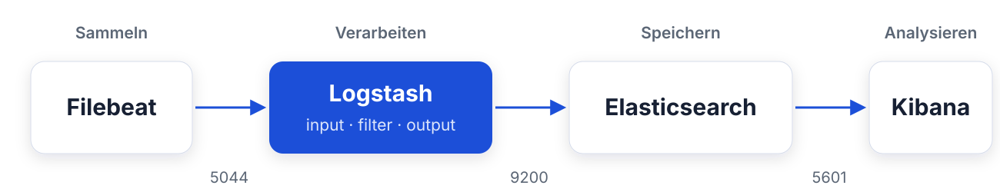
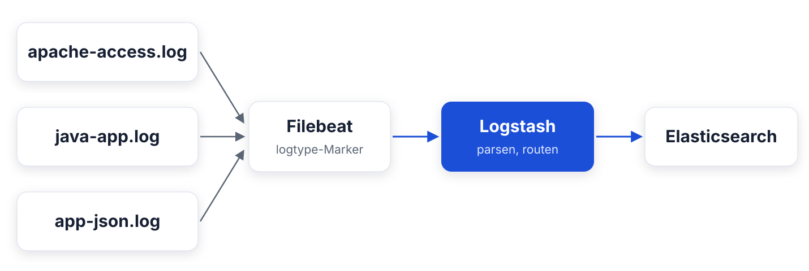
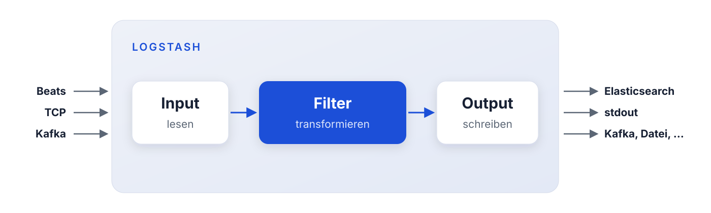
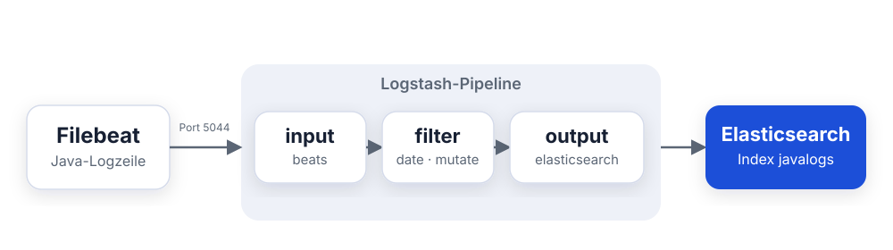
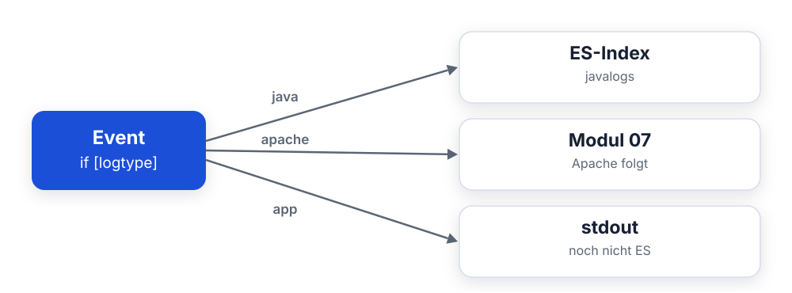

<style>
section blockquote { font-size: 0.8em; line-height: 1.3; margin-top: 0.25em; }
</style>

# Modul 06: Logstash-Grundlagen

Datenpipelines bauen mit input, filter und output

---

# Lernziele

Nach diesem Modul kannst du:

- Erklären, was Logstash ist und wann du es (nicht) brauchst
- Logstash gegen Filebeat allein und Elasticsearch Ingest Pipelines abgrenzen
- Den Aufbau einer Pipeline beschreiben: input, filter, output
- Das Logstash-Event-Modell verstehen: `@timestamp`, `@metadata`, Feldreferenzen
- Den beats-Input konfigurieren und Events von Filebeat annehmen
- Erste Filter einsetzen: `mutate`, `date`, `drop` - und Conditionals
- Events per `stdout`/`rubydebug` debuggen und gezielt nach Elasticsearch routen

---

<style scoped>
section { font-size: 1.6em; }
</style>

# Was ist Logstash?

Die **Verarbeitungs-Pipeline** des Stack:

- liest aus vielen Quellen
- **transformiert** die Daten
- schreibt an ein oder mehrere Ziele

**Typische Aufgaben bei Mustertech GmbH:**

- Java-Logs des Shops in strukturierte Felder zerlegen
- Zeitstempel aus der Logzeile übernehmen (statt Einlese-Zeitpunkt)
- Fehler-Events markieren und getrennt auswerten
- Events je nach Logtyp in unterschiedliche Indizes routen

> Merkregel: Beats **sammeln**, Logstash **verarbeitet**,
> Elasticsearch **speichert**, Kibana **visualisiert**.

---

# Logstash im Elastic Stack



- Filebeat liefert rohe Log-Events an Port **5044** (beats-Protokoll)
- Logstash parst, bereinigt und reichert an
- Elasticsearch indexiert die fertigen Dokumente

---

<style scoped>
section { font-size: 1.5em; }
</style>

# Brauche ich Logstash überhaupt?

In Lab 05 schrieb Filebeat direkt nach Elasticsearch - für
einfache Fälle völlig okay.

**Filebeat allein reicht, wenn:**

- die Logs schon strukturiert sind (z. B. NDJSON)
- oder ein Filebeat-Modul das Parsing übernimmt
- du keine aufwendige Transformation brauchst

**Logstash lohnt sich, wenn:**

- Logs geparst und angereichert werden müssen (Grok, Geoip, Lookups)
- Events abhängig vom Inhalt unterschiedlich behandelt werden sollen
- mehrere Quellen und/oder mehrere Ziele zusammenkommen
- du Lastspitzen abpuffern willst, bevor sie Elasticsearch treffen

---

<style scoped>
section { font-size: 1.3em; }
</style>

# Alternative: Elasticsearch Ingest Pipelines

Elasticsearch transformiert Dokumente auch **selbst** beim
Indexieren - mit **Ingest Pipelines** (auf den Ingest-Nodes).


**Vorteile:**

- Keine zusätzliche Komponente zu betreiben
- Viele Prozessoren: grok, date, geoip, rename, ...

**Grenzen:**

- Verbraucht Ressourcen im Elasticsearch-Cluster
- Nur ein Ziel: der eigene Cluster
- Keine Inputs: Die Daten müssen schon ankommen (Push)

---

# Entscheidungsmatrix

<style scoped>
table { font-size: 0.62em; }
section { font-size: 1.5em; }
</style>

| Anforderung                                | Filebeat allein | Ingest Pipeline | Logstash |
| ------------------------------------------ | :-------------: | :-------------: | :------: |
| Logdateien einsammeln und verschicken      | ja              | -               | (ja)     |
| Multiline-Events zusammenfassen            | ja              | -               | ja       |
| Parsen und anreichern (grok, date, geoip)  | -               | ja              | ja       |
| Bedingte Verarbeitung (if/else)            | begrenzt        | ja              | ja       |
| Daten aus DB/Kafka/HTTP **abholen** (Pull) | -               | -               | ja       |
| Mehrere Ziele (ES + Kafka + Datei + ...)   | -               | -               | ja       |
| Lastspitzen puffern (Persistent Queue)     | -               | -               | ja       |
| Keine zusätzliche Infrastruktur            | ja              | ja              | -        |

> Faustregel: So wenig Komponenten wie möglich - aber sobald Routing,
> mehrere Quellen/Ziele oder Pufferung gefragt sind, führt an Logstash
> kaum ein Weg vorbei.

---

# Frage in die Runde

- Wie kommen eure Logs heute nach Elasticsearch - direkt per Beat,
  über Ingest Pipelines oder schon über Logstash?
- Wo müsstet ihr parsen, routen oder puffern - und tut es noch nicht?

---

<style scoped>
section { font-size: 0.9em; }
</style>

# Unser Kursszenario

Bei Mustertech GmbH landen ab jetzt **alle drei Logquellen** aus Lab 05
in Logstash:



- Filebeat markiert jedes Event mit `logtype: apache | java | app`
- Logstash entscheidet anhand von `logtype`, wie das Event
  verarbeitet und wohin es geschrieben wird

**Heute:** Java-Logs. **Modul 07:** Apache-Logs mit Grok und Geoip.

---

<style scoped>
section { font-size: 1.5em; }
</style>

# Logstash im Kurs-Setup (Docker)

Logstash läuft in unserer Tag-2-Umgebung als Container
(`environment/day2/docker-compose.yml`):

| Aspekt          | Wert                                              |
| --------------- | ------------------------------------------------- |
| Image           | `docker.elastic.co/logstash/logstash:9.3.0`       |
| Pipeline-Ordner | `environment/day2/logstash/pipeline/` (gemountet) |
| beats-Port      | `5044` (nur im Docker-Netz: `logstash:5044`)      |
| Monitoring-API  | `http://localhost:9600`                           |
| Logs            | `docker compose logs -f logstash`                 |

- Alle `*.conf`-Dateien im Pipeline-Ordner werden geladen
- Die Startkonfiguration `main.conf` liegt schon bereit

---

<style scoped>
section { font-size: 1.6em; }
</style>

# pipelines.yml - welche Pipelines laufen?

Logstash kann mehrere unabhängige Pipelines betreiben. Die Datei
`pipelines.yml` legt fest, welche das sind:

```yaml
- pipeline.id: main
  path.config: "/usr/share/logstash/pipeline"
```

- Ohne eigene `pipelines.yml` gilt genau diese Standard-Pipeline `main`
- `path.config` zeigt auf den Ordner mit den `.conf`-Dateien
- **Achtung:** Mehrere `.conf`-Dateien in **einem** `path.config`
  werden zu **einer** Pipeline zusammengefügt - nicht zu mehreren!

> Im Kurs arbeiten wir mit der einen Standard-Pipeline `main` und
> einer einzigen Datei `main.conf`.

---

<style scoped>
section { font-size: 1.6em; }
</style>

# Automatischer Config-Reload

In unserem Setup ist `config.reload.automatic: true` aktiviert:

- Logstash prüft alle 3 Sekunden, ob sich `.conf`-Dateien
  geändert haben (`config.reload.interval`)
- Änderungen werden **ohne Neustart** übernommen
- Syntaxfehler? Die alte Pipeline läuft weiter, der Fehler
  erscheint im Log

**Deshalb beim Arbeiten immer ein Log-Fenster offen halten:**

```bash
docker compose logs -f logstash
```

> Speichern, ins Log schauen, testen - das ist der
> Arbeitszyklus in den Labs 06 und 07.

---

<style scoped>
section { font-size: 1.6em; }
</style>

# Monitoring-API (Port 9600)

Logstash hat eine HTTP-API für Status und Statistiken:

```bash
# Läuft Logstash? Version, Status
curl "http://localhost:9600/?pretty"

# Pipeline-Statistiken: Events in/out, Filter-Laufzeiten
curl "http://localhost:9600/_node/stats/pipelines?pretty"
```

Interessante Werte unter `pipelines.main.events`:

| Feld       | Bedeutung                          |
| ---------- | ---------------------------------- |
| `in`       | Events, die angekommen sind        |
| `filtered` | Events, die die Filter durchliefen |
| `out`      | Events, die ausgegeben wurden      |

---

<style scoped>
section { font-size: 1.5em; }
</style>

# Kurz: Native Installation

Außerhalb von Docker installierst du Logstash klassisch per
Paketmanager (apt/yum) oder Archiv:

| Pfad                          | Inhalt                             |
| ----------------------------- | ---------------------------------- |
| `/etc/logstash/logstash.yml`  | Grundeinstellungen                 |
| `/etc/logstash/pipelines.yml` | Pipeline-Definitionen              |
| `/etc/logstash/conf.d/`       | Pipeline-Konfigurationen (`.conf`) |
| `/var/log/logstash/`          | Logstash-eigene Logs               |

```bash
sudo systemctl start logstash
```

- Logstash ist eine JVM-Anwendung - Java bringt das Paket mit
- Faustregel für den Start: 4 GB RAM, JVM-Heap ca. die Hälfte

---

# Pipeline-Anatomie: drei Phasen

Jede Logstash-Pipeline besteht aus bis zu drei Abschnitten:



| Phase    | Aufgabe                                 | Pflicht? |
| -------- | --------------------------------------- | -------- |
| `input`  | Events entgegennehmen oder abholen      | ja       |
| `filter` | Events verändern, anreichern, verwerfen | nein     |
| `output` | Events an Ziele schreiben               | ja       |

---

<style scoped>
section { font-size: 1.4em; }
</style>

# Eine minimale Pipeline

So sieht unsere Startkonfiguration `main.conf` aus (gekürzt):

```ruby
input {
  beats {
    port => 5044
  }
}

filter {
  # noch leer - hier bauen wir gleich Filter ein
}

output {
  stdout {
    codec => rubydebug
  }
}
```

- Syntax: `plugin { option => wert }` - pro Phase beliebig viele Plugins
- Kommentare beginnen mit `#`

---

# So läuft ein Event durch



- **input**: rohe Zeile kommt rein, ein Event entsteht
- **filter**: `@timestamp` gesetzt, Felder ergänzt/aufgeräumt
- **output**: fertiges Dokument geht raus (oder auf die Konsole)

---

<style scoped>
section { font-size: 1.2em; }
</style>

# Das Event-Modell

Logstash verarbeitet **Events**: strukturierte Objekte aus
Feld-Wert-Paaren - konzeptionell wie ein JSON-Dokument.

Jedes Event, das von Filebeat ankommt, enthält u. a.:

| Feld            | Inhalt                                      |
| --------------- | ------------------------------------------- |
| `message`       | die rohe Logzeile                           |
| `@timestamp`    | Zeitstempel des Events                      |
| `logtype`       | unser Marker aus Filebeat (apache/java/app) |
| `agent.*`       | Infos über den Filebeat-Agenten             |
| `log.file.path` | Quelldatei, z. B. `/data/java-app.log`      |
| `host`          | Hostname des Shippers                       |
| `tags`          | Liste von Markierungen (z. B. für Fehler)   |

Filter können Felder **lesen, ändern, hinzufügen und löschen**.

---

<style scoped>
section { font-size: 1.4em; }
</style>

# Ein Event in rubydebug-Ansicht

So gibt `stdout { codec => rubydebug }` ein Event aus:

```ruby
{
       "message" => "2026-06-30 12:01:23,189 INFO [main] com.mustertech.shop.order.OrderService - Produktkatalog-Cache aktualisiert: 12841 Artikel in 3421 ms",
    "@timestamp" => 2026-07-02T09:15:42.318Z,
      "@version" => "1",
       "logtype" => "java",
           "log" => {
        "file" => { "path" => "/data/java-app.log" }
    },
         "agent" => {
        "type" => "filebeat", "version" => "9.3.0", ...
    },
          "tags" => [ "beats_input_codec_plain_applied" ]
}
```

> Fällt dir etwas auf? `@timestamp` ist der **Einlese-Zeitpunkt** -
> nicht die Zeit aus der Logzeile. Das reparieren wir gleich mit dem
> `date`-Filter.

---

<style scoped>
section { font-size: 1.6em; }
</style>

# Spezialfelder: @timestamp und @version

**`@timestamp`**

- Jedes Event hat genau einen primären Zeitstempel
- Standard: der Moment, in dem das Event erzeugt/gelesen wurde
- Elasticsearch und Kibana nutzen dieses Feld als Zeitachse
- Der `date`-Filter setzt es auf die **echte** Logzeit

**`@version`**

- Versionsnummer des Event-Schemas, praktisch immer `"1"`
- Kannst du ignorieren (oder per `mutate` entfernen)

> Regel: `@timestamp` soll immer beantworten, **wann etwas passiert
> ist** - nicht, wann es eingelesen wurde.

---

<style scoped>
section { font-size: 1.4em; }
</style>

# Spezialfeld: @metadata

`@metadata` ist ein Feldbereich für **interne Zwischenwerte**:

- Wird von **keinem Output mitgeschrieben** - ideal für
  Steuerinformationen, die nicht im Index landen sollen
- Beats legt hier z. B. `[@metadata][beat]` und
  `[@metadata][version]` ab

```ruby
output {
  elasticsearch {
    hosts => ["http://elasticsearch:9200"]
    index => "%{[@metadata][beat]}-%{[@metadata][version]}"
  }
}
```

Zum Debuggen sichtbar machen:

```ruby
stdout { codec => rubydebug { metadata => true } }
```

---

<style scoped>
section { font-size: 1.05em; }
</style>

# Feldreferenz-Syntax

Felder sprichst du in eckigen Klammern an, verschachtelte Felder
mit einer Klammer **pro Ebene**:

| Referenz            | Bedeutung                      |
| ------------------- | ------------------------------ |
| `[message]`         | Top-Level-Feld `message`       |
| `[log][file][path]` | verschachtelt: `log.file.path` |
| `[@metadata][beat]` | Metadaten-Feld                 |

**In Conditionals:**

```ruby
if [logtype] == "java" { ... }
```

**In Strings (sprintf-Format) mit `%{...}`:**

```ruby
mutate {
  add_field => { "quelle" => "Datei %{[log][file][path]}" }
}
```

> Häufigster Anfängerfehler: `[log.file.path]` statt
> `[log][file][path]`. Punkte sind hier **keine** Ebenen-Trenner!

---

# Inputs im Überblick

<style scoped>
table { font-size: 0.68em; }
section { font-size: 1.5em; }
</style>

Logstash bringt Dutzende Input-Plugins mit. Die wichtigsten:

| Input       | Modus | Typischer Einsatz                                               |
| ----------- | ----- | --------------------------------------------------------------- |
| `beats`     | Push  | Events von Filebeat/Metricbeat & Co. (Port 5044)                |
| `file`      | Pull  | Lokale Dateien lesen (wie Filebeat, aber auf dem Logstash-Host) |
| `tcp`/`udp` | Push  | Syslog, Netzwerkgeräte, eigene Anwendungen                      |
| `http`      | Push  | Webhooks, Events per HTTP POST annehmen                         |
| `jdbc`      | Pull  | Datenbanktabellen periodisch abfragen                           |
| `kafka`     | Pull  | Events aus Kafka-Topics konsumieren                             |

> Push: die Quelle liefert an Logstash. Pull: Logstash holt sich die
> Daten aktiv ab - das kann kein Beat und keine Ingest Pipeline.

---

<style scoped>
section { font-size: 1.6em; }
</style>

# Der beats-Input im Detail

```ruby
input {
  beats {
    port => 5044
  }
}
```

- Öffnet einen TCP-Port für das **beats-Protokoll**
- Filebeat verbindet sich dorthin: `output.logstash:
  hosts: ["logstash:5044"]`
- **Back-Pressure inklusive:** Kommt Logstash nicht hinterher,
  drosselt Filebeat automatisch, es gehen keine Events verloren
- Filebeat bestätigt gelesene Daten erst, wenn Logstash sie
  angenommen hat (Registry bleibt konsistent)

> Ein Logstash kann Events von **vielen** Beats gleichzeitig
> annehmen. Typisch: hunderte Filebeats, ein Logstash-Cluster.

---

<style scoped>
section { font-size: 1.5em; }
</style>

# Hinweis: ECS-Kompatibilität

Seit Version 8 läuft Logstash standardmäßig im
**ECS-Modus** (Elastic Common Schema, `pipeline.ecs_compatibility: v8`):

- Felder von Beats kommen bereits ECS-konform an
  (`log.file.path`, `agent.version`, `host`, ...)
- Viele Plugins benennen ihre Ergebnis-Felder nach ECS -
  z. B. schreibt der `geoip`-Filter nach `[source][geo]`-Strukturen
- Vorteil: Deine Daten passen zu Kibana-Standards, Dashboards
  und Integrationen

> Für uns heißt das: Wir übernehmen die ECS-Feldnamen von Filebeat
> einfach und vergeben für eigene Felder kurze, klare Namen.

---

# Frage in die Runde

- Welche Felder wollt ihr in euren Logs eigentlich durchsuchbar
  haben - und welche sind heute nur Text in `message`?
- Gibt es Log-Zeilen, die ihr gar nicht erst speichern wollt?

---

# Filter im Überblick

<style scoped>
table { font-size: 0.7em; }
section { font-size: 1.5em; }
</style>

Filter werden **von oben nach unten** auf jedes Event angewendet:

| Filter      | Aufgabe                                            | Modul |
| ----------- | -------------------------------------------------- | ----- |
| `mutate`    | Felder umbenennen, konvertieren, entfernen, taggen | 06    |
| `date`      | `@timestamp` aus einem Feld setzen                 | 06    |
| `drop`      | Event komplett verwerfen                           | 06    |
| `grok`      | Text per Muster in Felder zerlegen                 | 07    |
| `geoip`     | IP-Adressen mit Geodaten anreichern                | 07    |
| `useragent` | Browser-Strings aufschlüsseln                      | 07    |

> Heute legen wir das Fundament - `grok` bekommst du im Lab schon
> fertig vorgegeben, die Erklärung folgt in Modul 07.

---

<style scoped>
section { font-size: 1.3em; }
</style>

# mutate - das Schweizer Taschenmesser

`mutate` ändert Felder, ohne den Inhalt zu interpretieren:

```ruby
filter {
  mutate {
    rename       => { "msg" => "log_message" }
    convert      => { "dauer_ms" => "integer" }
    remove_field => ["@version", "log_ts"]
    add_tag      => ["fehler"]
  }
}
```

| Option                  | Wirkung                                             |
| ----------------------- | --------------------------------------------------- |
| `rename`                | Feld umbenennen                                     |
| `convert`               | Typ ändern: `integer`, `float`, `string`, `boolean` |
| `remove_field`          | Felder löschen (Liste)                              |
| `add_field` / `add_tag` | Feld bzw. Tag hinzufügen                            |

---

<style scoped>
section { font-size: 1.6em; }
</style>

# mutate - Praxisbeispiele Mustertech

**Zahlen als Zahlen speichern** (sonst kann Kibana nicht rechnen):

```ruby
mutate { convert => { "antwortzeit_ms" => "integer" } }
```

**Hilfsfelder nach Gebrauch aufräumen:**

```ruby
mutate { remove_field => ["log_ts"] }
```

**Events markieren** (Tags sind einfache Strings im Feld `tags`):

```ruby
mutate { add_tag => ["fehler"] }
```

> Reihenfolge beachten: Innerhalb **eines** `mutate`-Blocks ist die
> Ausführungsreihenfolge festgelegt (u. a. rename vor convert).
> Im Zweifel: mehrere `mutate`-Blöcke untereinander schreiben.

---

<style scoped>
section { font-size: 1.5em; }
</style>

# Der date-Filter

Der `date`-Filter parst einen Zeitstempel aus einem Feld und schreibt
ihn nach `@timestamp`:

```ruby
date {
  match    => ["log_ts", "yyyy-MM-dd HH:mm:ss,SSS"]
  timezone => "UTC"
}
```

- `match`: Feldname + ein oder mehrere Datumsmuster (Java-Time-Syntax)
- `timezone`: Zeitzone der Quelle, falls sie **nicht** in der
  Logzeile steht
- `target`: Zielfeld - Standard ist `@timestamp`

**Beispiel:** `2026-06-30 12:01:23,189`

- Muster: `yyyy-MM-dd HH:mm:ss,SSS`

---

<style scoped>
section { font-size: 1.25em; }
</style>

# date - Fallstricke

**Warum das zählt:**

- Ohne `date` = `@timestamp` ist der Einlese-Zeitpunkt
- Alte Logs neu eingelesen -> **alle Events auf "jetzt"**
- Kibana-Histogramm wird wertlos

**Wenn das Parsen fehlschlägt:**

- Das Event bekommt den Tag `_dateparsefailure`
- `@timestamp` bleibt auf dem Einlese-Zeitpunkt
- In Kibana suchbar: `tags: "_dateparsefailure"`

| Muster-Baustein | Bedeutung              | Beispiel           |
| --------------- | ---------------------- | ------------------ |
| `yyyy-MM-dd`    | Datum                  | `2026-06-30`       |
| `HH:mm:ss,SSS`  | Zeit mit Millisekunden | `12:01:23,189`     |
| `Z` / `ZZ`      | Zeitzonen-Offset       | `+0200` / `+02:00` |

---

<style scoped>
section { font-size: 1.6em; }
</style>

# Der drop-Filter

`drop` verwirft ein Event vollständig - es erreicht **keinen** Output:

```ruby
filter {
  if [level] == "DEBUG" {
    drop { }
  }
}
```

**Typische Einsatzfälle:**

- DEBUG-/TRACE-Rauschen aussortieren
- Healthcheck-Requests (`/health`, `/ping`) nicht indexieren
- Events ohne verwertbaren Inhalt verwerfen

> Was du nicht indexierst, kostet weder Speicher noch Suchzeit.
> Filtern an der Quelle ist die günstigste Optimierung.

---

<style scoped>
section { font-size: 1.5em; }
</style>

# Conditionals: if / else if / else

Filter (und Outputs!) lassen sich an Bedingungen knüpfen:

```ruby
filter {
  if [logtype] == "java" {
    # nur für Java-Logs
  } else if [logtype] == "apache" {
    # nur für Apache-Logs
  } else {
    # alles andere
  }
}
```

- Bedingungen prüfen **Feldwerte** des aktuellen Events
- Beliebig schachtelbar
- Genau so routen wir bei Mustertech die drei Logtypen

---

# Conditionals: Operatoren

<style scoped>
table { font-size: 0.68em; }
section { font-size: 1.5em; }
</style>

| Operator           | Bedeutung               | Beispiel                 |
| ------------------ | ----------------------- | ------------------------ |
| `==` / `!=`        | gleich / ungleich       | `[level] == "ERROR"`     |
| `<` `>` `<=` `>=`  | Vergleich               | `[dauer_ms] > 1000`      |
| `=~` / `!~`        | Regex-Match             | `[message] =~ /Timeout/` |
| `in` / `not in`    | enthalten in Liste/Feld | `"fehler" in [tags]`     |
| `and` / `or` / `!` | Verknüpfung             | `[a] == 1 and [b] == 2`  |

**Beispiele:**

```ruby
if [level] == "ERROR" or [level] == "FATAL" { ... }

if "fehler" in [tags] { ... }

if ![logtype] { ... }   # Feld fehlt oder ist leer
```

---

<style scoped>
section { font-size: 1.2em; }
</style>

# Debuggen mit stdout + rubydebug

Der wichtigste Output während der Entwicklung:

```ruby
output {
  stdout { codec => rubydebug }
}
```

- Gibt jedes Event **komplett und lesbar** auf die Konsole aus
- Im Docker-Setup sichtbar über:

```bash
docker compose logs -f logstash
```

**Typischer Workflow:**

1. Filter ändern und speichern (Auto-Reload greift)
2. Events neu einspielen (bei uns: `./reset.sh`)
3. Im Log prüfen: Sind die Felder da? Stimmt `@timestamp`?

> Erst wenn die Events im stdout gut aussehen, den
> Elasticsearch-Output aktivieren.

---

# Outputs im Überblick

<style scoped>
table { font-size: 0.7em; }
section { font-size: 1.5em; }
</style>

| Output           | Typischer Einsatz                              |
| ---------------- | ---------------------------------------------- |
| `elasticsearch`  | Standard-Ziel: Events indexieren               |
| `stdout`         | Debugging auf der Konsole                      |
| `file`           | Events in Dateien schreiben (Archiv, Übergabe) |
| `kafka`          | Events an Kafka-Topics weiterreichen           |
| `email` / `http` | Benachrichtigungen, Webhooks                   |

- Mehrere Outputs gleichzeitig sind erlaubt - jedes Event geht
  standardmäßig an **alle** Outputs
- Mit Conditionals steuerst du, welches Event wohin geht

---

<style scoped>
section { font-size: 1.2em; }
</style>

# elasticsearch-Output: index vs. data_stream

**Variante 1 - klassischer Index** (unser Weg im Lab):

```ruby
elasticsearch {
  hosts => ["http://elasticsearch:9200"]
  index => "javalogs"
}
```

**Variante 2 - Data Stream** (Standard für laufende Zeitreihen):

```ruby
elasticsearch {
  hosts => ["http://elasticsearch:9200"]
  data_stream         => "true"
  data_stream_type    => "logs"
  data_stream_dataset => "mustertech.java"
}
```

Schreibt in den Data Stream `logs-mustertech.java-default` -
mit automatischem Rollover und ILM (siehe Modul 04/Tag 3).

> Ohne `index`-Angabe schreibt Logstash 9.x per Default in den
> Data Stream `logs-generic-default`.

---

<style scoped>
section { font-size: 1.5em; }
</style>

# Outputs mit Conditionals routen

Genau so sieht der Endzustand unseres Labs aus:

```ruby
output {
  if [logtype] == "java" {
    elasticsearch {
      hosts => ["http://elasticsearch:9200"]
      index => "javalogs"
    }
  } else {
    stdout {
      codec => rubydebug
    }
  }
}
```

- Java-Logs landen im Index `javalogs`
- Apache- und JSON-Logs bleiben (noch) auf der Konsole -
  die holen wir in Modul 07 nach

---

# Routing nach logtype



- Ein `if/else` im **output** entscheidet pro Event das Ziel
- Heute nur der Java-Zweig scharf, der Rest folgt in Modul 07

---

<style scoped>
section { font-size: 1.4em; }
</style>

# Kurz: Dead Letter Queue (DLQ)

Was passiert, wenn Elasticsearch ein Event **ablehnt**
(z. B. Mapping-Konflikt, HTTP 400)?

- Standard: Das Event wird verworfen und geloggt
- Mit DLQ: Das Event wird in eine lokale Warteschlange geschrieben
  und kann später repariert und neu eingespielt werden

```yaml
# logstash.yml
dead_letter_queue.enable: true
```

```ruby
# Reparatur-Pipeline liest die DLQ wieder ein
input {
  dead_letter_queue { path => "/usr/share/logstash/data/dead_letter_queue" }
}
```

> Merken: DLQ gibt es nur für den `elasticsearch`-Output.
> Für den Kurs reicht es zu wissen, dass es sie gibt.

---

<style scoped>
section { font-size: 1.25em; }
</style>

# Praxisfalle: die Filebeat-Registry

Filebeat merkt sich in seiner **Registry**, was es schon gelesen hat.

**Konsequenz im Lab:**

- Output von Elasticsearch auf Logstash umgestellt
- Gelesene Events werden **nicht noch einmal** gesendet
- Es kommt scheinbar "nichts an"

**Lösung in unserer Umgebung:**

```bash
cd environment/day2
./reset.sh
```

- Löscht alle indexierten Daten **und** die Filebeat-Registry
- Alle Logs werden komplett neu eingelesen
- Deine Konfig-Änderungen bleiben erhalten

> Diesen Befehl wirst du im Lab mehrfach brauchen - immer dann,
> wenn du Events neu durch die Pipeline schicken willst.

---

<style scoped>
section { font-size: 1.4em; }
</style>

# Zusammenfassung

- **Logstash** = Datenpipeline: `input` --> `filter` --> `output`;
  einsetzen bei Parsing, Routing, mehreren Quellen/Zielen und Pufferung
- **Alternativen kennen:** Filebeat allein (nur sammeln),
  Ingest Pipelines (Transformation im Cluster, keine Inputs)
- **Event-Modell:** `@timestamp` (die echte Ereigniszeit!),
  `@metadata` (intern, wird nicht ausgegeben),
  Feldreferenzen `[feld][unterfeld]`
- **beats-Input** auf Port 5044 nimmt Filebeat-Events an,
  mit eingebautem Back-Pressure
- **Erste Filter:** `mutate` (rename/convert/remove/add_tag),
  `date` (Logzeit nach `@timestamp`), `drop`, gesteuert über
  **Conditionals** (`if [logtype] == "java"`)
- **Outputs:** `stdout`/`rubydebug` zum Debuggen,
  `elasticsearch` mit `index` oder `data_stream`, DLQ als Auffangnetz

---

# Ausblick: Modul 07

Im nächsten Modul zerlegen wir unstrukturierten Text richtig:

- **Grok:** Muster-basierte Textzerlegung - das Pattern aus dem
  heutigen Lab wirst du dann selbst schreiben können
- **Geoip:** Aus Client-IPs der Apache-Logs werden Länder,
  Städte und Koordinaten
- Am Ende fließen **alle drei Logtypen** von Mustertech strukturiert
  nach Elasticsearch

> Jetzt geht's ins Lab: Filebeat auf Logstash umstellen und die
> Java-Logs durch die erste eigene Pipeline schicken.
