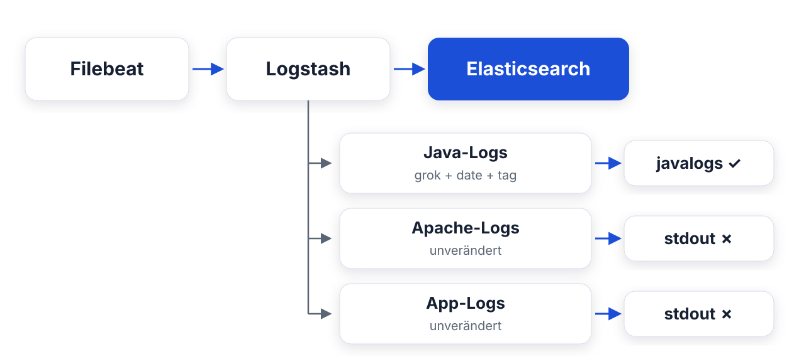
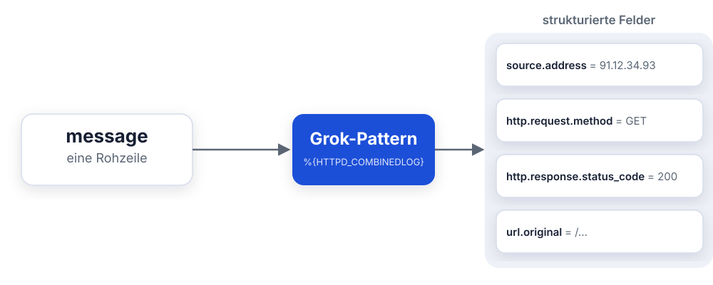
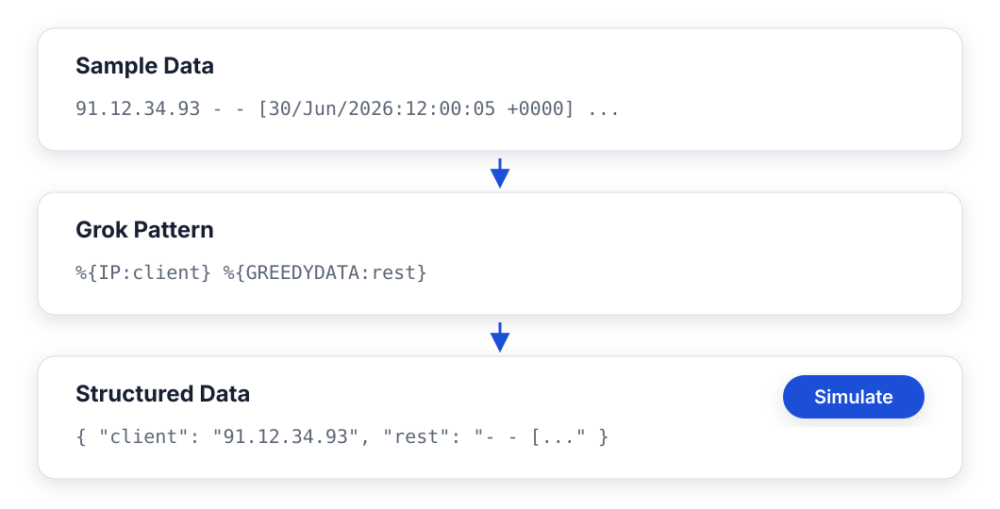
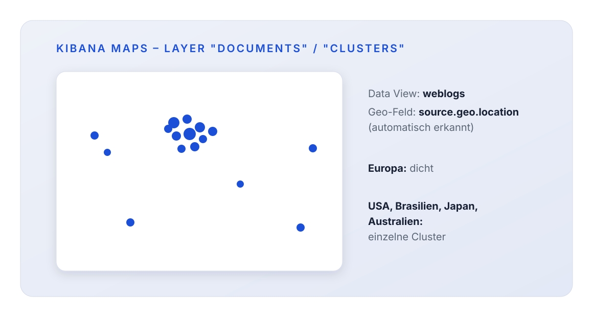
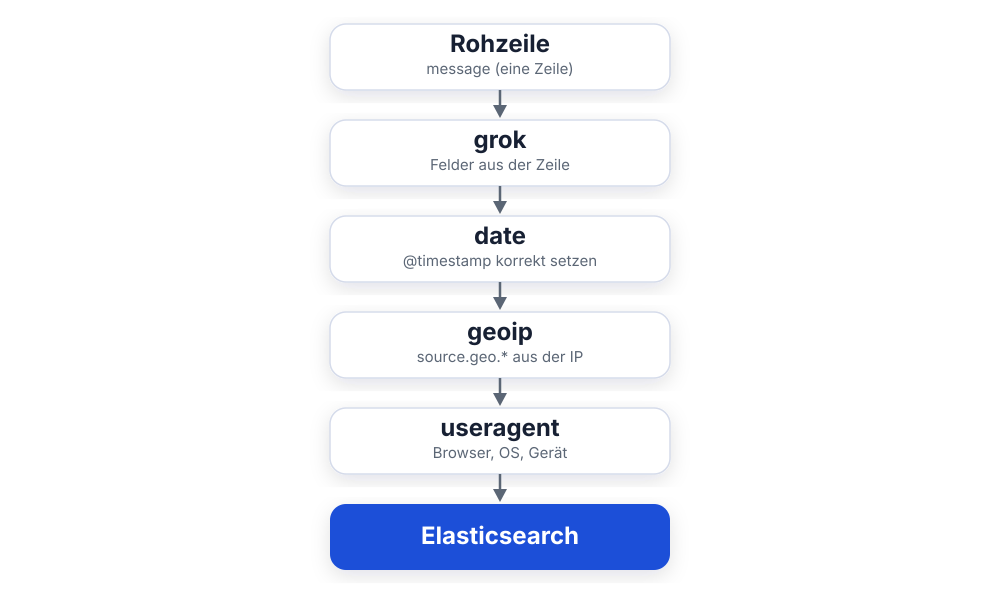
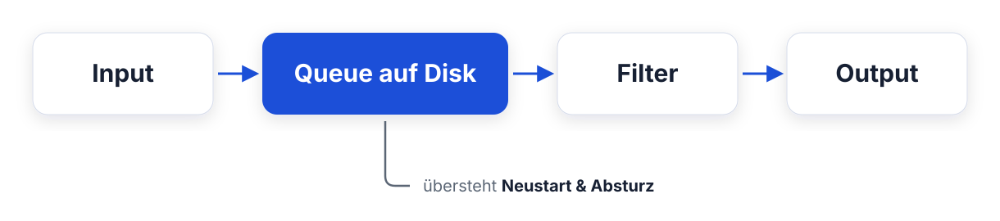
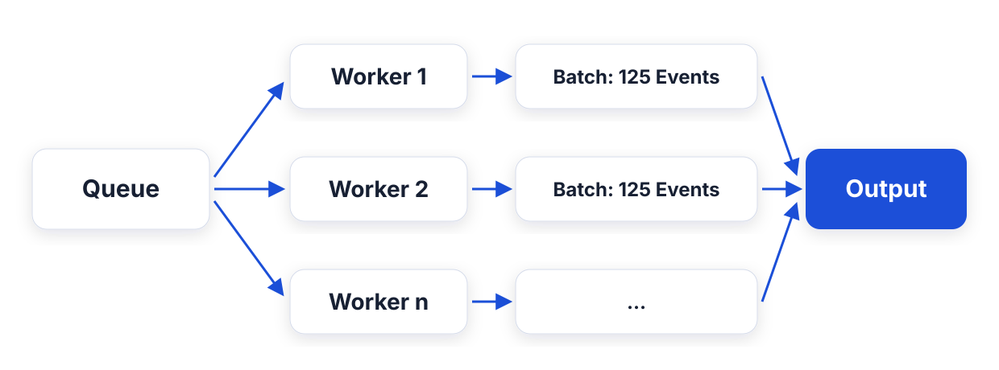
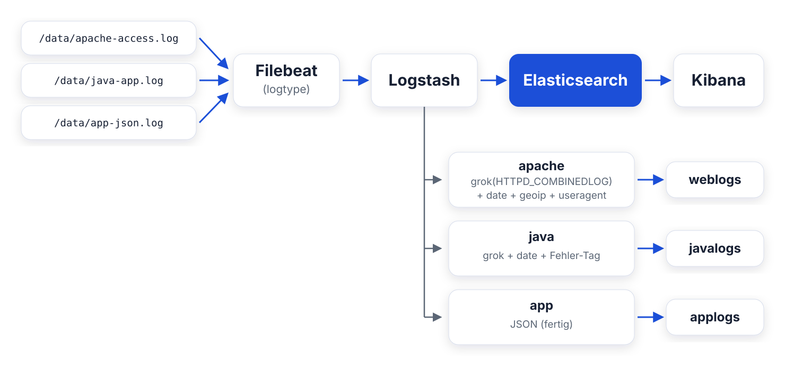

<style>
section blockquote { font-size: 0.8em; line-height: 1.3; margin-top: 0.25em; }
</style>


# Modul 07: Logstash Filter-Praxis

Grok, Geoip und Betrieb

---

# Lernziele

Nach diesem Modul kannst du:

- Unstrukturierte Logzeilen mit **Grok** in Felder zerlegen
- Den **Kibana Grok Debugger** zum Entwickeln und Testen von Patterns nutzen
- Eigene Grok-Patterns schreiben und `_grokparsefailure` debuggen
- **Dissect** als schnelle Alternative zu Grok einordnen
- IP-Adressen mit dem **Geoip-Filter** um Standortdaten anreichern
- Das nötige **geo_point-Mapping** per Index-Template bereitstellen
- Logstash im Betrieb absichern: Queues, Worker, Monitoring, DLQ

---

<style scoped>section { font-size: 1.25em; }</style>

# Ausgangslage bei Mustertech GmbH

Stand nach Modul 06:



- Apache-Zugriffslogs: noch eine einzige `message`-Zeile
- Keine Status-Codes, keine URLs, keine Client-Infos

**Ziel heute:** Apache-Logs parsen, mit Geodaten anreichern,
alle drei Logtypen sauber nach Elasticsearch routen.

---

# Agenda

| Teil | Thema                                          |
| ---- | ---------------------------------------------- |
| 1    | Grok - unstrukturierte Logs parsen             |
| 2    | Dissect - die schnelle Alternative             |
| 3    | Geoip - IP-Adressen zu Standorten              |
| 4    | Weitere Filter: useragent, kv, date-Feinheiten |
| 5    | Betrieb & Best Practices                       |

---

# Frage in die Runde

**Bevor wir parsen:**

- Wie durchsuchst du deine Logs heute - grep, Volltext, gar nicht?
- Woran scheiterst du: "zeig mir alle 500er von gestern Mittag"?

> Genau das macht Grok gleich beantwortbar.

---

# Teil 1: Grok

Unstrukturierte Logs in Felder zerlegen

---

<style scoped>section { font-size: 1.5em; }</style>

# Das Problem: Text ist keine Struktur

Eine Zeile aus dem Apache-Log des Mustertech-Shops:

```text
91.12.34.93 - - [30/Jun/2026:12:00:05 +0000]
  "GET /static/js/app.js HTTP/1.1" 200 47332
  "https://www.mustertech-shop.de/" "Mozilla/5.0 (iPhone; ...)"
```

Ohne Parsing landet alles in **einem einzigen Feld** `message`:

- Kein Filtern nach Status-Code 500
- Keine Top-URLs im Dashboard
- Keine Auswertung nach Herkunftsland

> Für jede sinnvolle Analyse brauchen wir **einzelne Felder** -
> genau dafür gibt es Grok.

---

<style scoped>section { font-size: 1.5em; }</style>

# Was ist Grok?

Grok = **reguläre Ausdrücke mit Namen**.

- Basiert auf der Regex-Bibliothek **Oniguruma**
- Logstash bringt **über 120 fertige Patterns** mit
- Patterns sind kombinierbar und wiederverwendbar

Statt kryptischer Regex ...

```text
(?:(?:25[0-5]|2[0-4][0-9]|[01]?[0-9][0-9]?)\.){3}...
```

... schreibst du einfach:

```text
%{IP:client}
```

> Grok macht Regex lesbar - du kombinierst Bausteine
> statt Zeichenklassen zu zählen.

---

# Vom Rohlog zum Feld

Ein Feld rein, viele Felder raus:



> Das ist der ganze Trick - Grok schneidet die Zeile in Felder.

---

<style scoped>section { font-size: 1.2em; }</style>

# Grok-Syntax: %{PATTERN:feld}

```text
%{PATTERN:feldname}
```

| Bestandteil | Bedeutung                                       |
| ----------- | ----------------------------------------------- |
| `PATTERN`   | Name eines Grok-Patterns (z. B. `IP`, `NUMBER`) |
| `feldname`  | Ziel-Feld im Event (optional)                   |

**Beispiele:**

```text
%{IP:client}          # matcht eine IP, schreibt sie in "client"
%{NUMBER:dauer}       # matcht eine Zahl, schreibt sie in "dauer"
%{LOGLEVEL}           # matcht nur, ohne Feld anzulegen
```

Im Logstash-Filter:

```ruby
grok {
  match => { "message" => "%{IP:client} %{GREEDYDATA:rest}" }
}
```

---

<style scoped>table { font-size: 0.7em; } section { font-size: 1.5em; }</style>

# Mitgelieferte Patterns (Auswahl)

| Pattern             | Matcht                                   | Beispiel                     |
| ------------------- | ---------------------------------------- | ---------------------------- |
| `IP`                | IPv4- oder IPv6-Adresse                  | `91.12.34.93`                |
| `NUMBER`            | Ganz- oder Dezimalzahl                   | `47332`, `3.14`              |
| `WORD`              | Ein Wort (ohne Leerzeichen)              | `GET`                        |
| `USER`              | Benutzername                             | `svc_shop`                   |
| `TIMESTAMP_ISO8601` | ISO-Zeitstempel                          | `2026-06-30 12:01:23,189`    |
| `HTTPDATE`          | Apache-Zeitformat                        | `30/Jun/2026:12:00:05 +0000` |
| `LOGLEVEL`          | Log-Level                                | `INFO`, `ERROR`, `WARN`      |
| `JAVACLASS`         | Java-Klassenname                         | `com.mustertech.shop.Cart`   |
| `URIPATH`           | URL-Pfad                                 | `/checkout`                  |
| `DATA`              | Beliebiger Text (genügsam)               | `http-nio-8080-exec-1`       |
| `GREEDYDATA`        | Beliebiger Text (gierig, bis Zeilenende) | Rest der Zeile               |

> Alle Patterns: `github.com/logstash-plugins/logstash-patterns-core`

---

<style scoped>section { font-size: 1.5em; }</style>

# DATA vs. GREEDYDATA

Beide matchen "beliebigen Text", aber unterschiedlich:

| Pattern      | Regex | Verhalten                           |
| ------------ | ----- | ----------------------------------- |
| `DATA`       | `.*?` | **Genügsam** - so wenig wie möglich |
| `GREEDYDATA` | `.*`  | **Gierig** - so viel wie möglich    |

**Faustregel:**

- `DATA` zwischen zwei festen Begrenzern:
  `\[%{DATA:thread}\]`
- `GREEDYDATA` nur **am Ende** des Patterns:
  `- %{GREEDYDATA:msg}`

> `GREEDYDATA` mitten im Pattern zwingt die Regex-Engine zu
> teurem Backtracking - ein häufiger Performance-Killer.

---

<style scoped>section { font-size: 1.3em; }</style>

# Apache Combined Log Format - Anatomie

```text
91.12.34.93 - - [30/Jun/2026:12:00:05 +0000]
  "GET /static/js/app.js HTTP/1.1" 200 47332
  "https://www.mustertech-shop.de/" "Mozilla/5.0 (iPhone; ...)"
```

| Bestandteil                         | Bedeutung                    |
| ----------------------------------- | ---------------------------- |
| `91.12.34.93`                       | Client-IP                    |
| `- -`                               | Ident / Auth-Benutzer (leer) |
| `[30/Jun/2026:12:00:05 +0000]`      | Zeitstempel der Anfrage      |
| `"GET /static/js/app.js HTTP/1.1"`  | Methode, Pfad, HTTP-Version  |
| `200`                               | Status-Code                  |
| `47332`                             | Antwortgröße in Bytes        |
| `"https://www.mustertech-shop.de/"` | Referrer                     |
| `"Mozilla/5.0 (...)"`               | User-Agent                   |

---

<style scoped>section { font-size: 1.3em; }</style>

# HTTPD_COMBINEDLOG - das fertige Pattern

Für dieses Standardformat musst du **nichts selbst bauen**:

```ruby
grok {
  match => { "message" => "%{HTTPD_COMBINEDLOG}" }
}
```

Eine Zeile Konfiguration zerlegt die komplette Logzeile in Felder.

**Weitere fertige Format-Patterns:**

| Pattern             | Format                                  |
| ------------------- | --------------------------------------- |
| `HTTPD_COMMONLOG`   | Apache Common Log (ohne Referrer/Agent) |
| `HTTPD_COMBINEDLOG` | Apache/Nginx Combined Log               |
| `SYSLOGLINE`        | Klassisches Syslog                      |

> Prüfe immer zuerst, ob es für dein Logformat schon ein
> fertiges Pattern gibt.

---

<style scoped>table { font-size: 0.72em; } section { font-size: 1.1em; }</style>

# ECS-Kompatibilität: Feldnamen in Logstash 9

Logstash 9 läuft standardmäßig mit **ECS-Kompatibilität v8**.
`%{HTTPD_COMBINEDLOG}` erzeugt Felder nach dem
**Elastic Common Schema**:

| Log-Bestandteil | ECS-Feld                    |
| --------------- | --------------------------- |
| Client-IP       | `source.address`            |
| Auth-Benutzer   | `user.name`                 |
| Zeitstempel     | `timestamp` (temporär!)     |
| HTTP-Methode    | `http.request.method`       |
| Pfad            | `url.original`              |
| HTTP-Version    | `http.version`              |
| Status-Code     | `http.response.status_code` |
| Bytes           | `http.response.body.bytes`  |
| Referrer        | `http.request.referrer`     |
| User-Agent      | `user_agent.original`       |

> ECS-Feldnamen sind der gemeinsame Nenner des ganzen Stacks -
> Dashboards, Alerts und SIEM-Regeln bauen darauf auf.

---

<style scoped>section { font-size: 1.25em; }</style>

# Das temporäre Feld `timestamp`

Grok schreibt den Apache-Zeitstempel in ein **Hilfsfeld** `timestamp` -
`@timestamp` bleibt zunächst die **Einlese-Zeit**.

Der date-Filter übernimmt den echten Zeitpunkt und räumt auf:

```ruby
date {
  match => ["timestamp", "dd/MMM/yyyy:HH:mm:ss Z"]
  remove_field => ["timestamp"]
}
```

| Format-Baustein | Beispiel      |
| --------------- | ------------- |
| `dd/MMM/yyyy`   | `30/Jun/2026` |
| `HH:mm:ss`      | `12:00:05`    |
| `Z`             | `+0000`       |

> Ohne date-Filter zeigen deine Dashboards, **wann Filebeat die
> Zeile gelesen hat** - nicht, wann die Anfrage kam.

---

<style scoped>section { font-size: 1.3em; }</style>

# Kibana Grok Debugger

Patterns entwickelst du **nicht** durch Pipeline-Neustarts,
sondern im Grok Debugger:

**Management → Dev Tools → Grok Debugger**



> Erst im Debugger entwickeln, dann in die Pipeline übernehmen.

---

<style scoped>section { font-size: 1.2em; }</style>

# Achtung: Debugger zeigt Legacy-Feldnamen

Der Grok Debugger simuliert über **Elasticsearch** - dort sind bei
`%{HTTPD_COMBINEDLOG}` noch die **Legacy-Feldnamen** aktiv:

| Grok Debugger (Legacy) | Logstash 9 (ECS)            |
| ---------------------- | --------------------------- |
| `clientip`             | `source.address`            |
| `verb`                 | `http.request.method`       |
| `request`              | `url.original`              |
| `response`             | `http.response.status_code` |
| `bytes`                | `http.response.body.bytes`  |
| `agent`                | `user_agent.original`       |

**Nicht wundern:** Das Pattern ist dasselbe, nur die
Feldnamen im Ergebnis unterscheiden sich.

> Verlässliche Wahrheit ist immer der `rubydebug`-Output
> deiner echten Logstash-Pipeline.

---

<style scoped>section { font-size: 1.5em; }</style>

# Patterns schrittweise entwickeln

Nie das komplette Pattern auf einmal schreiben. Stattdessen:

1. **Anfang matchen:** `%{IP:client} %{GREEDYDATA:rest}`
2. **Simulate** - matcht es? Was steht in `rest`?
3. **Nächsten Baustein** aus `rest` herausziehen:
   `%{IP:client} %{USER:ident} %{USER:auth} %{GREEDYDATA:rest}`
4. Wiederholen, bis `rest` leer ist
5. `%{GREEDYDATA:rest}` am Ende entfernen

```text
%{IP:client} %{GREEDYDATA:rest}
%{IP:client} %{USER:ident} %{USER:auth} %{GREEDYDATA:rest}
%{IP:client} %{USER:ident} %{USER:auth} \[%{HTTPDATE:ts}\] %{GREEDYDATA:rest}
...
```

> Matcht ein Schritt nicht mehr, liegt der Fehler **genau im
> zuletzt hinzugefügten Baustein**.

---

<style scoped>section { font-size: 1.3em; }</style>

# Eigene Patterns: Inline-Regex

Wenn kein fertiges Pattern passt, definierst du direkt
im Match einen **benannten Regex**:

```text
(?<feldname>regex)
```

**Beispiel:** Mustertech-Bestellnummern wie `B-2026-266502`:

```ruby
grok {
  match => {
    "message" => "Bestellung (?<bestellnr>B-\d{4}-\d+) erfolgreich"
  }
}
```

Ergebnis:

```json
{ "bestellnr": "B-2026-266502" }
```

> Gut für Einmal-Fälle. Für Wiederverwendung: eigene
> Pattern-Definitionen (nächste Folie).

---

<style scoped>section { font-size: 1.3em; }</style>

# Eigene Patterns: wiederverwendbar

**Variante 1 - direkt im Filter (`pattern_definitions`):**

```ruby
grok {
  pattern_definitions => {
    "BESTELLNR" => "B-\d{4}-\d+"
  }
  match => { "message" => "Bestellung %{BESTELLNR:bestellnr}" }
}
```

**Variante 2 - eigene Pattern-Datei (`patterns_dir`):**

```ruby
# Datei /etc/logstash/patterns/mustertech:
#   BESTELLNR B-\d{4}-\d+

grok {
  patterns_dir => ["/etc/logstash/patterns"]
  match => { "message" => "Bestellung %{BESTELLNR:bestellnr}" }
}
```

> Eigene Patterns benennen wie mitgelieferte: GROSSBUCHSTABEN,
> sprechender Name.

---

<style scoped>section { font-size: 0.95em; }</style>

# Beispiel: unser Java-Log-Pattern

Aus Modul 06 kennst du das Pattern für die Anwendungslogs:

```text
2026-06-30 12:01:23,189 INFO [main]
  com.mustertech.shop.order.OrderService - Cache aktualisiert
```

```ruby
grok {
  match => {
    "message" => "(?m)%{TIMESTAMP_ISO8601:log_ts} %{LOGLEVEL:level} \[%{DATA:thread}\] %{JAVACLASS:logger} - %{GREEDYDATA:msg}"
  }
}
```

| Baustein               | Matcht                          |
| ---------------------- | ------------------------------- |
| `(?m)`                 | Multiline-Modus für Stacktraces |
| `%{TIMESTAMP_ISO8601}` | `2026-06-30 12:01:23,189`       |
| `%{LOGLEVEL}`          | `INFO`                          |
| `\[%{DATA:thread}\]`   | `[main]` - Klammern escaped!    |
| `%{JAVACLASS}`         | `com.mustertech.shop...`        |
| `%{GREEDYDATA:msg}`    | Rest inkl. Stacktrace           |

---

<style scoped>section { font-size: 1.1em; }</style>

# _grokparsefailure erkennen

Matcht ein Grok-Pattern nicht, wird das Event **nicht verworfen** -
es bekommt nur einen Tag:

```json
{
  "message": "kaputte Zeile ohne Struktur",
  "tags": ["_grokparsefailure"]
}
```

**Fehlerquote in Kibana Discover im Blick behalten:**

```text
tags: "_grokparsefailure"
```

**Oder per Query gegen Elasticsearch:**

```text
GET weblogs/_count
{
  "query": { "match": { "tags": "_grokparsefailure" } }
}
```

> Ein paar Failures sind normal (kaputte Requests, Scanner-Traffic).
> **Viele** Failures heißen: dein Pattern passt nicht zum Format.

---

<style scoped>section { font-size: 1.4em; }</style>

# _grokparsefailure debuggen

Systematisches Vorgehen:

1. **Original-Zeile holen:** In Discover nach
   `tags: "_grokparsefailure"` filtern, `message` kopieren
2. **In den Grok Debugger** einfügen, aktuelles Pattern testen
3. **Pattern von vorne kürzen**, bis es wieder matcht -
   der zuletzt entfernte Baustein ist der Übeltäter
4. Pattern anpassen, in die Pipeline übernehmen

**Typische Ursachen:**

- Leerzeichen: zwei statt einem, Tabs statt Spaces
- Optionale Teile (z. B. fehlender Referrer: `-`)
- Sonderzeichen, die nicht escaped sind: `[ ] ( ) "`
- Anderes Zeitformat als erwartet

---

<style scoped>section { font-size: 1.4em; }</style>

# Mehrere Patterns & eigene Failure-Tags

Ein grok-Filter kann **mehrere Patterns** probieren
(das erste treffende gewinnt):

```ruby
grok {
  match => {
    "message" => [
      "%{HTTPD_COMBINEDLOG}",
      "%{HTTPD_COMMONLOG}"
    ]
  }
  tag_on_failure => ["apache_grok_fehler"]
}
```

- Reihenfolge: **spezifischstes Pattern zuerst**
- `tag_on_failure`: eigener Tag statt `_grokparsefailure` -
  so weißt du, **welcher** grok-Filter gescheitert ist

> Bei mehreren grok-Filtern in einer Pipeline sind eigene
> Failure-Tags Gold wert.

---

<style scoped>section { font-size: 1.4em; }</style>

# Performance: Anker setzen

Grok sucht das Pattern standardmäßig **irgendwo** in der Zeile.
Bei Nicht-Treffern probiert die Engine jede Startposition durch.

**Lösung: Anker** - `^` (Zeilenanfang) und `$` (Zeilenende):

```ruby
grok {
  match => { "message" => "^%{HTTPD_COMBINEDLOG}$" }
}
```

**Effekt bei Nicht-Treffern:**

| Ohne Anker                  | Mit Anker                 |
| --------------------------- | ------------------------- |
| Versucht jede Startposition | Ein Versuch, dann Abbruch |
| Langsames Scheitern         | Schnelles Scheitern       |

> Gerade **nicht matchende** Zeilen kosten am meisten -
> Anker lassen Grok schnell scheitern.

---

<style scoped>section { font-size: 1.3em; }</style>

# Performance: Gier vermeiden

**Problematisch:**

```text
%{GREEDYDATA:a} %{GREEDYDATA:b} %{NUMBER:code}
```

Mehrdeutig - die Engine probiert unzählige Aufteilungen
durch (Backtracking).

**Regeln für schnelle Patterns:**

- So **spezifisch** wie möglich: `%{IP}` statt `%{DATA}`
- `DATA`/`GREEDYDATA` nur mit klaren Begrenzern drumherum
- `GREEDYDATA` maximal **einmal, am Ende**
- Anker `^` und `$` setzen
- Mit `_node/stats` prüfen, welche Filter Zeit fressen (Teil 5)

> Ein einziges schlecht gebautes Grok-Pattern kann den
> Durchsatz der ganzen Pipeline ruinieren.

---

# Teil 2: Dissect

Die schnelle Alternative für feste Formate

---

<style scoped>section { font-size: 1.3em; }</style>

# Dissect: Zerlegen ohne Regex

Dissect schneidet die Zeile an **festen Trennzeichen** auseinander -
keine Regex, kein Backtracking:

```text
2026-06-30T12:00:10|checkout-service|INFO|Zahlung autorisiert
```

```ruby
dissect {
  mapping => {
    "message" => "%{ts}|%{service}|%{level}|%{msg}"
  }
}
```

Ergebnis:

```json
{
  "ts": "2026-06-30T12:00:10",
  "service": "checkout-service",
  "level": "INFO",
  "msg": "Zahlung autorisiert"
}
```

---

<style scoped>section { font-size: 1.15em; }</style>

# Dissect-Syntax

Alles **zwischen** den `%{...}`-Platzhaltern ist wörtliches
Trennzeichen:

```ruby
dissect {
  mapping => {
    "message" => '%{client} - - [%{ts}] "%{method} %{path} %{http}"'
  }
}
```

**Nützliche Modifikatoren:**

| Schreibweise | Bedeutung                             |
| ------------ | ------------------------------------- |
| `%{feld}`    | Wert ins Feld schreiben               |
| `%{}`        | Wert verwerfen (Skip)                 |
| `%{+feld}`   | An vorhandenes Feld anhängen          |
| `%{feld->}`  | Wiederholte Trennzeichen überspringen |

> Dissect validiert **nicht** - es schneidet nur. Steht an der
> IP-Position Müll, landet der Müll im Feld.

---

<style scoped>table { font-size: 0.75em; } section { font-size: 1.25em; }</style>

# Grok vs. Dissect - wann was?

| Kriterium        | Dissect            | Grok                     |
| ---------------- | ------------------ | ------------------------ |
| Funktionsweise   | Feste Trennzeichen | Reguläre Ausdrücke       |
| Geschwindigkeit  | Sehr schnell       | Langsamer (Regex)        |
| Validierung      | Keine              | Ja (Pattern muss passen) |
| Variable Formate | Ungeeignet         | Stärke                   |
| Optionale Teile  | Ungeeignet         | Möglich                  |
| Lernkurve        | Flach              | Steiler                  |

**Faustregeln:**

- Format **stabil und einheitlich** → Dissect
- Format **variabel oder validierungsbedürftig** → Grok
- **Kombination:** Dissect zerlegt grob, Grok parst
  einzelne Teilfelder nach

> Bei hohem Durchsatz lohnt sich Dissect: gleiches Ergebnis,
> deutlich weniger CPU.

---

# Frage in die Runde

**Standort deiner Nutzer:**

- Weisst du, aus welchen Ländern euer Traffic kommt?
- Wo wäre eine Karte im Dashboard hilfreich - Angriffe,
  Kundenverteilung, CDN-Planung?

---

# Teil 3: Geoip

Aus IP-Adressen werden Standorte

---

<style scoped>section { font-size: 1.2em; }</style>

# Was macht der Geoip-Filter?

Der Geoip-Filter schlägt IP-Adressen in der
**MaxMind GeoLite2-Datenbank** nach:

```text
91.12.34.93  ──>  Deutschland, Hessen, Frankfurt am Main,
                  lat 50.11, lon 8.68
```

**Wichtig zu wissen:**

- Logstash lädt die GeoLite2-City-Datenbank beim ersten
  Einsatz **automatisch herunter** - einmalig Internetzugang nötig
- Danach wird sie regelmäßig aktualisiert (Standard: alle 24 h)
- Die Genauigkeit ist **ISP-basiert**: Stadt-Level ist eine
  Näherung, Land-Level sehr zuverlässig
- Private IPs (`10.x`, `192.168.x`) haben keinen Eintrag →
  Tag `_geoip_lookup_failure`

> Für Mustertech heißt das: Wir sehen endlich, **aus welchen
> Ländern** die Shop-Besucher kommen.

---

<style scoped>section { font-size: 1.1em; }</style>

# Geoip konfigurieren

Grok hat die Client-IP bereits in `source.address` abgelegt.
Genau da setzt Geoip an:

```ruby
geoip {
  source => "[source][address]"
  target => "[source]"
}
```

| Option   | Bedeutung                               |
| -------- | --------------------------------------- |
| `source` | Feld mit der IP-Adresse                 |
| `target` | Wohin die Geo-Felder geschrieben werden |

- `[source][address]` ist die Logstash-Schreibweise für das
  verschachtelte Feld `source.address`
- `target => "[source]"` erzeugt ECS-konforme Felder unter
  `source.geo.*`

> In ECS gehört die Geo-Info des Clients unter `source.geo` -
> das erwarten auch Kibana Maps und die SIEM-App.

---

<style scoped>table { font-size: 0.8em; } section { font-size: 1.2em; }</style>

# Was Geoip anreichert

Nach dem Filter enthält das Event unter `source.geo.*`:

| Feld                          | Beispiel                        |
| ----------------------------- | ------------------------------- |
| `source.geo.country_name`     | `Germany`                       |
| `source.geo.country_iso_code` | `DE`                            |
| `source.geo.region_name`      | `Hesse`                         |
| `source.geo.city_name`        | `Frankfurt am Main`             |
| `source.geo.location`         | `{ "lat": 50.11, "lon": 8.68 }` |
| `source.geo.timezone`         | `Europe/Berlin`                 |
| `source.geo.continent_code`   | `EU`                            |

**Damit möglich:**

- Traffic-Verteilung nach Land (Balken, Kreisdiagramm)
- **Karten** mit Client-Standorten (braucht `geo_point`!)
- Filter wie `source.geo.country_iso_code: "DE"`

---

<style scoped>section { font-size: 1.4em; }</style>

# Das Mapping-Problem: geo_point

**Stolperfalle:** Ohne Vorbereitung mappt Elasticsearch
`source.geo.location` per Dynamic Mapping als **Objekt mit
zwei floats**, nicht als `geo_point`.

```text
Dynamic Mapping:              Benötigt für Maps:
source.geo.location.lat  ❌   source.geo.location
source.geo.location.lon  ❌   (type: geo_point)     ✅
```

**Folgen ohne geo_point:**

- Kibana Maps findet **kein Geo-Feld** im Data View
- Keine Geo-Abfragen (`geo_distance`, `geo_bounding_box`)

**Lösung:** Ein **Index-Template**, das das Mapping festlegt,
**bevor** der Index entsteht.

> Mappings sind nachträglich nicht änderbar - zu spät angelegt
> heißt: Index löschen und neu befüllen.

---

<style scoped>section { font-size: 1.1em; }</style>

# Index-Template für weblogs

```text
PUT _index_template/weblogs
{
  "index_patterns": ["weblogs*"],
  "template": {
    "mappings": {
      "properties": {
        "source": {
          "properties": {
            "address": { "type": "keyword" },
            "geo": {
              "properties": {
                "location":         { "type": "geo_point" },
                "country_iso_code": { "type": "keyword" },
                "city_name":        { "type": "keyword" }
              }
            }
          }
        }
      }
    }
  }
}
```

- Greift automatisch für **jeden neuen Index**, der auf
  `weblogs*` passt
- Nicht definierte Felder mappt Elasticsearch weiterhin dynamisch

---

<style scoped>section { font-size: 1.5em; }</style>

# Reihenfolge ist alles

```text
1. PUT _index_template/weblogs     (Dev Tools)
2. Logstash schreibt erstes Event  → Index "weblogs" entsteht
                                     → Template greift ✅
```

**Falsche Reihenfolge:**

```text
1. Logstash schreibt erstes Event  → Index mit Dynamic Mapping ❌
2. PUT _index_template/weblogs     → greift NUR für neue Indizes
```

**Reparatur, falls es passiert ist:**

```text
DELETE weblogs        # Index löschen
# Daten neu einspielen (bei uns: ./reset.sh)
```

> Templates zuerst, Daten danach - diese Regel gilt für
> jedes Mapping-Vorhaben in Elasticsearch.

---

<style scoped>section { font-size: 1.25em; }</style>

# Kibana Maps auf den Ergebnissen

Mit `geo_point`-Mapping wird der Traffic **sichtbar**:



- **Documents-Layer:** jeder Request ein Punkt
- **Clusters-Layer:** aggregiert - besser bei 10.000+ Events
- Tooltips: `url.original`, `http.response.status_code`, Stadt

> Maps-Grundlagen: Modul 04 - jetzt mit **euren eigenen** Weblogs.

---

# Teil 4: Weitere Filter

useragent, kv und date-Feinheiten

---

<style scoped>section { font-size: 1.1em; }</style>

# useragent: Browser & Geräte erkennen

Der User-Agent-String ist lang und kryptisch - der
useragent-Filter schlüsselt ihn auf:

```ruby
useragent {
  source => "[user_agent][original]"
  target => "[user_agent]"
}
```

Aus `Mozilla/5.0 (iPhone; CPU iPhone OS 17_5 ...) ... Safari/604.1` wird:

| Feld                     | Wert            |
| ------------------------ | --------------- |
| `user_agent.name`        | `Mobile Safari` |
| `user_agent.version`     | `17.5`          |
| `user_agent.os.name`     | `iOS`           |
| `user_agent.device.name` | `iPhone`        |

**Damit beantwortet Mustertech:** Wie hoch ist der Mobile-Anteil
im Shop? Welche Browser müssen wir testen?

---

<style scoped>section { font-size: 1.5em; }</style>

# kv: Key-Value-Paare parsen

Für Logs im Format `schlüssel=wert` gibt es den kv-Filter:

```text
dauer=421 status=ok kunde=k-8812 betrag=249.90
```

```ruby
kv {
  source => "msg"
  field_split => " "
  value_split => "="
}
```

Ergebnis:

```json
{ "dauer": "421", "status": "ok",
  "kunde": "k-8812", "betrag": "249.90" }
```

> Typisch für Audit-Logs, Firewalls und viele Java-Frameworks -
> spart dir ein Grok-Pattern pro Schlüssel.

---

<style scoped>section { font-size: 1.2em; }</style>

# date-Feinheiten: Zeitzonen

Die häufigste Fehlerquelle bei Zeitstempeln: **fehlende
Zeitzonen-Info** in der Logzeile.

```text
2026-06-30 12:01:23,189   ← 12 Uhr... aber wo?
```

Ohne Angabe interpretiert Logstash die Zeit in der
**Zeitzone des Logstash-Hosts** - oft falsch!

```ruby
date {
  match => ["log_ts", "yyyy-MM-dd HH:mm:ss,SSS"]
  timezone => "Europe/Berlin"   # Zeitzone der LOG-QUELLE
}
```

- Steht die Zone im Log (`+0000`), parst `Z` sie direkt,
  keine `timezone`-Option nötig
- `@timestamp` ist **immer UTC**; Kibana rechnet für die
  Anzeige in die Browser-Zeitzone um

> Faustregel: 1-2 Stunden Versatz in Kibana = Zeitzonen-Problem.

---

<style scoped>section { font-size: 1.15em; }</style>

# date-Feinheiten: Locale & mehrere Formate

**Monatsnamen sind sprachabhängig:**

`30/Jun/2026` - `Jun` ist Englisch. Auf einem deutschen System
kann das Parsing scheitern (`Mär` vs. `Mar`).

```ruby
date {
  match => ["timestamp", "dd/MMM/yyyy:HH:mm:ss Z"]
  locale => "en"          # explizit ist besser als implizit
}
```

**Mehrere Formate gleichzeitig:**

```ruby
date {
  match => ["ts", "yyyy-MM-dd HH:mm:ss,SSS",
                  "yyyy-MM-dd'T'HH:mm:ss.SSSZ",
                  "ISO8601"]
}
```

- Das erste passende Format gewinnt
- Scheitern alle: Tag `_dateparsefailure` - genauso
  überwachen wie `_grokparsefailure`

---

# Die Filter-Kette im Überblick

Reihenfolge im `filter{}`-Block der Apache-Pipeline:



> Reihenfolge zählt: geoip und useragent brauchen die Felder,
> die grok vorher anlegt.

---

# Frage in die Runde

**Ehrlich gefragt:**

- Ist dir schon mal eine Pipeline abgeschmiert - waren die
  Events dann weg?
- Wie merkst du heute, dass eine Verarbeitung klemmt -
  Alert oder Zufall?

> Antworten liefert dieser Teil: Queues, Monitoring, DLQ.

---

# Teil 5: Betrieb & Best Practices

Logstash produktionsreif machen

---

<style scoped>section { font-size: 1.1em; }</style>

# Persistent Queues

- Standard: Events puffern **im Speicher** - Absturz, alles weg
- Persistent Queue: erst auf Platte, dann in die Filter

In `logstash.yml`:

```yaml
queue.type: persisted
queue.max_bytes: 4gb        # Standard: 1024mb
```



- Puffert auch **Lastspitzen** ab, wenn Elasticsearch
  langsamer indexiert als Events ankommen
- Ist die Queue voll, bremst Logstash die Inputs
  (Backpressure bis zu Filebeat)

> Für produktive Pipelines: Persistent Queue einschalten.

---

<style scoped>section { font-size: 1.1em; }</style>

# pipeline.workers & batch.size

Zwei Stellschrauben bestimmen den Durchsatz (`logstash.yml`):

```yaml
pipeline.workers: 8       # Standard: Anzahl CPU-Kerne
pipeline.batch.size: 125  # Events pro Worker und Batch
```



| Schraube     | Erhöhen wenn ...                              |
| ------------ | --------------------------------------------- |
| `workers`    | CPU nicht ausgelastet, Filter sind das Limit  |
| `batch.size` | Elasticsearch-Bulk-Requests zu klein/zu viele |

- Größere Batches = mehr Durchsatz, mehr RAM, mehr Latenz
- **Messen statt raten** - mit der Monitoring-API

---

<style scoped>section { font-size: 1.3em; }</style>

# Monitoring-API: _node/stats

Logstash hat eine eingebaute HTTP-API auf **Port 9600**:

```bash
curl "localhost:9600/_node/stats/pipelines?pretty"
```

Liefert **pro Pipeline und pro Plugin**:

```json
{
  "events": { "in": 10000, "out": 10000,
              "duration_in_millis": 4820 },
  "plugins": {
    "filters": [{
      "name": "grok",
      "events": { "in": 10000, "out": 10000 },
      "failures": 3,
      "events.duration_in_millis": 2100
    }]
  }
}
```

> So findest du den Filter, der die Zeit frisst - und siehst
> Grok-`failures` ohne Kibana.

---

<style scoped>section { font-size: 1.1em; }</style>

# Pipeline-zu-Pipeline

Statt einer Riesen-Pipeline: **mehrere kleine**, verbunden
über interne Adressen (`pipelines.yml` + `pipeline`-Plugin):

```ruby
# Pipeline "eingang": verteilt nach Logtyp
output {
  if [logtype] == "apache" {
    pipeline { send_to => ["web"] }
  } else {
    pipeline { send_to => ["app"] }
  }
}

# Pipeline "web": eigene Filter, eigener Output
input { pipeline { address => "web" } }
```

**Vorteile:**

- Getrennte Zuständigkeiten, getrennt testbar
- Eigene Queue & Worker-Einstellungen pro Pipeline
- Eine langsame Pipeline blockiert die anderen nicht

---

<style scoped>section { font-size: 1.3em; }</style>

# Dead Letter Queue (DLQ)

Was passiert mit Events, die Elasticsearch **ablehnt**
(z. B. Mapping-Konflikt, Fehler 400)?

Ohne DLQ: Event wird verworfen. Mit DLQ (`logstash.yml`):

```yaml
dead_letter_queue.enable: true
```

Abgelehnte Events landen auf Platte und können später
**repariert und neu eingespielt** werden:

```ruby
input {
  dead_letter_queue {
    path => "/usr/share/logstash/data/dead_letter_queue"
    pipeline_id => "main"
  }
}
# ... reparieren (mutate) und erneut an Elasticsearch senden
```

> DLQ ist dein Sicherheitsnetz gegen stillen Datenverlust
> bei Mapping-Problemen.

---

<style scoped>section { font-size: 1.4em; }</style>

# Konfigurationen versionieren & testen

Pipeline-Konfigs sind **Code** - behandle sie auch so:

- **Git:** Jede Änderung versionieren, Review vor dem Deploy
- **Syntax-Check vor dem Start:**

```bash
bin/logstash -f pipeline/ --config.test_and_exit
```

- **Testdaten durchspielen:** kleine Datei mit bekannten
  Zeilen (gute + kaputte) durch die Pipeline schicken,
  Output vergleichen
- **Auto-Reload** (`config.reload.automatic: true`) ist super
  fürs Entwickeln; in Produktion bewusst entscheiden
- Failure-Tags (`_grokparsefailure`, `_dateparsefailure`)
  **dauerhaft überwachen** - z. B. per Alert (Tag 3!)

> Der schlimmste Pipeline-Fehler ist der, den niemand bemerkt.

---

<style scoped>table { font-size: 0.78em; } section { font-size: 1.5em; }</style>

# Best Practices im Überblick

| Bereich     | Empfehlung                                          |
| ----------- | --------------------------------------------------- |
| Grok        | Anker setzen, spezifische Patterns, Debugger nutzen |
| Dissect     | Bei festen Formaten Grok ersetzen                   |
| Feldnamen   | ECS verwenden - der ganze Stack baut darauf auf     |
| Zeitstempel | Immer date-Filter, Zeitzone & Locale explizit       |
| Mappings    | Index-Templates **vor** den ersten Daten            |
| Zuverlässig | Persistent Queue + DLQ aktivieren                   |
| Durchsatz   | Mit `_node/stats` messen, dann Worker/Batch tunen   |
| Struktur    | Große Pipelines in Pipeline-zu-Pipeline zerlegen    |
| Qualität    | Konfigs in Git, Failure-Tags überwachen             |

---

<style scoped>section { font-size: 1.1em; }</style>

# Zusammenfassung Tag 2

Die komplette Logging-Pipeline der Mustertech GmbH **steht**:



- **Modul 05 - Filebeat:** Logdateien einsammeln, Multiline bändigen,
  Logtypen markieren
- **Modul 06 - Logstash-Pipelines:** Input/Filter/Output, Conditionals,
  mutate & date
- **Modul 07 - Filter-Praxis:** Grok & Dissect, Geoip mit geo_point-Template,
  useragent, Betrieb (Queues, Monitoring, DLQ)

---

<style scoped>section { font-size: 1.6em; }</style>

# Ausblick auf Tag 3

Die Daten fließen strukturiert und angereichert - jetzt holen
wir mehr daraus:

- **Alerting:** den 5xx-Fehler-Burst im Checkout automatisch melden
  statt zufällig finden
- **Index-Lifecycle-Management:** weblogs & Co. automatisch
  rotieren und aufräumen
- **Betrieb des Clusters:** Snapshots, Skalierung, Sicherheit

> Du hast heute aus rohen Textzeilen durchsuchbare, angereicherte
> Events gemacht - darauf baut Tag 3 auf.
