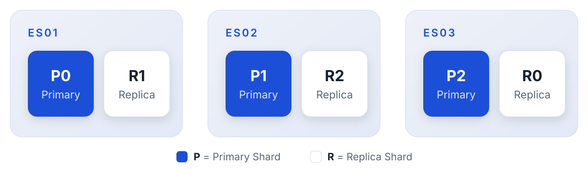
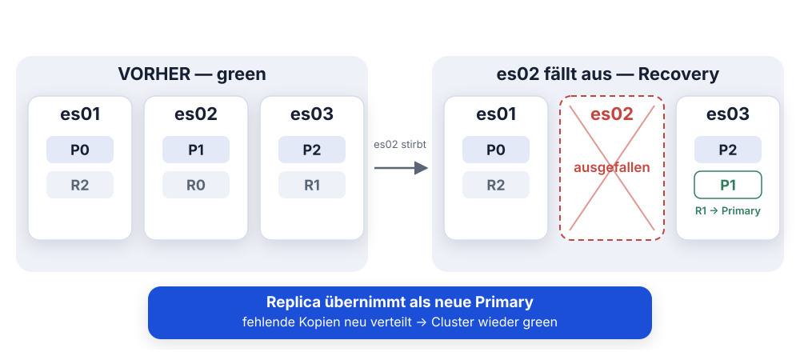
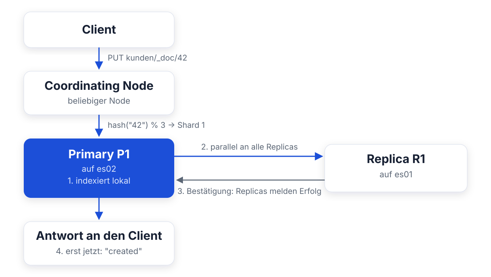
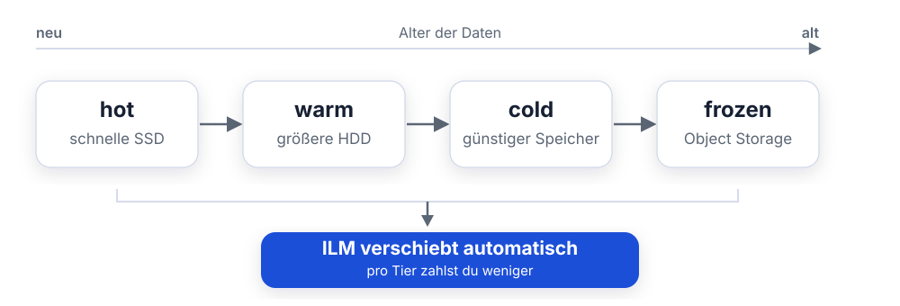
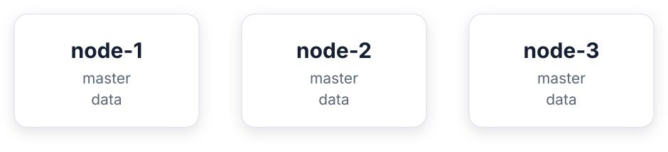
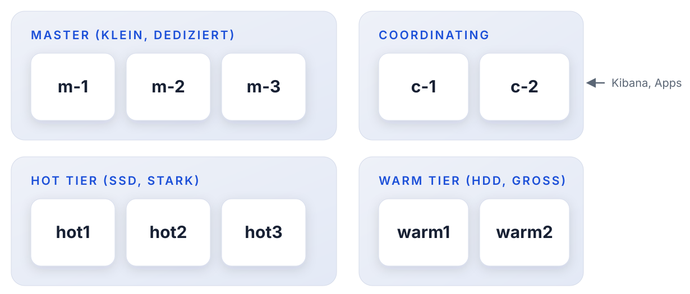
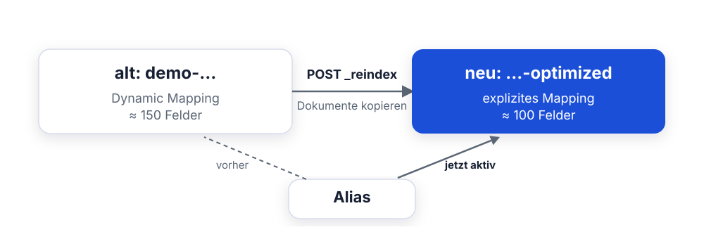

<style>
section blockquote { font-size: 0.8em; line-height: 1.3; margin-top: 0.25em; }
</style>

# Modul 08: Cluster-Architektur & Optimierung

Wie Elasticsearch skaliert

---

# Lernziele

Nach diesem Modul kannst du:

- Den Aufbau eines verteilten Elasticsearch-Clusters erklären (Nodes, Shards,
  Replicas)
- Den Weg eines Dokuments durch den Cluster nachvollziehen (Routing,
  Schreibpfad)
- Master-Wahl und Quorum verstehen und Split-Brain-Szenarien vermeiden
- Node-Rollen unterscheiden und typische Cluster-Topologien bewerten
- Shards richtig dimensionieren und mit den `_cat`-APIs diagnostizieren
- Mappings und Queries gezielt optimieren (keyword, enabled, filter-Kontext)

---
<style scoped>
section { font-size: 1.7em; }
</style>

# Ausgangslage bei Mustertech GmbH

Die Elastic-Plattform ist inzwischen geschäftskritisch: Bestellungen, Logs,
Transaktionen - alles landet dort.

**Bisher: ein einzelner Node. Das verursacht Probleme:**

- Node fällt aus - was dann?
- Datenmenge wächst - wie skalieren?
- Manche Abfragen kriechen - woran liegt's?

**Heute bauen wir:** ein 3-Node-Cluster, der auch den Ausfall eines Knotens
aushält.

---

# Teil 1: Verteilte Cluster

Nodes, Shards, Replicas - und was passiert, wenn etwas ausfällt

---
<style scoped>
table { font-size: 0.85em; }
section { font-size: 1.5em; }
</style>

# Warum überhaupt ein Cluster?

Ein einzelner Node stößt irgendwann an Grenzen:

| Problem                     | Lösung im Cluster                   |
| --------------------------- | ----------------------------------- |
| Festplatte voll             | Daten auf mehrere Nodes verteilen   |
| CPU/RAM am Limit            | Last auf mehrere Nodes verteilen    |
| Node fällt aus - Daten weg  | Kopien (Replicas) auf anderen Nodes |
| Node fällt aus - Dienst weg | Andere Nodes übernehmen automatisch |

**Zwei Ziele, ein Mechanismus:**

- **Skalierung** - mehr Daten, mehr Anfragen
- **Hochverfügbarkeit** - kein Single Point of Failure

> Elasticsearch ist von Grund auf als verteiltes System gebaut. Ein Cluster
> mit einem Node ist nur der Sonderfall.

---
<style scoped>
table { font-size: 0.78em; }
section { font-size: 1.6em; }
</style>

# Grundbegriffe

| Begriff     | Bedeutung                                                            |
| ----------- | -------------------------------------------------------------------- |
| **Cluster** | Verbund von Nodes mit gemeinsamem Namen und Zustand                  |
| **Node**    | Eine Elasticsearch-Instanz (ein Prozess, meist ein Container/Server) |
| **Index**   | Logische Sammlung von Dokumenten (z. B. `kunden`)                    |
| **Shard**   | Physisches Teilstück eines Index - ein eigenständiger Lucene-Index   |
| **Primary** | Original-Shard, nimmt Schreiboperationen entgegen                    |
| **Replica** | Kopie einer Primary auf einem *anderen* Node                         |

**Unser Kurs-Cluster:**

- Name: `training-cluster`
- Nodes: `es01`, `es02`, `es03`

> Ein Index ist nur eine logische Klammer: gearbeitet wird immer auf Shards.

---
<style scoped>
code { font-size: 0.85em; }
section { font-size: 1.4em; }
</style>

# Shards - ein Index in Scheiben

Der Index `kunden` mit 3 Primary Shards und 1 Replica pro Primary:



**Regeln der Verteilung:**

- Eine Replica liegt **nie** auf demselben Node wie ihre Primary
- Elasticsearch verteilt Shards automatisch möglichst gleichmäßig
- Fällt ein Node aus, werden fehlende Kopien auf den übrigen Nodes neu erstellt

> 3 Primaries + 1 Replica = 6 Shards. Jeder Node bekommt ungefähr gleich viel ab.

---
<style scoped>
table { font-size: 0.8em; }
code { font-size: 0.9em; }
section { font-size: 1.6em; }
</style>

# Primary vs. Replica

| Aspekt           | Primary                                  | Replica                            |
| ---------------- | ---------------------------------------- | ---------------------------------- |
| Schreiben        | Ja - immer zuerst hier                   | Nein, wird von der Primary kopiert |
| Lesen/Suchen     | Ja                                       | Ja - erhöht den Lese-Durchsatz     |
| Bei Node-Ausfall | Replica wird zur neuen Primary befördert | Wird auf anderem Node neu erstellt |
| Anzahl änderbar  | **Nein** (nach Index-Anlage fix)         | **Ja**, jederzeit per Setting      |

```
PUT kunden/_settings
{ "index": { "number_of_replicas": 2 } }
```

> Replicas sind gleichzeitig Ausfallsicherung **und** Lese-Skalierung.

---
<style scoped>
section { font-size: 1.4em; }
</style>

# Was passiert bei Node-Ausfall?



- Für **jede** verlorene Primary springt eine Replica ein
- Der Master verteilt die fehlenden Kopien auf die übrigen Nodes neu

---
<style scoped>
code { font-size: 0.9em; }
section { font-size: 1.6em; }
</style>

# Routing - Welcher Shard bekommt das Dokument?

Elasticsearch berechnet den Ziel-Shard deterministisch. Vereinfacht:

```
shard_nr = hash(_routing) % anzahl_primary_shards
```

- `_routing` ist standardmäßig die Dokument-ID (`_id`)
- Dasselbe Dokument landet also **immer** auf demselben Shard
- Beim Abruf per ID kennt Elasticsearch den Shard sofort, kein Suchen nötig

**Die wichtigste Konsequenz:**

Würde sich `anzahl_primary_shards` ändern, zeigte die Formel plötzlich auf
andere Shards: kein Dokument wäre mehr auffindbar.

> Deshalb ist die Anzahl der Primary Shards nach dem Anlegen
> **unveränderlich**. Nur die Replica-Anzahl ist flexibel.

---
<style scoped>
section { font-size: 1.5em; }
</style>

# Der Schreibpfad: Primary → Replica



- Der Node, der die Anfrage annimmt, **koordiniert**. Das kann jeder Node machen
- Die Antwort kommt erst, wenn Primary **und** aktive Replicas geschrieben haben

> Schreiben ist im Cluster teurer als auf einem Einzel-Node: jede Replica
> schreibt mit. Dafür ist das Dokument sofort mehrfach gesichert.

---
<style scoped>
section { font-size: 1.6em; }
</style>

# Der Lesepfad: Suche im Cluster

Eine Suche kennt die Dokument-IDs nicht, sie muss **alle Shards** fragen:

1. Der Coordinating Node nimmt die Anfrage entgegen
2. Er schickt die Suche an **je eine Kopie** jedes Shards
   (Primary *oder* Replica, was gerade weniger Last hat)
3. Jeder Shard liefert seine Top-Treffer
4. Der Coordinating Node führt die Ergebnisse zusammen und sortiert final

**Was daraus folgt:**

- Mehr Replicas = mehr parallele Suchkapazität
- Mehr Shards = mehr Teilanfragen pro Suche - **nicht** automatisch schneller

> Suchen skaliert über Replicas. Zu viele Shards machen Suchen langsamer,
> nicht schneller - dazu gleich mehr.

---
<style scoped>
section { font-size: 1.6em; }
</style>

# Der Cluster State

Der Cluster State ist das gemeinsame "Gedächtnis" des Clusters:

- Welche **Nodes** gehören dazu?
- Welche **Indizes** existieren, mit welchen **Settings**?
- Welche **Mappings** haben die Indizes - jedes einzelne Feld!
- Welcher **Shard** liegt auf welchem Node?

**Verwaltung:**

- Nur der **Master-Node** darf den Cluster State ändern
- Jede Änderung wird an alle Nodes verteilt
- Jeder Node hält eine vollständige Kopie im Speicher

> Jedes Feld in jedem Mapping vergrößert den Cluster State. Das wird in
> Teil 4 noch wichtig.

---
<style scoped>
section { font-size: 1.3em; }
</style>

# Der Master-Node

Genau **ein** Node im Cluster ist zu jedem Zeitpunkt der aktive Master.

**Aufgaben des Masters:**

- Cluster State verwalten und verteilen
- Indizes anlegen und löschen
- Shards den Nodes zuweisen (Allocation)
- Nodes in den Cluster aufnehmen und entfernen

**Was der Master NICHT tut:**

- Suchanfragen und Indexierung laufen **nicht** über den Master,
  das erledigen die Data Nodes

**Begriffe:**

- **master-eligible**: darf Master *werden* (Rolle `master`)
- **aktiver Master**: wurde gewählt, in `_cat/nodes` mit `*` markiert

---
<style scoped>
table { font-size: 0.85em; }
code { font-size: 0.9em; }
section { font-size: 1.5em; }
</style>

# Master-Wahl & Quorum

Fällt der Master aus, wählen die verbliebenen master-eligible Nodes einen
neuen, automatisch und innerhalb von Sekunden.

**Die Regel: Quorum = Mehrheit**

```
Quorum = (Anzahl master-eligible Nodes / 2) + 1
```

| Master-eligible Nodes | Quorum | Verkraftbare Ausfälle |
| --------------------- | ------ | --------------------- |
| 1                     | 1      | 0                     |
| 2                     | 2      | **0** (!)             |
| 3                     | 2      | 1                     |
| 5                     | 3      | 2                     |

> Seit Elasticsearch 7 verwaltet der Cluster das Quorum selbst (Voting
> Configuration). Du musst nur genügend master-eligible Nodes bereitstellen.

---
<style scoped>
section { font-size: 1.35em; }
</style>

# Split-Brain

Was, wenn das Netzwerk den Cluster in zwei Hälften teilt?


**Ohne Quorum:** Beide Seiten ernennen einen Master, beide nehmen
Schreibzugriffe an: die Daten laufen auseinander. Das ist **Split-Brain**.

**Mit Quorum:** Nur die Seite mit der **Mehrheit** (hier: es02 + es03 = 2 von
3) darf einen Master wählen. Die Minderheit stellt den Betrieb ein.

> Deshalb: immer eine **ungerade** Anzahl master-eligible Nodes - 3 ist der
> Standard. 2 Master-Nodes sind nicht besser als 1, sondern schlechter.

---
<style scoped>
table { font-size: 0.8em; }
code { font-size: 0.9em; }
section { font-size: 1.5em; }
</style>

# Cluster Health: Grün, Gelb, Rot

```
GET _cluster/health
```

| Status     | Bedeutung                               | Handlungsbedarf                         |
| ---------- | --------------------------------------- | --------------------------------------- |
| **green**  | Alle Primaries und Replicas zugewiesen  | Keiner                                  |
| **yellow** | Alle Primaries da, aber Replicas fehlen | Ausfallsicherung reduziert - beobachten |
| **red**    | Mindestens eine Primary fehlt           | **Datenverlust droht - sofort handeln** |

**Typische Ursachen für Yellow:**

- Ein Node ist gerade ausgefallen (Replicas werden neu verteilt)
- Einzel-Node-Cluster mit `number_of_replicas: 1`, die Replica kann
  nirgends hin

> Yellow heißt: Der Cluster funktioniert, aber der nächste Ausfall könnte
> wehtun.

---

# Frage in die Runde

**Wie steht ihr da?**

- Wer betreibt heute schon mehr als einen Node - und warum?
- Wer läuft noch auf einem einzelnen Node und hätte Bauchschmerzen, wenn der
  morgen stirbt?

*Sammeln wir kurz, bevor wir uns die Rollen ansehen.*

---

# Teil 2: Node-Rollen

Nicht jeder Node muss alles können

---
<style scoped>
table { font-size: 0.75em; }
code { font-size: 0.85em; }
section { font-size: 1.45em; }
</style>

# Node-Rollen im Überblick

Jeder Node bekommt über `node.roles` eine Liste von Rollen:

```yaml
node.roles: [ master, data, ingest ]
```

| Rolle                   | Aufgabe                                           |
| ----------------------- | ------------------------------------------------- |
| `master`                | Darf Master werden - Cluster-Verwaltung           |
| `data`                  | Hält Shards, führt Suchen und Indexierung aus     |
| `ingest`                | Führt Ingest-Pipelines aus (Vorverarbeitung)      |
| `ml`                    | Machine-Learning-Jobs                             |
| `transform`             | Transform-Jobs (kontinuierliche Aggregation)      |
| `remote_cluster_client` | Zugriff auf entfernte Cluster (CCS/CCR)           |
| *(leer)* `[]`           | **Coordinating-only** - nur Anfragen koordinieren |

> Ohne explizite Konfiguration hat ein Node fast alle Rollen: gut für den
> Einstieg, in großen Clustern trennt man sie.

---
<style scoped>
table { font-size: 0.9em; }
section { font-size: 1em; }
</style>

# Data-Tiers: hot, warm, cold, frozen

Für zeitbasierte Daten (Logs, Transaktionen) gibt es spezialisierte
Data-Rollen, die **Tiers**:

| Rolle          | Daten                                       | Typische Hardware                        |
| -------------- | ------------------------------------------- | ---------------------------------------- |
| `data_hot`     | Aktuelle Daten, viel Schreiben & Suchen     | Schnelle SSDs, viel CPU                  |
| `data_warm`    | Ältere Daten, seltener abgefragt            | Größere, langsamere Platten              |
| `data_cold`    | Alte Daten, read-only                       | Günstiger Speicher                       |
| `data_frozen`  | Archiv über Searchable Snapshots            | Minimal - Daten liegen im Object Storage |
| `data_content` | Nicht-zeitbasierte Inhalte (Produktkatalog) | Ausgewogen                               |

**Zusammenspiel:** Index Lifecycle Management (ILM) verschiebt Indizes
automatisch von hot nach warm nach cold.



---
<style scoped>
section { font-size: 1.5em; }
</style>

# Coordinating-only Nodes

Ein Node mit **leerer** Rollenliste macht nur eines: Anfragen koordinieren.

```yaml
node.roles: [ ]
```

- Nimmt Such- und Indexierungsanfragen an
- Verteilt sie an die Data Nodes und führt Ergebnisse zusammen
- Hält selbst keine Daten, wird nie Master

**Wann sinnvoll?**

- Große Cluster mit vielen aufwendigen Aggregationen: das Zusammenführen
  kostet CPU und RAM, die man den Data Nodes nicht wegnehmen will
- Als stabiler Endpunkt für Kibana und Anwendungen

> Jeder Node koordiniert automatisch. Dedizierte Coordinating Nodes lohnen sich
> erst in großen Clustern.

---
<style scoped>
section { font-size: 1.6em; }
</style>

# Typische Topologien (1): Ein Node


- Alles auf einem Node - so lief Mustertech bisher
- **Kein** Failover, **keine** Replicas erzeugbar (Health: yellow)
- Völlig in Ordnung für: Entwicklung, Tests, Demos

> Für Produktion ungeeignet: ein Ausfall bedeutet Stillstand, im
> schlimmsten Fall auch Datenverlust.

---
<style scoped>
section { font-size: 1.6em; }
</style>

# Typische Topologien (2): Drei Nodes - der Klassiker



- Alle Nodes sind master-eligible **und** Data Nodes
- Quorum 2 von 3 - ein Node darf ausfallen
- Replicas immer auf einem anderen Node - Health: green

**Das ist der Sweet Spot für kleine und mittlere Setups** - und genau
unsere Kurs-Umgebung.

> Drei gleichberechtigte Nodes: minimaler Aufwand, echte Hochverfügbarkeit.

---
<style scoped>
section { font-size: 1.25em; }
</style>

# Typische Topologien (3): Getrennte Rollen

Ab ~10 Nodes trennt man die Rollen:



**Warum?**

- Dedizierte Master: Cluster-Verwaltung bleibt stabil, auch wenn Data Nodes
  unter Volllast stehen
- Tiers: Hardware passend zur Datennutzung
- Coordinating: schützt Data Nodes vor teuren Merge-Operationen

> Rollen trennt man, weil die Messwerte dafür sprechen - nicht auf Vorrat.
> Erst messen, dann trennen.

---
<style scoped>
table { font-size: 0.8em; }
section { font-size: 1.6em; }
</style>

# Unsere Kurs-Topologie

Der `training-cluster`, mit dem du gleich arbeitest:

| Node   | Rollen               | zone | temp | Erreichbarkeit               |
| ------ | -------------------- | ---- | ---- | ---------------------------- |
| `es01` | master, data, ingest | a    | hot  | Port 9200 nach außen, Kibana |
| `es02` | master, data         | b    | warm | Nur clusterintern            |
| `es03` | master, data         | b    | warm | Nur clusterintern            |

- Alle drei sind **master-eligible** → Quorum 2 von 3
- Security ist **aktiv**: TLS + Login (`elastic` / `changeme`)
- `zone` und `temp` sind **Custom-Attribute** (`node.attr.*`) -
  die nutzen wir gleich für die Shard-Steuerung

> `es01` ist unser einziger Zugangspunkt von außen. Merk dir das für die
> Failover-Übung.

---
<style scoped>
code { font-size: 0.9em; }
section { font-size: 1.45em; }
</style>

# node.attr - Eigene Node-Attribute

Neben den Rollen kannst du Nodes frei beschriften:

```yaml
node.attr.zone: a
node.attr.temp: hot
```

- Beliebige Schlüssel-Wert-Paare in der `elasticsearch.yml`
- Sichtbar über `GET _cat/nodeattrs?v`
- Elasticsearch ignoriert sie - **bis du sie für die Shard-Allokation
  benutzt** (Teil 3)

**Typische Attribute in der Praxis:**

- `zone` / `rack` - physischer Standort (Rechenzentrum, Availability Zone)
- `temp` - Temperatur-Klassifizierung der Hardware

> Attribute sind reine Metadaten. Interessant werden sie erst mit Allocation
> Awareness und Filtering.

---

# Frage in die Runde

**Bevor wir über Shards reden:**

- Weiß jemand aus dem Kopf, wie viele Shards sein größter Index hat?
- Wer hat schon mal einen Index angelegt und die Shard-Anzahl einfach auf
  Default gelassen?

*Haltet die Zahl im Hinterkopf - gleich wisst ihr, ob sie passt.*

---

# Teil 3: Shard-Optimierung

Wie viele Shards? Wie groß? Und wer entscheidet, wo sie liegen?

---
<style scoped>
section { font-size: 1.55em; }
</style>

# Wie groß soll ein Shard sein?

**Die Faustregel: 10 bis 50 GB pro Shard.**

- Unter ~10 GB: Verwaltungs-Overhead frisst den Nutzen auf
- Über ~50 GB: Recovery und Rebalancing dauern zu lange
- Zusätzlich: möglichst unter ~200 Millionen Dokumente pro Shard

**So planst du die Primary-Anzahl:**

```
Erwartete Indexgröße / Ziel-Shard-Größe = Anzahl Primaries
z. B.  120 GB / 40 GB  =  3 Primary Shards
```

- Denk daran: Die Primary-Anzahl ist nach dem Anlegen **fix**
- Bei wachsenden Daten: zeitbasierte Indizes + Rollover statt Riesen-Index

> Lieber wenige, gut gefüllte Shards als viele leere. Warum, zeigt die
> nächste Folie.

---
<style scoped>
section { font-size: 1.15em; }
</style>

# Das Oversharding-Problem

Jeder Shard ist ein vollständiger Lucene-Index und kostet - **auch wenn er
fast leer ist**:

- Heap-Speicher für Segment-Metadaten
- Datei-Handles und Threads
- Einen Eintrag im Cluster State
- Eine eigene Teilanfrage bei **jeder** Suche

**Typisches Antipattern:**

Täglicher Log-Index mit 5 Primaries + 1 Replica = 10 Shards/Tag.
Nach einem Jahr: **3.650 Shards** für vielleicht 50 GB Daten.

**Gegenmittel:**

- Weniger Primaries (oft reicht 1)
- Rollover nach Größe statt starrem Zeitraster (ILM)
- Bestehende Indizes: `_shrink` reduziert die Primary-Anzahl

> Oversharding ist das häufigste selbstgemachte Cluster-Problem: es
> entsteht schleichend und bremst jede Suche.

---
<style scoped>
table { font-size: 0.78em; }
code { font-size: 0.9em; }
section { font-size: 1.6em; }
</style>

# Die _cat-APIs

Kompakte, menschenlesbare Übersichten über den Cluster:

| API                   | Zeigt                                       |
| --------------------- | ------------------------------------------- |
| `GET _cat/health`     | Cluster-Status in einer Zeile               |
| `GET _cat/nodes`      | Nodes, Rollen, Ressourcen, Master (`*`)     |
| `GET _cat/nodeattrs`  | Custom-Attribute der Nodes (`zone`, `temp`) |
| `GET _cat/indices`    | Indizes mit Doc-Anzahl und Größe            |
| `GET _cat/shards`     | Jeder Shard: Index, Nummer, p/r, Node       |
| `GET _cat/allocation` | Shards und Plattenplatz pro Node            |
| `GET _cat/recovery`   | Laufende und abgeschlossene Shard-Kopien    |

> `_cat` ist für Menschen gemacht. Für Skripte nimmst du die JSON-APIs
> (`_cluster/health`, `_nodes/stats`, ...) oder `?format=json`.

---
<style scoped>
table { font-size: 0.78em; }
code { font-size: 0.8em; }
section { font-size: 1.25em; }
</style>

# _cat-Syntax: Spalten gezielt auswählen

| Parameter | Wirkung                               |
| --------- | ------------------------------------- |
| `?v`      | Kopfzeile anzeigen (verbose)          |
| `&h=...`  | Nur bestimmte Spalten (kommagetrennt) |
| `&s=...`  | Nach Spalte sortieren                 |
| `?help`   | Alle verfügbaren Spalten auflisten    |

**Beispiel - Shard-Verteilung kompakt:**

```
GET _cat/shards/kunden?v&h=index,shard,prirep,state,node&s=shard
```

```
index  shard prirep state   node
kunden 0     p      STARTED es02
kunden 0     r      STARTED es03
kunden 1     p      STARTED es03
...
```

> `prirep`: `p` = Primary, `r` = Replica. Mit `?help` findest du für jede
> `_cat`-API alle Spaltennamen.

---
<style scoped>
code { font-size: 0.85em; }
section { font-size: 1.4em; }
</style>

# Allocation Awareness: Zonen-bewusst verteilen

Mustertech betreibt Nodes in zwei Brandabschnitten (`zone: a` / `zone: b`).
Was, wenn Primary **und** Replica zufällig in derselben Zone liegen?

**Lösung: Awareness aktivieren**

```
PUT _cluster/settings
{
  "persistent": {
    "cluster.routing.allocation.awareness.attributes": "zone"
  }
}
```

- Elasticsearch verteilt Kopien desselben Shards auf **unterschiedliche
  Zonen**
- Fällt eine ganze Zone aus, existiert jede Shard-Kopie noch mindestens einmal

> Awareness ist Pflicht, sobald dein Cluster über Rechenzentren oder
> Availability Zones verteilt läuft.

---
<style scoped>
code { font-size: 0.8em; }
section { font-size: 1.1em; }
</style>

# Allocation Filtering: Shards gezielt platzieren

Pro Index bestimmst du, **welche Nodes** seine Shards halten dürfen:

```
PUT kunden/_settings
{
  "index.routing.allocation.require.zone": "a"
}
```

| Variante    | Bedeutung                          |
| ----------- | ---------------------------------- |
| `require.*` | Node MUSS das Attribut haben       |
| `include.*` | Node muss EINEN der Werte haben    |
| `exclude.*` | Node DARF das Attribut NICHT haben |

**Typische Einsätze:**

- Node ausmustern: `cluster.routing.allocation.exclude._ip` - Shards
  wandern ab, dann kannst du den Node stoppen
- Wichtige Indizes auf schnelle Hardware zwingen (`require.temp: hot`)

> Zum Entfernen setzt du das Setting auf `null`, dann verteilen sich die
> Shards wieder frei.

---
<style scoped>
table { font-size: 0.8em; }
section { font-size: 1.4em; }
</style>

# Disk Watermarks: Schutz vor vollen Platten

Elasticsearch überwacht den Füllstand jedes Data Nodes:

| Watermark       | Default | Wirkung                                         |
| --------------- | ------- | ----------------------------------------------- |
| **low**         | 85 %    | Keine *neuen* Shards mehr auf diesen Node       |
| **high**        | 90 %    | Shards werden aktiv auf andere Nodes verschoben |
| **flood_stage** | 95 %    | Betroffene Indizes werden **read-only** gesetzt |

- Einstellbar über `cluster.routing.allocation.disk.watermark.*`
- Der Read-only-Block wird automatisch wieder entfernt, sobald genug Platz
  frei ist

**Symptom in der Praxis:** Indexierung schlägt plötzlich fehl mit
`cluster_block_exception` ... `read_only_allow_delete`

> Wenn Schreibzugriffe unerklärlich scheitern: zuerst
> `GET _cat/allocation?v` - oft ist einfach eine Platte voll.

---
<style scoped>
code { font-size: 0.78em; }
section { font-size: 1.25em; }
</style>

# _cluster/allocation/explain

Wenn ein Shard `UNASSIGNED` ist, sagt dir diese API **warum**:

```
GET _cluster/allocation/explain
{
  "index": "kunden",
  "shard": 0,
  "primary": false
}
```

Ohne Body erklärt sie den ersten unzugewiesenen Shard, den sie findet.

**Typische Antworten (`explanation`):**

- `node_left` - der Node mit dem Shard ist weg
- `a copy of this shard is already allocated to this node` -
  Replica darf nicht zur eigenen Primary
- Watermark überschritten, Filtering-Regel verhindert Zuweisung, ...

> Bei gelbem oder rotem Cluster ist `allocation/explain` immer dein erster
> Anlaufpunkt.

---

# Frage in die Runde

- Wer schreibt seine Mappings explizit - und wer lässt Elasticsearch raten
  (Dynamic Mapping)?
- Hat schon mal jemand einen Index mit hunderten Feldern gesehen, die keiner
  gebraucht hat?

*Darum geht es jetzt: was Dynamic Mapping anrichtet und wie du gegensteuerst.*

---

# Teil 4: Index-Optimierung - Mapping-Workshop

Warum das Mapping über Speicher, Geschwindigkeit und Stabilität entscheidet

---
<style scoped>
section { font-size: 1.2em; }
</style>

# Das Szenario: Mustertechs Transaktionsdaten

Mustertech indexiert Zahlungs- und Treuepunkte-Transaktionen direkt aus der
Shop-API, mit **Dynamic Mapping**. Das Ergebnis:

- Über **150 Felder** im Transaktions-Index (im echten System: 513!)
- Aggregationen auf Kategorien schlagen fehl
- Der Index ist größer als die Rohdaten

**Unser Workshop-Setup:** jeder Index existiert zweimal:

| Index                              | Mapping                  |
| ---------------------------------- | ------------------------ |
| `demo-smarttransactions`           | Original (alle Probleme) |
| `demo-smarttransactions-optimized` | Optimiert                |

Dazu: `demo-loyaltytransactions` (je 200 Dokumente) und
`demo-generalstores` (50 Filialen).

> Gleiche Daten, zwei Mappings - wir messen den Unterschied live.
> **Setup im Repo:** `workshop-demo/` (`node setup.js`) legt die Indizes an,
> die fertigen Dev-Tools-Blocks liegen in `workshop-demo/devtools-commands.txt`.

---
<style scoped>
section { font-size: 1.35em; }
</style>

# Warum das Mapping alles bestimmt

Für **jedes Feld** im Mapping baut Elasticsearch Datenstrukturen auf:

- **Invertierter Index** - für die Suche
- **Doc Values** - für Aggregationen und Sortierung
- Einen Eintrag im **Cluster State** (auf jedem Node im Speicher!)

Jedes Feld kostet also: Plattenplatz, Heap, Indexierungszeit -
**bei jedem einzelnen Dokument**.

**Unsere vier Stellschrauben heute:**

1. Der richtige Feldtyp: `text` vs. `keyword`
2. Felder komplett abschalten: `enabled: false`
3. Der richtige Query-Kontext: `filter` vs. `must`
4. Feldanzahl reduzieren → kleinerer Index

> Ins Mapping gehört nur, was du wirklich brauchst - alles andere kostet bloß.

---
<style scoped>
table { font-size: 0.82em; }
section { font-size: 1.55em; }
</style>

# Recap: text vs. keyword

| Aspekt                              | `text`                                          | `keyword`                         |
| ----------------------------------- | ----------------------------------------------- | --------------------------------- |
| Verarbeitung                        | Analysiert: zerlegt in Tokens, kleingeschrieben | Exakter Wert, unverändert         |
| Gedacht für                         | Volltextsuche (Beschreibungen)                  | Filter, Aggregationen, Sortierung |
| `"Lebensmittel & Getränke"` wird zu | `lebensmittel`, `getränke`                      | `Lebensmittel & Getränke`         |
| Aggregierbar                        | Nein (ohne Tricks)                              | Ja                                |

**Die Frage an jedes String-Feld:**

- Sucht jemand *in* diesem Text? → `text`
- Filtert, aggregiert oder sortiert jemand *nach* dem Wert? → `keyword`

> Kategorien, Status-Codes, IDs, E-Mail-Adressen: fast immer `keyword`.

---
<style scoped>
code { font-size: 0.72em; }
section { font-size: 1.15em; }
</style>

# Antipattern: Aggregation auf einem text-Feld

Im Original-Index ist `category` als `text` gemappt. "Top-Kategorien" für
das Dashboard:

```
GET demo-generalstores/_search
{
  "size": 0,
  "aggs": {
    "kategorien": {
      "terms": { "field": "category" }
    }
  }
}
```

**Ergebnis: eine Fehlermeldung.**

```
"Fielddata is disabled on [category] in [demo-generalstores].
 Text fields are not optimised for aggregations ..."
```

**Warum die Weigerung? Zu Recht:**

- Aggregation auf `text` müsste den invertierten Index im Heap umdrehen (Fielddata)
- Teuer - und liefert nur Token-Fragmente (`lebens`, `mittel`, ...)

---
<style scoped>
code { font-size: 0.85em; }
section { font-size: 1.2em; }
</style>

# Die Lösung: keyword

Im optimierten Index ist `category` als `keyword` gemappt:

```
GET demo-generalstores-optimized/_search
{
  "size": 0,
  "aggs": {
    "kategorien": {
      "terms": { "field": "category" }
    }
  }
}
```

**Ergebnis: saubere Buckets**

```
"buckets": [
  { "key": "Bücher",       "doc_count": 7 },
  { "key": "Lebensmittel", "doc_count": 7 },
  { "key": "Spielwaren",   "doc_count": 7 },
  ...
]
```

> Eine Zeile im Mapping entscheidet, ob dein Kibana-Dashboard funktioniert.

---
<style scoped>
code { font-size: 0.85em; }
section { font-size: 1.4em; }
</style>

# Wir brauchen Beides? Multi-Fields.

Das Dynamic Mapping legt Strings standardmäßig **doppelt** an:

```json
"category": {
  "type": "text",
  "fields": {
    "keyword": { "type": "keyword", "ignore_above": 256 }
  }
}
```

- Volltextsuche über `category`
- Aggregation über `category.keyword`

**Aber:** Beide Varianten kosten Speicher und Indexierungszeit.

- Nie Volltextsuche auf dem Feld? → nur `keyword` mappen
- Nie Aggregation? → nur `text` mappen

> Dynamic Mapping ist bequem zum Starten. Spätestens im Produktivbetrieb
> schreibst du das Mapping besser selbst.

---
<style scoped>
code { font-size: 0.72em; }
section { font-size: 1.2em; }
</style>

# enabled: false - Speichern ohne Indexieren

Mustertechs Transaktionen enthalten den kompletten **Kassenbon** als
verschachteltes Objekt: dutzende Felder, nach denen **niemand sucht**.

```json
"receipt": {
  "type": "object",
  "enabled": false
}
```

**Was passiert:**

- Das Objekt bleibt vollständig in `_source` erhalten
- Es wird **weder geparst noch indexiert**: kein einziges Unterfeld
  landet im Mapping

**Was du gewinnst:**

- ~40 Felder weniger im Mapping (bei Mustertech)
- Schnellere Indexierung, kleinerer Cluster State

> Die Anwendung kann den Bon weiterhin anzeigen, nur suchen kann man nicht
> mehr danach. Und das wollte ohnehin niemand.

---
<style scoped>
code { font-size: 0.8em; }
section { font-size: 1.05em; }
</style>

# enabled: false in Aktion

**Original-Index - das Feld ist durchsuchbar:**

```
GET demo-smarttransactions/_search
{
  "size": 1,
  "query": { "exists": { "field": "receipt.value.name" } }
}
```

→ Treffer.

**Optimierter Index - dieselbe Query:**

```
GET demo-smarttransactions-optimized/_search
{
  "size": 1,
  "query": { "exists": { "field": "receipt.value.name" } }
}
```

→ **0 Treffer.** Sind die Daten weg?

```
GET demo-smarttransactions-optimized/_doc/STX_000001
```

→ Das komplette `receipt`-Objekt liegt in `_source`. **Nichts ist verloren.**

---
<style scoped>
table { font-size: 0.76em; }
code { font-size: 0.8em; }
section { font-size: 1.3em; }
</style>

# Feinjustierung: index und doc_values

Das Feld `merchant.object` enthält in **jedem** Dokument denselben Wert
(`general.merchants`, der API-Ressourcentyp). Niemand filtert danach,
niemand aggregiert darauf.

```json
"object": { "type": "keyword", "index": false, "doc_values": false }
```

| Schalter            | Schaltet ab              | Feld bleibt in `_source`? |
| ------------------- | ------------------------ | ------------------------- |
| `enabled: false`    | Alles (nur Objekte/Root) | Ja                        |
| `index: false`      | Suche auf dem Feld       | Ja                        |
| `doc_values: false` | Aggregation/Sortierung   | Ja                        |

- `enabled` gilt für ganze Objekte, `index`/`doc_values` für einzelne Felder
- Bei Mustertech zieht sich `object` durch jede Referenz: **~20 Felder**,
  deren Overhead so verschwindet

> Frag bei jedem Feld: Suchen? Aggregieren? Beides nein → beide Schalter aus.

---
<style scoped>
section { font-size: 1.45em; }
</style>

# filter vs. must: Zwei Kontexte, zwei Kosten

Eine `bool`-Query hat zwei Arten von Bedingungen:

**Query-Kontext (`must`, `should`):**

- Beantwortet: *Wie gut* passt das Dokument?
- Berechnet einen **Relevanz-Score** (`_score`) - für jeden Treffer

**Filter-Kontext (`filter`, `must_not`):**

- Beantwortet: Passt das Dokument - **ja oder nein**?
- Kein Score, dafür **cachebar**: wiederholte Filter kommen aus dem
  Query-Cache

**Die Frage dahinter:** Hat je jemand nach der "relevantesten Transaktion"
gesucht?

> Für exakte Bedingungen (Status, Zeitraum, Beträge) ist `filter` praktisch
> immer richtig.

---
<style scoped>
code { font-size: 0.78em; }
section { font-size: 1.0em; }
</style>

# filter vs. must im Vergleich

```
GET demo-smarttransactions/_search
{
  "size": 3,
  "_source": ["id", "status", "basket_info.sum"],
  "query": {
    "bool": {
      "must": [
        { "term": { "status": "ok" } },
        { "range": { "basket_info.sum": { "gte": 5000 } } }
      ]
    }
  }
}
```

→ Jeder Treffer hat `_score > 0`: Elasticsearch hat Relevanz berechnet.

```
      "bool": {
        "filter": [
          { "term": { "status": "ok" } },
          { "range": { "basket_info.sum": { "gte": 5000 } } }
        ]
      }
```

→ `_score` ist überall `0.0`: keine Berechnung, Ergebnis cachebar.

> Gleiche Treffer, weniger Arbeit. Mit `"profile": true` kannst du die
> Ausführung im Detail vergleichen.

---
<style scoped>
section { font-size: 1.7em; }
</style>

# Wer muss daran denken - du oder Kibana?

**Gute Nachricht:**

- KQL-Abfragen in Kibana landen automatisch im **Filter-Kontext**
- Auch Kibana-Filter (die Pills) sind Filter-Kontext

**Aufpassen musst du, wenn:**

- deine Anwendung **direkt gegen die API** programmiert
- du Queries aus Beispielen kopierst (viele Tutorials nutzen `must`)
- du Volltext-Relevanz (`match` in `must`) mit exakten Bedingungen mischst:
  dann gehören die exakten Bedingungen in `filter`

> Faustregel: `must` nur für das, was das Ranking beeinflussen soll,
> alles andere in `filter`.

---
<style scoped>
code { font-size: 0.78em; }
section { font-size: 1.25em; }
</style>

# Die Bilanz: Feldanzahl und Indexgröße

```
GET _cat/indices/demo-*?v&h=index,docs.count,store.size&s=index
```

```
index                              docs.count store.size
demo-smarttransactions                    200        1mb
demo-smarttransactions-optimized          200      0.6mb
...
```

Gleiche Daten, gleiches JSON - der optimierte Index ist **deutlich
kleiner**. Bei 200 Dokumenten. Bei Millionen Transaktionen macht das
richtig was aus.

```
GET demo-smarttransactions/_mapping?filter_path=**.properties
```

- Original: **über 150 Felder** - optimiert: gut 100
- Mustertechs echtes Mapping: 513 Felder → geschätzt ~280 nach Optimierung
- Schutznetz: `index.mapping.total_fields.limit` (Default: 1000)

> Weniger Felder = schnellere Indexierung, weniger Heap, stabilerer Cluster.

---
<style scoped>
section { font-size: 1.65em; }
</style>

# Mapping-Checkliste für Mustertech

Vor dem Anlegen eines produktiven Index:

- [ ] **Explizites Mapping** statt Dynamic Mapping für bekannte Felder
- [ ] Strings bewusst als `text` **oder** `keyword` - Multi-Field nur wenn
      beides gebraucht wird
- [ ] Große Objekt-Blobs, nach denen niemand sucht → `enabled: false`
- [ ] Konstante/ungenutzte Felder → `index: false`, `doc_values: false`
- [ ] Exakte Bedingungen in Queries → `filter` statt `must`
- [ ] Feldanzahl im Blick behalten (`_mapping`, `total_fields.limit`)

> Mapping-Änderungen wirken nur auf **neue** Indizes: bestehende Daten
> musst du reindexieren (`_reindex`).

---
<style scoped>
section { font-size: 1.35em; }
</style>

# Reindexing: Mapping nachträglich ändern

Der Primary-Shard-Count und die meisten Mapping-Typen stehen fest. Willst du
sie ändern, kopierst du in einen frisch angelegten Index um:



- Neuen Index mit **sauberem Mapping** anlegen, dann `_reindex`
- Zum Schluss per **Alias** umschalten - die Anwendung merkt nichts

> Genau dieses Vorher-Nachher hast du im Workshop als zwei fertige Indizes
> vorliegen.

---

# Teil 5: Weitere Stellschrauben

Drei Settings, die du kennen solltest

---
<style scoped>
code { font-size: 0.85em; }
section { font-size: 1.4em; }
</style>

# refresh_interval: Wie schnell wird Neues sichtbar?

Neue Dokumente sind erst nach einem **Refresh** durchsuchbar,
standardmäßig **jede Sekunde** ("near real-time").

Jeder Refresh erzeugt ein neues Lucene-Segment - das kostet.

```
PUT logs-mustertech/_settings
{ "index": { "refresh_interval": "30s" } }
```

**Wann anpassen?**

- Log- und Metrik-Indizes: `30s` reicht fast immer, niemand braucht Logs
  sekundengenau
- Bulk-Import: `-1` (aus), nach dem Import zurücksetzen und einmal
  `POST index/_refresh`

> Refresh-Frequenz ist der einfachste Tausch: etwas Aktualität gegen
> spürbar mehr Indexierungs-Durchsatz.

---
<style scoped>
code { font-size: 0.85em; }
section { font-size: 1.6em; }
</style>

# force_merge: Segmente aufräumen

Jeder Shard besteht aus **Segmenten**, kleinen, unveränderlichen
Lucene-Teilindizes. Viele kleine Segmente = Overhead bei jeder Suche.

```
POST logs-mustertech-2026.06/_forcemerge?max_num_segments=1
```

**Regeln:**

- Nur für Indizes, in die **nicht mehr geschrieben** wird
  (z. B. der Log-Index vom letzten Monat)
- Teuer: liest und schreibt den ganzen Shard neu - außerhalb der
  Stoßzeiten laufen lassen
- Ergebnis: weniger Speicher, schnellere Suchen auf Alt-Daten

> ILM kann Force Merge automatisch beim Übergang in die Warm-Phase
> ausführen. Genau dafür ist es gedacht.

---
<style scoped>
code { font-size: 0.85em; }
section { font-size: 1.4em; }
</style>

# Index Sorting: Vorsortiert auf der Platte

Wenn fast alle Abfragen gleich sortieren (z. B. neueste Transaktionen
zuerst), kann der Index **physisch vorsortiert** werden:

```
PUT transaktionen
{
  "settings": {
    "index.sort.field": "created",
    "index.sort.order": "desc"
  }
}
```

- Nur beim **Anlegen** des Index möglich
- Sortierte Abfragen können früher abbrechen (Early Termination) -
  deutlich schneller
- Preis: langsamere Indexierung (Sortieren beim Schreiben)

> Ein Spezialwerkzeug: erst einsetzen, wenn ein Sortiermuster eindeutig
> dominiert.

---
<style scoped>
section { font-size: 1.15em; }
</style>

# Zusammenfassung

- Ein **Cluster** verteilt Indizes als **Shards** über Nodes: Primaries
  nehmen Schreibzugriffe an, **Replicas** sichern ab und skalieren Lesen
- Das **Routing** (`hash(_id) % primaries`) macht die Primary-Anzahl
  unveränderlich - plane sie mit der 10-50-GB-Faustregel
- Der **Master** verwaltet den Cluster State; **Quorum** (Mehrheit der
  master-eligible Nodes) verhindert Split-Brain - deshalb 3 Master-Nodes
- **Node-Rollen** und **Data-Tiers** trennen Verantwortung: erst ab
  größeren Clustern nötig, unser 3-Node-Setup ist der Klassiker
- **_cat-APIs** und `_cluster/allocation/explain` sind deine
  Diagnose-Werkzeuge; **Watermarks** schützen vor vollen Platten
- Das **Mapping** entscheidet über Größe und Geschwindigkeit:
  `keyword` für exakte Werte, `enabled: false` für Ballast,
  `filter` statt `must` für exakte Bedingungen
- **refresh_interval**, **force_merge** und **Index Sorting** sind die
  Feinjustierung für Spezialfälle

**Jetzt bist du dran:** Im Lab baust du den Cluster auf, lässt einen Node
ausfallen - und optimierst Mustertechs Transaktions-Mapping.
