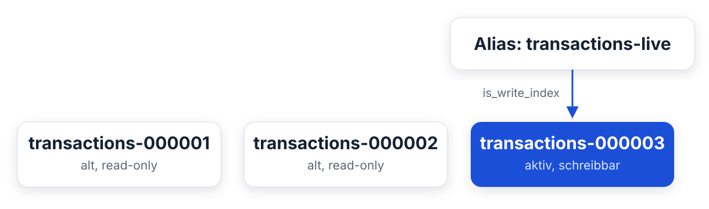
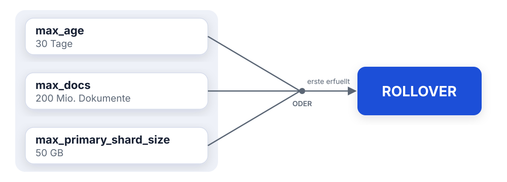
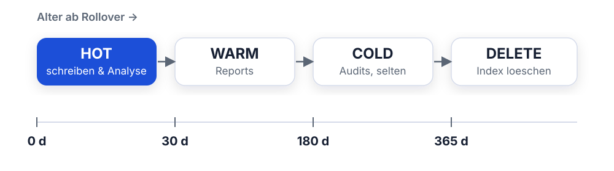
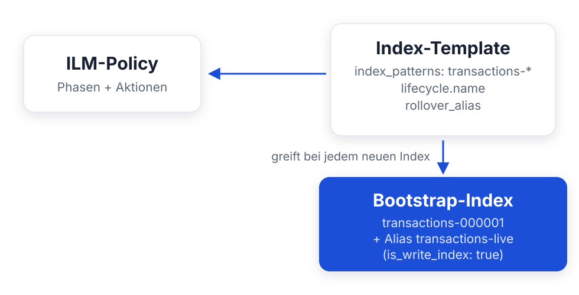
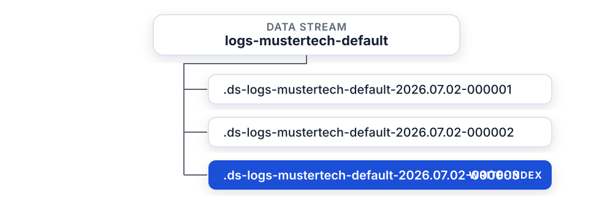

<style>
section blockquote { font-size: 0.8em; line-height: 1.3; margin-top: 0.25em; }
</style>

# Modul 09: Index Lifecycle Management

Indizes automatisiert verwalten - vom Anlegen bis zum Löschen

---

# Lernziele

Nach diesem Modul kannst du:

- Erklären, warum Zeitreihendaten automatisiertes Index-Management brauchen
- Das Rollover-Konzept beschreiben und anwenden
- Die ILM-Phasen hot, warm, cold, frozen und delete unterscheiden
- Eine ILM-Policy mit passenden Aktionen je Phase definieren
- Das Zusammenspiel aus Policy, Index-Template und Write-Alias aufbauen
- Data Streams als modernen Standard für Zeitreihendaten einsetzen
- ILM-Probleme mit `_ilm/explain` diagnostizieren

---

# Teil 1: Warum automatisiertes Index-Management?

Das Problem mit unbegrenzt wachsenden Daten

---

<style scoped>
section { font-size: 1.6em; }
</style>

# Ausgangslage bei Mustertech GmbH

Der Onlineshop von Mustertech schreibt jede Transaktion nach Elasticsearch:

- **Bestellungen** aus dem Webshop
- **Kassentransaktionen** aus den Filialen
- **Anwendungs-Logs** aller Services

**Das Muster ist immer gleich - Zeitreihendaten:**

- Neue Dokumente kommen laufend dazu
- Alte Dokumente werden praktisch nie geändert
- Aktuelle Daten werden häufig abgefragt, alte selten
- Rechtliche Vorgaben: Aufbewahrung z. B. 1 Jahr, danach Löschung

> Zeitreihendaten wachsen unbegrenzt. Ohne Management läuft der Cluster
> irgendwann voll.

---

<style scoped>
table { font-size: 0.8em; }
section { font-size: 1.6em; }
</style>

# Das Problem: ein einziger großer Index

Naiver Ansatz: alle Transaktionen landen für immer im Index `transactions`.

| Problem                       | Auswirkung                                         |
| ----------------------------- | -------------------------------------------------- |
| **Shard-Größe**               | Shards wachsen unbegrenzt, Recovery dauert Stunden |
| **Keine Skalierung**          | Shard-Anzahl ist nach Anlage fix                   |
| **Löschen teuer**             | Einzelne Dokumente löschen = teure Delete-by-Query |
| **Alles auf teurer Hardware** | Auch 3 Jahre alte Daten liegen auf SSDs            |
| **Mapping-Fehler dauerhaft**  | Mapping lässt sich nachträglich kaum ändern        |

**Faustregel:** Shards sollten zwischen **10 und 50 GB** groß sein.

> Ein Index, der ewig wächst, verletzt diese Regel zwangsläufig.

---

<style scoped>
section { font-size: 1.6em; }
</style>

# Erster Lösungsansatz: zeitbasierte Indizes

Statt einem Index pro Datentyp: **ein Index pro Zeitraum**.

```
transactions-2026.05
transactions-2026.06
transactions-2026.07   ← hier wird aktuell geschrieben
```

**Vorteile:**

- Alte Daten löschen = kompletten Index löschen (billig und sofort)
- Jeder Index bleibt überschaubar groß

**Aber:** Wer legt den neuen Index an, wer löscht die alten - und wer
verschiebt Daten auf günstigere Hardware?

> Von Hand ist das fehleranfällig. Diese Arbeit übernimmt ILM.

---

<style scoped>
section { font-size: 1.5em; }
</style>

# Das Rollover-Konzept

Die Anwendung schreibt nie direkt in einen Index, sondern in einen **Alias**.
Beim **Rollover** wird ein neuer Index erzeugt und der Alias umgehängt:



- Die Anwendung merkt vom Rollover **nichts**, sie schreibt weiter in den Alias
- Suchen über den Alias treffen **alle** Indizes
- Das Suffix `-000001` wird automatisch hochgezählt

> Rollover entkoppelt den logischen Namen von den physischen Indizes.

---

<style scoped>
table { font-size: 0.8em; }
section { font-size: 1.1em; }
</style>

# Wann passiert ein Rollover?

ILM prüft die Bedingungen laufend. Sobald **eine** greift, wird gerollt:

| Bedingung                | Beispiel    | Bedeutung                        |
| ------------------------ | ----------- | -------------------------------- |
| `max_age`                | `30d`       | Index ist 30 Tage alt            |
| `max_docs`               | `200000000` | Index enthält 200 Mio. Dokumente |
| `max_primary_shard_size` | `50gb`      | Ein Primary-Shard erreicht 50 GB |



**Praxis:** `max_age` **und** `max_primary_shard_size` kombinieren - so
entstehen weder uralte Mini-Indizes noch riesige Shards.

---

# Frage in die Runde

Denk an ein System aus deinem Alltag, das laufend wegschreibt - Logs,
Events, Bestellungen.

- Wie groß werden eure Indizes über die Zeit, und wer räumt sie auf?
- Läuft das Löschen alter Daten bei euch von Hand oder automatisch?

---

# Teil 2: Die ILM-Phasen

hot, warm, cold, frozen, delete - der Lebenszyklus eines Index

---

<style scoped>
section { font-size: 1.5em; }
</style>

# Der Lebenszyklus eines Index

ILM führt jeden Index durch bis zu fünf Phasen:


- Jede Phase hat ein `min_age`: Mindestalter, ab dem die Phase beginnt
- Das Alter zählt ab dem **Rollover** (nicht ab Index-Erstellung)
- Nur `hot` ist Pflicht - alle anderen Phasen sind optional

> Nicht jede Policy braucht alle Phasen. Oft reicht hot → warm → delete.

---

<style scoped>
table { font-size: 0.75em; }
section { font-size: 1.05em; }
</style>

# Die fünf Phasen im Überblick

| Phase      | Zugriffsmuster                     | Typische Hardware            |
| ---------- | ---------------------------------- | ---------------------------- |
| **hot**    | Aktives Schreiben, häufige Suchen  | Schnelle SSDs/NVMe, viel CPU |
| **warm**   | Kein Schreiben, regelmäßige Suchen | Günstigere SSDs, weniger CPU |
| **cold**   | Kein Schreiben, seltene Suchen     | Große, langsame Platten      |
| **frozen** | Archiv, sehr seltene Suchen        | Objektspeicher (S3) + Cache  |
| **delete** | -                                  | Index wird gelöscht          |

**Beispiel Mustertech - Transaktionsdaten:**



---

<style scoped>
section { font-size: 1.4em; }
</style>

# Hot-Phase: Aktionen

In der Hot-Phase wird aktiv geschrieben. Die wichtigsten Aktionen:

```json
"hot": {
  "min_age": "0ms",
  "actions": {
    "rollover": {
      "max_age": "30d",
      "max_primary_shard_size": "50gb"
    },
    "set_priority": { "priority": 100 }
  }
}
```

- **rollover** - erzeugt neuen Write-Index, sobald eine Bedingung erfüllt ist
- **set_priority** - hohe Priorität: Hot-Indizes werden nach einem
  Cluster-Neustart **zuerst** wiederhergestellt

> Die Rollover-Aktion gehört fast immer in die Hot-Phase: sie stößt den
> gesamten Lebenszyklus an.

---

<style scoped>
section { font-size: 1.3em; }
</style>

# Warm-Phase: Aktionen

Ab jetzt wird nicht mehr geschrieben. Der Index wird für **Lesezugriffe
optimiert**:

```json
"warm": {
  "min_age": "30d",
  "actions": {
    "shrink":     { "number_of_shards": 1 },
    "forcemerge": { "max_num_segments": 1 },
    "allocate":   { "require": { "temp": "warm" } },
    "set_priority": { "priority": 50 }
  }
}
```

| Aktion         | Effekt                                                    |
| -------------- | --------------------------------------------------------- |
| **shrink**     | Reduziert die Shard-Anzahl (z. B. 3 → 1)                  |
| **forcemerge** | Verschmilzt Segmente - weniger Overhead, schnellere Suche |
| **allocate**   | Verschiebt Shards auf bestimmte Nodes                     |

---

<style scoped>
section { font-size: 1.2em; }
</style>

# allocate und Node-Attribute

Woher weiß ILM, welche Nodes "warm" sind? Über **Node-Attribute** in der
Konfiguration jedes Nodes:

```yaml
# elasticsearch.yml auf es01
node.attr.temp: hot

# elasticsearch.yml auf es02 und es03
node.attr.temp: warm
```

Die `allocate`-Aktion verschiebt die Shards dann gezielt:

```json
"allocate": { "require": { "temp": "warm" } }
```

**In unserer Trainingsumgebung:** es01 ist `hot`, es02/es03 sind `warm`.
Die Shard-Wanderung kannst du live beobachten:

```
GET _cat/shards/transactions-*?v&h=index,shard,prirep,node
```

> Alternativ gibt es dedizierte Node-Rollen (`data_hot`, `data_warm`, ...),
> das Prinzip ist dasselbe.

---

<style scoped>
section { font-size: 1.5em; }
</style>

# Cold-Phase: Aktionen

Daten werden **selten** abgefragt, müssen aber verfügbar bleiben:

```json
"cold": {
  "min_age": "180d",
  "actions": {
    "set_priority": { "priority": 0 },
    "readonly": {}
  }
}
```

- **readonly** - der Index wird explizit schreibgeschützt
- **allocate** - optional auf noch günstigere Nodes verschieben
- **searchable_snapshot** - der Index wird durch einen durchsuchbaren
  Snapshot ersetzt (dazu gleich mehr)

> In der Cold-Phase zählt nur noch: möglichst wenig Ressourcen verbrauchen,
> aber durchsuchbar bleiben.

---

<style scoped>
section { font-size: 1.2em; }
</style>

# Frozen-Phase und Searchable Snapshots

Die Frozen-Phase treibt das Sparen auf die Spitze:

- Der Index liegt als **Snapshot im Objektspeicher** (z. B. S3)
- Lokal wird nur ein **kleiner Cache** vorgehalten
- Suchen sind möglich, aber deutlich langsamer

```json
"frozen": {
  "min_age": "270d",
  "actions": {
    "searchable_snapshot": { "snapshot_repository": "backup" }
  }
}
```

**Der Haken:** Searchable Snapshots benötigen eine **Enterprise-Lizenz**.
Dafür sind sie ideal für Compliance-Daten: jahrelang aufbewahren, fast nie
abfragen.

> Frozen macht Langzeitaufbewahrung bezahlbar: Objektspeicher statt lokaler
> Platten.

---

<style scoped>
section { font-size: 1.5em; }
</style>

# Delete-Phase

Am Ende des Lebenszyklus wird der Index **komplett gelöscht**:

```json
"delete": {
  "min_age": "365d",
  "actions": {
    "delete": {}
  }
}
```

- Löschen eines ganzen Index ist **billig**, kein Delete-by-Query nötig
- `min_age` zählt ab dem Rollover: 365 Tage nach Rollover ist der
  **jüngste** Datensatz im Index mindestens 365 Tage alt
- Optional: `"wait_for_snapshot": "<slm-policy>"` - löscht erst, wenn ein
  Snapshot existiert

> Automatisches Löschen ist auch Datenschutz: Aufbewahrungsfristen werden
> zuverlässig eingehalten.

---

<style scoped>
table { font-size: 0.7em; }
section { font-size: 1.2em; }
</style>

# Aktionen je Phase - Übersicht

| Aktion                | hot | warm | cold | frozen | delete |
| --------------------- | :-: | :--: | :--: | :----: | :----: |
| `rollover`            | x   |      |      |        |        |
| `set_priority`        | x   | x    | x    |        |        |
| `shrink`              | x   | x    |      |        |        |
| `forcemerge`          | x   | x    |      |        |        |
| `allocate`            |     | x    | x    |        |        |
| `readonly`            | x   | x    | x    |        |        |
| `searchable_snapshot` | x   |      | x    | x      |        |
| `delete`              |     |      |      |        | x      |

**Merkhilfe:**

- **hot** = rollover
- **warm** = optimieren (shrink, forcemerge) und umziehen (allocate)
- **cold/frozen** = einfrieren und auslagern
- **delete** = aufräumen

---

# Frage in die Runde

Wir haben hot, warm, cold, frozen gesehen - jede Phase auf anderer Hardware.

- Habt ihr im Cluster unterschiedlich schnelle Nodes: SSD, HDD, Objektspeicher?
- Welche eurer Daten würdet ihr nach ein paar Wochen guten Gewissens auf
  langsame Platten schieben?

---

# Teil 3: Policy, Template und Alias

Das Zusammenspiel der drei Bausteine

---

<style scoped>
section { font-size: 1.5em; }
</style>

# Die drei Bausteine

Damit ILM funktioniert, müssen drei Dinge zusammenspielen:



1. **Policy** - definiert Phasen und Aktionen
2. **Template** - verknüpft neue Indizes automatisch mit Policy und Alias
3. **Bootstrap-Index** - der erste Index mit dem Write-Alias, manuell angelegt

---

<style scoped>
code { font-size: 0.75em; }
section { font-size: 1.3em; }
</style>

# Schritt 1: Die ILM-Policy

Beispiel Mustertech - Transaktionsdaten mit 1 Jahr Aufbewahrung:

```json
PUT _ilm/policy/transactions-lifecycle
{
  "policy": {
    "phases": {
      "hot": {
        "min_age": "0ms",
        "actions": {
          "rollover": { "max_age": "30d",
                        "max_primary_shard_size": "50gb" },
          "set_priority": { "priority": 100 }
        }
      },
      "warm": {
        "min_age": "30d",
        "actions": {
          "shrink":       { "number_of_shards": 1 },
          "forcemerge":   { "max_num_segments": 1 },
          "set_priority": { "priority": 50 }
        }
      },
```

---

<style scoped>
code { font-size: 0.85em; }
section { font-size: 1.4em; }
</style>

# Schritt 1: Die ILM-Policy (Fortsetzung)

```json
      "cold": {
        "min_age": "180d",
        "actions": {
          "set_priority": { "priority": 0 },
          "readonly": {}
        }
      },
      "delete": {
        "min_age": "365d",
        "actions": { "delete": {} }
      }
    }
  }
}
```

**Ergebnis:** hot 0 - 30 Tage → warm 30 - 180 Tage → cold 180 - 365 Tage →
Löschung nach 365 Tagen.

```
GET _ilm/policy/transactions-lifecycle
```

---

<style scoped>
code { font-size: 0.85em; }
section { font-size: 1.1em; }
</style>

# Schritt 2: Das Index-Template

Das Template sorgt dafür, dass **jeder neue Index** im Muster
`transactions-*` automatisch richtig konfiguriert wird:

```json
PUT _index_template/transactions-template
{
  "index_patterns": ["transactions-*"],
  "template": {
    "settings": {
      "number_of_shards": 1,
      "number_of_replicas": 1,
      "index.lifecycle.name": "transactions-lifecycle",
      "index.lifecycle.rollover_alias": "transactions-live"
    },
    "mappings": {
      "properties": {
        "created":        { "type": "date" },
        "status":         { "type": "keyword" },
        "payment_method": { "type": "keyword" },
        "basket_info":    { "properties": {
          "sum":      { "type": "integer" },
          "currency": { "type": "keyword" } } }
      }
    }
  }
}
```

---

<style scoped>
section { font-size: 1.3em; }
</style>

# Schritt 3: Bootstrap-Index mit Write-Alias

Den **ersten** Index legst du einmalig von Hand an - inklusive Alias:

```json
PUT transactions-000001
{
  "aliases": {
    "transactions-live": {
      "is_write_index": true
    }
  }
}
```

**Warum ist das nötig?**

- Das Template greift zwar (Muster `transactions-*` passt), aber
  den **Alias mit `is_write_index`** kann nur der Bootstrap-Index setzen
- Ab dem ersten Rollover übernimmt ILM: `transactions-000002`,
  `-000003`, ... entstehen automatisch

> Das Suffix `-000001` ist Pflicht: daraus berechnet ILM den Namen des
> nächsten Index.

---

<style scoped>
section { font-size: 1.2em; }
</style>

# Schreiben und Lesen: immer über den Alias

Ab jetzt gilt die eiserne Regel: **nie direkt gegen einen Index-Namen
arbeiten.**

```json
POST transactions-live/_doc
{
  "created": "2026-07-02T09:30:00Z",
  "status": "ok",
  "payment_method": "creditcard",
  "basket_info": { "sum": 11999, "currency": "EUR" }
}
```

```json
GET transactions-live/_search
{
  "query": { "term": { "status": "ok" } }
}
```

- **Schreiben** geht in den Index mit `is_write_index: true`
- **Suchen** treffen alle Indizes hinter dem Alias

> Würde die Anwendung `transactions-000001` direkt verwenden, würde sie nach
> dem ersten Rollover in den falschen Index schreiben.

---

<style scoped>
section { font-size: 1.1em; }
</style>

# Rollover in Aktion

Im Normalbetrieb rollt ILM automatisch. Zum Testen geht es auch manuell:

```
POST transactions-live/_rollover
```

**Vorher:**

```
transactions-000001  ← is_write_index: true
```

**Nachher:**

```
transactions-000001  ← Alias zeigt weiter drauf (nur lesen)
transactions-000002  ← is_write_index: true (neu)
```

**Prüfen:**

```
GET _cat/indices/transactions-*?v&h=index,docs.count,store.size
GET transactions-live/_alias
```

> Neue Dokumente landen automatisch in `-000002`. Die Anwendung hat nichts
> davon mitbekommen.

---

# Frage in die Runde

Gleich geht es um Data Streams - den Weg, den Beats und Logstash automatisch
gehen.

- Wer von euch schickt Logs oder Metriken nach Elasticsearch?
- Legt ihr die Indizes dafür selbst an, oder macht das schon die Pipeline?

---

# Teil 4: Data Streams und Fehlerdiagnose

Weniger Handarbeit für Zeitreihen - und was zu tun ist, wenn ILM hakt

---

<style scoped>
section { font-size: 1.15em; }
</style>

# Data Streams: der moderne Standard

Alias + Bootstrap-Index funktioniert, bedeutet aber Handarbeit:
Bootstrap-Index anlegen, Alias pflegen, Suffix-Konvention einhalten.

**Data Streams** kapseln das komplett:



- **Kein Bootstrap-Index** und **kein Alias** nötig: der erste Schreibzugriff
  erzeugt den Data Stream samt Backing-Index
- Rollover, Naming und Write-Index-Verwaltung übernimmt Elasticsearch
- Beats, Elastic Agent und Logstash schreiben standardmäßig in Data Streams

> Für neue Zeitreihen-Anwendungsfälle sind Data Streams die erste Wahl.

---

<style scoped>
table { font-size: 0.75em; }
section { font-size: 1.5em; }
</style>

# Data Stream vs. Alias + Rollover

| Aspekt           | Alias + Rollover                  | Data Stream                                               |
| ---------------- | --------------------------------- | --------------------------------------------------------- |
| Setup            | Policy + Template + Bootstrap     | Policy + Template - fertig                                |
| Zeitstempel-Feld | beliebig                          | `@timestamp` ist **Pflicht**                              |
| Updates/Deletes  | direkt möglich                    | nur per `_update_by_query` bzw. gezielt auf Backing-Index |
| Schreiben        | in den Alias                      | in den Data-Stream-Namen                                  |
| Backing-Indizes  | `name-000001`, ...                | `.ds-<name>-<datum>-000001`                               |
| Einsatzgebiet    | auch Nicht-Zeitreihen, Altsysteme | Logs, Metriken, Events                                    |

**Naming-Konvention** (von Elastic vorgegeben und von Templates erwartet):

```
<typ>-<dataset>-<namespace>
logs-mustertech.shop-production
metrics-mustertech.checkout-default
```

> Wenn deine Daten append-only sind und einen Zeitstempel haben: Data Stream.

---

<style scoped>
code { font-size: 0.75em; }
section { font-size: 1.0em; }
</style>

# Data Stream anlegen

Ein Template mit `data_stream: {}` genügt:

```json
PUT _index_template/logs-mustertech-template
{
  "index_patterns": ["logs-mustertech-*"],
  "data_stream": {},
  "priority": 500,
  "template": {
    "settings": { "index.lifecycle.name": "transactions-lifecycle" },
    "mappings": {
      "properties": {
        "@timestamp": { "type": "date" },
        "message":    { "type": "text" }
      }
    }
  }
}
```

Der erste indexierte Eintrag erzeugt den Data Stream automatisch:

```json
POST logs-mustertech-default/_doc
{ "@timestamp": "2026-07-02T10:15:00Z", "message": "Checkout ok" }
```

```
GET _data_stream/logs-mustertech-default
```

---

<style scoped>
code { font-size: 0.7em; }
section { font-size: 1.0em; }
</style>

# Fehlerdiagnose: _ilm/explain

Die zentrale Diagnose-API, wenn ILM nicht tut, was du erwartest:

```
GET transactions-000001/_ilm/explain
```

```json
{
  "indices": {
    "transactions-000001": {
      "managed": true,
      "policy": "transactions-lifecycle",
      "phase": "hot",
      "action": "rollover",
      "step": "check-rollover-ready",
      "age": "12.5d",
      "phase_time_millis": 1751445600000
    }
  }
}
```

| Feld     | Bedeutung                                       |
| -------- | ----------------------------------------------- |
| `phase`  | Aktuelle Phase (hot/warm/cold/frozen/delete)    |
| `action` | Aktuell laufende Aktion                         |
| `step`   | Konkreter Arbeitsschritt - bei Fehlern: `ERROR` |

---

<style scoped>
section { font-size: 1.1em; }
</style>

# Typische ILM-Fehler

**`step` steht auf `ERROR`:**

- `_ilm/explain` zeigt `step_info` mit der Fehlermeldung
- Häufig: `rollover_alias` fehlt am Index oder zeigt auf den falschen Index
- Nach Behebung: Schritt erneut ausführen mit

```
POST transactions-000001/_ilm/retry
```

**"Es passiert einfach nichts":**

- ILM prüft die Bedingungen nur alle **10 Minuten**
  (`indices.lifecycle.poll_interval`, Default `10m`)
- Geduld - oder im Training das Intervall verkürzen:

```json
PUT _cluster/settings
{
  "persistent": { "indices.lifecycle.poll_interval": "10s" }
}
```

> `poll_interval` verkürzen ist ein Trainings-Trick. In Produktion bleibt der
> Default: 10 Minuten Verzögerung spielen bei Tagen/Monaten keine Rolle.

---

<style scoped>
section { font-size: 1.6em; }
</style>

# ILM in Kibana

Alles aus diesem Modul geht auch über die Oberfläche:

**Stack Management > Index Lifecycle Policies**

- Policies anlegen und bearbeiten - mit grafischem Phasen-Editor
- Zeigt an, wie viele Indizes eine Policy verwenden

**Stack Management > Index Management**

- Tab **Indices**: ILM-Status jedes Index (Phase, Aktion, Fehler)
- Tab **Data Streams**: Backing-Indizes einsehen
- Tab **Index Templates**: Templates verwalten

> Die UI ruft intern dieselben APIs auf. Für Automatisierung und Versionierung
> nimm trotzdem die APIs.

---

<style scoped>
section { font-size: 1.3em; }
</style>

# Zusammenfassung

- **Zeitreihendaten** wachsen unbegrenzt - ein einzelner Index skaliert nicht
  und lässt sich nicht sinnvoll aufräumen
- **Rollover** teilt den Datenstrom in handliche Indizes; die Anwendung
  schreibt immer in einen **Alias** mit `is_write_index`
- **ILM-Phasen**: hot (schreiben), warm (optimieren, umziehen),
  cold/frozen (auslagern), delete (löschen) - gesteuert über `min_age`
  ab Rollover
- Das Setup besteht aus **drei Bausteinen**: ILM-Policy, Index-Template
  (mit `lifecycle.name` + `rollover_alias`) und Bootstrap-Index `-000001`
- **Data Streams** sind der moderne Standard für Logs, Metriken und Events:
  kein Bootstrap, `@timestamp` Pflicht, Naming `logs-<dataset>-<namespace>`
- **Diagnose**: `GET <index>/_ilm/explain` zeigt Phase, Schritt und Fehler;
  `_ilm/retry` startet fehlgeschlagene Schritte neu;
  `indices.lifecycle.poll_interval` bestimmt den Prüf-Takt

**Nächstes Modul:** Betrieb, Backup & Updates - Mustertech geht in Produktion.
