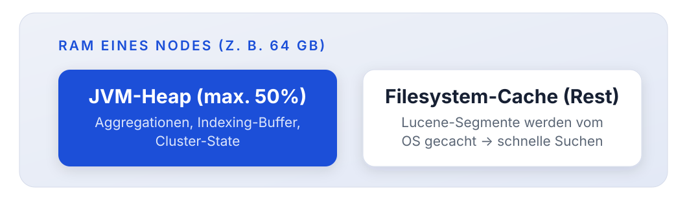
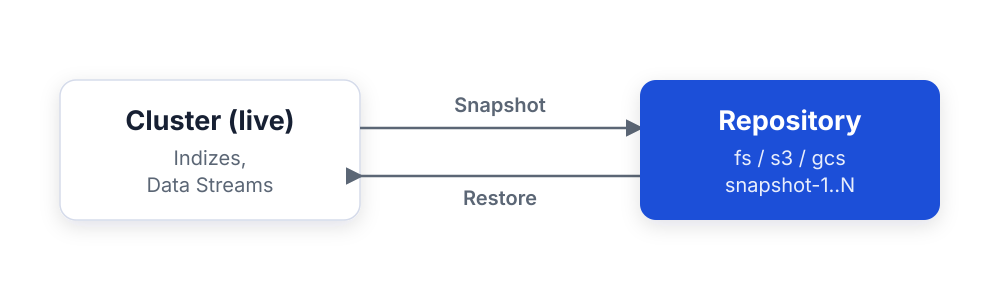
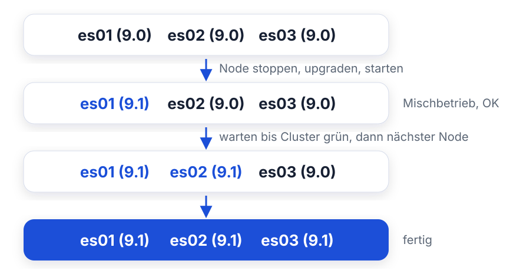
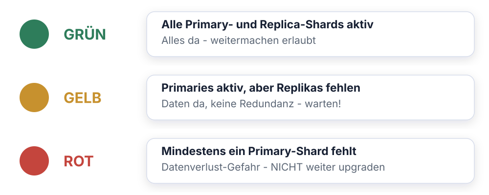

<style>
section blockquote { font-size: 0.8em; line-height: 1.3; margin-top: 0.25em; }
</style>

# Modul 10: Betrieb, Backup & Updates

Elasticsearch produktionsreif betreiben: Sizing, Konfiguration, Snapshots
und Rolling Upgrades

---

<style scoped>
section { font-size: 1.2em; }
</style>

# Lernziele

Nach diesem Modul kannst du:

- Cluster-Größe und Hardware für eine Live-Umgebung abschätzen
- Deployment-Optionen (Bare Metal, Docker, Kubernetes, Elastic Cloud)
  gegeneinander abwägen
- Die wichtigsten Produktiv-Einstellungen in `elasticsearch.yml`,
  JVM und Betriebssystem benennen
- Snapshot-Repositories anlegen und Snapshots erstellen
- Indizes gezielt wiederherstellen - auch unter neuem Namen
- Backups mit SLM-Policies automatisieren
- Ein Rolling Upgrade Schritt für Schritt durchführen

---

# Teil 1: Aufbau einer Live-Umgebung

Mustertech geht in Produktion

---

<style scoped>
section { font-size: 1.6em; }
</style>

# Von der Trainingsumgebung zur Produktion

Unser 3-Node-Docker-Cluster ist perfekt zum Lernen. Für den Livegang von
Mustertech stellen sich neue Fragen:

- **Sizing:** Wie viel RAM, Disk und CPU brauchen die Nodes?
- **Deployment:** Bare Metal, Docker, Kubernetes oder Cloud?
- **Konfiguration:** Welche Einstellungen sind in Produktion Pflicht?
- **Backup:** Wie sichern wir die Daten - und wie kommen sie zurück?
- **Updates:** Wie aktualisieren wir den Cluster ohne Downtime?

> Betrieb plant man nicht hinterher: Diese Fragen gehören auf den Tisch,
> bevor der erste Produktivindex entsteht.

---

<style scoped>
section { font-size: 1.2em; }
</style>

# Sizing: Arbeitsspeicher und die 50%-Regel

Die wichtigste Ressource für Elasticsearch ist **RAM**:



**Die Regeln:**

- Maximal **50% des RAM** für den JVM-Heap, der Rest gehört dem
  Filesystem-Cache
- Heap nie über **~30 GB** (Grenze der Compressed Object Pointers:
  darüber werden Zeiger doppelt so groß, effektiv verlierst du Speicher)
- Seit ES 8/9 setzt Elasticsearch den Heap **automatisch** nach diesen
  Regeln, manuell nur noch in Sonderfällen

> Mehr als 64 GB RAM pro Node bringen für den Heap nichts mehr - lieber
> mehr Nodes.

---

<style scoped>
table { font-size: 0.72em; }
section { font-size: 1.25em; }
</style>

# Sizing: Disk und CPU

**Anhaltspunkte** (kein Ersatz für Lasttests!):

| Ressource | Hot-Nodes                     | Warm-/Cold-Nodes            |
| --------- | ----------------------------- | --------------------------- |
| Disk      | SSD/NVMe, lokal               | Größere, günstigere Platten |
| RAM:Disk  | ca. 1:30                      | ca. 1:100 und mehr          |
| CPU       | Viele Kerne (Indexing kostet) | Weniger Kerne ausreichend   |

**Weitere Faustregeln:**

- Shards zwischen **10 und 50 GB** halten (siehe Modul 09)
- Disk-Bedarf ≈ Rohdaten × 1,1 bis 1,3 (Mapping-abhängig!) × Replika-Faktor
  - Reserve einplanen: ab **85% Füllstand** verteilt Elasticsearch keine
  neuen Shards mehr auf den Node (Disk Watermark)
- Ab ca. 5 - 10 Nodes: **dedizierte Master-Nodes** (3 Stück, klein
  dimensioniert) für stabile Cluster-Koordination

> Miss mit realen Daten: Ein Testindex mit echtem Mapping verrät dir das
> tatsächliche Verhältnis von Rohdaten zu Indexgröße.

---

<style scoped>
table { font-size: 0.62em; }
section { font-size: 1.4em; }
</style>

# Deployment-Optionen im Vergleich

| Kriterium           | Bare Metal / VMs      | Docker Compose           | Kubernetes (ECK)          | Elastic Cloud         |
| ------------------- | --------------------- | ------------------------ | ------------------------- | --------------------- |
| **Kontrolle**       | Maximal               | Hoch                     | Hoch                      | Eingeschränkt         |
| **Betriebsaufwand** | Hoch                  | Mittel                   | Mittel (K8s-Know-how!)    | Minimal               |
| **Performance**     | Maximal (lokale NVMe) | Gut                      | Gut (Storage-abhängig)    | Gut                   |
| **Skalierung**      | Manuell               | Manuell                  | Deklarativ, automatisiert | Klicks / API          |
| **Upgrades**        | Manuell (Rolling)     | Manuell                  | Operator-gesteuert        | Vollautomatisch       |
| **Kosten**          | Hardware + Personal   | Infrastruktur + Personal | Infrastruktur + Personal  | Subskription          |
| **Typisch für**     | Große On-Prem-Cluster | Kleine Setups, Tests     | Container-Strategie       | Schneller Start, SaaS |

**ECK** = Elastic Cloud on Kubernetes, der offizielle Operator: verwaltet
Zertifikate, Konfiguration, Rolling Upgrades als Kubernetes-Ressourcen.

> Welche Variante passt, hängt am vorhandenen Know-how, den
> Compliance-Anforderungen und am Budget - eine Patentantwort gibt es nicht.

---

<style scoped>
section { font-size: 1.4em; }
</style>

# Deployment: Empfehlung für Mustertech

**Szenario:** mittelgroßer Cluster, eigenes Ops-Team, Daten müssen in der EU
bleiben, Kubernetes bereits im Einsatz.

**Entscheidung: Kubernetes mit ECK-Operator**

- Vorhandene K8s-Kompetenz wird genutzt
- Deklarative Cluster-Definition, versionierbar in Git
- Operator übernimmt Zertifikate, Secrets und Rolling Upgrades

**Anders sähe die Entscheidung aus, wenn ...**

- ... kein Ops-Team vorhanden → **Elastic Cloud**
- ... maximale Suchlatenz-Anforderungen → **Bare Metal mit NVMe**
- ... nur ein kleines internes Logging → **Docker Compose** reicht

> Die Konzepte der nächsten Abschnitte (Konfiguration, Snapshots, Upgrades)
> gelten für alle Varianten, nur die Werkzeuge unterscheiden sich.

---

# Frage in die Runde: Wo läuft eure Suche?

- Wer betreibt Elasticsearch heute Bare Metal, wer in Docker, wer in
  Kubernetes, wer in der Cloud?
- Was hat damals den Ausschlag gegeben - und würdet ihr es heute nochmal
  genauso machen?

---

# Teil 2: Produktiv-Konfiguration

Was vor dem Livegang eingestellt sein muss

---

<style scoped>
code { font-size: 0.76em; }
section { font-size: 1.2em; }
</style>

# elasticsearch.yml - die Essentials

```yaml
# Identität
cluster.name: mustertech-prod        # nie den Default lassen!
node.name: es-prod-01
node.roles: [ master, data, ingest ]
node.attr.temp: hot                  # für ILM-allocate

# Netzwerk
network.host: 0.0.0.0                # erreichbar machen
http.port: 9200

# Discovery (Cluster-Bildung)
discovery.seed_hosts: ["es-prod-01", "es-prod-02", "es-prod-03"]
cluster.initial_master_nodes: ["es-prod-01", "es-prod-02", "es-prod-03"]

# Pfade - Daten getrennt vom OS
path.data: /var/lib/elasticsearch
path.logs: /var/log/elasticsearch
path.repo: /mnt/backups             # für fs-Snapshot-Repositories
```

- `cluster.initial_master_nodes` nur beim **allerersten Start** - danach
  entfernen!
- Security (TLS, Auth) ist seit ES 8 **standardmäßig aktiv**; in
  Produktion niemals abschalten

---

<style scoped>
section { font-size: 1.1em; }
</style>

# JVM-Konfiguration

Eigene Einstellungen gehören nach `config/jvm.options.d/`, nicht in die
mitgelieferte `jvm.options`:

```
# config/jvm.options.d/heap.options
-Xms16g
-Xmx16g
```

**Regeln:**

- `Xms` = `Xmx`: Heap fest reservieren, kein Nachwachsen zur Laufzeit
- Maximal 50% des RAM, maximal ~30 GB (siehe Teil 1)
- **Ohne eigene Datei gilt:** Elasticsearch berechnet den Heap automatisch
  aus dem verfügbaren RAM, für die meisten Setups die beste Wahl

**Kontrolle:**

```
GET _nodes/stats/jvm?filter_path=nodes.*.jvm.mem.heap_max_in_bytes
```

> Finger weg von exotischen GC-Tuning-Flags - die Defaults sind von Elastic
> für den Suchworkload optimiert.

---

<style scoped>
section { font-size: 0.9em; }
</style>

# Betriebssystem-Einstellungen

Drei Einstellungen, ohne die kein Produktivbetrieb möglich ist:

**1. Virtual Memory - `vm.max_map_count`**

```bash
# /etc/sysctl.conf
vm.max_map_count = 262144
```

Lucene nutzt Memory-Mapped Files; der Linux-Default (65530) ist zu niedrig.

**2. Swapping deaktivieren**

```yaml
# elasticsearch.yml
bootstrap.memory_lock: true
```

Ein swappender Heap macht den Node quälend langsam. Besser: Swap ganz aus
(`swapoff -a`) oder `memory_lock`.

**3. File Descriptors**

```
# limits.conf: mindestens
elasticsearch  -  nofile  65535
```

> Die offiziellen Pakete (DEB/RPM, Docker-Image) setzen 2. und 3. bereits;
> `vm.max_map_count` musst du auf dem Host immer selbst setzen.

---

<style scoped>
section { font-size: 1.3em; }
</style>

# Bootstrap Checks

Elasticsearch prüft beim Start eine Reihe von Bedingungen, die
**Bootstrap Checks**:

- **Entwicklungsmodus** (nur an localhost gebunden):
  Verstöße sind nur **Warnungen** im Log
- **Produktionsmodus** (`network.host` auf externe Adresse):
  Verstöße **verhindern den Start**

**Typische Checks:**

- Heap: `Xms` == `Xmx`?
- `vm.max_map_count` hoch genug?
- File-Descriptor-Limit ausreichend?
- Memory Lock erfolgreich (falls konfiguriert)?
- Kein Swap-begünstigendes Setup?

> Klingt nervig, ist aber Absicht: Elasticsearch verweigert lieber den
> Start, als mit einer Konfiguration zu laufen, die unter Last umfällt.

---

<style scoped>
table { font-size: 0.68em; }
section { font-size: 1.1em; }
</style>

# Wichtige Cluster-Settings

Dynamische Einstellungen zur Laufzeit, per API und ohne Neustart:

```json
PUT _cluster/settings
{
  "persistent": {
    "cluster.routing.allocation.disk.watermark.low": "85%"
  }
}
```

| Setting                            | Default | Bedeutung                             |
| ---------------------------------- | ------- | ------------------------------------- |
| `...disk.watermark.low`            | 85%     | Keine neuen Shards auf den Node       |
| `...disk.watermark.high`           | 90%     | Shards werden aktiv wegverschoben     |
| `...disk.watermark.flood_stage`    | 95%     | Indizes werden **read-only** gesetzt  |
| `cluster.max_shards_per_node`      | 1000    | Obergrenze Shards pro Data-Node       |
| `action.destructive_requires_name` | true    | Kein `DELETE *` ohne expliziten Namen |

- **persistent** - überlebt Cluster-Neustarts
- **transient** - gilt bis zum Neustart (in Produktion meist vermeiden)

> Wenn Indizes plötzlich read-only sind: fast immer die Flood-Stage-Watermark.
> Platz schaffen, dann setzt ES 9 den Schreibschutz automatisch zurück.

---

# Frage in die Runde: Wann habt ihr zuletzt restored?

- Wer musste schon mal ein echtes Restore fahren - geplant oder im Notfall?
- Weißt du gerade aus dem Kopf, wie alt euer letztes Backup ist und ob es
  sich zurückspielen ließe?

---

# Teil 3: Backup & Restore

Snapshots - die Lebensversicherung des Clusters

---

<style scoped>
section { font-size: 1.5em; }
</style>

# Replikas sind kein Backup!

Ein verbreiteter Irrtum: "Wir haben Replikas, uns kann nichts passieren."

**Replikas schützen vor:** Ausfall einzelner Nodes.

**Replikas schützen NICHT vor:**

- `DELETE transactions-*` - versehentlich oder böswillig
- Fehlerhaften Bulk-Updates, die Daten überschreiben
- Mapping-Unfällen, Bugs in der eigenen Anwendung
- Ausfall des gesamten Clusters oder Rechenzentrums
- Ransomware

**Die einzige echte Absicherung:** **Snapshots** in ein externes Repository.

> Ein Backup, das im selben Cluster liegt, ist kein Backup. Ein Backup, das
> nie ein Restore-Test gesehen hat, auch nicht.

---

# Snapshot und Restore: der Weg der Daten



- **Snapshot:** Cluster schreibt in das externe Repository - inkrementell
- **Repository:** liegt außerhalb des Clusters, überlebt dessen Totalausfall
- **Restore:** holt einen Stand zurück, gezielt einzelne Indizes

---

<style scoped>
table { font-size: 0.68em; }
section { font-size: 1.05em; }
</style>

# Snapshot-Repositories

Snapshots landen in einem **Repository**, dem Speicherort außerhalb des
Clusters:

| Typ     | Speicherort                    | Typischer Einsatz                |
| ------- | ------------------------------ | -------------------------------- |
| `fs`    | Shared Filesystem (NFS, ...)   | On-Prem, kleine Setups           |
| `s3`    | AWS S3 / S3-kompatibel (MinIO) | Cloud und On-Prem-Objektspeicher |
| `gcs`   | Google Cloud Storage           | GCP-Umgebungen                   |
| `azure` | Azure Blob Storage             | Azure-Umgebungen                 |
| `url`   | HTTP(S), nur lesend            | Read-only-Archive verteilen      |

**Wichtig beim `fs`-Typ:**

- Der Pfad muss auf **allen Nodes** unter demselben Mountpoint erreichbar
  sein (Shared Storage!)
- Der Pfad muss in `elasticsearch.yml` freigegeben sein:

```yaml
path.repo: /usr/share/elasticsearch/snapshots
```

> S3, GCS und Azure sind in ES 9 eingebaut, keine Plugin-Installation mehr
> nötig. Credentials gehören in den **Elasticsearch Keystore**.

---

<style scoped>
section { font-size: 0.75em; }
</style>

# Repository anlegen

In unserer Trainingsumgebung teilen sich alle drei Nodes ein
Snapshot-Volume; `path.repo` ist bereits gesetzt:

```json
PUT _snapshot/backup
{
  "type": "fs",
  "settings": {
    "location": "/usr/share/elasticsearch/snapshots"
  }
}
```

**Repository testen - immer machen:**

```
POST _snapshot/backup/_verify
```

Prüft, dass **jeder Node** in das Repository schreiben kann.

**S3-Variante** (Demo mit MinIO, Compose-Profil `s3`):

```json
PUT _snapshot/backup-s3
{
  "type": "s3",
  "settings": { "bucket": "es-snapshots",
                "endpoint": "http://minio:9000" }
}
```

> MinIO steckt im Repo unter `environment/day3`: starten mit
> `docker compose --profile s3 up -d --wait` (Service `minio`, Konsole auf Port 9001).

---

<style scoped>
section { font-size: 1.2em; }
</style>

# Snapshot erstellen

```json
PUT _snapshot/backup/snapshot-2026-07-02?wait_for_completion=true
{
  "indices": "transactions-*,logs-*",
  "include_global_state": false
}
```

- `indices` - welche Indizes/Data Streams (Default: alle)
- `include_global_state` - Cluster-Settings, Templates, ILM-Policies
  mitsichern (für Voll-Backups: `true`)
- `wait_for_completion=true` - Antwort erst nach Abschluss (sonst läuft der
  Snapshot im Hintergrund)

**Snapshots sind inkrementell:**

- Nur **neue oder geänderte Segmente** werden kopiert
- Der zweite Snapshot desselben Index ist darum schnell und klein
- Jeder Snapshot bleibt trotzdem **eigenständig wiederherstellbar**

> Snapshots entstehen im laufenden Betrieb; die Indexierung läuft weiter.

---

<style scoped>
section { font-size: 1.4em; }
</style>

# Snapshots prüfen

**Alle Snapshots eines Repositories:**

```
GET _snapshot/backup/_all
GET _cat/snapshots/backup?v
```

**Einzelnen Snapshot im Detail:**

```
GET _snapshot/backup/snapshot-2026-07-02
```

Wichtige Felder in der Antwort:

- `state` - `SUCCESS`, `IN_PROGRESS`, `PARTIAL` oder `FAILED`
- `indices` - was tatsächlich enthalten ist
- `failures` - Shards, die nicht gesichert werden konnten

> `PARTIAL` heißt: mindestens ein Shard fehlt im Snapshot. Ursache prüfen -
> ein partielles Backup ist im Ernstfall ein böses Erwachen.

---

<style scoped>
section { font-size: 1.2em; }
</style>

# Restore: Wiederherstellen

**Ganzen Snapshot oder einzelne Indizes zurückholen:**

```json
POST _snapshot/backup/snapshot-2026-07-02/_restore
{
  "indices": "transactions-000001"
}
```

**Wichtigste Regel:** Ein Index kann nur wiederhergestellt werden, wenn er
im Cluster **nicht existiert** (oder geschlossen ist).

Typischer Ablauf nach einem versehentlichen `DELETE`:

1. Prüfen, welcher Snapshot den Index enthält:
   `GET _snapshot/backup/_all`
2. Restore auslösen (siehe oben)
3. Fortschritt beobachten: `GET _cat/recovery/transactions-000001?v`
4. Prüfen: `GET transactions-000001/_count`

> Der Restore läuft wie eine normale Shard-Recovery, der Cluster bleibt
> dabei voll benutzbar.

---

<style scoped>
section { font-size: 1.4em; }
</style>

# Restore unter neuem Namen: rename_pattern

Häufiges Szenario: Der Live-Index läuft weiter, du willst den alten Stand
**daneben** wiederherstellen, z. B. um einzelne Dokumente zu vergleichen:

```json
POST _snapshot/backup/snapshot-2026-07-02/_restore
{
  "indices": "transactions-000001",
  "rename_pattern": "(.+)",
  "rename_replacement": "restored-$1"
}
```

**Ergebnis:** Der Snapshot-Stand liegt als `restored-transactions-000001`
im Cluster; der Original-Index bleibt unberührt.

- `rename_pattern` - regulärer Ausdruck auf den Index-Namen
- `rename_replacement` - Zielname, `$1` = erste Capture-Group

> So testest du auch regelmäßig deine Backups, ohne Produktionsdaten zu
> gefährden. Restore-Tests gehören in jeden Backup-Plan.

---

<style scoped>
code { font-size: 0.8em; }
section { font-size: 1.25em; }
</style>

# SLM: Snapshot Lifecycle Management

Backups von Hand macht niemand zuverlässig - **SLM** automatisiert sie:

```json
PUT _slm/policy/nightly-backup
{
  "schedule": "0 30 1 * * ?",
  "name": "<nightly-{now/d}>",
  "repository": "backup",
  "config": {
    "indices": "*",
    "include_global_state": true
  },
  "retention": {
    "expire_after": "30d",
    "min_count": 5,
    "max_count": 50
  }
}
```

- `schedule` - Cron-Ausdruck **mit Sekundenfeld**: hier täglich 01:30 Uhr
- `name` - Namensmuster mit Datums-Math: `nightly-2026.07.02`
- `retention` - alte Snapshots automatisch aufräumen

---

<style scoped>
section { font-size: 1.6em; }
</style>

# SLM: Ausführen und Überwachen

**Policy sofort testen (nicht auf 01:30 Uhr warten):**

```
POST _slm/policy/nightly-backup/_execute
```

**Status und Historie:**

```
GET _slm/policy/nightly-backup
GET _slm/stats
```

Wichtige Felder: `last_success`, `last_failure`, `next_execution`.

**In Kibana:** Stack Management > Snapshot and Restore - Repositories,
Snapshots, SLM-Policies und Restore per UI.

> Überwache `last_failure` aktiv (Alerting!). Ein seit Wochen
> fehlschlagendes Backup fällt sonst erst auf, wenn es zu spät ist.

---

# Frage in die Runde: Euer letztes Upgrade

- Wie zieht ihr heute Versionen hoch - Rolling, Wartungsfenster mit
  Downtime, oder übernimmt das ein Operator bzw. die Cloud?
- Was ist beim letzten Sprung schiefgegangen, und was macht ihr seitdem
  anders?

---

# Teil 4: Updates

Den Cluster aktualisieren - ohne Downtime

---

<style scoped>
section { font-size: 1.22em; }
</style>

# Versionskompatibilität

Elasticsearch-Versionen: `MAJOR.MINOR.PATCH` (z. B. `9.1.3`).

**Kompatibilitätsregeln:**

- **Rolling Upgrade** (ohne Downtime) möglich:
  - zwischen Minor-Versionen derselben Major (`9.0` → `9.1`)
  - von der **letzten Minor** der Vorgänger-Major (`8.19` → `9.x`)
- **Indizes** sind lesbar, wenn sie in der **vorherigen Major** erstellt
  wurden (N-1): ES 9 liest Indizes aus ES 8, Indizes aus ES 7 nicht mehr

**Upgrade-Pfad-Beispiel Mustertech:** `8.14` → `8.19` → `9.x`

**Reihenfolge im Stack:**

1. Elasticsearch zuerst
2. Kibana danach (gleiche Version wie ES!)
3. Beats / Logstash / Agents zuletzt (dürfen älter sein)

> Vor jedem Major-Upgrade: Upgrade Assistant konsultieren und **Snapshot
> erstellen** - ein Downgrade gibt es nicht.

---

<style scoped>
section { font-size: 1.4em; }
</style>

# Upgrade Assistant in Kibana

**Stack Management > Upgrade Assistant** - hier beginnt jedes
Major-Upgrade:

- Zeigt **Deprecation Warnings**: Einstellungen, Mappings und Features,
  die in der nächsten Major entfallen
- Findet **zu alte Indizes**, die vor dem Upgrade reindexiert werden müssen
  (mit geführtem Reindex)
- Prüft Elasticsearch **und** Kibana
- Deprecation-Logs zeigen, ob laufende Anwendungen veraltete APIs nutzen

Dasselbe per API:

```
GET _migration/deprecations
```

> Erst wenn der Upgrade Assistant grün ist, wird das Major-Upgrade geplant -
> nicht andersherum.

---

<style scoped>
section { font-size: 1.25em; }
</style>

# Rolling Upgrade: das Prinzip

Beim **Rolling Upgrade** wird ein Node nach dem anderen aktualisiert; der
Cluster bleibt durchgehend verfügbar:



**Voraussetzungen:**

- Replikas vorhanden (sonst sind Daten beim Node-Stopp offline!)
- Aktueller **Snapshot** existiert
- **Master-eligible Nodes zuletzt** upgraden

---

# Cluster-Health: die Ampel beim Upgrade



- Nach jedem Node erst wieder auf **grün** warten, dann der nächste
- Gelb heißt: der Cluster kopiert noch, gib ihm die Zeit

> `GET _cluster/health` ist dein Taktgeber beim Rolling Upgrade.

---

<style scoped>
code { font-size: 0.82em; }
section { font-size: 1.08em; }
</style>

# Rolling Upgrade: Schritt für Schritt (1/2)

**Pro Node - Schritte 1 bis 3:**

**1. Shard-Allocation einschränken** - verhindert, dass der Cluster beim
Node-Stopp sofort Shards umkopiert:

```json
PUT _cluster/settings
{
  "persistent": {
    "cluster.routing.allocation.enable": "primaries"
  }
}
```

**2. Flush** - beschleunigt die spätere Recovery:

```
POST _flush
```

**3. Node stoppen und upgraden:**

```bash
systemctl stop elasticsearch     # oder: Docker-Image-Tag erhöhen
# Paket aktualisieren (apt/yum) bzw. neues Image deployen
systemctl start elasticsearch
```

---

<style scoped>
code { font-size: 0.8em; }
section { font-size: 1.1em; }
</style>

# Rolling Upgrade: Schritt für Schritt (2/2)

**4. Warten, bis der Node wieder im Cluster ist:**

```
GET _cat/nodes?v&h=name,version
```

**5. Allocation wieder aktivieren:**

```json
PUT _cluster/settings
{
  "persistent": {
    "cluster.routing.allocation.enable": null
  }
}
```

**6. Warten, bis der Cluster grün ist, erst dann der nächste Node:**

```
GET _cluster/health?wait_for_status=green&timeout=60s
GET _cat/recovery?v&active_only=true
```

**7. Schritte 1 - 6 für jeden weiteren Node wiederholen.**

> Niemals zwei Nodes gleichzeitig - und niemals weitermachen, solange der
> Cluster gelb oder rot ist.

---

<style scoped>
section { font-size: 1.22em; }
</style>

# Update-Fallstricke aus der Praxis

- **Kein Snapshot vor dem Upgrade** - es gibt **kein Downgrade**; ein
  einmal von 9.1 geschriebener Shard bleibt 9.1
- **Cluster gelb ignoriert** - der nächste Node-Stopp macht ihn rot und
  Daten sind offline
- **Kibana vergessen** - Kibana muss auf **dieselbe Version** wie
  Elasticsearch (direkt nach ES upgraden)
- **Master-Nodes zuerst upgegradet** - kann dazu führen, dass alte
  Data-Nodes dem neuen Master nicht mehr beitreten können
- **Deprecations ignoriert** - die Anwendung bricht nach dem
  Major-Upgrade, nicht während des Upgrades

**Managed-Varianten nehmen dir das ab:**

- **ECK**: Image-Tag in der Ressource ändern → Operator rollt
- **Elastic Cloud**: Klick auf "Upgrade"

> Der Ablauf bleibt immer derselbe Rolling-Upgrade - die Frage ist nur,
> wer ihn ausführt.

---

<style scoped>
section { font-size: 1.15em; }
</style>

# Zusammenfassung

- **Sizing:** max. 50% des RAM als Heap, nie über ~30 GB; Rest gehört dem
  Filesystem-Cache. Hot-Nodes: SSD + CPU, Warm/Cold: große günstige Platten
- **Deployment:** Bare Metal (Kontrolle), Docker (Einfachheit),
  Kubernetes/ECK (Automatisierung), Elastic Cloud (minimaler Aufwand);
  Know-how und Compliance entscheiden
- **Produktiv-Konfiguration:** `cluster.name`, Discovery-Settings,
  `path.*`; JVM über `jvm.options.d`; `vm.max_map_count=262144`, kein Swap;
  Bootstrap Checks erzwingen das im Produktionsmodus
- **Backup:** Replikas sind kein Backup! Snapshot-Repository (`fs`/`s3`/...)
  anlegen und verifizieren, Snapshots sind inkrementell; Restore einzelner
  Indizes, `rename_pattern` für Kopien; **SLM** automatisiert Zeitplan und
  Retention
- **Updates:** N-1-Kompatibilität, Upgrade Assistant vor Major-Upgrades;
  Rolling Upgrade: Allocation auf `primaries` → Node upgraden →
  Allocation zurück → warten auf **grün** → nächster Node

**Damit kann Mustertech in den Produktivbetrieb gehen.**
