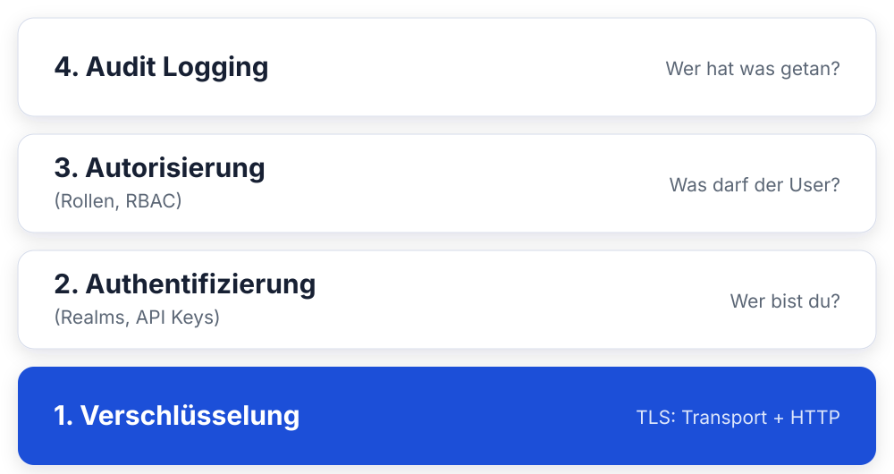
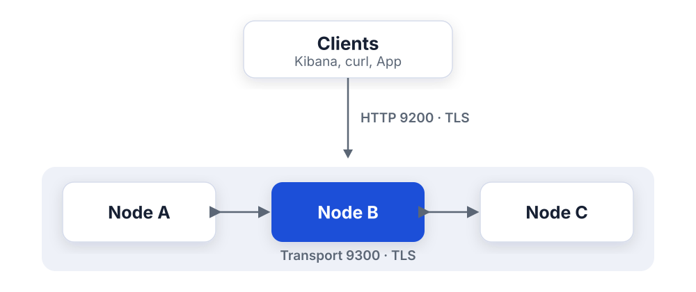
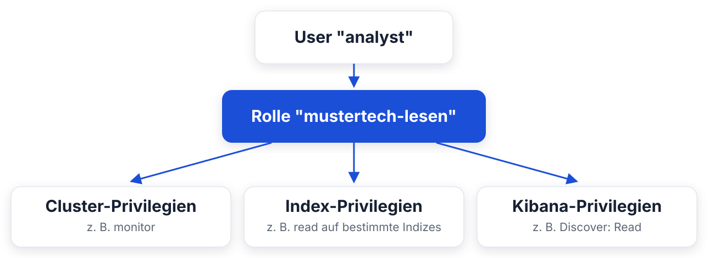
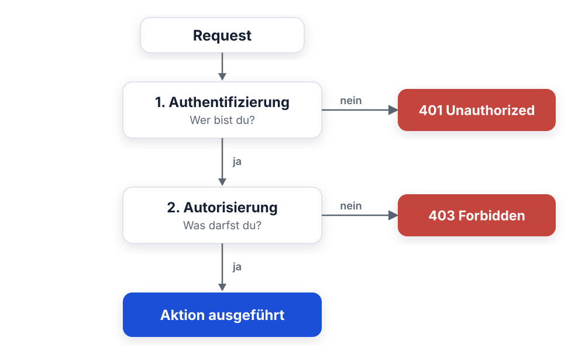
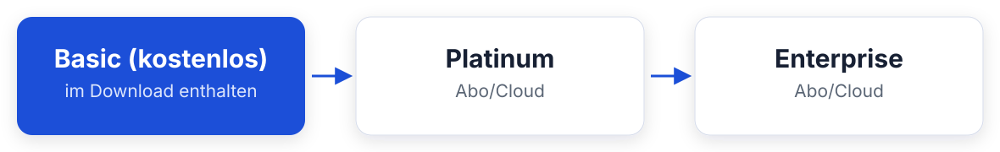

<style>
section blockquote { font-size: 0.8em; line-height: 1.3; margin-top: 0.25em; }
</style>

# Modul 11: Security & Lizenzen

Cluster absichern, Zugriffe steuern und Lizenzmodelle verstehen

---

# Lernziele

Nach diesem Modul kannst du:

- Die Security-Ebenen des Elastic Stack benennen und einordnen
- TLS auf Transport- und HTTP-Ebene unterscheiden
- Authentifizierungsmethoden auswählen: native Realm, API Keys,
  Service Accounts, SSO
- Rollen mit Cluster-, Index- und Kibana-Privilegien definieren
- Field- und Document-Level-Security erklären
- Die Lizenzstufen Basic, Platinum und Enterprise unterscheiden
- Eine Trial-Lizenz aktivieren und die Folgen einschätzen

---

# Agenda

**Teil 1: Security-Ebenen**
Warum Security, TLS, Authentifizierung - vom nativen Realm bis SSO

**Teil 2: Autorisierung**
Rollen, Privilegien, DLS/FLS, Kibana Spaces

**Teil 3: Live-Demo**
User, Rolle und API Key - gemeinsam in den Dev Tools

**Teil 4: Lizenzmodelle**
Basic vs. Platinum vs. Enterprise, Lizenzgeschichte, Trial-Demo

---

# Warum Security? Ein Blick zurück

Jahrelang liefen Elasticsearch-Cluster **komplett offen** im Internet:

- Bis Version 6.8 kostete Security extra, viele verzichteten darauf
- Suchmaschinen wie Shodan fanden zehntausende offene Cluster
- Folge: massenhafte Datenlecks - Kundendaten, Gesundheitsdaten, Logins
- 2020: "Meow-Attacken" löschten tausende ungeschützte Cluster automatisiert

**Bei Mustertech GmbH:** Bestell-, Kunden- und Logdaten im Cluster.
Offener Port 9200 = kurzer Weg zum meldepflichtigen Datenschutzvorfall.

> Seit Version 8 ist Security an - ein offener Cluster ist heute eine
> bewusste Fehlentscheidung.

---

# Frage in die Runde

**Wie steht ihr heute da?**

- Weiss bei euch jeder, wer produktiv auf den Cluster zugreift?
- Würdet ihr merken, wenn euer Port 9200 offen im Netz hängt?

---

# Die Security-Ebenen im Überblick



Jede Ebene baut auf der darunter auf. Ohne TLS ist Authentifizierung
wertlos - Passwörter wären im Klartext mitlesbar.

---
<style scoped>
table { font-size: 0.82em; }
section { font-size: 1.6em; }
</style>

# TLS: Transport vs. HTTP

Elasticsearch hat **zwei getrennte Kommunikationskanäle**, beide werden
separat verschlüsselt:

| Ebene         | Port | Wer spricht hier?             | Pflicht?               |
| ------------- | ---- | ----------------------------- | ---------------------- |
| **Transport** | 9300 | Nodes untereinander (Cluster) | Ja, sobald Security an |
| **HTTP**      | 9200 | Clients: Kibana, curl, Apps   | Dringend empfohlen     |

**In unserem Schulungscluster:** Beide Ebenen sind mit TLS gesichert,
deshalb nutzt du den ganzen Tag schon:

```bash
curl -k -u elastic:changeme https://localhost:9200/_cluster/health
```

> `-k` überspringt die Zertifikatsprüfung: okay für Schulung und
> selbstsignierte Zertifikate, in Produktion gehört die CA verteilt.

---

# TLS: zwei Kanäle, zwei Verschlüsselungen



- Oben: Client redet mit einem Node (HTTP 9200)
- Innen: Nodes reden untereinander (Transport 9300)
- Beide Wege getrennt verschlüsselt, sonst hört jemand mit

---

<style scoped>
section { font-size: 1.2em; }
</style>

# Authentifizierung: Die Realms

Ein **Realm** ist eine Quelle, gegen die Elasticsearch Anmeldedaten prüft.
Mehrere Realms bilden eine Kette - der erste Treffer gewinnt.

| Realm           | Beschreibung                              | Lizenz   |
| --------------- | ----------------------------------------- | -------- |
| **Native**      | User in Elasticsearch selbst gespeichert  | Basic    |
| **File**        | User in lokaler Datei (Notfallzugang)     | Basic    |
| **LDAP / AD**   | Anbindung an Verzeichnisdienst            | Platinum |
| **SAML / OIDC** | Single Sign-On (z. B. Entra ID, Keycloak) | Platinum |
| **PKI**         | Client-Zertifikate                        | Platinum |

> Für Mustertech reicht heute der native Realm: User und Passwörter
> verwaltet Elasticsearch selbst.

---
<style scoped>
section { font-size: 1.5em; }
</style>

# Built-in Users

Elasticsearch bringt vordefinierte Systembenutzer mit:

- **`elastic`** - Superuser, darf alles. Unser Schulungslogin.
- **`kibana_system`** - interner User, mit dem Kibana sich am
  Cluster anmeldet
- weitere für interne Stack-Komponenten (z. B. `logstash_system`)

**Regeln für die Praxis:**

- `elastic` ist der Notfall- und Setup-Account, **nicht** für den Alltag
- Kein Mensch und keine Anwendung sollte dauerhaft als `elastic` arbeiten
- Für jede Person und jede Anwendung: eigener User oder API Key mit
  minimalen Rechten (Least Privilege)

> Dass wir heute alle als `elastic` arbeiten, ist Schulungskomfort -
> in Produktion wäre das ein Audit-Finding.

---
<style scoped>
section { font-size: 1.4em; }
</style>

# API Keys

**Anwendungen** authentifizieren sich am besten per **API Key** statt mit
Username und Passwort:

- Werden per API erzeugt, optional mit Ablaufdatum (`expiration`)
- Können eigene, eingeschränkte Rechte tragen (`role_descriptors`)
- Lassen sich einzeln widerrufen, ohne andere Zugänge zu stören
- Werden im Header übertragen: `Authorization: ApiKey <base64-wert>`

**Typische Fälle bei Mustertech:**

- Der Webshop schreibt Bestellungen in den Cluster
- Ein Reporting-Skript liest nachts Kennzahlen aus
- Filebeat/Elastic Agent liefern Logs an

> Der Key-Wert wird **nur einmal** bei der Erstellung angezeigt, danach
> ist er nicht mehr abrufbar. Sicher ablegen!

---

<style scoped>
section { font-size: 1.2em; }
</style>

# Service Accounts

Für **Stack-eigene Komponenten** gibt es Service Accounts, eine
Spezialform für Dienste wie Fleet Server oder Kibana:

- Feste, vordefinierte Accounts, z. B. `elastic/fleet-server`,
  `elastic/kibana`
- Authentifizierung über **Service Account Tokens** statt Passwort
- Rechte sind fest auf die Aufgabe des Dienstes zugeschnitten

**Abgrenzung:**

| Mechanismus      | Für wen?                         |
| ---------------- | -------------------------------- |
| Native User      | Menschen (Login in Kibana)       |
| API Keys         | Eigene Anwendungen und Skripte   |
| Service Accounts | Elastic-Stack-Komponenten selbst |

---

# Frage in die Runde

**Wer meldet sich bei euch an?**

- Wie authentifizieren sich eure Anwendungen heute - Passwort im
  Config-File oder was Besseres?
- Pflegt ihr User doppelt, oder hängt schon alles an einem
  zentralen Login?

---
<style scoped>
section { font-size: 1.6em; }
</style>

# SSO: LDAP, AD, SAML, OIDC - Überblick

Ab einer gewissen Unternehmensgröße will niemand User doppelt pflegen:

- **LDAP / Active Directory:** Elasticsearch prüft Anmeldedaten gegen den
  Verzeichnisdienst, AD-Gruppen werden auf Rollen gemappt
- **SAML / OIDC:** Login läuft über einen Identity Provider
  (Entra ID, Okta, Keycloak), inklusive MFA und zentralem Offboarding
- **Rollen-Mapping:** Gruppe `mustertech-analysten` im AD →
  Rolle `mustertech-lesen` in Elasticsearch

**Aber:** Alle diese Realms benötigen eine **Platinum-Lizenz**,
dazu gleich mehr im Lizenz-Teil.

> Merke für die Beratung im eigenen Haus: Security-Basis ist frei,
> SSO-Integration kostet.

---

<style scoped>
section { font-size: 1.5em; }
</style>

# Teil 2: Autorisierung

Authentifizierung klärt, **wer** du bist.
Autorisierung klärt, **was** du darfst.

Elasticsearch nutzt **rollenbasierte Zugriffskontrolle (RBAC)**:



> User bekommen nie direkt Rechte - immer über Rollen. Eine Rolle kann
> vielen Usern zugewiesen werden.

---

# Ein Request durchläuft zwei Kontrollen



Erst wer, dann was - beide müssen passen.

---

<style scoped>
section { font-size: 1.2em; }
</style>

# Cluster-Privilegien

Cluster-Privilegien regeln **clusterweite Operationen**:

| Privileg          | Erlaubt                                          |
| ----------------- | ------------------------------------------------ |
| `monitor`         | Cluster-Status lesen (`_cluster/health`, `_cat`) |
| `manage`          | Cluster-Einstellungen ändern                     |
| `manage_security` | User und Rollen verwalten                        |
| `manage_ilm`      | ILM-Policies verwalten                           |
| `all`             | Alles - Vorsicht!                                |

**Faustregel:** Analysten brauchen meist **gar kein**
Cluster-Privileg, höchstens `monitor`.

---
<style scoped>
section { font-size: 1em; }
</style>

# Index-Privilegien

Index-Privilegien gelten pro **Index-Muster**, Wildcards erlaubt:

| Privileg              | Erlaubt                               |
| --------------------- | ------------------------------------- |
| `read`                | Suchen und Dokumente lesen            |
| `write`               | Dokumente indexieren, ändern, löschen |
| `create_index`        | Neue Indizes anlegen                  |
| `view_index_metadata` | Mappings und Settings lesen           |
| `manage`              | Index-Einstellungen ändern, löschen   |
| `all`                 | Alles auf diesem Index                |

**Beispiel Mustertech:** Die Rolle `mustertech-lesen` bekommt
`read` + `view_index_metadata` auf `kibana_sample_data_*` -
nicht mehr.

> `view_index_metadata` braucht Kibana, um Feldlisten in Discover
> anzuzeigen.

---
<style scoped>
section { font-size: 1.3em; }
</style>

# Kibana-Privilegien

Elasticsearch-Rechte allein reichen nicht: **Kibana hat eigene
Privilegien**, pro Feature und pro Space:

- **Feature-Privilegien:** Discover, Dashboards, Dev Tools,
  Stack Management ... jeweils `Read` oder `All`
- Zuweisung pro **Space** (dazu gleich mehr)
- Verwaltung: **Stack Management → Security → Roles**; dort
  konfigurierst du Elasticsearch- und Kibana-Rechte in einer Rolle

**Beispiel:**

| Rolle              | ES-Rechte                 | Kibana-Rechte      |
| ------------------ | ------------------------- | ------------------ |
| `mustertech-lesen` | `read` auf Sample-Indizes | Discover: Read     |
| `mustertech-admin` | `all` auf `mustertech-*`  | Alle Features: All |

> Ein User ohne Kibana-Privilegien kann sich zwar per API anmelden,
> sieht in Kibana aber nichts.

---
<style scoped>
code { font-size: 0.85em; }
section { font-size: 1.35em; }
</style>

# Document-Level-Security (DLS)

DLS filtert, **welche Dokumente** ein User sehen darf, per Query
in der Rolle:

**Szenario Mustertech:** Das Team Süd soll nur Bestellungen aus Bayern
und Baden-Württemberg sehen.

```json
{
  "indices": [{
    "names": ["mustertech-orders-*"],
    "privileges": ["read"],
    "query": {
      "terms": {
        "customer.region": ["Bayern", "Baden-Württemberg"]
      }
    }
  }]
}
```

Der User merkt nichts davon: Suchen liefern einfach nur die
erlaubten Dokumente zurück.

---
<style scoped>
code { font-size: 0.85em; }
section { font-size: 1.3em; }
</style>

# Field-Level-Security (FLS)

FLS filtert, **welche Felder** ein User sehen darf:

**Szenario:** Externe Dienstleister analysieren Bestellmuster, dürfen
aber keine personenbezogenen Daten sehen.

```json
{
  "indices": [{
    "names": ["mustertech-orders-*"],
    "privileges": ["read"],
    "field_security": {
      "grant": ["order.*", "product.*"]
    }
  }]
}
```

Felder wie `customer.name` oder `customer.email` existieren für diesen
User schlicht nicht - auch nicht in Discover.

> **Achtung Lizenz:** DLS und FLS sind **Platinum-Features**,
> mit Basic nicht verfügbar.

---
<style scoped>
section { font-size: 1.5em; }
</style>

# Kibana Spaces

**Spaces** unterteilen Kibana in getrennte Arbeitsbereiche:

- Eigene Dashboards, Data Views und gespeicherte Objekte pro Space
- Zugriff pro Space über Rollen steuerbar
- Wechsel über das Space-Menü oben links

**Beispiel-Aufteilung bei Mustertech:**

| Space        | Inhalt              | Zugriff          |
| ------------ | ------------------- | ---------------- |
| `default`    | Allgemeine Analysen | Alle             |
| `logistik`   | Versand-Dashboards  | Team Logistik    |
| `management` | Umsatz-KPIs         | Geschäftsführung |

> Spaces sind **Organisation**, keine harte Datengrenze. Die
> eigentliche Datensicherheit regeln Index-Privilegien, DLS und FLS.

---
<style scoped>
section { font-size: 1.3em; }
</style>

# Audit Logging

Die vierte Ebene aus unserem Schichtenmodell: **Wer hat wann was
getan?**

- Protokolliert Authentifizierungsversuche, Zugriffe und
  verweigerte Anfragen (`access_denied`)
- Aktivierung in `elasticsearch.yml`:
  `xpack.security.audit.enabled: true`
- Ausgabe als JSON-Datei (`<cluster>_audit.json`) - die kann man
  wieder in Elasticsearch indexieren

**Typische Fragen, die das Audit-Log beantwortet:**

- Wer hat gestern den Index `mustertech-orders-2026` gelöscht?
- Von welcher IP kamen die fehlgeschlagenen Logins?
- Welche Anwendung nutzt noch den alten API Key?

> **Achtung Lizenz:** Audit Logging ist ein Platinum-Feature.

---

# Teil 3: Live-Demo

Das bauen wir jetzt gemeinsam nach, im Schulungscluster,
per Dev Tools:

1. Rolle `mustertech-lesen` anlegen - Lesezugriff auf die
   Sample-Indizes plus Discover in Kibana
2. User `analyst` anlegen und der Rolle zuweisen
3. Login als `analyst` testen - was sieht er, was nicht?
4. API Key erzeugen und per curl verwenden

> Alle Befehle stehen auf den folgenden Folien. Du kannst sie nach
> der Demo selbst ausprobieren.

---
<style scoped>
code { font-size: 0.74em; }
section { font-size: 1.15em; }
</style>

# Demo 1: Rolle anlegen

In Kibana: **Dev Tools** öffnen. Die Rolle bekommt Lesezugriff auf die
Sample-Daten und das Discover-Feature im Default-Space:

```json
POST /_security/role/mustertech-lesen
{
  "cluster": [],
  "indices": [
    {
      "names": ["kibana_sample_data_*"],
      "privileges": ["read", "view_index_metadata"]
    }
  ],
  "applications": [
    {
      "application": "kibana-.kibana",
      "privileges": ["feature_discover.read"],
      "resources": ["space:default"]
    }
  ]
}
```

> Der `applications`-Block ist die API-Schreibweise für
> Kibana-Privilegien. Bequemer geht das über
> **Stack Management → Security → Roles**.

---
<style scoped>
code { font-size: 0.9em; }
section { font-size: 1.55em; }
</style>

# Demo 2: User anlegen

```json
POST /_security/user/analyst
{
  "password": "analyst-geheim-123",
  "full_name": "Mustertech Analyst",
  "roles": ["mustertech-lesen"]
}
```

**Prüfen, ob alles da ist:**

```
GET /_security/user/analyst
GET /_security/role/mustertech-lesen
```

> User- und Rollenverwaltung geht genauso über die UI:
> **Stack Management → Security → Users / Roles**.

---
<style scoped>
section { font-size: 1.35em; }
</style>

# Demo 3: Login testen

1. Öffne ein **privates Browserfenster** (damit die
   `elastic`-Session nicht stört)
2. Gehe auf `http://localhost:5601`
3. Melde dich an als `analyst` / `analyst-geheim-123`

**Was du siehst:**

- Das Menü ist stark reduziert: nur **Discover** ist sichtbar
- Die Sample-Daten sind lesbar
- Kein Dev Tools, kein Stack Management, keine Dashboards

**Gegentest per API:**

```bash
curl -k -u analyst:analyst-geheim-123 \
  "https://localhost:9200/kibana_sample_data_logs/_search?size=1"
```

Lesen klappt - Schreiben würde mit `403 Forbidden` scheitern.

---
<style scoped>
code { font-size: 0.82em; }
section { font-size: 0.95em; }
</style>

# Demo 4: API Key erzeugen

Zurück als `elastic` in Dev Tools - ein Key mit eigenen,
eingeschränkten Rechten:

```json
POST /_security/api_key
{
  "name": "reporting-key",
  "expiration": "7d",
  "role_descriptors": {
    "nur-logs-lesen": {
      "indices": [
        {
          "names": ["kibana_sample_data_logs"],
          "privileges": ["read"]
        }
      ]
    }
  }
}
```

**Antwort (gekürzt):**

```json
{
  "id": "a1b2c3...",
  "api_key": "xyz...",
  "encoded": "YTFiMmMzLi4uOnh5ei4uLg=="
}
```

> Das Feld `encoded` ist genau der Wert für den HTTP-Header.

---
<style scoped>
code { font-size: 0.85em; }
section { font-size: 1.6em; }
</style>

# Demo 5: API Key mit curl nutzen

Statt `-u user:passwort` kommt der Key in den
`Authorization`-Header:

```bash
curl -k \
  -H "Authorization: ApiKey YTFiMmMzLi4uOnh5ei4uLg==" \
  "https://localhost:9200/kibana_sample_data_logs/_count"
```

**Key wieder loswerden:**

```json
DELETE /_security/api_key
{
  "name": "reporting-key"
}
```

> So bindest du Anwendungen an den Cluster an: pro Anwendung ein Key,
> minimale Rechte, Ablaufdatum, jederzeit widerrufbar.

---
<style scoped>
section { font-size: 1.35em; }
</style>

# Security-Checkliste für Produktion

Was du aus Teil 1-3 für den eigenen Cluster mitnimmst:

- [ ] TLS auf **Transport- und HTTP-Ebene** aktiv, CA an Clients
  verteilt (kein dauerhaftes `curl -k`)
- [ ] `elastic`-Passwort geändert, Account nur für Notfälle
- [ ] Pro Person ein **eigener User**, pro Anwendung ein
  **eigener API Key**
- [ ] Rollen nach **Least Privilege** - Index-Muster so eng wie
  möglich
- [ ] Kibana-Zugriff über **Feature-Privilegien und Spaces**
  eingeschränkt
- [ ] Keine Cluster-Privilegien für Analysten
- [ ] API Keys mit **Ablaufdatum** und Namenskonvention

> Diese Liste ist komplett mit der **Basic-Lizenz** umsetzbar:
> Geld kostet erst SSO, DLS/FLS und Audit Logging.

---

# Frage in die Runde

**Basic oder kaufen?**

- Welche Security-Features aus Teil 1-3 braucht ihr wirklich - und
  was davon ist Basic, was Platinum?
- Wer entscheidet in eurem Haus über so eine Lizenz?

---

<style scoped>
section { font-size: 1.5em; }
</style>

# Teil 4: Lizenzmodelle

Der Elastic Stack ist "free & open" - aber nicht jedes Feature:



- **Basic:** Standardlizenz nach der Installation, kein Ablaufdatum
- **Platinum / Enterprise:** kommerzielle Subscriptions
  (Support inklusive)
- **Trial:** 30 Tage alle Enterprise-Features zum Testen

**Aktuelle Lizenz anzeigen:**

```
GET /_license
```

---
<style scoped>
table { font-size: 0.68em; }
section { font-size: 1.5em; }
</style>

# Feature-Matrix: Was ist frei, was kostet?

| Feature                                    | Basic | Platinum | Enterprise |
| ------------------------------------------ | :---: | :------: | :--------: |
| TLS, RBAC, native Realm, API Keys          | ja    | ja       | ja         |
| Kibana Spaces                              | ja    | ja       | ja         |
| ILM, Data Streams, Snapshots               | ja    | ja       | ja         |
| Alerting mit Index-/Server-Log-Connector   | ja    | ja       | ja         |
| Alerting mit Slack, E-Mail, PagerDuty, ... | -     | ja       | ja         |
| SSO (LDAP/AD, SAML, OIDC), Audit Logging   | -     | ja       | ja         |
| DLS / FLS                                  | -     | ja       | ja         |
| Machine Learning (Anomaly Detection)       | -     | ja       | ja         |
| Cross-Cluster Replication                  | -     | ja       | ja         |
| Searchable Snapshots (Cold/Frozen Tier)    | -     | -        | ja         |

> Security-**Basisfeatures sind seit 6.8 kostenlos**, die
> Enterprise-Integrationen (SSO, DLS/FLS) nicht.

---
<style scoped>
section { font-size: 1.4em; }
</style>

# Lizenzgeschichte: ELv2, SSPL und OpenSearch

Wie es zu "free & open" kam:

- **Bis 2021:** Elasticsearch und Kibana unter **Apache 2.0**
- **2021:** Wechsel auf **SSPL / Elastic License v2 (ELv2)**.
  Hintergrund: Konflikt mit AWS, das Elasticsearch als Managed
  Service anbot
- ELv2 verbietet im Kern, die Software **als Managed Service**
  anzubieten; normale Nutzung im Unternehmen bleibt frei
- **AWS-Antwort:** Fork **OpenSearch** unter Apache 2.0
  (siehe Modul 01)
- **2024:** Elastic ergänzt **AGPLv3** als dritte Lizenzoption,
  damit ist Elasticsearch wieder Open Source im OSI-Sinn

> Für dich als Anwender im Unternehmen ändern diese Lizenzen nichts.
> Relevant werden sie erst, wenn du Elasticsearch selbst als Service
> weiterverkaufen willst.

---
<style scoped>
code { font-size: 0.85em; }
section { font-size: 1.3em; }
</style>

# Demo: Trial-Lizenz aktivieren

Jeder Cluster darf **einmalig** eine 30-Tage-Trial starten:

```
POST /_license/start_trial?acknowledge=true
```

**Danach prüfen:**

```
GET /_license
```

Ergebnis: `"type": "trial"`, gültig 30 Tage, Feature-Umfang **Enterprise**.

**Was sich sofort ändert (in Kibana nachschauen):**

- **Machine Learning** erscheint im Menü (Anomaly Detection)
- Neue **Connectors** für Alerting: Slack, E-Mail, PagerDuty, Webhook
- DLS/FLS-Optionen in der Rollenverwaltung

> Einmalig pro Cluster! Unsere Schulungscluster sind Wegwerf-Umgebungen,
> hier ist das unkritisch. In Produktion überlegst du dir den Zeitpunkt gut.

---
<style scoped>
section { font-size: 1.3em; }
</style>

# Lizenzverwaltung in Kibana

Dasselbe geht auch über die Oberfläche:

**Stack Management → License Management**

Dort siehst und machst du:

- Aktuelle Lizenzstufe und Ablaufdatum
- **Start a 30-day trial** - der Button hinter unserem API-Call
- **Update license** - gekaufte Lizenzdatei (JSON) hochladen

**Per API:**

| Aufgabe           | Request                                       |
| ----------------- | --------------------------------------------- |
| Lizenz anzeigen   | `GET /_license`                               |
| Trial starten     | `POST /_license/start_trial?acknowledge=true` |
| Lizenz einspielen | `PUT /_license` (mit Lizenz-JSON)             |

---
<style scoped>
section { font-size: 1.1em; }
</style>

# Nach der Trial

Was passiert nach 30 Tagen ohne Kauf?

- Die Lizenz fällt zurück auf **Basic**
- Platinum-Features stellen die Arbeit ein
  (ML-Jobs stoppen, SSO-Logins schlagen fehl)
- **Deine Daten bleiben vollständig erhalten**, es wird nichts
  gelöscht
- Kibana warnt rechtzeitig vor dem Ablauf

**Entscheidungshilfe für Mustertech:**

| Bedarf                              | Empfehlung   |
| ----------------------------------- | ------------ |
| Logs, Dashboards, Basis-Alerting    | Basic reicht |
| SSO, ML, Slack-Alerts, DLS/FLS      | Platinum     |
| Riesige Archive günstig durchsuchen | Enterprise   |

---
<style scoped>
section { font-size: 1.3em; }
</style>

# Zusammenfassung

- **Security-Ebenen:** TLS (Transport + HTTP) → Authentifizierung →
  Autorisierung → Audit; seit Version 8 standardmäßig aktiv
- **Authentifizierung:** native User für Menschen, **API Keys** für
  Anwendungen, Service Accounts für Stack-Komponenten,
  SSO (LDAP/SAML/OIDC) nur mit Platinum
- **Autorisierung:** Rollen bündeln Cluster-, Index- und
  Kibana-Privilegien; Least Privilege ist die Regel
- **DLS/FLS** filtern Dokumente und Felder pro Rolle
  (Platinum-Feature)
- **Lizenzen:** Basic deckt Security-Basis, ILM und Basis-Alerting ab;
  Platinum bringt ML, SSO und erweiterte Connectors;
  die Trial schaltet alles 30 Tage frei, einmalig pro Cluster

**Nächstes Modul:** Alerting, Monitoring & SIEM - wir lassen den
Cluster selbst Alarm schlagen.
