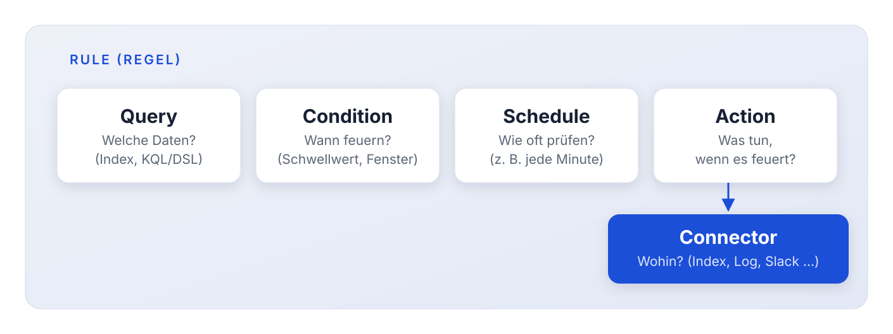
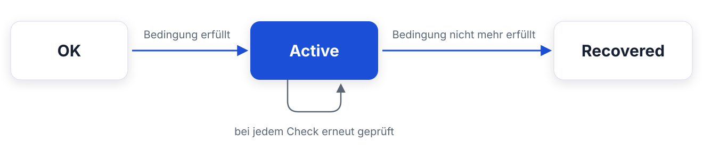
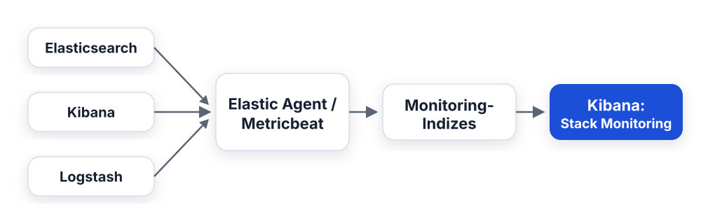
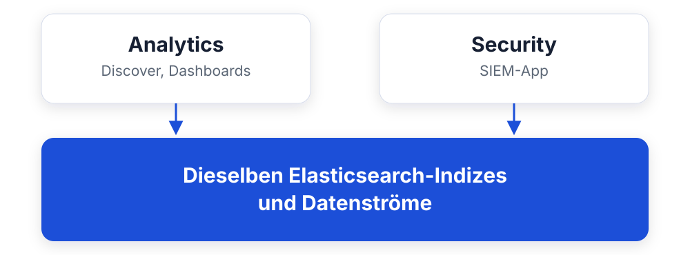
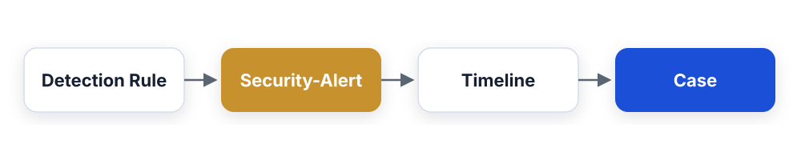

<style>
section blockquote { font-size: 0.8em; line-height: 1.3; margin-top: 0.25em; }
</style>


# Modul 12: Alerting, Monitoring & SIEM

Vom passiven Dashboard zum aktiven System: Alarme, Cluster-Gesundheit
und Security-Analysen

---

<style scoped>
section { font-size: 0.9em; }
</style>

# Lernziele

Nach diesem Modul kannst du:

- Die Alerting-Bausteine Rule, Condition, Action und Connector
  auseinanderhalten
- Passende Rule-Typen für typische Anwendungsfälle auswählen
- Einschätzen, welche Connectors mit Basic funktionieren und welche
  Platinum brauchen
- Stack Monitoring einrichten und die wichtigsten Metriken lesen
- Die `_cat`- und `_nodes`-APIs als Low-Level-Alternative nutzen
- Elastic Security (SIEM) einordnen: Detection Rules, Timelines, Cases
- Erklären, warum ECS die Grundlage für SIEM ist

---

# Agenda

**Teil 1: Kibana Alerting**
Rules, Conditions, Actions und Connectors: der Cluster meldet sich
selbst

**Teil 2: Stack Monitoring**
Wer überwacht das Monitoring? Node-Metriken, JVM Heap, Index-Raten

**Teil 3: Elastic Security (SIEM)**
Detection Rules, Timelines und Cases: Security-Analysen auf
denselben Daten

---

# Warum Alerting?

**Szenario bei Mustertech GmbH:**

Am Wochenende fällt der Bezahldienstleister aus. Der Webshop liefert
stundenlang HTTP 503. Die Logs sind alle da - in Elasticsearch.

**Aber niemand schaut am Sonntag auf ein Dashboard.**

- Dashboards sind **passiv** - sie beantworten Fragen, die du stellst
- Alerting ist **aktiv** - das System meldet sich, wenn etwas
  passiert
- Montagmorgen-Forensik wird zu Sonntagabend-Reaktion

> Daten sammeln ist die halbe Miete. Der Wert entsteht, wenn das System
> von selbst Alarm schlägt.

---

# Frage in die Runde

**Wie erfahrt ihr heute, dass etwas kaputt ist?**

- Wer hat einen Ausfall schon mal zuerst vom Kunden erfahren - nicht
  vom eigenen Monitoring?
- Was alarmiert euch aktuell: Mail, Pager, Chat, oder Zuruf über den
  Flur?

---

<style scoped>
section { font-size: 1.5em; }
</style>

# Teil 1: Kibana Alerting - die Bausteine



- Eine **Rule** wird regelmäßig ausgeführt und prüft eine Bedingung
- Ist die Bedingung erfüllt, entsteht ein **Alert**
- Der Alert löst **Actions** aus; jede Action nutzt einen
  **Connector**

---
<style scoped>
section { font-size: 1.6em; }
</style>

# Wo finde ich das in Kibana?

Zwei Orte in **Stack Management** (Bereich *Alerts and Insights*):

| Ort            | Zweck                                          |
| -------------- | ---------------------------------------------- |
| **Rules**      | Regeln anlegen, aktivieren, Verlauf einsehen   |
| **Connectors** | Verbindungen zu Zielsystemen zentral verwalten |

**Voraussetzung:**

- **Encryption Keys** gesetzt
  (`xpack.encryptedSavedObjects.encryptionKey`)
- damit verschlüsselt Kibana die Zugangsdaten der Connectors

> In unserem Schulungscluster sind die Keys bereits gesetzt,
> Alerting funktioniert sofort.

---
<style scoped>
section { font-size: 1.5em; }
</style>

# Wer führt die Rules eigentlich aus?

- Rules laufen **in Kibana**, nicht in Elasticsearch: der
  Task Manager von Kibana plant und führt die Checks aus
- Kibana fragt dabei Elasticsearch ab (die Query der Rule)
- Der Zustand (Rules, Alerts, Verlauf) liegt in internen
  `.kibana*`-Indizes

**Konsequenzen:**

- Ist **Kibana down, feuern keine Alerts**, auch wenn
  Elasticsearch läuft
- Viele Rules mit kurzen Intervallen belasten Kibana;
  bei Bedarf horizontal skalieren (mehrere Kibana-Instanzen)

> Für Alerts zur Cluster-Gesundheit gibt es zusätzlich
> ES-seitiges "Watcher"-Alerting (Platinum, Vorgänger-Technologie).
> Neueinstiege nutzen Kibana Alerting.

---

<style scoped>
section { font-size: 0.85em; }
table { font-size: 0.85em; }
</style>

# Rule-Typen im Überblick

| Rule-Typ                | Prüft ...                              | Lizenz   |
| ----------------------- | -------------------------------------- | -------- |
| **Index threshold**     | Aggregierten Wert gegen Schwellwert    | Basic    |
| **Elasticsearch query** | Trefferzahl einer KQL/DSL-Query        | Basic    |
| **Log threshold**       | Log-Einträge nach Kriterien (Logs-App) | Basic    |
| **Anomaly Detection**   | ML-Anomalie-Score                      | Platinum |
| **Security Rules**      | Detection Rules der Security-App       | Basic*   |

\* Die Security-App selbst ist Basic, einzelne Features (z. B. ML-Rules)
brauchen Platinum.

**Für die meisten Fälle reichen zwei:**

- **Index threshold** - "Durchschnittliche Antwortzeit über 2 s"
- **Elasticsearch query** - "Mehr als 10 Dokumente mit `response: 503`
  in 5 Minuten"

---
<style scoped>
table { font-size: 0.8em; }
section { font-size: 1.25em; }
</style>

# Connectors: Basic vs. Platinum

Der Connector bestimmt, **wohin** der Alarm geht:

| Connector               | Lizenz   | Typischer Einsatz             |
| ----------------------- | -------- | ----------------------------- |
| **Index**               | Basic    | Alert-Dokument in einen Index |
| **Server log**          | Basic    | Eintrag ins Kibana-Log        |
| E-Mail                  | Platinum | Benachrichtigung ans Team     |
| Slack / Microsoft Teams | Platinum | ChatOps                       |
| PagerDuty / Opsgenie    | Platinum | Rufbereitschaft               |
| Webhook                 | Platinum | Beliebige eigene Systeme      |
| Jira / ServiceNow       | Platinum | Ticket automatisch erstellen  |

**Mit Basic** kannst du Alerting also vollständig lernen und testen.
Für die **Zustellung an Menschen** (Mail, Slack, Pager) brauchst du
Platinum.

> Der Index-Connector ist unterschätzt: Alerts landen als Dokumente in
> einem Index, und den kannst du wiederum in Dashboards auswerten.

---
<style scoped>
table { font-size: 0.74em; }
section { font-size: 1.08em; }
</style>

# Beispiel: Eine Rule für den 503-Ausfall

So sieht die Rule für unser Wochenend-Szenario aus
(Typ: **Elasticsearch query**):

| Einstellung     | Wert                                    |
| --------------- | --------------------------------------- |
| **Name**        | `Fehlerrate Webshop`                    |
| **Data View**   | `kibana_sample_data_logs`               |
| **Query (KQL)** | `response.keyword >= 500`               |
| **Condition**   | Trefferzahl **über 10**                 |
| **Time window** | letzte **5 Minuten**                    |
| **Check every** | **1 Minute**                            |
| **Action**      | Index-Connector → Index `alerts-uebung` |

**Ablauf zur Laufzeit:**

1. Jede Minute führt Kibana die Query über das 5-Minuten-Fenster aus
2. Über 10 Treffer → Alert wird **aktiv**, Action feuert
3. Fällt die Zahl wieder unter den Schwellwert → Alert **recovered**

> Genau diese Rule baust du gleich im Mini-Lab selbst.

---
<style scoped>
code { font-size: 0.85em; }
section { font-size: 1.55em; }
</style>

# Actions: Variablen und Kontext

In der Action definierst du das Dokument bzw. die Nachricht, mit
**Mustache-Variablen** aus dem Alert-Kontext:

```json
{
  "regel": "{{rule.name}}",
  "zeitpunkt": "{{context.date}}",
  "treffer": "{{context.value}}",
  "bedingung": "{{context.conditions}}"
}
```

**Weitere Stellschrauben:**

- **Action frequency:** bei jedem Check erneut oder nur bei
  Statuswechsel ("On status changes"), das verhindert Alarm-Spam
- Eigene Action für **Recovered**: Entwarnung ist auch eine
  Information

---

<style scoped>
section { font-size: 1.5em; }
</style>

# Der Lebenszyklus eines Alerts



- **Active:** Bedingung ist erfüllt, Actions feuern gemäß
  Action frequency
- **Recovered:** Bedingung ist nicht mehr erfüllt, optional eigene
  Entwarnungs-Action
- **Flapping:** Ein Alert, der schnell zwischen Active und Recovered
  pendelt. Kibana erkennt das und dämpft die Benachrichtigungen

> Ein Alert ist kein Ereignis, sondern ein **Zustand**: er beginnt,
> dauert an und endet.

---
<style scoped>
section { font-size: 1.5em; }
</style>

# Rule-Details: Verlauf, Snooze und Fehlersuche

Klick auf eine Rule in der Rule-Liste öffnet die **Detailseite**:

- **Aktive Alerts** mit Startzeitpunkt und gemessenem Wert
- **Execution history:** jede Ausführung mit Dauer und Ergebnis;
  hier findest du auch Fehler (z. B. kaputte Query)
- **Snooze:** Benachrichtigungen temporär stummschalten
  (z. B. während eines geplanten Wartungsfensters); die Rule läuft
  weiter, nur die Actions pausieren
- **Disable:** Rule komplett anhalten

**Praxisfall Mustertech:** Sonntagnacht ist Deployment-Fenster,
also wird die 503-Rule für 2 Stunden gesnoozt statt gelöscht.

> Gelöschte Rules verlieren ihren Verlauf. Snooze und Disable sind
> fast immer die bessere Wahl.

---
<style scoped>
section { font-size: 1.6em; }
</style>

# Best Practices gegen Alarmmüdigkeit

Das größte Risiko eines Alerting-Systems: **Es wird ignoriert.**

- **Wenige, klare Rules** statt hundert lauter. Jede Rule braucht
  einen Verantwortlichen und eine erwartete Reaktion
- **Schwellwerte an der Realität kalibrieren:** erst beobachten
  (Index-Connector!), dann benachrichtigen
- **"On status changes"** statt "bei jedem Check": eine Störung,
  eine Nachricht
- **Recovered-Actions** nutzen: Entwarnung spart Nachfragen
- Schwere und Routing trennen: kritisch → Pager,
  informativ → Index/Dashboard

> Wenn das Team anfängt, Alerts wegzuklicken, ist das System
> gescheitert, egal wie gut die Technik ist.

---

# Frage in die Runde

**Bevor wir den Cluster selbst überwachen:**

- Wie viele Alerts pro Woche sind bei euch noch "echt" - und wie viele
  klickt ihr nur noch weg?
- Wer merkt bei euch zuerst, dass eine Platte volläuft?

---

# Teil 2: Stack Monitoring

**Wer überwacht eigentlich das Monitoring-System?**

Der Elastic Stack ist bei Mustertech inzwischen selbst
Produktionsinfrastruktur:

- Fällt der Cluster aus, sind Dashboards **und** Alerting blind
- Volle Disks, überlasteter JVM Heap, hängende Shards: alles
  schleichende Ausfälle
- Deshalb **Stack Monitoring**: der Stack beobachtet sich selbst

**In Kibana:** Hauptmenü → **Stack Monitoring**

> Die Erkenntnis "der Cluster war seit Tagen gelb" sollte nicht aus
> einem Kundenanruf stammen.

---
<style scoped>
section { font-size: 0.95em; }
table { font-size: 0.85em; }
</style>

# Architektur: Wie werden Metriken erfasst?

**1. Womit sammeln?**



- **Elastic Agent / Metricbeat** (empfohlen)
- **Self-Monitoring** (legacy, deprecated): Cluster schreibt selbst -
  einfach, aber blind genau dann, wenn es brennt

**2. Wohin schreiben?**

| Variante                           | Bewertung                              |
| ---------------------------------- | -------------------------------------- |
| In denselben Cluster               | Okay für Dev/Schulung                  |
| **Dedizierter Monitoring-Cluster** | Produktion: sichtbar, wenn Prod brennt |

> Das Monitoring darf nicht am selben Tropf hängen wie das überwachte
> System.

---

<style scoped>
section { font-size: 0.9em; }
</style>

# Was zeigt Stack Monitoring?

| Bereich      | Metriken                                      |
| ------------ | --------------------------------------------- |
| **Cluster**  | Status (green/yellow/red), Nodes, Shards      |
| **Nodes**    | CPU, Load, **JVM Heap**, Disk Free            |
| **Indizes**  | Index-Rate (docs/s), Such-Rate, Latenz, Größe |
| **Kibana**   | Antwortzeiten, Speicher, Verfügbarkeit        |
| **Logstash** | Events in/out, Pipeline-Durchsatz             |

**Worauf du bei einem 3-Node-Cluster wie unserem achtest:**

- **JVM Heap** dauerhaft über ~75 % → Garbage-Collection-Druck
- **Disk** über der Watermark (Standard 85 %) → ES verschiebt/blockiert
  Shards
- Auseinanderlaufende **Index-Raten** → Hot-Spotting auf einem Node

---

<style scoped>
section { font-size: 0.85em; }
</style>

# Recap: green, yellow, red

Der Cluster-Status ist die wichtigste Einzelmetrik, zur Erinnerung:

| Status     | Bedeutung                                                |
| ---------- | -------------------------------------------------------- |
| **green**  | Alle Primary- und Replica-Shards zugewiesen              |
| **yellow** | Alle Primaries da, aber Replicas fehlen                  |
| **red**    | Mindestens ein Primary-Shard fehlt, Datenzugriff gestört |

**Für unseren 3-Node-Cluster heißt das:**

- Fällt **ein** Node aus → kurz yellow, dann heilt sich der Cluster
  selbst (Replicas werden neu verteilt)
- Fallen **zwei** Nodes aus → je nach Shard-Verteilung red

> Yellow ist ein Warnsignal, kein Notfall. Aber ein dauerhaft gelber
> Cluster hat keine Reserve mehr für den nächsten Ausfall.

---
<style scoped>
section { font-size: 1.6em; }
</style>

# Monitoring + Alerting = Stack-Monitoring-Rules

Hier laufen Teil 1 und Teil 2 zusammen: Kibana bringt **vorgefertigte
Rules für die Cluster-Gesundheit** mit, u. a.:

- **Cluster health**: Status yellow/red
- **CPU usage** und **Disk usage** über Schwellwert
- **JVM memory usage** (Heap über 85 %)
- **Missing monitoring data**: ein Node liefert keine Metriken mehr
- **License expiration**: die Lizenz läuft ab

Sichtbar und konfigurierbar in **Stack Management → Rules**
(werden beim ersten Besuch von Stack Monitoring angelegt).

> Du musst Cluster-Überwachung also nicht selbst bauen, nur die
> Schwellwerte prüfen und einen sinnvollen Connector hinterlegen.

---
<style scoped>
code { font-size: 0.85em; }
section { font-size: 1.3em; }
</style>

# Low-Level-Alternative: _cat und_nodes

Kein Kibana zur Hand? Die APIs liefern dieselben Kernaussagen,
du kennst einige davon schon von Tag 1:

```bash
# Cluster-Status auf einen Blick
curl -k -u elastic:changeme \
  "https://localhost:9200/_cat/health?v"

# Nodes mit Heap, RAM, CPU, Load und Rollen
curl -k -u elastic:changeme \
  "https://localhost:9200/_cat/nodes?v&h=name,heap.percent,ram.percent,cpu,load_1m,node.role"

# Indizes mit Größe und Dokumentzahl
curl -k -u elastic:changeme \
  "https://localhost:9200/_cat/indices?v&s=store.size:desc"

# Detaillierte Node-Statistiken (JSON, für Skripte)
curl -k -u elastic:changeme \
  "https://localhost:9200/_nodes/stats/jvm,os"
```

> `_cat` ist für Menschen (Tabellen), `_nodes/stats` für Maschinen
> (JSON). Beide sind lizenzfrei und immer verfügbar.

---

# Frage in die Runde

**Von Betrieb zu Security:**

- Liegen bei euch Security-Logs (Logins, Firewall) schon in Elastic -
  oder in einem ganz anderen Topf?
- Wer würde bei euch einen Brute-Force-Versuch auf das Login überhaupt
  bemerken?

---

<style scoped>
section { font-size: 1.5em; }
</style>

# Teil 3: Elastic Security (SIEM)

**SIEM** = Security Information and Event Management:
sicherheitsrelevante Ereignisse zentral sammeln, korrelieren
und erkennen.

**Die zentrale Einordnung:**



> Elastic Security ist **keine separate Installation**, sondern eine
> Kibana-App auf denselben Daten, die du schon indexierst.

---
<style scoped>
section { font-size: 1.35em; }
</style>

# Die Bausteine der Security-App

**Hauptmenü → Security:**

- **Detection Rules:** Regeln, die kontinuierlich nach verdächtigen
  Mustern suchen; Treffer werden zu **Security-Alerts**
  - Über 1.000 **vorgefertigte Rules** von Elastic
    (gemappt auf MITRE ATT&CK)
  - Eigene Rules: Query-, Threshold-, Indicator-Match-,
    ML-basiert (letztere: Platinum)
- **Timelines:** interaktiver Arbeitsbereich, um einen Vorfall
  chronologisch zu rekonstruieren - Events per Drag & Drop
  korrelieren
- **Cases:** Fälle eröffnen, Alerts und Timelines anhängen,
  im Team bearbeiten - das Ticketsystem für Security-Vorfälle

> Detection Rules sind technisch dasselbe Konzept wie Kibana-Rules,
> nur spezialisiert auf Security und mit fertiger Regelbibliothek.

---
<style scoped>
section { font-size: 1.3em; }
</style>

# Detection Rules im Detail

Jede Detection Rule trägt mehr Metadaten als eine normale
Kibana-Rule:

| Attribut         | Beispiel                                                  |
| ---------------- | --------------------------------------------------------- |
| **Severity**     | low / medium / high / critical                            |
| **Risk score**   | 0-100, fließt in die Alert-Priorisierung ein              |
| **MITRE ATT&CK** | Taktik + Technik, z. B. `Credential Access → Brute Force` |
| **Schedule**     | Intervall + Look-back (überlappend gegen Lücken)          |

**MITRE ATT&CK** ist der Industriestandard-Katalog für
Angreifer-Taktiken. Die Zuordnung macht Alerts vergleichbar und
zeigt Abdeckungslücken ("welche Taktiken erkennen wir gar nicht?").

> Die vorgefertigten Rules aktivierst du unter
> **Security → Rules → Add Elastic rules**, gezielt nach
> Datenquelle, nicht alle 1.000 auf einmal.

---
<style scoped>
section { font-size: 1.5em; }
</style>

# Timelines: Vorfälle rekonstruieren

Ein Alert ist nur der Anfang. Die **Timeline** ist der
Arbeitsbereich für die Analyse:

- Events aus beliebigen Indizes chronologisch **nebeneinanderlegen**
- Per Drag & Drop filtern: eine verdächtige IP aus einem Alert
  ziehen → alle Events dieser IP erscheinen
- Notizen anheften, Zwischenstände speichern, mit dem Team teilen

**Typischer Ablauf bei Mustertech:**

1. Alert: gehäufte Fehlzugriffe auf `/checkout/payment`
2. Timeline öffnen, Client-IP hineinziehen
3. Sichtbar wird: dieselbe IP hat vorher `/login` durchprobiert
4. Ergebnis: kein Payment-Problem, sondern ein Scan - IP blocken

---
<style scoped>
section { font-size: 1.6em; }
</style>

# Cases: Vorfälle verwalten

**Cases** sind das eingebaute Fall-Management der Security-App:

- Aus einem oder mehreren Alerts einen **Fall eröffnen**
- Timelines, Kommentare und Beobachtungen anhängen
- Status verfolgen: *Open → In progress → Closed*
- Zuweisung an Teammitglieder

**Anbindung nach außen:** Cases lassen sich mit Jira, ServiceNow
oder Swimlane synchronisieren. Dafür braucht es die entsprechenden
Connectors (Platinum).

> Alerts beantworten "Was ist passiert?", Cases beantworten
> "Wer kümmert sich, und was wurde entschieden?"

---
<style scoped>
section { font-size: 1.0em; }
</style>

# ECS: Die Voraussetzung für SIEM

Die vorgefertigten Detection Rules erwarten Felder nach dem
**Elastic Common Schema** (bekannt aus den Beats-/Logstash-Modulen):

| ECS-Feld           | Bedeutung                         |
| ------------------ | --------------------------------- |
| `source.ip`        | Quell-IP                          |
| `destination.port` | Ziel-Port                         |
| `event.category`   | z. B. `network`, `authentication` |
| `user.name`        | Betroffener Benutzer              |
| `process.name`     | Ausgeführter Prozess              |

**Warum das wichtig ist:**

- Eine Rule wie "Brute Force: viele fehlgeschlagene Logins" sucht in
  `event.category: authentication` und `event.outcome: failure`
- Heißen deine Felder `login_status` und `src_addr`, findet sie
  **nichts**

> Ohne ECS-konforme Daten ist die Regelbibliothek wertlos.
> Integrations und Elastic Agent liefern ECS automatisch.

---
<style scoped>
section { font-size: 1.2em; }
</style>

# Demo-Idee: Sample Web Logs als Spielwiese

Mit den **Sample Web Logs** lässt sich das Prinzip zeigen:

1. **Security → Rules → Create new rule**, Typ **Custom query**
2. Index-Pattern `kibana_sample_data_logs` ergänzen
3. Query: `response.keyword >= 400 and url.keyword: *login*`
   - "fehlgeschlagene Zugriffe auf Login-Seiten"
4. Severity und Risk Score vergeben, Schedule setzen, Rule aktivieren
5. Treffer erscheinen unter **Security → Alerts** und lassen sich in
   eine **Timeline** ziehen oder an einen **Case** hängen

So wird der komplette Workflow sichtbar (alles mit Basic-Lizenz):



---
<style scoped>
section { font-size: 1.6em; }
</style>

# Ehrlicher Hinweis: Die Grenzen der Demo

Die Sample-Daten sind Web-Logs, **keine echten Security-Events**:

- Keine Benutzer- oder Prozess-Informationen
- Keine Authentifizierungs-Events
  (`event.category: authentication` fehlt)
- Keine Endpoint- oder Netzwerkdaten

**Folge:** Fast alle der 1.000+ vorgefertigten Detection Rules
laufen auf diesen Daten ins Leere: sie finden schlicht keine
passenden Felder.

> Volle SIEM-Nutzung braucht passende Datenquellen (Windows-Logs,
> Firewall, Endpoint) via **Integrations und Elastic Agent**.
> Genau da setzt Modul 13 an.

---

<style scoped>
section { font-size: 0.85em; }
</style>

# Abgrenzung: Was ist frei, was nicht?

| Security-Feature                               | Lizenz     |
| ---------------------------------------------- | ---------- |
| Security-App, Detection Rules                  | Basic      |
| Vorgefertigte Regelbibliothek                  | Basic      |
| Timelines, Cases                               | Basic      |
| ML-basierte Detection Rules                    | Platinum   |
| Endpoint Protection (Elastic Defend erweitert) | Enterprise |

**Realistische Einschätzung für Mustertech:**

- Ein "kleines SIEM" für Web- und Systemlogs: mit Basic machbar
- Ein SOC-taugliches SIEM mit ML, Response-Automatisierung und
  Endpoint-Schutz: kommerzielle Lizenz einplanen

---
<style scoped>
section { font-size: 1.3em; }
</style>

# Zusammenfassung

- **Alerting:** Rule → Condition → Action → Connector. Rules prüfen
  periodisch eine Bedingung; Connectors stellen die Nachricht zu
- Mit **Basic** funktionieren ES-Query- und Threshold-Rules plus
  Index- und Server-Log-Connector; Slack, E-Mail und PagerDuty
  brauchen **Platinum**
- **Stack Monitoring** beobachtet den Stack selbst: Node-Metriken,
  JVM Heap, Index-Raten. In Produktion mit dediziertem
  Monitoring-Cluster; `_cat`/`_nodes` sind die API-Alternative
- **Elastic Security (SIEM)** ist eine App auf denselben Daten:
  Detection Rules (vorgefertigt + eigene), Timelines, Cases
- **ECS** ist die Eintrittskarte ins SIEM: ohne einheitliche
  Feldnamen greifen die vorgefertigten Rules nicht

**Als Nächstes:** Mini-Lab Alerting, du baust die 503-Rule selbst.
Danach Modul 13: Integrations & Elastic Agent.
