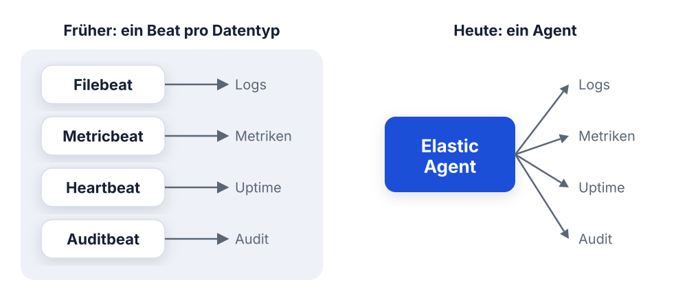
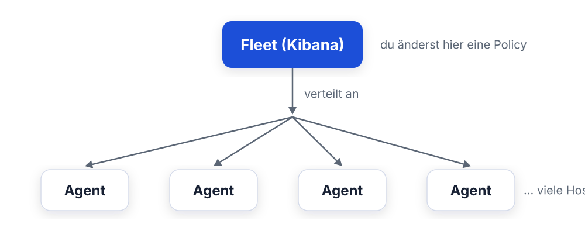
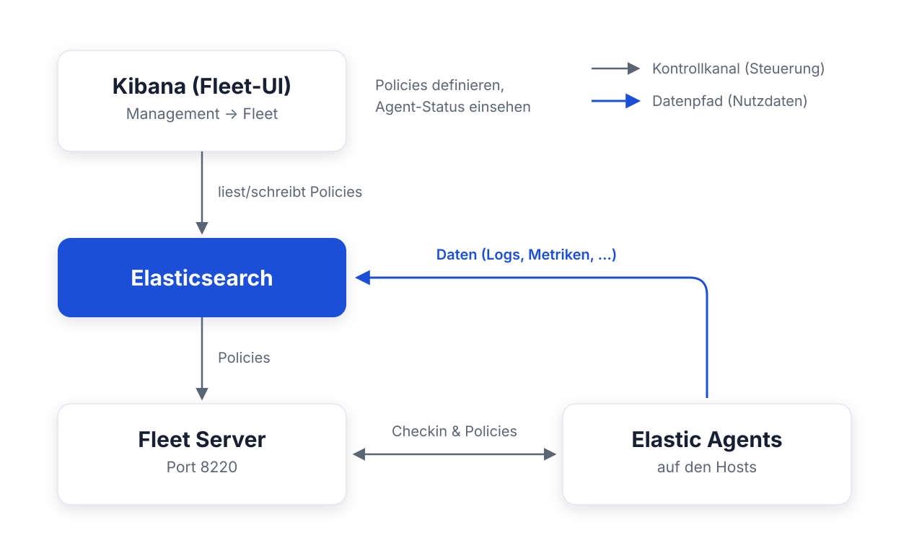
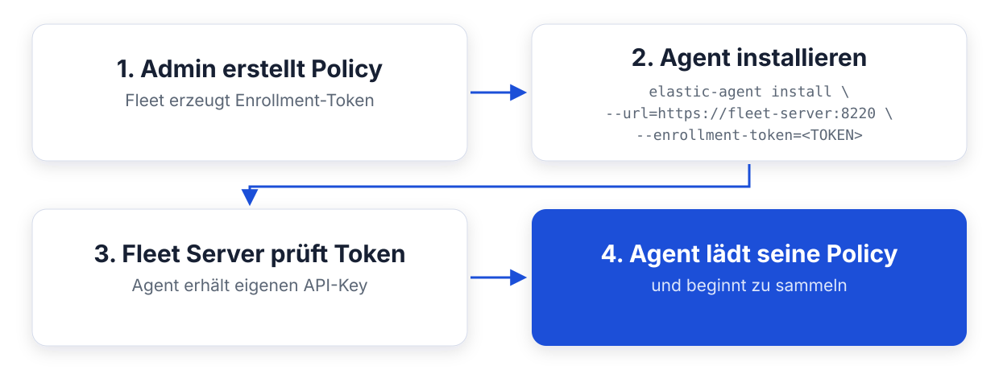
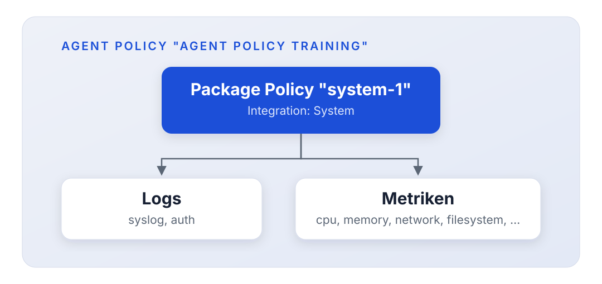

<style>
section blockquote { font-size: 0.8em; line-height: 1.3; margin-top: 0.25em; }
</style>

# Modul 13: Fleet & Elastic Agent

Zentrale Agent-Verwaltung: ein Agent für Logs, Metriken & Co.

---

# Lernziele

Nach diesem Modul kannst du:

- Erklären, warum Elastic Agent die Beats-Familie ablöst
- Die Fleet-Architektur beschreiben: Fleet Server, Agents, Policies, Enrollment
- Integrationen aus dem Katalog zu einer Agent Policy hinzufügen
- Den Status deiner Agents in der Fleet-UI überwachen
- Fleet-managed und Standalone-Betrieb gegeneinander abwägen

---

# Ausgangslage bei Mustertech GmbH

An Tag 2 hast du Filebeat auf den Webservern eingerichtet. Jetzt meldet der
Betrieb neue Anforderungen:

- **Metriken** (CPU, RAM, Disk) von allen Hosts einsammeln
- **Weitere Systeme** anbinden: Datenbanken, Docker, Message Queues
- **Updates** zentral ausrollen, nicht per SSH auf 50 Hosts
- **Überblick behalten:** Welcher Agent läuft wo, in welcher Version,
  mit welcher Konfiguration?

> Mit Filebeat allein kommst du hier nicht weiter. Zeit für Elastic Agent
> und Fleet.

---

# Rückblick: Die Beats-Familie

<style scoped>
table { font-size: 0.8em; }
section { font-size: 1.6em; }
</style>

Bisher galt: **Pro Datentyp ein eigener Beat.**

| Beat           | Sammelt                        |
| -------------- | ------------------------------ |
| **Filebeat**   | Logdateien                     |
| **Metricbeat** | System- und Service-Metriken   |
| **Packetbeat** | Netzwerkverkehr                |
| **Heartbeat**  | Verfügbarkeit (Uptime-Checks)  |
| **Auditbeat**  | Audit-Daten (Datei-Integrität) |
| **Winlogbeat** | Windows Event Logs             |

Jeder Beat: eigene Config, eigener Prozess, eigener Update-Zyklus.

---

<style scoped>
section { font-size: 1.6em; }
</style>

# Das Problem im Betrieb

Rechnen wir das für Mustertech durch:

```
50 Hosts x 3 Beats (Filebeat, Metricbeat, Heartbeat)
= 150 Installationen
= 150 Konfigurationsdateien
= 150 Prozesse, die einzeln aktualisiert werden wollen
```

**Typische Folgen:**

- Versions-Drift: Host A läuft mit 8.12, Host B mit 9.1
- Konfigurationsänderungen brauchen SSH oder ein Config-Management-Tool
- Kein zentraler Überblick: Läuft der Metricbeat auf db-07 noch?

> Genau dieses Betriebsproblem lösen Elastic Agent und Fleet.

---

# Frage in die Runde

**Wie sieht das bei euch aus?**

- Wie viele Agents, Beats oder Collector laufen bei euch im Betrieb -
  und wisst ihr auf Anhieb, wer in welcher Version läuft?
- Wie rollt ihr heute eine Config-Änderung auf viele Hosts aus:
  SSH, Ansible, Puppet, oder von Hand?

---

<style scoped>
section { font-size: 0.8em; }
</style>

# Elastic Agent: Ein Agent für alles

**Elastic Agent** ist ein einzelnes Binary, das die Aufgaben der Beats
zusammenfasst:

- Logs, Metriken, Uptime, Security: **eine Installation**
- **Eine Policy** statt vieler YAML-Dateien
- **Ein Update** statt vieler Einzel-Updates

Unter der Haube steuert der Agent weiter Beats-Komponenten - die
Sammel-Technik bleibt also dieselbe.



> Ein Agent pro Host - egal, wie viele Datenquellen du anzapfst.

---

<style scoped>
section { font-size: 1.3em; }
</style>

# Integrationen: Der Katalog

Was der Agent sammelt, bestimmen **Integrationen**, fertige Pakete für
über **300 Systeme und Dienste**:

| Kategorie     | Beispiele                         |
| ------------- | --------------------------------- |
| Infrastruktur | System, Docker, Kubernetes        |
| Webserver     | Nginx, Apache, HAProxy            |
| Datenbanken   | PostgreSQL, MySQL, MongoDB, Redis |
| Cloud         | AWS, Azure, GCP                   |
| Security      | Elastic Defend, 1Password, Okta   |
| Messaging     | Kafka, RabbitMQ                   |

Den Katalog findest du in Kibana unter **Management → Integrations**.

> Bevor du etwas selbst baust: Prüfe den Katalog, sehr wahrscheinlich gibt
> es schon eine Integration.

---

<style scoped>
section { font-size: 1.6em; }
</style>

# Anatomie einer Integration

Eine Integration ist mehr als eine Sammel-Konfiguration. Sie bringt mit:

- **Inputs:** Was wird gesammelt (z. B. Access-Logs, CPU-Metriken)?
- **Ingest Pipelines:** Parsing passiert serverseitig in Elasticsearch;
  das Grok-Wissen aus Tag 2 steckt hier fertig drin
- **Index-Templates & Data Streams:** Mappings und Rollover sind
  vorkonfiguriert
- **Dashboards & Visualisierungen:** Fertige Auswertungen in Kibana

**Beispiel Nginx-Integration:** Access-/Error-Log-Parsing, GeoIP-Anreicherung
und ein fertiges Traffic-Dashboard, ohne eine Zeile Grok.

> Vergleiche das mit Tag 2: Was du dort manuell gebaut hast, liefert eine
> Integration schlüsselfertig.

---

# Frage in die Runde

**Was würdet ihr zuerst anschließen?**

- Welche drei Systeme aus eurem Stack wären die ersten Kandidaten für
  eine fertige Integration - Datenbank, Reverse Proxy, Kubernetes?
- Gibt es bei euch etwas so Spezielles, dass es dafür wohl keine
  Integration gibt?

---

<style scoped>
section { font-size: 1.6em; }
</style>

# Wann sind Beats noch die richtige Wahl?

Elastic Agent ist der empfohlene Standard, aber es gibt Ausnahmen:

| Situation                                       | Empfehlung                          |
| ----------------------------------------------- | ----------------------------------- |
| Minimaler Ressourcen-Footprint nötig            | Einzelner Beat                      |
| Sehr spezielle, fein getunte Beat-Konfiguration | Beat behalten                       |
| Keine passende Integration verfügbar            | Beat oder Custom-Input              |
| Bestehendes, stabiles Beats-Setup               | Migration planen, nicht überstürzen |
| Neues Projekt                                   | **Elastic Agent**                   |

> Beats werden weiter gepflegt, aber neue Features landen zuerst im
> Elastic Agent.

---

# Migrationspfad: Beats → Elastic Agent

So migriert Mustertech schrittweise:

1. **Parallel betreiben:** Elastic Agent auf einem Pilot-Host neben den
   bestehenden Beats installieren
2. **Integration statt Modul:** Für jedes Beats-Modul die passende
   Integration zur Policy hinzufügen
3. **Daten vergleichen:** Kommen dieselben Felder an? Stimmen die Dashboards?
4. **Beats abschalten:** Host für Host, sobald die Daten passen

> Keine Big-Bang-Migration: Data Streams erlauben den Parallelbetrieb
> ohne Konflikte.

---

<style scoped>
section { font-size: 0.9em; }
</style>

# Was ist Fleet?

**Fleet** = zentrale Verwaltung aller Elastic Agents, direkt in Kibana.
Zwei Teile:

- **Fleet-UI:** Kibana-App unter **Management → Fleet** - Policies bauen,
  Agent-Status sehen
- **Fleet Server:** Komponente, mit der sich alle Agents verbinden -
  verteilt Policies, nimmt Statusmeldungen entgegen



> Policy in Kibana ändern - Minuten später läuft sie auf allen Hosts.

---

# Fleet-Architektur



---

<style scoped>
section { font-size: 1.6em; }
</style>

# Wichtig: Kontrollkanal vs. Datenpfad

Ein häufiges Missverständnis - die Daten fließen **nicht** durch den
Fleet Server:

| Kanal             | Weg                            | Inhalt                     |
| ----------------- | ------------------------------ | -------------------------- |
| **Kontrollkanal** | Agent ↔ Fleet Server           | Policies, Status, Aktionen |
| **Datenpfad**     | Agent → Output (Elasticsearch) | Logs, Metriken, Events     |

**Konsequenzen:**

- Fällt der Fleet Server aus, **fließen die Daten weiter**, nur
  Policy-Änderungen kommen nicht mehr an
- Der Fleet Server braucht wenig Ressourcen, denn er transportiert keine
  Nutzdaten

---

<style scoped>
section { font-size: 1.6em; }
</style>

# Der Fleet Server im Detail

Der Fleet Server ist **selbst ein Elastic Agent**, gestartet in einem
speziellen Modus.

**Seine Aufgaben:**

- **Policy-Verteilung:** Liest Policies aus Elasticsearch und liefert sie
  an die Agents aus
- **Checkin-Handling:** Nimmt regelmäßige Statusmeldungen der Agents entgegen
- **Enrollment:** Prüft Enrollment-Tokens, wenn sich neue Agents anmelden
- **Status-Reporting:** Schreibt den Agent-Zustand zurück nach
  Elasticsearch (sichtbar in der Fleet-UI)

**Betrieb:** Lauscht standardmäßig auf **Port 8220** (TLS), skaliert
horizontal. Für große Flotten betreibst du mehrere Fleet Server.

---

<style scoped>
section { font-size: 1.4em; }
</style>

# Enrollment: Agents anmelden

Wie kommt ein neuer Agent in die Flotte?



- **Enrollment-Token:** Gehört zu genau **einer Policy**; der Agent landet
  automatisch in der richtigen Konfiguration
- Nach dem Enrollment nutzt der Agent einen **individuellen API-Key**,
  das Token wird nicht mehr gebraucht

> In der UI: **Fleet → Enrollment tokens**, pro Policy ein Token.

---

<style scoped>
section { font-size: 1.45em; }
</style>

# Agent Policies

Eine **Agent Policy** bündelt die komplette Konfiguration für eine Gruppe
von Agents:

- Welche **Integrationen** laufen (und mit welchen Einstellungen)
- Welcher **Output** verwendet wird
- Ob der Agent sich **selbst überwacht** (eigene Logs/Metriken)

**Regeln:**

- Ein Agent hat **genau eine** Policy
- Eine Policy kann **beliebig viele Agents** versorgen
- Jede Änderung erhöht die **Revision**; Agents ziehen sie beim nächsten
  Checkin automatisch

**Beispiel Mustertech:** Policy "Webserver" (System + Nginx), Policy
"Datenbanken" (System + PostgreSQL).

---

<style scoped>
section { font-size: 1.4em; }
</style>

# Integrationen in der Policy: Package Policies

Fügst du einer Agent Policy eine Integration hinzu, entsteht eine
**Package Policy**, die konkrete, konfigurierte Instanz der Integration:



**In der UI:** Policy öffnen → **Add integration** → Katalog durchsuchen →
Einstellungen anpassen → speichern.

> Dieselbe Integration kann in mehreren Policies stecken, jeweils mit
> eigenen Einstellungen.

---

<style scoped>
section { font-size: 1.7em; }
</style>

# Outputs: Wohin senden die Agents?

Der **Output** legt fest, wohin die gesammelten Daten fließen:

| Output-Typ        | Einsatzzweck                                    |
| ----------------- | ----------------------------------------------- |
| **Elasticsearch** | Standard, direkt in den Cluster                 |
| **Logstash**      | Zusätzliche Verarbeitung, eigene Filter (Tag 2) |
| **Kafka**         | Puffer/Entkopplung in großen Umgebungen         |

- Outputs konfigurierst du zentral unter **Fleet → Settings**
- Jede Policy referenziert einen Output; Änderung an einer Stelle wirkt
  auf alle zugehörigen Agents

> In unserer Schulungsumgebung: Output `https://es01:9200` mit der
> Cluster-CA, vorkonfiguriert in `kibana.yml`.

---

<style scoped>
section { font-size: 1.5em; }
</style>

# Der Checkin-Zyklus und Agent-Status

Agents melden sich **regelmäßig** beim Fleet Server ("Checkin") und holen
sich dabei Policy-Änderungen und Aktionen (z. B. Upgrade) ab.

**Status in der Fleet-UI:**

| Status        | Bedeutung                                         |
| ------------- | ------------------------------------------------- |
| **Healthy**   | Agent läuft, alle Inputs in Ordnung               |
| **Unhealthy** | Agent läuft, aber mindestens ein Input hat Fehler |
| **Updating**  | Agent übernimmt gerade Policy/Upgrade             |
| **Offline**   | Kein Checkin mehr: Host down? Netzwerk?           |

> "Unhealthy" heißt nicht "tot": Oft scheitert nur ein einzelner Input,
> z. B. weil eine Logdatei fehlt. Die Details siehst du auf der
> Agent-Detailseite.

---

# Die Fleet-UI in Kibana

<style scoped>
table { font-size: 0.8em; }
section { font-size: 1.6em; }
</style>

**Management → Fleet** - die wichtigsten Tabs:

| Tab                   | Inhalt                                    |
| --------------------- | ----------------------------------------- |
| **Agents**            | Alle Agents mit Status, Policy, Version   |
| **Agent policies**    | Policies anlegen, Integrationen verwalten |
| **Enrollment tokens** | Tokens pro Policy einsehen und erzeugen   |
| **Data streams**      | Welche Data Streams die Agents befüllen   |
| **Settings**          | Fleet-Server-Hosts, Outputs               |

> Klicke auf einen Agent, um Details zu sehen: laufende Inputs, Versionen,
> Diagnose-Daten.

---

<style scoped>
section { font-size: 1.4em; }
</style>

# Data Streams: Wohin fließen die Daten?

Integrationen schreiben in **Data Streams** mit festem Namensschema:

```
<typ>-<dataset>-<namespace>
```

| Beispiel                       | Typ     | Dataset      | Namespace  |
| ------------------------------ | ------- | ------------ | ---------- |
| `metrics-system.cpu-default`   | metrics | system.cpu   | default    |
| `logs-nginx.access-production` | logs    | nginx.access | production |

- **Namespace** trennt Umgebungen (default, production, staging),
  frei wählbar pro Policy/Integration
- In Discover nutzt du die Data Views **`logs-*`** und **`metrics-*`**;
  Fleet legt sie automatisch an

> Kein manuelles Index-Design mehr: Templates, Mappings und ILM bringen die
> Integrationen mit.

---

<style scoped>
table { font-size: 0.75em; }
section { font-size: 1.5em; }
</style>

# Standalone vs. Fleet-managed

Elastic Agent kann auch **ohne Fleet** laufen, mit lokaler
`elastic-agent.yml` ("Standalone").

| Kriterium            | Fleet-managed                 | Standalone                         |
| -------------------- | ----------------------------- | ---------------------------------- |
| Konfiguration        | Zentral in Kibana (UI/API)    | Lokale YAML-Datei                  |
| Änderungen ausrollen | Automatisch beim Checkin      | Eigenes Deployment (Ansible, K8s)  |
| Config-as-Code       | Eingeschränkt (API/Terraform) | Voll: YAML im Git                  |
| Review-Prozess       | Kibana-Audit                  | Git: Merge Request, Diff, Rollback |
| Zusatzkomponente     | Fleet Server nötig            | Keine                              |
| Status-Überblick     | Fleet-UI                      | Eigenes Monitoring                 |

---

<style scoped>
code { font-size: 0.85em; }
section { font-size: 1.4em; }
</style>

# Standalone: elastic-agent.yml

So sieht eine minimale Standalone-Konfiguration aus:

```yaml
outputs:
  default:
    type: elasticsearch
    hosts: ["https://es01:9200"]
    api_key: "..."

inputs:
  - id: system-metrics
    type: system/metrics
    data_stream.namespace: default
    streams:
      - metricset: cpu
        data_stream.dataset: system.cpu
      - metricset: memory
        data_stream.dataset: system.memory
```

> Dieselben Bausteine wie in Fleet, nur liegt die Datei bei dir statt
> in Kibana.

---

<style scoped>
section { font-size: 0.9em; }
</style>

# Wann welcher Modus?

**Fleet-managed** passt, wenn:

- Ein Ops-Team viele Hosts zentral über die UI verwalten will
- Agents häufig dazukommen oder wegfallen
- Du fertige Integrationen per Klick ausrollen willst

**Standalone** passt, wenn:

- Deine Infrastruktur per GitOps läuft (Kubernetes, Terraform, Ansible)
- Jede Änderung ein Review durchlaufen soll
- Du keine zusätzliche Komponente (Fleet Server) betreiben willst

> Mustertech startet Fleet-managed: das Ops-Team will den zentralen
> Überblick. Beide Modi lassen sich mischen.

---

# Frage in die Runde

**Fleet-managed oder Standalone bei euch?**

- Würde bei euch eher das Ops-Team zentral über die UI klicken - oder
  soll jede Änderung als Merge Request durch Git laufen?
- Wo läuft eure Infrastruktur schon per GitOps, wo noch von Hand?

---

<style scoped>
section { font-size: 1.5em; }
</style>

# Unsere Schulungsumgebung

Fleet läuft als **Compose-Profil** in `environment/day3`:

```bash
docker compose --profile fleet up -d --wait
```

Das startet zwei zusätzliche Container:

- **fleet-server:** Elastic Agent im Fleet-Server-Modus (Port 8220,
  eigenes TLS-Zertifikat, bootstrappt sich über die Kibana-API)
- **agent (mustertech-agent-01):** Enrollt sich automatisch in die Policy
  **"Agent Policy Training"** (mit System-Integration)

Kibana ist in `kibana.yml` **vorkonfiguriert**: Fleet-Server-Host, Output
mit Cluster-CA, Packages und zwei Agent Policies.

> Der erste Start dauert einige Minuten: Kibana lädt die Packages vom
> Elastic Package Registry (Internet nötig).

---

<style scoped>
section { font-size: 1.5em; }
</style>

# Zusammenfassung

- **Elastic Agent** ersetzt die Beats-Familie: ein Binary, eine
  Konfiguration, ein Update; unter der Haube weiterhin Beats-Technologie
- **Integrationen** (über 300) bringen Inputs, Ingest Pipelines, Mappings
  und Dashboards fertig mit
- **Fleet** verwaltet Agents zentral: Policies in Kibana definieren, der
  **Fleet Server** verteilt sie beim Checkin; die Daten fließen direkt
  an den Output (Elasticsearch)
- **Enrollment-Tokens** ordnen neue Agents automatisch der richtigen
  Policy zu
- **Standalone-Betrieb** mit `elastic-agent.yml` ist die Alternative für
  GitOps- und Config-as-Code-Teams

---

# Frage in die Runde: Ausblick

**Ihr habt drei Tage Elastic Stack im Kopf - was jetzt?**

- Welchen Baustein aus dem Kurs baut ihr nächste Woche als Erstes bei
  euch nach?
- Wo klemmt es bei euch heute am meisten: beim Sammeln, beim Betreiben
  oder beim Auswerten?

---

<style scoped>
table { font-size: 0.75em; }
section { font-size: 1.4em; }
</style>

# Kursabschluss

**Drei Tage Elastic Stack im Rückblick:**

| Tag       | Schwerpunkt         | Du kannst jetzt ...                             |
| --------- | ------------------- | ----------------------------------------------- |
| **Tag 1** | Daten analysieren   | Discover & KQL, Dashboards, Maps, Mappings      |
| **Tag 2** | Logs einsammeln     | Filebeat, Logstash-Pipelines, Grok & GeoIP      |
| **Tag 3** | Plattform betreiben | Cluster & Shards, ILM, Fleet & Agents, Alerting |

**So geht es weiter:**

- **Elastic-Dokumentation:** elastic.co/docs - Referenz für alle Komponenten
- **Community-Forum:** discuss.elastic.co - Fragen stellen, Lösungen finden
- **Zertifizierungen:** Elastic Certified Engineer u. a. - elastic.co/training

> Die Mustertech GmbH hat jetzt eine komplette Observability-Plattform,
> und du das Wissen, sie zu betreiben. Danke für drei intensive Tage!
